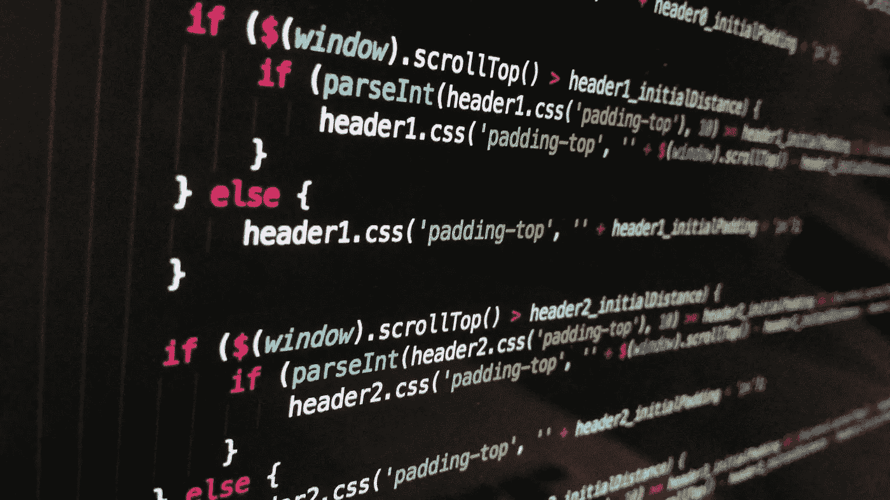
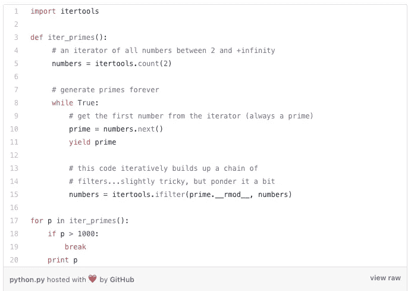
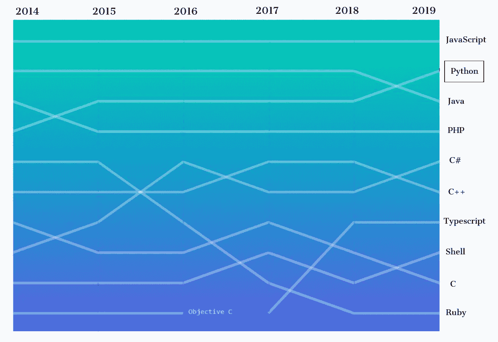
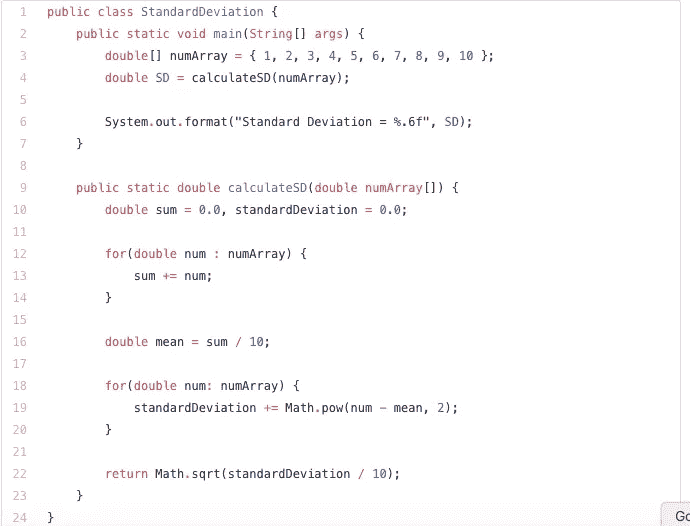
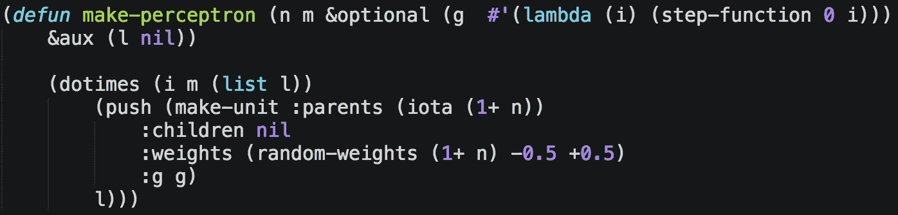
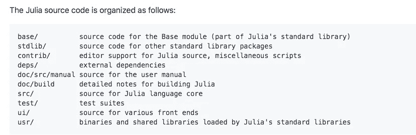
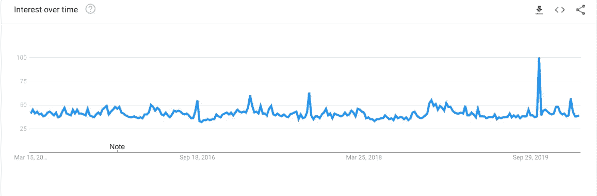

# 2021 年人工智能工程师的顶级编程语言

> 原文：<https://towardsdatascience.com/top-programming-languages-for-ai-engineers-in-2020-33a9f16a80b0?source=collection_archive---------1----------------------->

## 从几种编程语言中，人工智能工程师和科学家可以选择适合他们项目需求的正确语言

图片由 [Pixabay](https://pixabay.com/photos/technology-computer-black-code-1283624/) 提供

[**人工智能**](https://blog.digitalogy.co/the-difference-between-artificial-intelligence-machine-learning-and-deep-learning/) 现在已经成为我们日常生活中不可或缺的一部分，它在数百种独特的使用案例和情况中提供了所有的好处**，更不用说它让我们的事情变得多么简单和容易了。**

随着近年来的推动，人工智能已经走过了漫长的道路，帮助企业成长并实现其全部潜力。如果没有底层编程语言的核心改进，人工智能的这些进步是不可能的。

随着人工智能的蓬勃发展，随着编程语言的进步，对高效熟练的程序员和工程师的需求也在飙升。虽然有很多编程语言可以让你开始开发人工智能，但没有一种编程语言是人工智能编程的一站式解决方案，因为各种目标要求每个项目都有特定的方法。

我们将讨论下面列出的一些最受欢迎的方法，让您自己做决定——

# **● Python**

> Python 是你能读懂的最强大的语言。
> ——保罗·杜布瓦

通过 [Unsplash](https://unsplash.com/photos/D9Zow2REm8U) 进行 Python 编程

**开发于 1991 年**，[， **Python**](https://www.python.org/) 一直是一项民意调查，表明**超过 57%的开发者**更有可能选择 **Python 而非 C++** 作为他们开发人工智能解决方案的编程语言。Python 简单易学，让程序员和数据科学家更容易进入人工智能开发的世界。

> Python 是程序员需要多大自由的一个实验。太多的自由，没人能读懂别人的代码；太少，表现力受到威胁。
> 
> ——[吉多·范·罗苏姆](https://en.wikipedia.org/wiki/Guido_van_Rossum)

使用 Python，你不仅可以获得**优秀的** **社区支持和大量的库**，还可以享受编程语言提供的灵活性。您可能从 Python 中受益最大的一些功能是平台独立性和深度学习和机器学习的广泛框架。

> 编写 Python 代码的乐趣应该在于看到短小、简洁、易读的类，这些类用少量清晰的代码表达了大量的动作——而不是让读者厌烦得要死的大量琐碎代码。
> 
> 吉多·范·罗苏姆

**Python 代码片段示例:**

Python 代码片段示例([源代码](https://gist.githubusercontent.com/alexanderpetkov/21c0f4a2361eed84d25f0109ef54fd5c/raw/6af52aa2c087e73d7c84d0f159013adc9f452769/python.py))

## 一些最受欢迎的图书馆是-

> ● **TensorFlow** ，用于机器学习工作负载和处理数据集
> 
> ● **scikit-learn** ，用于训练机器学习模型
> 
> ● **PyTorch** ，用于计算机视觉和自然语言处理
> 
> ● **Keras** ，作为高度复杂的数学计算和操作的代码接口
> 
> ● **SparkMLlib** ，像 Apache Spark 的机器学习库，用算法和实用程序之类的工具让机器学习对每个人来说都很容易
> 
> ● **MXNet** ，作为 Apache 的另一个用于简化深度学习工作流的库
> 
> ● **Theano** ，作为定义、优化和评估数学表达式的库
> 
> ● **Pybrain** ，强大的机器学习算法

此外，根据 GitHub repositories 的贡献，Python 已经超过 Java，成为第二大流行语言**。事实上，Stack Overflow 称之为“ [**发展最快的**](https://stackoverflow.blog/2017/09/06/incredible-growth-python/?_ga=2.199625454.1908037254.1532442133-221121599.1532442133) ”主要编程语言。"**

来源:[十月](https://octoverse.github.com/)

**面向初学者的 Python 课程—**

 [## 面向初学者的 3 门免费 Python 课程:2020 版

### 如果你正在寻找可以用来扩展你的 Python 知识的最好的免费 Python 课程，你已经来到…

hackernoon.com](https://hackernoon.com/3-free-python-courses-for-beginners-2020-edition-j7c23y3u)  [## Python 训练营:学习 Python 编程和代码培训

### 这是 Udemy 上最全面、最直接的 Python 编程语言课程！你是否…

www.udemy.com](https://www.udemy.com/course/complete-python-bootcamp/?LSNPUBID=JVFxdTr9V80&ranEAID=JVFxdTr9V80&ranMID=39197&ranSiteID=JVFxdTr9V80-lB6TwxSdouentAk36.qjmw) 

# ● Java

> [一次编写，随处运行](https://en.wikipedia.org/wiki/Write_once,_run_anywhere)

> Java 被认为是世界上最好的编程语言之一，过去 20 年的使用证明了这一点。

凭借其**的高度用户友好性**、**的灵活性和平台独立性**，Java 已经被用于以各种方式开发人工智能，继续阅读了解其中的一些:

●**tensor flow**
tensor flow 支持的编程语言列表还包括带有 API 的 Java。这种支持不像其他完全支持的语言那样功能丰富，但它确实存在，并且正在快速改进。

● **深度 Java 库**
由亚马逊打造，使用 Java 创建和部署深度学习能力。

●**kube flow**
kube flow 有助于在 Kubernetes 上轻松部署和管理机器学习堆栈，提供随时可用的 ML 解决方案。

● **OpenNLP**
Apache 的 OpenNLP 是一个自然语言处理的机器学习工具。

● **Java 机器学习库**
Java-ML 为开发者提供了几种机器学习算法。

● **欧米诺**
欧米诺使得在欧米诺 GUI 的帮助下使用 Java 开源框架设计神经网络成为可能。

> 如果 Java 有真正的垃圾收集，大多数程序会在执行时删除自己。罗伯特·休厄尔

**Java 代码片段示例:**

Java 代码片段示例([源代码](https://gist.githubusercontent.com/alexanderpetkov/0ba6214e6bc3e0dbddba230448666988/raw/b8d5cc6b64d84873ae3c759641bfe8c64a69dab0/java.java))

**面向初学者的 Java 课程—**

 [## 供初学者在线学习的 5 大 Java 编程课程——最好的

### 如果你是计算机科学专业的毕业生，或者想学习 Java 并且正在寻找一些很棒的资源，例如…

javarevisited.blogspot.com](https://javarevisited.blogspot.com/2018/05/top-5-java-courses-for-beginners-to-learn-online.html) 

# **● R**

[**R**](https://www.r-project.org/about.html) 由**罗斯伊哈卡**和**罗伯特绅士**创造，第一个版本于 1995 年推出。目前由 R 开发核心小组维护，R 是 S 编程语言的实现，并帮助开发统计软件和数据分析。

让 R 非常适合开发人员进行人工智能编程的品质是:

> ●R 擅长处理庞大数字的基本特性，使它比 Python 更有优势，因为 Python 有着相对粗糙的 NumPy 包。
> 
> ●使用 R，您可以处理各种编程范例，如函数式编程、向量计算和面向对象编程。

一些可用于 R 的 AI 编程包有:

> ● Gmodels 提供了一组用于模型拟合的工具
> 
> ● Tm，作为文本挖掘应用的框架
> 
> ● RODBC 作为 R 的 ODBC 接口
> 
> ● OneR，用于实现一个规则机器学习分类算法，对机器学习模型有用

**在数据挖掘者和统计学家中广泛使用，R 提供的特性有:**

> ●扩展其功能的各种库和包
> 
> ●积极支持的社区
> 
> ●能够与 C、C++和 Fortran 协同工作
> 
> ●几个软件包有助于扩展功能
> 
> ●支持制作高质量的图表

> **有趣的事情——** [**新冠肺炎互动地图制作使用 R**](https://www.r-bloggers.com/covid-19-interactive-map-using-r-with-shiny-leaflet-and-dplyr/)

[用 R 制作的新冠肺炎互动地图](https://www.r-bloggers.com/covid-19-interactive-map-using-r-with-shiny-leaflet-and-dplyr/)

# **●序言**

**逻辑编程**的简称，Prolog 最早出现在 **1972** 。它是开发[人工智能](https://becominghuman.ai/10-artificial-intelligence-applications-that-can-generate-code-themselves-3eb9791c995e)，特别是自然语言处理的令人兴奋的工具。Prolog 最适合创建聊天机器人， **ELIZA** 是第一个用 Prolog 创建的聊天机器人。

第一个成功的聊天机器人([来源](https://medium.com/caravan-blog/the-first-successful-chatterbot-from-1966-17088c4c4669))

要理解 Prolog，您必须熟悉指导 Prolog 工作的一些基本术语，下面将简要介绍这些术语:

●事实定义了正确的陈述

●规则定义语句，但带有附加条件

●目标根据知识库定义提交的陈述所处的位置

●询问定义了如何使你的陈述真实，以及对事实和规则的最终分析

Prolog 提供了两种实现人工智能的方法，这两种方法已经实践了很长时间，并在数据科学家和研究人员中广为人知:

> ●符号方法包括基于规则的专家系统、定理证明、基于约束的方法。
> 
> ●统计方法包括神经网络、数据挖掘、机器学习和其他几种方法。

# ●口齿不清

Lisp 代码创建一个 n 输入 m 单位一层感知器([源](http://aima.cs.berkeley.edu/lisp/learning/algorithms/perceptron.lisp))

**列表处理**的简称，是仅次于 **Fortran** 的第二古老的编程语言。被称为人工智能的创始人之一，Lisp 是由约翰·麦卡锡在 1958 年创造的。

> Lisp 是一种做你被告知不可能做的事情的语言。
> 
> 肯特·皮特曼

作为一种实用的程序数学符号，Lisp 很快成为开发人员选择的人工智能编程语言。以下是 Lisp 的一些特性，这些特性使它成为机器学习人工智能项目的最佳选择之一:

> ●快速原型制作
> 
> ●动态对象创建
> 
> ●垃圾收集
> 
> ●灵活性

随着其他竞争编程语言的重大改进，Lisp 特有的几个特性也进入了其他语言。在某个时间点涉及 Lisp 的一些著名项目是 **Reddit** 和 **HackerNews** 。

> 以 Lisp 为例，你知道它是世界上最美的语言——至少在 Haskell 出现之前是这样。
> ——拉里·沃尔

# **●哈斯克尔**

Haskell 于 1990 年定义，并以著名数学家哈斯凯尔·布鲁克斯·加里的名字命名，它是一种纯函数静态类型的编程语言，配有惰性评估和更短的代码。

它被认为是一种非常**安全的编程语言**，因为它在处理错误方面提供了更多的灵活性，因为与其他编程语言相比，Haskell 很少出现错误。即使真的发生了，大多数非语法错误也是在编译时而不是运行时被发现的。Haskell 提供的一些特性是:

> ●强大的抽象能力
> 
> ●内置内存管理
> 
> ●代码可重用性
> 
> ●易于理解

> SQL、Lisp 和 Haskell 是我见过的花在思考上的时间比打字多的编程语言。菲利普·格林斯本

它的特性有助于提高程序员的生产率。Haskell 与其他编程语言非常相似，只是被一个小群体的开发人员使用。抛开挑战不谈，随着越来越多的开发人员社区采用 Haskell，Haskell 可以证明与其他竞争对手的 AI 语言一样好。

Matthew Butler 编码 GIF

# **●朱丽娅**

Julia 是一种高性能的通用动态编程语言，适合创建几乎任何应用程序，但非常适合数值分析和计算科学。与 Julia 一起工作的各种工具有:

Vim 和 Emacs 等热门编辑器

Juno、Visual Studio 等 ide

茱莉亚源代码组织([来源)](https://github.com/JuliaLang/julia)

Julia 提供的一些功能使其成为人工智能编程、机器学习、统计和数据建模的一个值得注意的选择，这些功能包括:

> ●动态类型系统
> 
> ●内置软件包管理器
> 
> ●能够进行并行和分布式计算
> 
> ●宏和元编程能力
> 
> ●支持多次派单
> 
> ●直接支持 C 函数

Julia 旨在消除其他编程语言的弱点，也可用于机器学习应用程序，与 T **ensorFlow.jl** 、 **MLBase.jl** 、 **MXNet.jl** 等工具集成，这些工具利用了 Julia 提供的可伸缩性。

**谷歌趋势— Julia 兴趣随时间变化**

谷歌趋势([来源](https://trends.google.com/trends/explore?date=today%205-y&geo=US&q=julia))

> [**JuliaCon 2019 亮点—**](https://www.youtube.com/user/JuliaLanguage)

JuliaCon 2019 集锦([来源](https://www.youtube.com/user/JuliaLanguage))

# 结论

有几种人工智能编程语言可供选择，人工智能工程师和科学家可以选择适合他们项目需求的正确语言。每一种人工智能编程语言都有其优点和缺点。随着对这些语言的定期改进，用不了多久，人工智能的开发就会变得比今天更加舒适，这样更多的人就可以加入到这一创新浪潮中来。杰出的社区支持让新人的生活变得更好，社区对几个包和扩展的贡献让每个人的生活更轻松。

# 类似的文章—

我希望这篇文章对你有用！如果您有兴趣了解更多信息，以下是附加资源:—

 [## 2020 年最受欢迎的 10 种编程语言

### 针对求职者和新开发人员的顶级编程语言的深入分析和排名

towardsdatascience.com](/top-10-in-demand-programming-languages-to-learn-in-2020-4462eb7d8d3e)  [## 2020 年十大商业编程语言

### 正是硬件和软件的结合促成了技术的大部分进步。顶级编程…

codeburst.io](https://codeburst.io/10-top-programming-languages-in-2019-for-developers-a2921798d652)  [## 2020 年人工智能工程师最喜欢的 5 种编程语言

### 全球近 14%的劳动力或 3.75 亿人可能会因人工智能和自动化而失业。迈出一步…

www.datasciencecentral.com](https://www.datasciencecentral.com/profiles/blogs/5-most-preferred-programming-languages-for-ai-engineers-in-2020)  [## 2020 年要学习的 7 种编程语言和框架

### 给热情的程序员的精选推荐

medium.com](https://medium.com/swlh/the-7-programming-languages-frameworks-to-learn-in-2020-6f9ac923ec5d) 

> ***关于作者***
> 
> ***克莱尔 D*** *。在*[***digital ogy***](https://www.digitalogy.co/)***—****是一个内容制作者和营销人员，这是一个技术采购和定制匹配市场，根据全球各地的特定需求，将人们与预先筛选的&顶尖开发人员和设计师联系起来。连接* ***数字学*** *上* [***领英***](https://www.linkedin.com/company/digitalogy) *，* [***推特***](https://twitter.com/DigitalogyCorp) *，*[***insta gram***](https://www.instagram.com/digitalogycorp)*。*