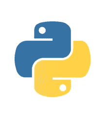
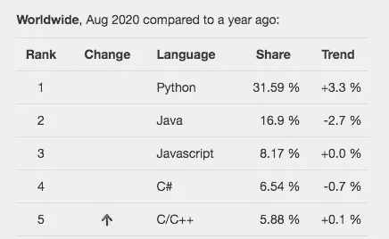
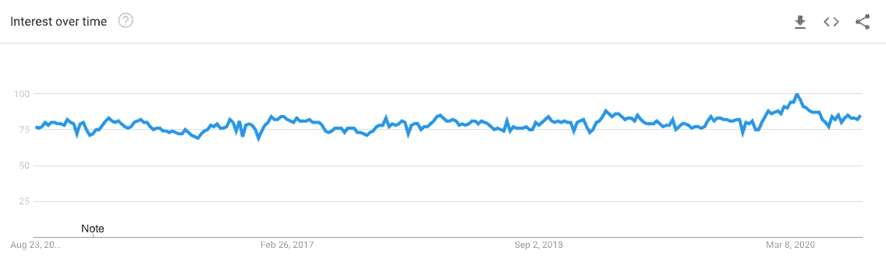
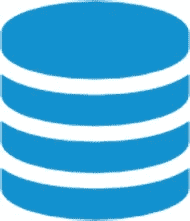
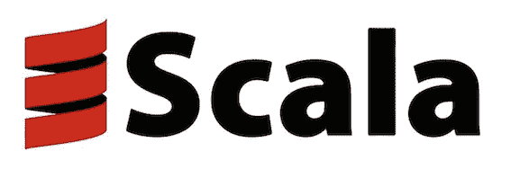
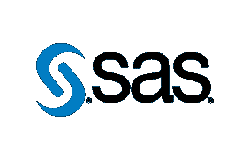

# 2020 年数据科学的顶级编程语言

> 原文：<https://towardsdatascience.com/top-programming-languages-for-data-science-in-2020-3425d756e2a7?source=collection_archive---------4----------------------->

## 您应该选择哪种编程语言来开始您的数据科学之旅？

照片由来自[佩克斯](https://www.pexels.com/photo/blur-close-up-code-computer-546819/?utm_content=attributionCopyText&utm_medium=referral&utm_source=pexels)的[路易斯·戈麦斯](https://www.pexels.com/@luis-gomes-166706?utm_content=attributionCopyText&utm_medium=referral&utm_source=pexels)拍摄

> "学习一门新编程语言的唯一方法是用它来写程序."
> ——*丹尼斯·里奇*

一门**编程语言**是任何开发者的超能力。每隔一段时间，就会出现一种新的编程语言或对现有语言的更新，试图提供更快、更优化的结果。开发人员经常会发现自己被各种各样的编程语言所困扰，决定为他们的下一个项目选择哪一种。

所有的编程语言都不相似，在许多情况下，适用于一个项目或一个需求的语言可能不适用于另一个项目或需求。数据科学就是这样一个趋势领域，对效率和高性能结果的需求正在飞速增长。本文将介绍少数顶级编程语言。

# 在为您的数据科学职业道路选择最佳编程语言时，您需要考虑什么

现在，在我们跳到涵盖一些顶级数据科学编程语言的部分之前，下面提到了一些您应该问自己的问题:

●手头的任务到底是什么？

●数据科学能在哪些方面帮到你？

●你对已经掌握的编程语言的熟练程度如何？

●你准备好让你的知识更上一层楼了吗？

●您的组织在多大程度上使用数据科学？

●你有兴趣学习高级数据科学吗？

**把这个也念出来—**

 [## 2020 年人工智能工程师的顶级编程语言

### 从几种编程语言中，人工智能工程师和科学家可以挑选出适合他们需要的语言

towardsdatascience.com](/top-programming-languages-for-ai-engineers-in-2020-33a9f16a80b0) 

# 2020 年数据科学的顶级编程语言

既然你已经回答了上面的问题，让我们进入下一部分。从现在开始，我们希望将您的注意力吸引到数据科学中一些最常用的编程语言上。您可能已经熟悉一些流行的编程语言，而有些可能对您来说是全新的。

# 1. **Python**

来源— [Python](https://www.python.org/)

[**Python**](https://www.python.org/) 在 [**数据科学顶级工具**](/best-data-science-tools-for-data-scientists-75be64144a88) 中占有重要地位，并且通常是一系列领域任务的首选，如[机器学习](https://blog.digitalogy.co/best-and-free-online-machine-learning-courses/)、深度学习、[人工智能](https://blog.digitalogy.co/artificial-intelligence-technologies/)等等。它是面向对象的，易于使用，并且由于其代码可读性高，对开发人员非常友好。

Python 庞大的生态系统包含丰富的库和各种用途的实现，这使它成为一个真正的多面选择。Python 提供的其他一些重要的突出特性包括:

*●* 支持强大的数据科学库，如 **Keras、Scikit-Learn、matplotlib、TensorFlow** 等

*●* 非常适合完成**数据收集、分析、建模**和**可视化**等任务

*●* 支持多种文件导出和共享选项

*●* 有一个强大的社区来获得支持

> 编写 Python 代码的乐趣应该在于看到短小、简洁、易读的类，这些类用少量清晰的代码表达了大量的动作——而不是让读者厌烦得要死的大量琐碎代码。
> 
> 吉多·范·罗苏姆

## PYPL 编程语言的流行程度—

PYPL 流行的编程语言([来源](http://pypl.github.io/PYPL.html))

## Python 库—

 [## 面向数据科学的顶级 Python 库

### 面向数据科学的流行 Python 库概述

towardsdatascience.com](/top-python-libraries-for-data-science-c226dc74999b)  [## 机器学习和深度学习的最佳 Python 库

### 现代机器学习模型和项目的 Python 库

towardsdatascience.com](/best-python-libraries-for-machine-learning-and-deep-learning-b0bd40c7e8c)  [## 用于自然语言处理的 Python 库

### 用于自然语言处理的流行 python 库概述

towardsdatascience.com](/python-libraries-for-natural-language-processing-be0e5a35dd64) 

## 面向数据科学的 Python 初学者课程

# 2.Java Script 语言

源代码— [JavaScript](https://www.javascript.com/)

> JavaScript:不要用我不好的部分来评价我，学习好的部分并坚持下去！
> 
> 埃里克·弗里曼

**多范例和事件驱动的脚本语言** [**JavaScript**](https://www.javascript.com/) 是 web 开发的顶级编程语言之一。使用 JavaScript，开发人员可以创建丰富的交互式网页，正是 JavaScript 的这一特性使得它成为创建漂亮的可视化效果的绝佳选择。

JavaScript 在数据科学中的其他用途包括**管理异步任务和处理实时数据**。支持 JavaScript 的几个令人信服的理由是:

*●* 允许为数据分析创建可视化

*●* 支持各种现代机器学习库，例如 TensorFlow.js、Keras.js 和 ConvNetJs 等

*●* 更易学易用

## 面向数据科学的顶级 JavaScript 库

*   **D3.js:**

Github 链接: [**了解更多 D3.js**](https://github.com/d3/d3)

*   **Tensorflow.js:**

Github 链接: [**了解更多 TensorFlow.js**](https://github.com/tensorflow/tfjs)

*   **Brain.js**

Github 链接: [**了解更多 Brain.js**](https://github.com/BrainJS/brain.js)

*   **Machinelearn.js**

Github 链接: [**了解更多 Machinelearn.js**](https://www.machinelearnjs.com/)

*   **Math.js:**

Github 链接: [**了解更多 Math.js**](https://github.com/josdejong/mathjs)

## JavaScript 语言随着时间的推移—

根据 GitHub 库的贡献，JavaScript 是**最流行的语言**

来源: [Octoverse](https://octoverse.github.com/)

# 3.Java 语言(一种计算机语言，尤用于创建网站)

源代码— [Java](https://www.javascript.com/)

> 一次编写，随处运行

编程语言 [Java](https://www.java.com/en/) 可能看起来很老，但是不要让这愚弄了你。它长期以来被一些顶级企业用于安全企业开发，作为他们**首选的开发堆栈**。为了迎合数据科学领域的蓬勃发展，Java 提供了诸如 **Hadoop、Spark、Hive、Scala 和 Fink** 等工具。

Java 虚拟机是开发人员在企业环境中为分布式系统、数据分析和机器学习编写代码的流行选择。Java 提供的其他主要优势包括:

*●* 为快速应用开发提供了几个 ide

*●* 用于数据分析、深度学习、自然语言处理、数据挖掘等任务

*●* 轻松扩展，从头构建复杂应用

*●* 能够更快地交付成果

> 如果 Java 有真正的垃圾收集，大多数程序会在执行时删除自己。
> —罗伯特·休厄尔

**完全初学者 Java 教程—**

 [## 免费 Java 教程—免费 Java 教程—完全初学者学习 Java

### 在作为软件开发人员和承包商为包括 CSC 在内的许多公司工作了 14 年后…

www.udemy.com](https://www.udemy.com/course/java-tutorial/) 

# 4. **R**

来源— [R 基金会](https://www.r-project.org/logo/)

R 是一个开源软件环境，主要用于处理数据科学中的统计和图形方面的事情。**时间序列分析、聚类、统计测试、线性和非线性建模**只是 r。

像 **RStudio 和 Jupyter** 这样的第三方接口使得与 R 一起工作变得更加容易。R 提供了**出色的可扩展性**，通常允许其他编程语言在 R 中修改数据对象而没有太多麻烦，这要归功于其**强大的面向对象特性**。编程语言 R 的关键要点是:

*●* 提供高效的数据处理和额外的数据分析工具

*●* 为创建用于数据分析的优秀图表提供了大量选项

*●* 允许用健壮的社区构建的包来扩展核心功能

*●* 包括一个活跃的贡献者社区

 [## 数据科学应该选择 R 的 6 个理由？

### 最近更新由克莱尔 d。人工智能创新的加速增长已经导致几个…

blog.digitalogy.co](https://blog.digitalogy.co/r-for-data-science/) 

# 5. **C/C++**

C 是 T2 最早的编程语言之一，大多数较新的语言使用 C/C++作为它们的代码库，例如 r。使用 C/C++需要对编程的基础有很强的理解。

尽管由于 C/C++的低级本质，对于数据科学初学者来说，它是编程语言中较为复杂的一面，但它正越来越多地被用于构建可用于数据科学的工具。

> 以 [**TensorFlow**](https://www.tensorflow.org/) 为例，它的核心是用 C++写的，其余部分是用 Python 写的。但这还不是全部，C 语言确实有一些优点，如下所述:

*●* 当底层算法也用 C 语言编写时，能够提供更快、更好的优化结果

*●* 由于其高效的本质，比其他编程语言相对更快

**Google Trends — C/C++兴趣随时间变化**

Google trends C/C++( [来源](https://trends.google.com/trends/explore?date=today%205-y&geo=US&q=C))

# 6.结构化查询语言

来源— [SQL](https://www.w3schools.com/sql/sql_intro.asp)

作为一名程序员，我相信你一定在生活中的某个时候使用过 SQL 。SQL 不仅仅是把你和你的数据库连接起来，它还有一个非常重要的目的，那就是，它只需要几个查询就能从大量的数据中为你提供事实和统计数据。

对于简化数据科学中的各种任务(如数据预处理)来说，提高 SQL 重要性的一些功能有:

*●*SQL 的非过程化特性让您专注于“是什么”,而不是“为什么”

与编程语言和数据库管理系统集成得很好

*●* 帮助您连接到您的数据以更好地理解它

*●* 允许更顺畅地管理大量数据

## 根据 Stackoverflow，最流行的技术—

来源— [Stackoverflow 调查](https://insights.stackoverflow.com/survey/2020#most-popular-technologies)

# 7. **MATLAB**

来源: [MathWorks 日志](https://www.mathworks.com/brand/visual-design/mathworks-logo.html) o

[MATLAB](https://www.mathworks.com/products/matlab.html) 主要是一个**数学计算环境**，设计用于执行高级数值计算，并带有各种工具，可以帮助您执行操作，如**矩阵操作**，数据和**函数绘制**等等。

有了 MATLAB，你可以轻松解决最棘手的数学和统计问题。它在学术界被广泛用于讲授线性代数和数值分析。MATLAB 的主要优点包括:

*●* 允许执行算法和创建用户界面

*●* 带有强大的数学函数集合

*●* 提供用于创建自定义数据图和可视化的内置图形

*●* 实现无缝可扩展性

 [## 数据科学的 MATLAB

### 随着近年来数据科学的发展，我们看到了数据科学工具的发展。r 和…

www.datasciencecentral.com](https://www.datasciencecentral.com/profiles/blogs/matlab-for-data-science) 

# 8.**斯卡拉**

来源:[Scala 编程语言](https://www.scala-lang.org/)

[Scala](https://www.scala-lang.org/) 是一种**高级编程语言**，运行在 **Java 虚拟机**上，可以让使用 Java 变得更加容易。Scala 可以和 Spark 一起有效地处理大量孤立的数据。底层并发支持使得 Scala 成为**构建高性能数据科学框架**的完美选择，比如 **Hadoop** 。Scala 的主要产品包括:

*●* 稳定、多才多艺，在某些情况下可以相对更快地交付结果

*●* 提供了超过 175000 个扩展 Scala 功能的库

*●* 支持各种 ide，比如 IntelliJ IDEA，VS Code，Vim，Atom，Sublime Text，甚至在你的浏览器中

*●* 提供强大的社区支持

**阅读 Scala 面试问题—**

 [## 2020 年前 27 个 Scala 面试问题和答案，适用于初学者和有经验者

### 主页>大数据> 2020 年参加 scala 的初学者和有经验者的前 27 个 Scala 面试问题和答案…

www.upgrad.com](https://www.upgrad.com/blog/scala-interview-questions-answers/) 

# 9.**朱丽亚**

来源——J[ulialang.org](https://julialang.org/)

> 技术计算的新方法

[**Julia**](https://julialang.org/) 是一种**动态类型的多用途**编程语言，但却是数值分析和计算科学分析的合适选择。虽然是高级编程语言，但如果需要，Julia 也可以用作低级编程。

Julia 已经被一些知名企业用于各种任务，包括**时间序列分析、风险分析，甚至太空任务规划**。Julia 的其他显著特征包括:

*●* 专注于提供高性能

*●* 对包管理器的内置支持

*●* 提供数据可视化、多维数据集上的操作以及用于深度学习的强大工具

*●* 支持并行和分布式计算

## **茱莉亚课程—**

 [## 朱莉娅科学编程

### 由开普敦大学提供。这四个模块的课程向用户介绍作为第一语言的朱莉娅。朱莉娅是一个…

www.coursera.org](https://www.coursera.org/learn/julia-programming) 

# 10.SAS

来源— [统计分析系统](https://www.sas.com/en_us/home.html)

[**统计分析系统**](https://www.sas.com/en_us/home.html) 的简称，SAS 是专门为商业智能、预测分析、高级分析而构建的**工业级软件环境**。

SAS 还允许用户**挖掘、更改和管理来自各种来源的数据**，其唯一目的是进行高级统计分析。

软件环境被分解成提供上述功能的工具集。其中一些涉及演示，一些涉及数据管理，一些涉及质量控制，还有一些涉及代码编辑器、项目管理器、网格计算管理器等特性。

**在这里学习 SAS—**

 [## 面向学者的免费 SAS 电子学习

### 借助在线课程和教材，快速轻松地学习情景应用程序。向 SAS 学院索取免费资料…

www.sas.com](https://www.sas.com/en_us/learn/academic-programs/resources/free-sas-e-learning.html) 

**2020 年最佳虚拟 SAS 全球论坛—**

## 更多用于数据科学的编程语言—

哈斯克尔

*●* 雨燕

*●* 八度

*●* Perl

*●* 口齿不清

# 结论

在整篇文章中，我们介绍了一些用于数据科学的顶级编程语言。每种语言都有自己的优点，与其他语言相比，它们通常能提供更好更快的结果。 [**数据科学的领域极其广阔**](/data-science-trends-for-2020-9b2ee27af499?source=your_stories_page---------------------------) 并且经常需要一套不同的工具来完成不同的任务。

用一种以上的编程语言武装自己可以保证帮助你在处理数据时克服独特的挑战。如果你是一名初露头角的数据科学家，你应该从上面提到的编程语言开始，因为它们是目前最受欢迎的语言。

> ***注:*** *为了消除各种各样的问题，我想提醒你一个事实，这篇文章仅代表我想分享的个人观点，你有权不同意它。*

# 更多有趣的阅读—

我希望这篇文章对你有用！下面是一些有趣的读物，希望你也喜欢

 [## 面向所有人的顶级谷歌人工智能工具

### 使用谷歌人工智能中心将想法变为现实

towardsdatascience.com](/top-google-ai-tools-for-everyone-60346ab7e08)  [## 2020 年必读的机器学习书籍

### 看看吧，你为什么要读它们？

towardsdatascience.com](/machine-learning-books-you-must-read-in-2020-d6e0620b34d7)  [## 2020 年你必须使用的最好的 Python IDEs 和代码编辑器

### 具有显著特性的顶级 Python IDEs 和代码编辑器

towardsdatascience.com](/best-python-ides-and-code-editors-you-must-use-in-2020-2303a53db24)  [## Python vs. Node。JS:哪个最适合你的项目？

### 使用一组预定义的因素对 Python 和 Node.js 进行详细比较

towardsdatascience.com](/python-vs-node-js-which-one-is-best-for-your-project-e98f2c63f020)  [## 2020 年必读的数据科学书籍

### 看看吧，你为什么要读它们？

towardsdatascience.com](/data-science-books-you-must-read-in-2020-1f30daace1cb) 

> ***关于作者***
> 
> ***克莱尔 D*** *。在*[***digital ogy***](https://www.digitalogy.co/)***—****是一个内容制作者和营销人员。这是一个技术采购和定制匹配市场，根据全球各地的特定需求，将人们与预先筛选的&顶尖开发人员和设计师联系起来。连接****Digitalogy****on*[***Linkedin***](https://www.linkedin.com/company/digitalogy)*[***Twitter***](https://twitter.com/DigitalogyCorp)*[***insta gram***](https://www.instagram.com/digitalogycorp)*。***