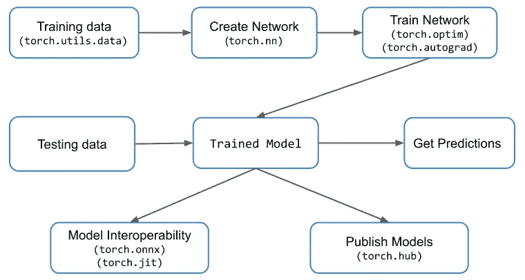
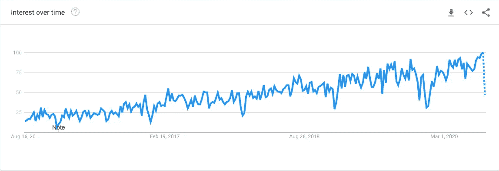
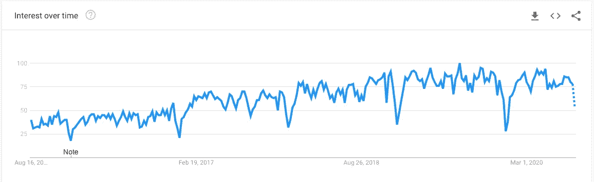

# 面向数据科学的顶级 Python 库

> 原文：<https://towardsdatascience.com/top-python-libraries-for-data-science-c226dc74999b?source=collection_archive---------10----------------------->

## 面向数据科学的流行 Python 库概述

在 [Unsplash](https://unsplash.com/?utm_source=unsplash&utm_medium=referral&utm_content=creditCopyText) 上由 [Hitesh Choudhary](https://unsplash.com/@hiteshchoudhary?utm_source=unsplash&utm_medium=referral&utm_content=creditCopyText) 拍摄的照片

> “Python 从一开始就是 Google 的重要组成部分，并且随着系统的成长和发展而保持不变。如今，数十名谷歌工程师使用 Python，我们正在寻找更多掌握这种语言的人。”
> 
> **——彼得·诺威格**，**谷歌公司****搜索质量总监**

**[**Python**](https://www.python.org/) 一直是一种非常有价值的编程语言**，不仅用于应用程序开发，还用于帮助**数据科学家和研究人员**找到复杂的**计算和数学**问题的解决方案。编程语言所提供的多功能性使得它可以毫不费力地用于各种领域。****

****Python 成为数据科学家的理想选择是因为它易于使用和调试。但是称 Python 为数据科学的首选编程语言是不公平的，如果不提及它的各种库和包的集合的话。****

# ******面向数据科学的顶级 Python 库******

****Python 的武器库中有很多包**，确切地说是超过 25.5 万个**。这些包的用例分布在大量不同的领域。由于我们的话题是数据科学，我们希望您关注一些被广大受众广泛使用的顶级 Python 库，包括数据科学家、研究人员、分析师和许多其他人。********

# ******1.**张量流********

********核心任务:**构建深度学习模型******

****由谷歌、[提供的**tensor flow**](https://www.tensorflow.org/)是开发和训练[机器学习模型](/a-tour-of-machine-learning-algorithms-466b8bf75c0a?source=your_stories_page---------------------------)的优秀工具，可用于移动、物联网等许多平台。它可以处理各种任务，如对象识别、语音识别等。****

****凭借 **TensorFlow 的灵活架构**，开发人员可以根据需求的增长轻松扩展硬件，其中包含的协作支持使其他团队成员的参与变得轻而易举。TensorFlow 提供的主要优势包括:****

*****●* 有助于更顺利地建立模型****

*****●* 包括从构思到最终部署的工具****

*****●* 提供强大的研究资源****

*****●* 拥有一流的社区支持****

*****●* 以谷歌照片、语音搜索等几款热门谷歌产品为后盾****

******TensorFlow 教程**——[https://www.tensorflow.org/tutorials/](https://www.tensorflow.org/tutorials/)****

******有张量流的责任 AI—******

## ******为什么是 Tensorflow？******

******也看看这个—******

**** [## 面向所有人的顶级谷歌人工智能工具

### 使用谷歌人工智能中心将想法变为现实

towardsdatascience.com](/top-google-ai-tools-for-everyone-60346ab7e08) 

# 2.PyTorch

> 从研究到生产

核心任务:开发和训练深度学习模型

由**脸书人工智能研究实验室**为机器学习开发的 [PyTorch](https://pytorch.org/) 主要用于与**计算机视觉和**自然语言处理相关的任务。

如果你发现自己正在寻找一种既快速又高效、能在分布式环境中工作并且毫不费力地扩展的生产就绪型机器学习工具，PyTorch 可能是你的正确选择。

基本 PyTorch 工作流程([来源](https://www.google.com/imgres?imgurl=https%3A%2F%2Fwww.learnopencv.com%2Fwp-content%2Fuploads%2F2019%2F05%2Ftorch-workflow.png&imgrefurl=https%3A%2F%2Fwww.learnopencv.com%2Fpytorch-for-beginners-basics%2F&tbnid=oMug2SdZawVNTM&vet=12ahUKEwiShvLuxqPoAhXSVHwKHa5KDYQQMygWegQIARAv..i&docid=ela9C-X5MB8TuM&w=760&h=406&q=pytorch%20torch.optim%20model%20image&ved=2ahUKEwiShvLuxqPoAhXSVHwKHa5KDYQQMygWegQIARAv))

开源 Python 库 PyTorch 提供的主要特性有:

*●* 支持张量计算，由强大的 GPU 加速提供动力，支持多维数组的高性能运算

*●* 省时的自动区分方法叫做亲笔签名

*●* 构建高度优化神经网络的专用模块

**欢迎来到 Pytorch 教程**——[https://pytorch.org/tutorials/](https://pytorch.org/tutorials/)

**Pytorch 资源—**[https://pytorch.org/resources/](https://pytorch.org/resources/)

 [## 选择 PyTorch 进行深度学习的理由

### PyTorch 可以为深度学习程序员提供很多东西

towardsdatascience.com](/reasons-to-choose-pytorch-for-deep-learning-c087e031eaca) 

# 3.克拉斯

> 简单。灵活。强大。

**核心任务:**构建深度学习模型

[Keras](https://keras.io/) 旨在通过提供**最优化的解决方案和 API**来简化甚至加速深度神经网络的实验。这个开源 Python 库利用了另一个名为 TensorFlow 的强大库的几个好处，并提供了一组构建块来简化深度神经网络的构建。Keras 的一些关键要点是:

*●* 通过图形处理单元(GPU)和张量处理单元(TPU)无缝支持分布式训练

*●* 在浏览器、移动设备和嵌入式设备上部署多样化的部署能力

*●* 允许更快的模型迭代和部署

**Keras 学习资源—**[https://keras.io/getting_started/learning_resources/](https://keras.io/getting_started/learning_resources/)

**Keras 备忘单—**[https://S3 . amazonaws . com/assets . data camp . com/blog _ assets/Keras _ Cheat _ Sheet _ python . pdf](https://s3.amazonaws.com/assets.datacamp.com/blog_assets/Keras_Cheat_Sheet_Python.pdf)

**Keras 教程—**[https://elitedata science . com/Keras-Tutorial-deep-learning-in-python](https://elitedatascience.com/keras-tutorial-deep-learning-in-python)

【Keras 入门—

# 4.**熊猫**

> 该名称源自术语“面板数据”，这是一个计量经济学术语，指的是包含同一个人在多个时间段的观察结果的数据集。
> 
> —维基百科

**最新版本:** 1.1.0

**核心任务**:数据处理和分析

**开源库** [熊猫](https://pandas.pydata.org/)为 Python 增加了高超的**数据操作和分析**能力，使其易于使用、灵活且快速。使用 pandas，您可以对数字数据和时间序列执行诸如争论、操作和可视化任务等任务。Pandas 具有几个内置功能，例如:

*●* 提供一个 DataFrame 对象，用于数据的操作和索引

*●* 用于读写内存数据结构和各种文件格式的工具套件

*●* 数据集的有效合并和连接

*●* 数据集的灵活重组

*●* 智能对齐数据并处理缺失值，以更好地组织数据

**谷歌趋势——随着时间的推移熊猫的兴趣**

谷歌趋势熊猫([来源](https://trends.google.com/trends/explore?date=today%205-y&geo=US&q=pandas))

**熊猫资源【https://www.fullstackpython.com/pandas.html ——**

**熊猫图书馆终极指南—**[https://www . freecodecamp . org/news/the-Ultimate-Guide-to-the-Pandas-Library-for-data-science-in-python/](https://www.freecodecamp.org/news/the-ultimate-guide-to-the-pandas-library-for-data-science-in-python/)

 [## 机器学习和深度学习的最佳 Python 库

### 现代机器学习模型和项目的 Python 库

towardsdatascience.com](/best-python-libraries-for-machine-learning-and-deep-learning-b0bd40c7e8c) 

# 5. **Scikit-Learn**

**核心任务:**建模

[Scikit-learn](https://scikit-learn.org/stable/) 是一个**开源 Python 库**，用 Python、Cython、C 和 C++编写。scikit-learn 构建在 NumPy、SciPy 和 matplotlib 之上，提供了一系列用于高效数据分析的工具。Scikit-Learn 可用于各种问题，包括回归、分类、聚类、降维、模型选择、预处理等。使 scikit-learn 成为更好选择的功能有:

*●* 支持支持向量机、随机森林、梯度提升、K 均值等多种方法

*●* 为线性代数、数组运算等多种运算提供优化的性能

*●* 社区驱动项目

**Github:**https://github.com/scikit-learn/scikit-learn

【https://scikit-learn.org/stable/tutorial/index.html】Scikit-学习教程—

**学习 Scikit-学习-**

 [## Scikit-Learn (Python):数据科学家的 6 个有用技巧

### 使用 scikit-learn (sklearn)改进 Python 中的机器学习模型的技巧

levelup.gitconnected.com](https://levelup.gitconnected.com/scikit-learn-python-6-useful-tricks-for-data-scientists-1a0a502a6aa3) 

# 6.Plotly

[Plotly](https://plotly.com/python/) 是另一个有用的**开源的基于浏览器的 Python 图形绘制库**，提供了超过 **30 种可视化**，涵盖科学、3D、统计、金融等等。plotly 库可以更容易地查看 Jupyter 笔记本中令人印象深刻的图形和图表，HTML 文件，甚至可以通过 Chart Studio Cloud 在线托管。Plotly 提供的一些主要好处是:

*●* 提供广泛的协作能力

*●* 提供各种共享和导出图表的选项

*●* 与 IPython 很好地集成在一起进行交互

*●* 活跃的开发者和贡献者社区之家

**Github—**[https://github.com/plotly/plotly.py](https://github.com/plotly/plotly.py)

**社区**——[https://community.plotly.com/](https://community.plotly.com/)

**谷歌趋势——随着时间的推移，人们的兴趣越来越浓厚**

谷歌趋势 Plotly( [来源](https://trends.google.com/trends/explore?date=today%205-y&geo=US&q=Plotly))

# 7.NumPy

**核心任务:**数据清理和操作

[NumPy](https://numpy.org/) 是一个**强大的开源 Python 库**，用于处理 n 维数组，并提供了一套广泛的数值运算工具，以实现增强的性能和更快的执行时间。NumPy 正被用于广泛的领域，如科学计算、数据科学、机器学习、数据可视化、数据分析等。NumPy 的关键要点是:

*●* 提供了一系列标准以及高级的数组操作

*●* 支持广泛的平台、环境和硬件

*●* 可理解的语法

*●* 数百名活跃用户组成的支持社区为项目做出了贡献

 [## 2020 年你必须使用的最好的 Python IDEs 和代码编辑器

### 具有显著特性的顶级 Python IDEs 和代码编辑器

towardsdatascience.com](/best-python-ides-and-code-editors-you-must-use-in-2020-2303a53db24) 

# 8.NLTK

**核心任务:**文本处理

[NLTK](https://www.nltk.org/) 简称**自然语言工具包**是一个开源的自然语言处理库和工具集合。自然语言工具包的简称，该库为任何使用自然语言的人提供了超过 50 种语言资源。这包括用于分类、标记、词干、解析、标记化和其他相关任务的工具，适用于学生、研究人员、分析人员和教育工作者。

该图书馆看到了它在各种研究领域的用途，包括人工智能、语言学、数据科学、机器学习等等。NLTK 的主要优势包括:

*●* 在教授计算语言学的教育机构和使用自然语言的工作场所中非常有名

*●* Python 让自然语言处理变得更加容易

*●* 它附带了全面的文档、一本介绍性的书和一些 API 来充分利用这个库

**资源—**

*   [**深入 NLTK**](http://textminingonline.com/dive-into-nltk-part-i-getting-started-with-nltk) —使用 NLTK 进行文本处理的详细的 8 部分教程。
*   [**NLTK 书**](http://www.nltk.org/book/) —用 NLTK 完成 Python 自然语言处理教程。

 [## 用于自然语言处理的 Python 库

### 用于自然语言处理的流行 python 库概述

towardsdatascience.com](/python-libraries-for-natural-language-processing-be0e5a35dd64) 

# 9. **SciPy**

[SciPy](https://scipy.org/scipylib/) 是一个面向数据科学的多领域开源 Python 库，涵盖科学、数学和工程。构成 SciPy 生态系统的核心组件是 NumPy、SciPy 库、Matplotlib、IPython、SymPy 和 Pandas，这使得它可以在上述领域中有效地使用。

作为一个用户友好的库，开发人员可以很容易地从 SciPy 提供的各种好处中受益，例如:

*●* 出色支持广泛的构建模块和操作，包括高性能计算和质量保证

*●* 带有大量内置函数和子程序，让你快速入门

*●* 支持代数、微积分、微分方程、

*●* 支持数据优化、整合、插值和修改

## **SciPy 2020 机械学习讲座现已上线—**

# 10. **Matplotlib —** 使用 Python 进行可视化

**最新版本—** 3.3.0:

[Matplotlib](https://matplotlib.org/) 是 Python 工具库中著名的开源图形绘制库。在执行数学任务时，Matplotlib **与 NumPy** 配合得很好。它通过其强大的 API 提供无缝嵌入选项，将 matplotlib 生成的图形集成到其他应用程序中。matplotlib 的一些突出特性包括:

*●* 各种各样的静态、动画和交互式图形和图表可供选择

*●* 支持可视化定制和导出

*●* 允许额外的工具包，包括第三方工具包，以扩展 matplotlib 提供的核心功能

*●* 活跃的开发人员组成的强大社区定期为项目做出贡献

**Matplotlib 教程—**[https://matplotlib.org/tutorials/index.html](https://matplotlib.org/tutorials/index.html)

**Google Trends — Matplotlib 利息随时间变化**

谷歌趋势 Matplotlib( [来源](https://trends.google.com/trends/explore?date=today%205-y&geo=US&q=Matplotlib))

# 11.**Seaborn-S**统计数据可视化

[Seaborn](https://seaborn.pydata.org/) 是 Python 中用于可视化的一个**开源库，它基于 matplotlib，并在 matplotlib 生成的图形和图表上提供了一个额外的定制层。该库通过对数据帧和数组进行操作并执行相关映射，努力为数据的独特表示提供显著的信息统计可视化。seaborn 提供的许多功能包括:**

*●* 带有丰富的可视化集合

*●* 通过提供工具和内置主题对图表进行严格控制

*●* 能够构建高级抽象来创建复杂的可视化

*●* 分析变量间关系的 API

## Seaborn 官方教程—

 [## seaborn 官方教程- seaborn 0.10.1 文档

### 编辑描述

seaborn.pydata.org](https://seaborn.pydata.org/tutorial.html) 

# 12.**统计模型**

[Statsmodels](https://www.statsmodels.org/devel/) 是一个**开源的统计驱动模块**，它为许多可用于统计分析和数据探索的统计模型提供了各种类和函数。该模块涵盖了大量的模型，从线性回归，离散模型，时间序列分析，生存分析，以及许多其他杂项模型。stats 模型的一些主要特性包括:

*●* 提供强大的统计分析、测试和模型估计能力

*●* 模型的各种测试，如拟合优度、正态性等

*●* 支持附加模型，如鲁棒线性模型、混合线性模型、

*●* 非参数统计

# 结论

**Python 生态系统**有**大量的库**可以帮助你完成各种各样的任务，而且效率也是最优的。在整篇文章中，我们讨论了十几个高性能的顶级 Python 库，涵盖了广泛的领域，包括数据科学，甚至机器学习和深度学习。当然，Python 生态系统比上面提到的库要广泛得多，它还涵盖了几个满足特定需求的库。我们敦促我们的访问者和开发者看看这些，并探索更新和更新的库的生态系统，如果你正在寻找一些特定的东西，因为更新的库经常出现。

> ***注:*** *为了消除各种各样的问题，我想提醒你一个事实，这篇文章仅代表我想分享的个人观点，你有权不同意它。*

# 更多有趣的阅读—

我希望这篇文章对你有用！下面是一些有趣的读物，希望你也喜欢

 [## 数据科学家的最佳数据科学工具

### 数据科学工具，使任务可以实现

towardsdatascience.com](/best-data-science-tools-for-data-scientists-75be64144a88)  [## 2020 年必读的机器学习书籍

### 看看吧，你为什么要读它们？

towardsdatascience.com](/machine-learning-books-you-must-read-in-2020-d6e0620b34d7)  [## Python vs. Node。JS:哪个最适合你的项目？

### 使用一组预定义的因素对 Python 和 Node.js 进行详细比较

towardsdatascience.com](/python-vs-node-js-which-one-is-best-for-your-project-e98f2c63f020)  [## 2020 年必读的数据科学书籍

### 看看吧，你为什么要读它们？

towardsdatascience.com](/data-science-books-you-must-read-in-2020-1f30daace1cb)  [## 10 家使用 Python 的世界级公司

### Python 正被 IT 界的一些巨头积极使用

towardsdatascience.com](/10-world-class-companies-using-python-26cde24919a8) 

> ***关于作者***
> 
> ***克莱尔 D*** *。在*[***digital ogy***](https://www.digitalogy.co/)***—****是一个内容制作者和营销人员。这是一个技术采购和定制匹配市场，根据全球各地的特定需求，将人们与预先筛选的&顶尖开发人员和设计师联系起来。连接****Digitalogy****on*[***Linkedin***](https://www.linkedin.com/company/digitalogy)*[***Twitter***](https://twitter.com/DigitalogyCorp)*[***insta gram***](https://www.instagram.com/digitalogycorp)*。*******