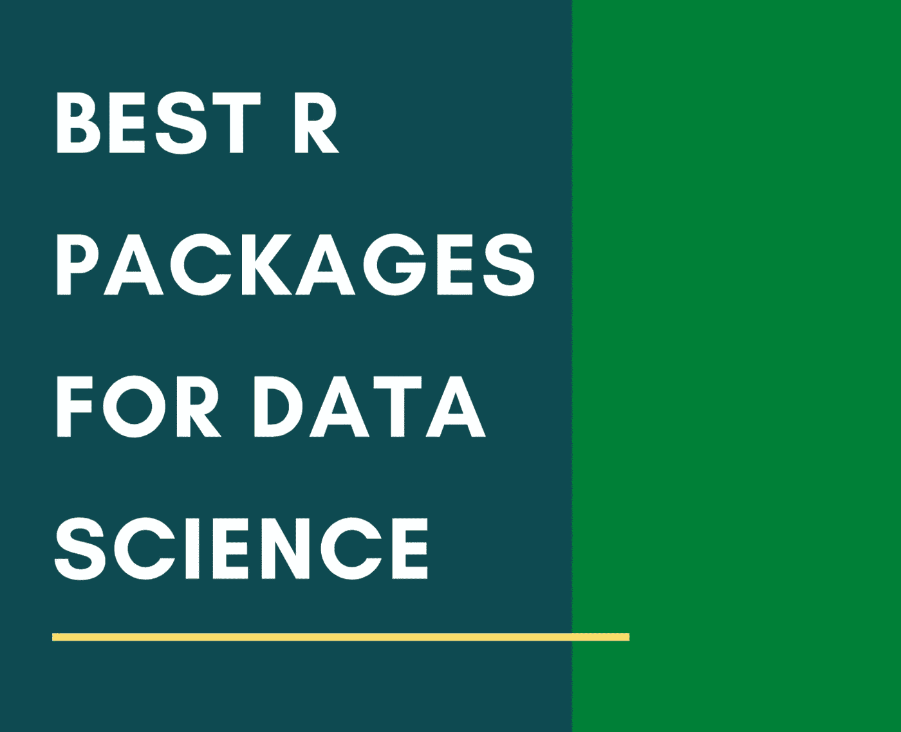

# 数据科学最佳 R 库和包

> 原文：<https://towardsdatascience.com/top-r-libraries-for-data-science-54f6eba4a78f?source=collection_archive---------21----------------------->

## 你可能想知道。

隔离第 10 天:清理我的笔记本电脑文件时，我发现了几个月前我设计的封面图片，但一直没有机会完成这个故事。所以，我想自我隔离让你除了完成未竟的事业之外别无选择。😛

我们经常在 Python 中遇到顶级的数据科学库或包，但我们错过的是，有更多的流行编程语言已知可以与它们的支持者和反对者一起执行不同的数据科学任务。数据科学的一种流行语言是 R；数据科学领域中一个众所周知且越来越受欢迎的工具。

虽然我们知道数据科学中最常用的 Python 库，但这里我根据我的经验，为数据科学家和工程师准备了一些最有用的 R 库。有些你会知道，有些你会去探索。

r 是一个主要为*统计计算设计的软件环境。**界面和结构非常适合与算法和数据建模相关的任务。拥有 100 多个库，R 已经成为最发达的库系统之一，可以计算成千上万个包来解决各种各样的问题。*

*在开发统计软件和数据分析的统计学家和数据挖掘者中很流行，也存在一个关于 R 过时或它与 Python 的比较的持续争论。Python 和 R 是两种不同的编程语言，处理不同的应用程序，因此，从技术上来说，这两种语言不应该进行比较。*

*然而，这里我们从不同的数据科学操作开始，如数据操作、可视化、竞争研究和机器学习。*

# *数据操作*

## ***dplyr***

*dplyr 提供了子集化、汇总、重新排列和连接数据集的基本功能。dplyr 是我们快速数据操作的首选包。dplyr 的主要操作功能是过滤、选择、排列、变异和汇总(分组)*

## *数据表*

*data.table 是 data.frames 的增强版本，基本上是对 r 中的数据进行排序。使用`data.table,`可以执行数据操作，如*子集*、*组*、*更新*、*连接*等。都有内在的联系。将这些相关的操作放在一起可以加快操作速度*

## *readr*

*读取矩形文本数据(readr)提供了一种快速友好的方法来读取矩形数据，如 csv(逗号分隔值)、tsv(制表符分隔值)、delim(分隔值)和 fwf(固定宽度文件)。它被设计成灵活地解析在野外发现的多种类型的数据，同时当数据意外改变时仍然完全失败。readr 是核心 tidyverse 的一部分，所以安装 tidyverse 应该也可以。*

## *tidyr*

*tidyr 确实使 R 数据变得整洁。一个整洁的数据是很重要的，因为确保这一点，你将花费更少的时间与工具斗争，更多的时间在你的分析上。此包提供了使用聚集和扩散功能将数据转换为整齐格式来更改数据集布局的工具*

## *stringr*

*tidy verse 家族的另一个有用的成员， *stringr* 包提供了一套全面的函数，用于轻松处理正则表达式和字符串。*

## *润滑剂*

*使跨持续时间、期间、间隔处理日期和时间更容易的工具。获得 lubridate 的最简单方法是不要安装整个 tidyverse，或者只安装 lubridate。*

# *数据可视化*

## *ggplot2*

*r 的 rich ecosytem 有许多著名的制作漂亮图形的软件包，但最流行和常用的可视化软件包之一是 ggplot2。它让您使用图形的语法来构建分层的、可定制的图。*

## *ggvis*

*使用图形语法构建的基于 web 的交互式图形的实现。将利润丰厚的 react 编程融入数据操作的语法中。使用 ggvis 很容易构建用于探索性数据分析的交互式图形。*

*它在视觉表现上不同于 ggplot2。每个交互式 ggvis 绘图必须连接到正在运行的 R 会话；作为 ggplots 的静态图不需要运行 R 会话即可查看。(用 ggplot 和 ggvis 检查`vega`)*

## *rgl*

*rgl 是一个 3D 图形包，可生成实时交互式 3D 绘图。它允许交互式旋转，缩放图形和选择区域。rgl 包还包括一个名为 R3D 的通用 3D 接口。它包含高级图形命令，大致模仿经典 R 图形，但在三维空间中工作。*

## *html 小部件*

*用 R 构建交互式(基于 javascript)可视化的一种更快更有效的方法是通过 htmlwidgets。实现 htmlwidgets 的包有传单(地图)、dygraphs(时间序列)、DT(表格)、diagrammeR(图表)、network3D(网络图)、threeJS (3D 散点图和地球仪)。*

## *格子木架*

*lattice 是一个附加包，作为 r 的 Trellis graphics 的实现。它是一个强大而优雅的高级数据可视化系统，侧重于多元数据。*

*(Trellis Graphics 是由 Rick Becker、Bill Cleveland 等人在贝尔实验室开发的数据可视化框架，扩展了 Bill Cleveland 在 1993 年出版的著作*可视化数据中提出的观点)**

# *机器学习*

## *最低贷款利率(minimum lending rate)*

*mlr 是 R 中流行的机器学习包，它将数据接口到大量的分类和回归技术。mlr 到分机也可以处理*

1.  *生存分析、聚类和一般的、特定示例的成本敏感学习*
2.  *通用重采样，包括交叉验证、引导和二次采样*
3.  *用现代优化技术调整超参数，用于单目标和多目标问题*
4.  *用于特征选择的过滤器和包装器方法*
5.  *使用机器学习中常见的附加操作扩展基本学习器，还允许简单的嵌套重采样*

## *随机森林*

*一旦我们将数据训练分为训练集和测试集，由`randomForest`包提供的随机森林分类器就可以用来构建一个有 n 棵树的随机森林。(注意:与`scikit-learn`不同，我们不需要显式调用`fit`方法来训练我们的模型)。在 R 中，默认情况下，随机森林中决策树的数量是 500，用作每次分裂潜在候选的特征的数量是 3。*

## *脱字号*

*`caret`包(简称为 **C** 分类 **A** 和**RE**gression**T**raining)是一组试图简化创建预测模型过程的函数。该包包含用于以下目的的工具:*

*   *数据分割*
*   *数据预处理*
*   *特征选择*
*   *使用重采样的模型调整*
*   *可变重要性估计(`importance = 1)`*

## *e1071*

*该软件包广泛用于实现*聚类、傅立叶变换、朴素贝叶斯、SVM* 和其他类型的杂项机器学习相关功能。*

## *视频高密光盘*

*分类数据的可视化工具和测试*

## *glmnet*

*交叉验证的套索和弹性网回归方法*

*试用`tree, maptree, mlbench, ipred, MASS` 进行更多的机器学习操作。*

*关于有用的 R 包的快速列表的 R 官方文档的精彩资源可以在这里找到。*

*感谢您的阅读！我希望你喜欢这篇文章。请告诉我，在您的数据科学之旅中，您使用过或期待学习或探索过哪些包或库？*

*数据帐篷快乐！*

**免责声明:本文表达的观点仅代表我个人，不代表严格的观点。**

# *了解你的作者*

*拉什是芝加哥伊利诺伊大学的研究生。她喜欢将数据可视化，并创造有见地的故事。她是用户体验分析师和顾问、技术演讲者和博客作者。*