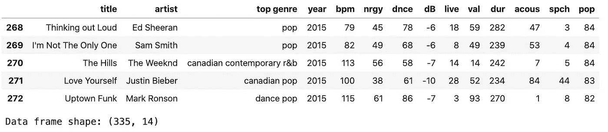
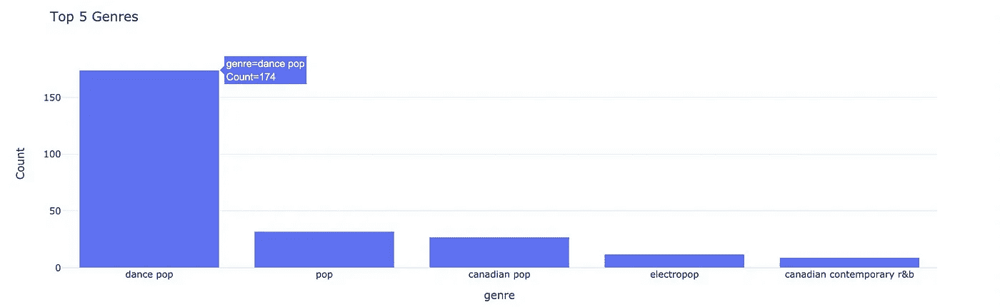
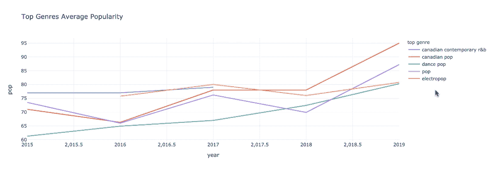
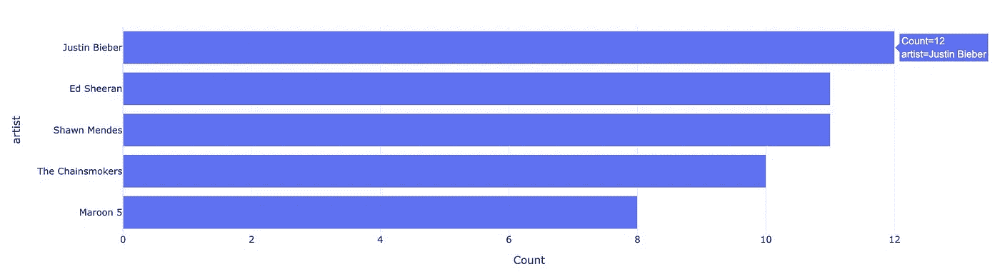
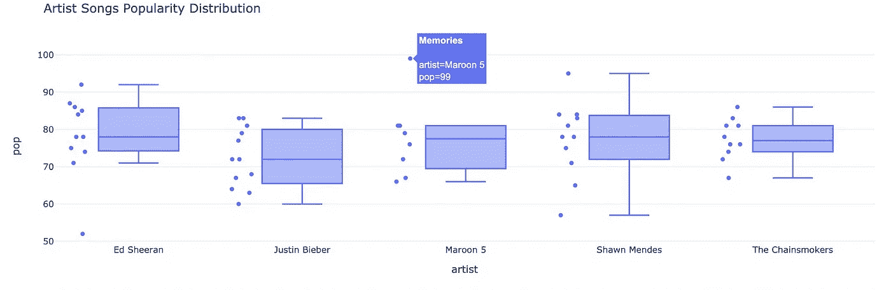
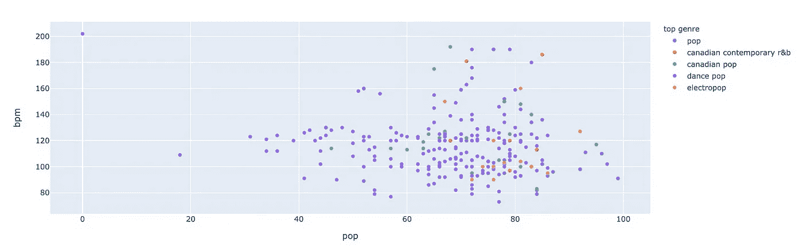
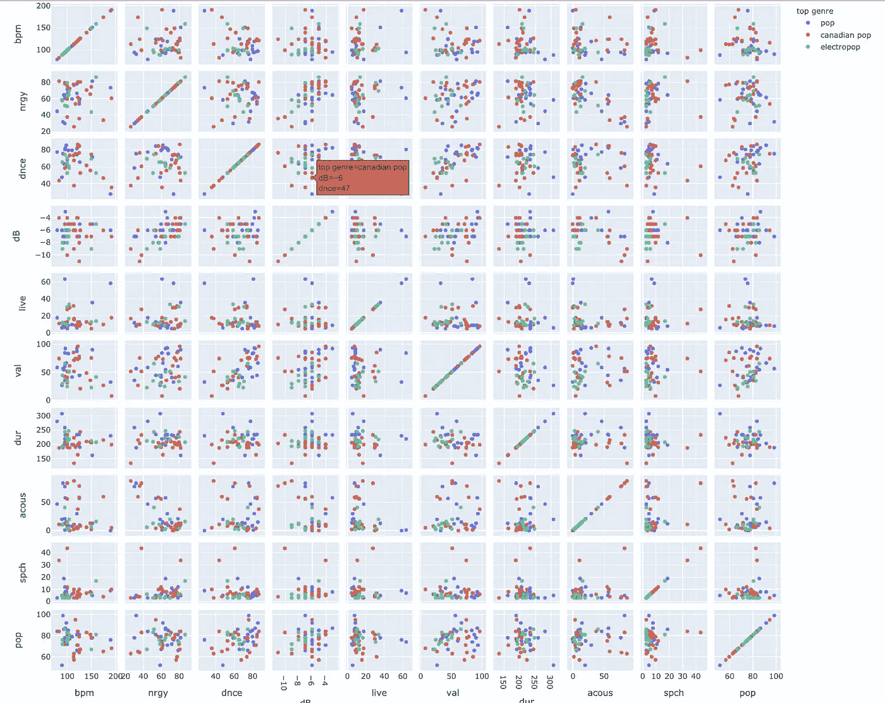

# 使用 Python 中的 Plotly Express 进行顶级 Spotify 歌曲数据探索

> 原文：<https://towardsdatascience.com/top-spotify-song-express-exploration-with-plotly-express-in-python-3f3b6afdb2b7?source=collection_archive---------25----------------------->

## 以 Spotify 歌曲数据为例，与 plotly express 取得联系，进行数据探索和可视化。


艾萨克·史密斯在 [Unsplash](https://unsplash.com?utm_source=medium&utm_medium=referral) 上拍摄的照片

数据可视化是数据科学的重要方面之一。它既可用于数据探索，也可用于交流分析结果。在数据浏览过程中，可视化可以揭示数据中隐藏的信息。用图表展示你的项目成果是交流你的发现的一个很好的方式。

Python 中有许多数据可视化库可供选择。一个这样的库被 plotly 表示。

> Plotly Express 是 Plotly 的一个易于使用的高级界面，它处理“整齐”的数据并生成易于样式化的图形— Plotly

在本文中，我们将使用 plotly express 库探索和可视化来自 Kaggle 的 Spotify 热门歌曲数据集。

## 导入库

首先，我们需要使用 pip 或 conda 将 plotly 安装到我们的环境中。您可以在 plotly 网站上查看安装该库的完整文档。 *Plotly Express* 库与 Plotly 库合二为一。

[](https://plot.ly/python/getting-started/) [## Plotly 入门

### 有关静态图像导出的详细信息，请参阅 Python 中的静态图像导出。扩展地理支持有些 plotly.py…

plot.ly](https://plot.ly/python/getting-started/) 

一旦安装了库，我们可以将库导入到我们的笔记本中。

```
import pandas as pd
import numpy as np
import plotly.express as px
```

## 数据准备

在本文中，我们使用了 Kaggle 的顶级 Spotify 音乐数据集。为了得到这个数据集，我们可以在这里下载数据集[。这个数据集由世界上最受欢迎的 Spotify 歌曲和 2010 年至 2019 年的另外 13 个变量组成。但是，我们将只使用 2015 年开始的数据子集。](https://www.kaggle.com/leonardopena/top-spotify-songs-from-20102019-by-year)

```
# Import Dataset
rawfile = './top10s.csv'#use encoder to avoid utf-8 error
df = pd.read_csv(rawfile,encoding = "ISO-8859-1")#remove id column
df = df.iloc[:,1:15]  
df = df.loc[df['year']>=2015]# get 5 year data only
display(df.head())
print('Data frame shape: {}'.format(df.shape))
```



## 视觉探索

让我们用 plotly express 创建一个基本的可视化。首先，我们将使用一个**条形图来查看在公告牌中出现频率最高的 5 个流派。**

```
famous_genres = df['top genre'].value_counts().head(5).to_frame().reset_index()
famous_genres.columns = ['genre','Count']
famous_genres_list = list(famous_genres['genre'])# Visualize
px.bar(famous_genres, 
       x = 'genre', 
       y = 'Count', 
       title = 'Top 5 Genres',
       template = 'plotly_white')
```



从 2015 年到 2019 年，舞蹈流行音乐是 Spotify billboard 中出现频率更高的流派。

其次，假设我们想知道这些流派每年的平均受欢迎程度。我们可以创建一个**折线图**来观察这个趋势。

```
top_5_genre = famous_genres_list
df_top = df.loc[df['top genre'].isin(top_5_genre)]group_by_genre = df_top.groupby(["year","top genre"]).mean().sort_values('year').reset_index()px.line(group_by_genre,
        x = 'year',
        y ='pop',
        line_group = 'top genre',
        title = 'Top Genres Average Popularity',
        template = 'plotly_white',
        color = 'top genre')
```



通过查看图表，即使流行舞曲风格的歌曲在公告牌上出现的频率最高，它的平均受欢迎程度仍然低于其他五大风格。但是，它总是逐年持续增长。

接下来，我们来看看这一时期最著名的艺术家是谁。我们将用**柱形图**来回答这个问题。

```
# Prepare data
famous_artist = df['artist'].value_counts().head(5).to_frame().reset_index()
famous_artist.columns = ['artist','Count']# Visualize
px.bar(famous_artist.sort_values('Count'), 
       x = 'Count', 
       y = 'artist', 
       title = 'Top 5 Artist',
       template = 'plotly_white',
       orientation = 'h')
```



与其他人相比，这五位艺术家贡献了 Spotify 中最热门的歌曲。

要看他们唱的每首歌的人气分布，可以用**框图。**

```
# Average Popularity of a particular genre over the yearstop_5_artist = famous_artist_list
df_top_artist = df.loc[df['artist'].isin(top_5_artist)]px.box(df_top_artist,
       x = 'artist',
       y = 'pop',
       hover_name = 'title',
       title = 'Artist Songs Popularity Distribution',
       template = 'plotly_white',
       points = 'all')
```



在其他歌曲中，《魔力红的回忆》最受欢迎。然而，这五位歌手的歌曲受欢迎程度的平均中位数在 70 到 80 之间。

这些歌曲中的每一首都有一个参数，如每分钟节拍数、能量、可跳舞性、响度、可爱度、长度等。我们可以通过制作**流行度与每分钟节拍的散点图**来检查一个变量与另一个变量之间的相关性。

```
px.scatter(df_top,
           x = 'pop',
           y = 'bpm',
           color = 'top genre')
```



我们还可以制作一个散点图，以散点图的形式查看所有变量的相关性。

```
cols = df_top_artist.select_dtypes(include=['float', 'int']).columns.tolist()[1:]px.scatter_matrix(df_top_artist, 
dimensions = cols,width=1400 ,height=1200, color = df_top_artist['top genre'])
```



## 最后的想法

通过数据探索，我们知道流行舞蹈是在 billboard 中出现最多的类型。即使这种类型没有显示出最高的人气得分，但从 2015 年到 2019 年，这种类型的人气不断增加。另一方面，最著名的艺术家是贾斯汀比伯。他在广告牌上出现了 12 次。然后最受欢迎的歌曲是《魔力红的回忆》。

使用 plotly express 进行可视化非常简单，尤其是当我们使用 panda 数据框时。我们只需要调用我们想要的图表，选择数据框，选择列，然后配置可定制的项目或让它使用默认值。通过这样做，我们将在一次函数调用中得到我们需要的图表。

## 参考

[](https://medium.com/plotly/introducing-plotly-express-808df010143d) [## ✨推出 Plotly 快递✨

### Plotly Express 是一个新的高级 Python 可视化库:它是 Plotly.py 的包装器，公开了一个简单的…

medium.com](https://medium.com/plotly/introducing-plotly-express-808df010143d) [](https://plot.ly/python/plotly-express/) [## Plotly Express

### 每行代表一朵花。https://en.wikipedia.org/wiki/Iris_flower_data_set 用 150 英镑返回一个“熊猫. DataFrame”

plot.ly](https://plot.ly/python/plotly-express/)