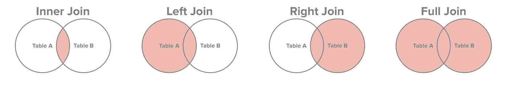

# 2020 年你应该知道的 SQL 面试问题

> 原文：<https://towardsdatascience.com/top-sql-interview-questions-you-should-know-in-2020-32ae491e01dd?source=collection_archive---------15----------------------->

## 如果你准备从事任何与数据相关的工作，你应该知道的问题

图片由[皮克斯拜](https://pixabay.com/?utm_source=link-attribution&utm_medium=referral&utm_campaign=image&utm_content=3843352)的 Gerd Altmann 提供

大多数与数据相关的工作需要你了解 SQL，你不应该让 SQL 面试问题成为你找不到工作的理由。尤其是在查询方面，它学起来很快，你应该确保你已经准备好回答一些最常见的与 SQL 相关的面试问题。

就这样，我给你一个 SQL 相关的面试问答列表。尽情享受吧！

***注:如果你不知道如何用 SQL 查询，你可以在五分钟内学会 SQL***[***这里***](/learn-beginner-sql-in-5-steps-in-5-minutes-c44c47fa39a1) ***。***

## 什么是 SQL？

SQL 代表结构化查询语言。根据 Wikipedia，SQL 是一种特定于领域的语言，用于编程，设计用于管理关系数据库管理系统中的数据，或用于关系数据流管理系统中的流处理[1]。

## 什么是主键？

主键是唯一标识表中每一行的一列(或一组列)。通常，ID 列就是为此目的而创建的。

## 什么是子句？

SQL 子句是 SQL 语句中定义明确的部分，通常用于根据预定义的条件过滤结果，但情况并非总是如此。例如，ORDER BY 是一个子句，但不筛选结果。

五个主要子句是 TOP 子句、WHERE 子句、ORDER BY 子句、GROUP BY 子句和 HAVING 子句。

## WHERE 和 HAVING 子句的区别是什么？

WHERE 和 HAVING 都用于筛选表以满足您设置的条件。当它们与 GROUP BY 子句一起使用时，两者之间的区别就显现出来了。WHERE 子句用于在分组之前(GROUP BY 子句之前)过滤行**，HAVING 用于在**分组之后过滤行**。**

## 什么是不同类型的连接，并解释每一种？

来自 SQL-Join 的图像

有四种不同类型的连接:

1.  内部联接:返回在两个表中都有匹配值的记录
2.  左连接:从左表返回所有的记录，从右表返回匹配的**记录**
3.  右连接:返回右表中的所有记录和左表中与**匹配的**记录
4.  完全连接:当左表或右表中有匹配项时，返回所有记录

## UNION 和 JOIN 的区别是什么？

两者都用于将一个或多个表中的数据合并成一个结果。区别在于 JOIN 语句将不同表的**列**组合成一个结果，而 UNION 语句将不同表的**行**组合成一个结果。

## DELETE 和 TRUNCATE 语句有什么区别？

DELETE 用于从表中删除一行或多行。使用 delete 语句后，可以回滚数据。

TRUNCATE 用于删除表中的所有行，并且数据在执行后不能回滚。

## 什么是视图？

视图也是一个表——它是对另一个表或多个表的查询的一个**存储结果集**,用户可以像对任何其他表一样对其进行查询。

## 什么是子查询，子查询有哪两种类型？

子查询(也称为内部查询或嵌套查询)是另一个 SQL 查询中的查询，用于返回将在主查询中作为条件使用的数据，以进一步限制要检索的数据[2]。

有两种类型的子查询:

1.  **相关子查询:**相关子查询不能独立于外部查询进行评估，因为子查询使用父语句的值。
2.  **不相关子查询:**不相关子查询可视为独立查询，子查询的输出在主查询中被替代。

你可以在这里了解更多。

## 聚合函数和标量函数有什么区别？为每一个给出一些例子

一个**集合函数**对多个值执行操作以返回一个值。聚合函数通常与 GROUP BY 和 HAVING 子句一起使用。聚合函数的一些示例包括:

*   **AVG()** —计算一组值的平均值。
*   **COUNT()** —统计特定表格或视图中的记录总数。
*   **MIN()** —计算值集合的最小值。
*   **MAX()** —计算值集合的最大值。
*   **SUM()** —计算值集合的总和。
*   **FIRST()** —获取值集合中的第一个元素。
*   **LAST()** —获取值集合中的最后一个元素。

一个**标量函数**基于输入值返回单个值。标量函数的一些示例包括:

*   **LEN()** —计算给定字段(列)的总长度。
*   **UCASE()** —将字符串值的集合转换为大写字符。
*   **LCASE()** —将字符串值的集合转换为小写字符。
*   **CONCAT()** —连接两个或多个字符串。
*   **ROUND()** —计算数值字段的舍入整数值(或小数点值)。

## SQL 和 MySQL 有什么区别？

重申一下，SQL 是一种管理、检索和操作结构化数据库的特定领域语言。MySQL 是一个关系数据库管理系统，就像 Oracle 一样。

TLDR: SQL 是一种语言，而 MySQL 是一种数据库。

# 感谢阅读！

如果你喜欢我的工作，想支持我…

1.  支持我的最好方式是在**媒体**上关注我[这里](https://medium.com/@terenceshin)。
2.  在 **Twitter** 这里[成为第一批关注我的人之一](https://twitter.com/terence_shin)。我会在这里发布很多更新和有趣的东西！
3.  此外，成为第一批订阅我的新 **YouTube 频道** [这里](https://www.youtube.com/channel/UCmy1ox7bo7zsLlDo8pOEEhA?view_as=subscriber)！
4.  在 **LinkedIn** 上关注我[这里](https://www.linkedin.com/in/terenceshin/)。
5.  在我的**邮箱列表** [这里](https://forms.gle/UGdTom9G6aFGHzPD9)报名。
6.  看看我的网站，[**terenceshin.com**](https://terenceshin.com/)。

# 相关文章

 [## 数据科学家的 5 个常见 SQL 面试问题

### 帮助您发展 SQL 技能，在任何面试中胜出

towardsdatascience.com](/5-common-sql-interview-problems-for-data-scientists-1bfa02d8bae6)  [## 2020 年 20 分钟数据科学速成班

### 帮助你在顶尖科技公司找到工作的终极资源

towardsdatascience.com](/20-minute-data-science-crash-course-for-2020-8670ad4f727a)  [## 超过 100 个数据科学家面试问题和答案！

### 来自亚马逊、谷歌、脸书、微软等公司的面试问题！

towardsdatascience.com](/over-100-data-scientist-interview-questions-and-answers-c5a66186769a) 

# 参考

[1][https://en.wikipedia.org/wiki/SQL](https://en.wikipedia.org/wiki/SQL)

[https://www.tutorialspoint.com/sql/sql-sub-queries.htm](https://www.tutorialspoint.com/sql/sql-sub-queries.htm)