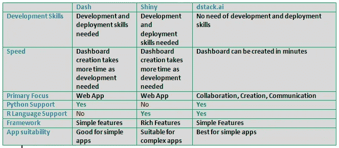
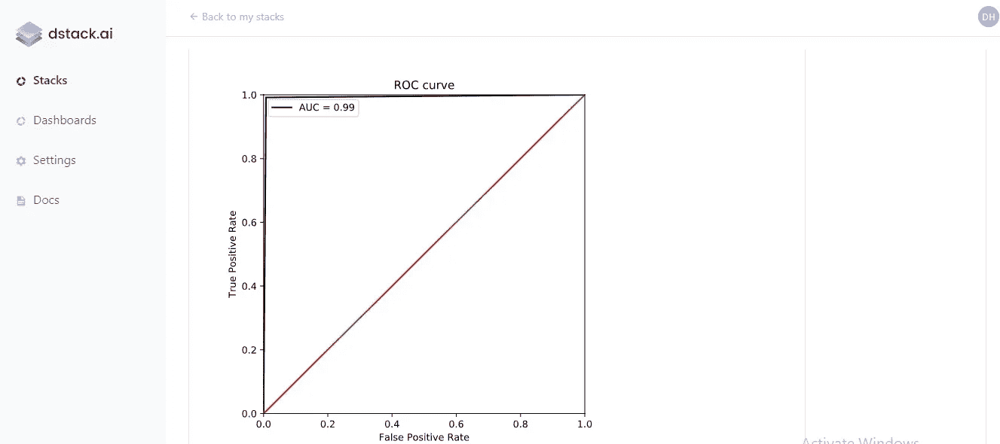
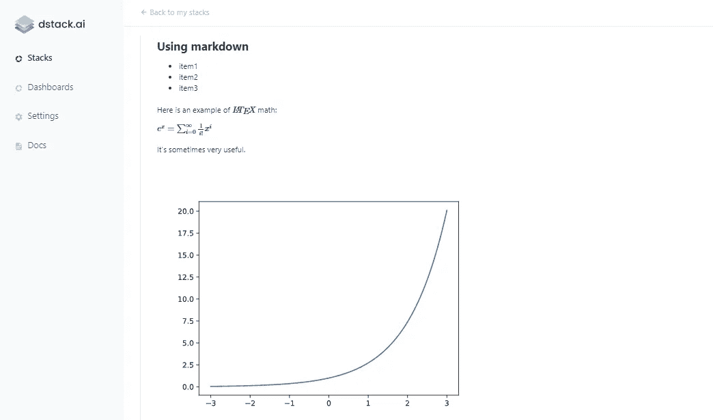
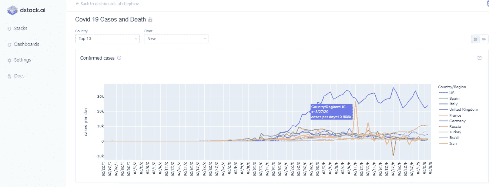

# 关于 dstack.ai 要知道的七件事

> 原文：<https://towardsdatascience.com/top-ten-things-to-know-about-dstack-ai-2567472d6862?source=collection_archive---------70----------------------->

## dstack.ai:协作！！创造！！交流！！

你有没有想过数据科学家到底是如何合作的？最好的协作平台应该是什么？

由[万花筒](https://unsplash.com/@kaleidico?utm_source=medium&utm_medium=referral)在 [Unsplash](https://unsplash.com?utm_source=medium&utm_medium=referral) 上拍摄的照片

## 介绍

大多数数据分析师和他们的团队没有有效的协作实践。事实上，数据科学家之间的大多数现有协作流程都是有机发展的，并没有遵循系统化的方法。如果我们遵循某些专门为此目的而设计的实践或工具，我们可以做得更好，并提高生产率。

今年年初，当我的团队开始抱怨协作效率不高时，我意识到是时候寻找一个设计良好的平台来解决这个问题了。令我高兴的是，我发现了

涉及开发的数据科学家协作工具在市场上非常活跃，尤其是在团队环境中，如竞争团体和创业公司。另一方面 [**dstack.ai**](https://dstack.ai) 并不要求我们具备开发、CSS、部署技能。使用 dstack.ai，我们可以在几分钟内构建一个仪表板，而不是需要几天时间并需要维护的 [Dash](https://plotly.com/dash/) 或 [Shiny](https://shiny.rstudio.com/) 。

另一个要点是，协作工具大多是特定的，没有一个工具能为企业环境提供完整的解决方案，因为它们有非常特定的用例，例如， [**Dash**](https://plotly.com/dash/) 只支持 Python 编程语言，而 [**Shiny**](https://shiny.rstudio.com/) 只支持 R 编程语言。那么，如果个人和初创企业使用多种语言工作，他们会选择什么呢？首选来自 [**dstack.ai**](https://dstack.ai)

[**dstack . ai**](https://dstack.ai)**是其中一个人性化、快速、免费****的数据科学协作平台。在我们深入探讨 [**的细节之前，dstack.ai**](https://dstack.ai) 让我们快速对比一下下面这三款工具。******

********

****Dash Vs 闪亮 Vs dstack.ai****

****看一下上面的表格，人们可以很容易地说，dstack.ai 将在这个领域占据有利位置。****

******现在让我们来讨论选择**[**dstack . ai**](https://dstack.ai)**作为我们数据团队首要工具的十大理由。******

1.  ******轻松协作******

****与任何人、任何地方协作是[dstack.ai](https://dstack.ai) 背后的基本思想。协作至关重要且富有成效，因为它使数据科学家能够解决比单个问题更大的问题。它还通过促进共享上下文来减少依赖性。****

****[dstack.ai](http://dstack.ai/) 是一个高效的协作工具，有助于数据分析师和分布式团队在数据探索和结果交付期间有效工作。****

****通过创建一个堆栈，协作可以变得非常容易和有用。栈只不过是一个你想与他人分享的可视化输出。我为我的团队创建了一个受试者工作特征曲线下面积(ROC-AUC)堆栈，如下图所示，并与大家分享。就是这么简单！！****

********

****我使用 dstack.ai 的第一个堆栈****

******2。更少的时间******

****有没有人不想更快地完成自己的工作？如果我们的团队使用的是 [dstack.ai](http://dstack.ai/) ，我们可以在将近 30%的时间内完成可视化报告的构建并获得利益相关者的反馈。这大大节省了工时。****

****正如**[**dstack.ai**](https://dstack.ai)不需要开发、CSS 和部署的技术技能，有了 d stack . ai 我们可以在几分钟内构建一个仪表板。即使一个非技术人员也能轻松做到。******

****这是可能的，因为有了 [dstack.ai](http://dstack.ai/) 我们的数据科学团队可以在更短的时间内发送他们的数据结果并交换反馈，因为系统已经设置好了，您只需将它用于您的数据。****

******3。省力******

****我再次想知道是否有人愿意为同样的产出付出更多的努力？换句话说，给定一个结果，我们总是想要优化，并最小化所需的努力，以获得一个有效的系统。****

****有了 [dstack.ai](http://dstack.ai/) ，我们的数据科学团队可以提高他们的数据结果，并以更少的工作量与利益相关方交换反馈。例如，如果您必须使用 markdown 和 latex 创建一份报告，它可以在几分钟内完成。示例在下面的截图中。****

********

******4。交互式仪表盘******

****仪表板是构建迷人的交互式报告的一种行之有效的方法。为了构建一个仪表板，我们只需要使用 Python 或 R 应用程序编程接口来推送我们的数据可视化报告。****

****一旦有了可视化效果，只需点击几下就可以将它们组合到一个仪表板中，这是一项非常简单的任务！！****

********

****使用 dstack.ai 的交互式仪表板****

****你可以点击查看这个仪表盘的实况[。](https://dstack.ai/cheptsov/d/505d2087-9adc-49e3-88de-6b46079c394f)****

******5。数据集管理******

****数据科学项目的关键要素之一是数据集的高效协作。dstack.ai 提供了简单的接口和服务来上传和管理数据集。我们还可以管理数据集的修订，并在工作团队中共享这些数据集。****

****如前所述，将数据集和可视化上传到 dstack.ai 对于 Python 和 R 都是可用的。这些数据集可以在 Jupyter 笔记本和应用程序中的 Python 和 R 脚本中使用。****

****我们可以向 dstack.ai 推送(上传)和从 dstack . ai 拉取(下载)数据集。****

****将数据集推送到 dstack.ai****

****从 dstack.ai 中提取数据集****

****使用 [**dstack.ai**](http://dstack.ai/) 创建帐户后，我们可以使用在设置中找到的安全令牌发布数据。****

******6。共享数据报告******

****使用[**dstack . ai**](http://dstack.ai/)**时，共享数据报告非常简单且用户友好。**在 dstack.ai 上发布的所有报告和数据集都遵循为注册个人资料指定的隐私设置。****

****默认情况下，提交给[**dstack . ai**](http://dstack.ai/)**的数据或可视化是公共的**。**但是，我们也可以通过更改单个数据集和可视化的隐私设置来使它们成为私有的。如果需要，我们也可以只与选定的用户共享它们。我们还可以通过电子邮件邀请合作者加入我们的可视化、数据集或仪表板。******

****[**dstack . ai**](http://dstack.ai/)**用户界面支持 bot 手机和电脑浏览器**。**数据报告可通过手机友好型网络应用程序访问。******

****如果需要，我们甚至可以与非技术用户共享发布的链接，以便他或她可以使用 web 浏览器查看和访问 dstack.ai 托管的前端应用程序上的发布堆栈。****

******7。Python 和 R******

****[**dstack.ai**](http://dstack.ai/) 值得称赞的一个方面是它同时支持 Python 和 R。如果你将它与其他工具如 Shiny 和 Dash 进行比较，你会发现 **Shiny** 是一个 R 包，用于使用 R 构建交互式 web 应用程序，另一方面 **Dash** 是一个用于创建 web 应用程序的开源 Python 库。****