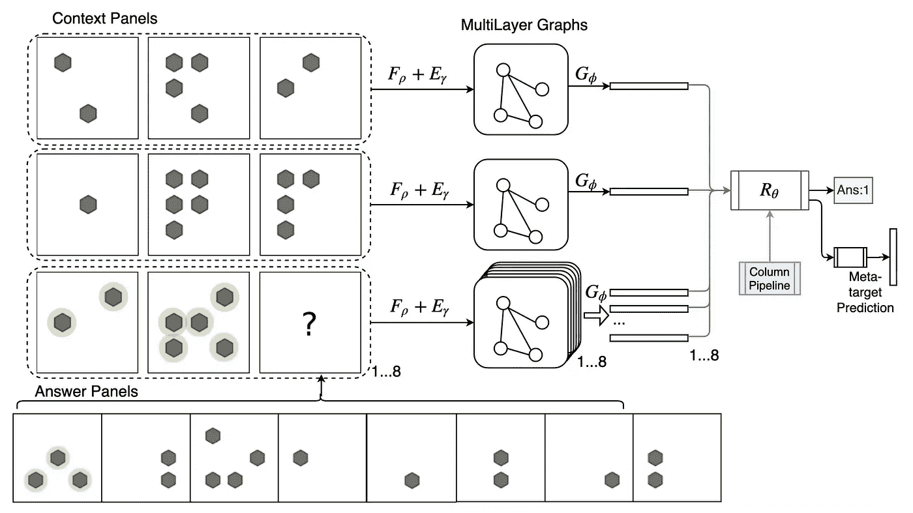
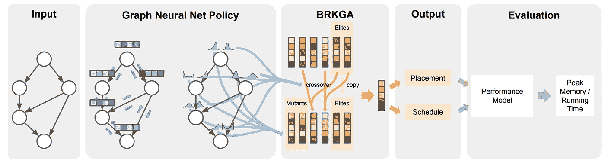
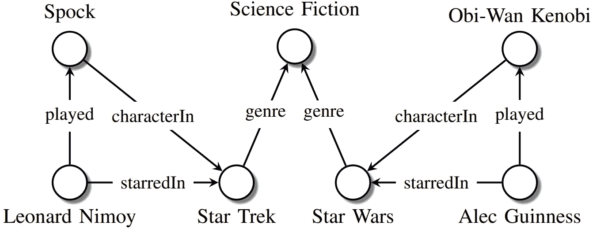
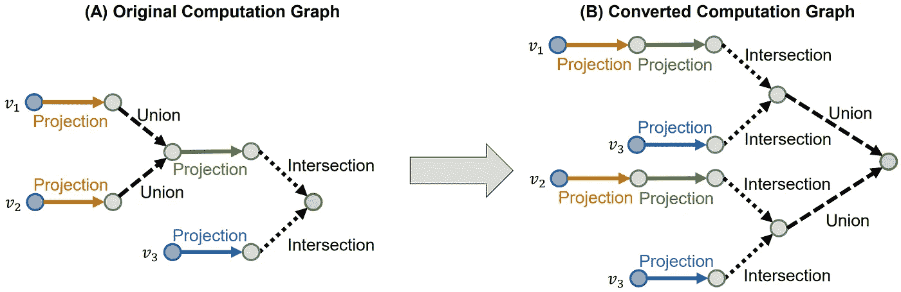
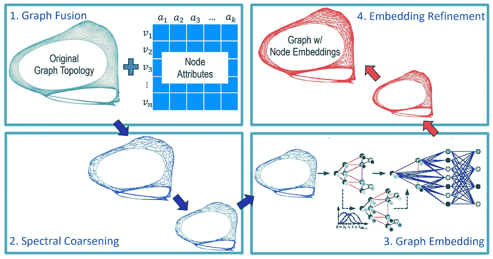

# 2020 年图形机器学习的主要趋势

> 原文：<https://towardsdatascience.com/top-trends-of-graph-machine-learning-in-2020-1194175351a3?source=collection_archive---------8----------------------->

[来源](http://shutterstock.com)

2020 年刚刚开始，但我们已经可以在最新的研究论文中看到图机器学习(GML)的趋势。以下是我对 2020 年 GML 将面临的重要问题的看法，以及对这些论文的讨论。

# 介绍

本文的目标不是介绍 GML 的基本概念，如图形神经网络(GNNs)，而是展示我们在顶级科学会议上可以看到的前沿研究。首先，我把作品提交给了 ICLR 2020，这是 GML 最负盛名的提交作品的会议之一。在[之前的帖子](https://medium.com/@sergei.ivanov_24894/iclr-2020-graph-papers-9bc2e90e56b0)中，我已经描述了这个领域的一些快速统计数据，但这里有一个简短的版本:

> 在 GML 有 150 篇投稿，三分之一的论文被接受。这相当于所有被接受论文的大约 10%。

我阅读了大部分 GML 的论文，以下是我列出的 2020 年趋势:

1.  **对 GNN 的理论理解更加扎实；**
2.  **GNN 新酷应用；**
3.  **知识图谱变得更受欢迎；**
4.  **图嵌入的新框架。**

让我们来看看这些趋势。

# 1.对 GNN 的理论理解更加扎实

我特别兴奋地看到这一趋势，因为它表明 GML 地区正在成熟，以前的启发式方法正在被新的理论解决方案所取代。关于图形神经网络还有很多需要理解的地方，但是关于 GNNs 如何工作已经有了相当多的重要结果。

我先说我最喜欢的: [*神经网络学不到的图形:深度 vs 宽度*](https://openreview.net/forum?id=B1l2bp4YwS) 作者 Andreas Loukas。本文在技术简单性、高度的实际影响和深远的理论见解之间取得了惊人的平衡。

> 它表明，节点嵌入的维数(网络的宽度，`w`)乘以层数(网络的深度，`d`)应该与图的大小`n`，即`dw = O(n)`成比例，如果我们希望 GNN 能够计算出流行的图问题(如循环检测、直径估计、顶点覆盖等)的解决方案。).

因此，GNN 的许多当前实现无法实现这一条件，因为层的数量(在许多实现中约为 2–5)和嵌入的维度(约为 100–1000)与图的大小相比不够大。另一方面，在当前的环境下，更大的网络太令人望而却步，这提出了一个问题，即我们应该如何设计高效的 GNNs 这是我们需要在未来解决的问题。很有说服力的是，这篇论文也从 80 年代的分布式计算模型中得到启发，表明 gnn 本质上做同样的事情。里面有更多的结果，所以我建议看一看。

同样，另外两篇论文，乌诺&铃木和巴塞洛等人，研究了 GNNs 的力量。第一个， [*图神经网络指数级地失去对节点分类的表达能力*](https://openreview.net/forum?id=S1ldO2EFPr) ，表明:

> 在某些权重条件下，当层数增加时，除了节点度数和连通分量(由拉普拉斯谱确定)之外，GCNs 不能学习任何东西。

这个结果是众所周知的性质的推广，即 Markov 过程收敛到唯一的平衡点，其中收敛速度由转移矩阵的特征值决定。

在第二篇论文 [*图神经网络的逻辑表达能力*](https://openreview.net/forum?id=r1lZ7AEKvB) 中，作者展示了 GNNs 和它们可以捕获的节点分类器类型之间的联系。我们已经知道，一些 GNNs 和同构的 WL 测试一样强大，即两个节点被 WL 着色为相同当且仅当它们被 GNNs 分类为相同。但是 GNN 能捕捉到其他分类功能吗？例如，想象一个布尔函数，当且仅当一个图有一个孤立的顶点时，它将 true 赋给所有的节点。GNNs 能抓住这个逻辑吗？直觉上不会，因为 GNN 是一种消息传递机制，如果图的一部分和另一部分(两个相连的组件)之间没有链接，则两者之间不会传递消息。因此，一个简单的解决方案是在邻域聚合后添加一个读出操作，这样当每个节点更新所有要素时，它就拥有了图中所有其他节点的信息。

其他理论方面的工作包括[侯等人](https://openreview.net/forum?id=rkeIIkHKvS)对的图信息使用的测量以及 [Srinivasan & Ribeiro](https://openreview.net/forum?id=SJxzFySKwH) 的基于角色和基于距离的节点嵌入的等价性。

# 2.GNN 的新酷应用

看到 GNNs 如何应用于现实世界的任务也很棒。今年有一些应用程序可以修复 Javascript 中的错误、玩游戏、回答类似智商的测试、优化 TensorFlow 计算图、分子生成和对话系统中的问题生成。

在 [*HOPPITY:学习图变换来检测和修复程序中的 bug*](https://openreview.net/forum?id=SJeqs6EFvB)*Dinella 等人**提出了** **一种在 Javascript 代码**中同时检测和修复 bug 的方法。代码被转换成抽象语法树，然后通过 GNN 预处理以获得代码嵌入。其思想是给定一个处于初始状态的图，通过多轮图编辑操作符(添加或删除节点，替换节点值或类型)来修改它。为了理解图中的哪些节点应该被修改，他们采用了指针网络，该指针网络采用图嵌入和迄今为止的编辑历史，并选择节点。然后，使用 LSTM 网络执行修复，该网络也采用图形嵌入和编辑的上下文。作者在 GitHub 的提交上验证了这种方法，显示了对其他不太通用的基线的显著提升。精神上类似魏等人的工作 [*LambdaNet:使用图神经网络的概率类型推断*](https://openreview.net/forum?id=Hkx6hANtwH) 研究**如何为 Python 或 TypeScript 等语言推断变量的类型。**作者提出了一种类型依赖超图，它包含作为节点的程序变量以及它们之间的关系，例如逻辑(例如布尔类型)或上下文(例如相似的变量名)约束。然后，首先训练 GNN 模型，以产生图的变量和可能类型的嵌入，然后使用这些嵌入来预测具有最高可能性的类型。在实验中，LambdaNet 在标准变量类型(例如 boolean)和用户定义的类型上都有较高的性能。*

*王等人 [*的一篇论文用多重图网络*](https://openreview.net/forum?id=ByxQB1BKwH) 进行抽象图推理，展示了**如何在类智商测验** **(瑞文递进矩阵(RPM)和图三段论(DS))中用 GNNs 进行推理。**在 RPM 任务中，为矩阵的每一行组成一个图，对于该图，通过前馈模型获得边缘嵌入，随后是图摘要。由于最后一行有 8 个可能的答案，因此创建了 8 个不同的图表，每个图表都与前两行连接在一起，以获得 ResNet 模型对 IQ 分数的预测。*

**

*[王等](https://openreview.net/forum?id=ByxQB1BKwH)*

*DeepMind 的一篇论文 [*增强遗传算法学习优化计算图*](https://openreview.net/forum?id=rkxDoJBYPB) 提出**一种 RL 算法优化张量流计算图的代价。**图通过标准的消息传递 GNN 进行处理，产生与图中每个节点的调度优先级相对应的离散嵌入。这些嵌入被送入遗传算法 BRKGA，该算法决定每个节点的设备放置和调度。该模型被训练以优化所获得的张量流图的实际计算成本。*

**

**“用于优化计算图的增强型遗传算法学习”*作者 [Paliwal 等人](https://openreview.net/forum?id=rkxDoJBYPB)*

*其他有趣的应用包括史等人的[分子生成](https://openreview.net/forum?id=S1esMkHYPr)、江等人的[游戏、陈等人的](https://openreview.net/forum?id=HkxdQkSYDB)[对话系统](https://openreview.net/forum?id=HygnDhEtvr)*

# *3.知识图表变得更加流行*

*今年有不少关于知识图推理的论文。本质上，知识图是一种表示事实的结构化方式。与一般的图不同，在知识图中，节点和边实际上有一些含义，如演员的名字或电影中的表演(见下图)。知识图上的一个常见问题是回答复杂的查询，如“2000 年前史蒂文·斯皮尔伯格的哪些电影获得了奥斯卡奖？”，可以翻译成一个逻辑查询∨ { `Win(Oscar, V)` ∧ `Directed(Spielberg, V)` ∧ `ProducedBefore(2000, V)` }。*

**

*知识图示例。(来源:[尼克尔等人](https://arxiv.org/abs/1503.00759))*

*在论文 [*Query2box:使用盒子嵌入对向量空间中的知识图进行推理*](https://openreview.net/forum?id=BJgr4kSFDS) 中，任等人**提出将查询嵌入到潜在空间中，而不是作为单个点，而是作为矩形盒子。**该方法允许执行自然交集操作，即合取∧，因为它产生新的矩形框。然而，对并集(即析取∨)建模并不那么简单，因为它可能会导致非重叠区域。此外，为了精确地对任何具有嵌入的查询建模，由 VC 维测量的嵌入之间的距离函数的复杂度应该与图中实体的数量成比例。相反，有一个很好的技巧可以将析取查询替换为 DNF 形式，其中联合只发生在计算图的末尾，这有效地简化了每个子查询的简单距离计算。*

**

**[*任等*](https://openreview.net/forum?id=BJgr4kSFDS) 【查询 2 框:利用框嵌入对向量空间中的知识图进行推理】**

**在类似的主题中，Wang 等人**在标题为 [*“知识图中数值规则的可微分学习”*](https://openreview.net/forum?id=rJleKgrKwS) *的论文中提出了一种处理数值实体和规则***的方法。例如，对于一个引用知识图，您可以有一个规则`influences(Y,X)` ← `colleagueOf(Z,Y)` ∧ `supervisorOf(Z,X)` ∧ `hasCitation>(Y,Z)`，该规则指出，通常情况下，学生`X`受到他们的主管`Z`的同事`Y`的影响，该同事引用的次数更多。该规则右侧的每个关系可以表示为矩阵，并且寻找缺失链接的过程可以表述为关系与实体向量的连续矩阵乘法，该过程称为规则学习。由于矩阵的构造方式，神经方法只能使用分类规则，如`colleagueOf(Z,Y)`。作者的贡献是以一种新的方式有效地使用数字规则，如`hasCitation>(Y,Z)`和求反运算符，通过表明在现实中没有必要显式地物化这样的矩阵，这大大减少了运行时间。**

**另一个在机器学习领域更频繁出现的主题是**对现有模型的重新评估，以及它们在公平环境中的表现。像这样的论文 [*可以教老狗新把戏！Ruffinelli 等人的关于训练知识图嵌入*](https://openreview.net/forum?id=BkxSmlBFvr) 的研究表明，新模型的性能通常取决于实验训练的“次要”细节，例如损失函数、正则化子和采样方案的形式。在一项大型消融研究中，作者观察到，旧方法(如重新标度模型)仅通过适当调整超参数就可以实现 SOTA 性能。****

**在这个领域还有许多其他有趣的作品。 [Allen 等人](https://openreview.net/forum?id=SygcSlHFvS)基于单词嵌入的最新见解，了解更多关于关系和实体的学习表征的潜在空间。 [Asai et al.](https://openreview.net/forum?id=SJgVHkrYDH) 展示了一个模型如何在回答给定查询的维基百科图上检索推理路径。[塔巴科夫&科斯塔贝罗](https://openreview.net/forum?id=S1g8K1BFwS)触及了图嵌入模型的概率校准这个重要话题。他们表明，通过用 sigmoid 函数变换逻辑来获得概率的流行嵌入模型 TransE 和 ComplEx 校准得很差，即要么低估要么高估事实的存在。他们的方法依赖于生成被破坏的三元组作为负数，这些负数被已知的方法使用，例如 Platt 标度和保序回归来校准概率。**

# **4.图嵌入的新框架**

**图形嵌入是图形机器学习的一个长期话题，今年有了关于我们应该如何学习图形表示的新观点。**

**Deng 等人**在工作 [*GraphZoom:一种用于精确和可扩展图嵌入的多级谱方法*](https://openreview.net/forum?id=r1lGO0EKDH) 中提出了一种在节点分类问题中改进任何无监督嵌入方法**的运行时间和准确性的方法。总体思想是首先将原始图缩减为更小的图，这样可以快速计算节点嵌入，然后恢复原始图的嵌入。开始时，基于属性相似性，用对应于节点的 k 个最近邻居之间的链接的附加边来扩充原始图。然后，对图进行粗化:通过局部谱方法将每个节点投影到一个低维空间，并聚集成簇。任何无监督的图嵌入方法，如 DeepWalk 或 Deep Graph Infomax，都可以用来获得小图上的节点嵌入。在最后一步中，所获得的节点嵌入(其本质上代表聚类的嵌入)用平滑算子迭代地广播回来，以防止不同的节点具有相同的嵌入。在实验中，GraphZoom 框架比 node2vec 和 DeepWalk 方法实现了惊人的 40 倍加速，准确率提高了 10%。**

****

**“GraphZoom:一种用于精确和可扩展图形嵌入的多级谱方法”，作者[邓等人](https://openreview.net/forum?id=r1lGO0EKDH)**

**一些论文已经仔细研究了图分类问题的先前结果。[*Errica 等人对用于图形分类的图形神经网络*](https://openreview.net/forum?id=HygDF6NFPB) 的公平比较有助于对关于该问题的 GNN 模型的公平重新评估，**表明，不利用图形拓扑的简单基线(即，它在聚集节点特征上工作)的性能与 SOTA GNNs 相当。**这一令人惊讶的现象显然在 2015 年由[奥尔洛娃等人](https://sites.google.com/site/feast2015/program/accepted-abstracts)发表过，但并未获得大量读者。这项工作的一个很好的结果是在流行的数据集上的公平的 SOTA 结果和 PyTorch-Geometric 中的方便的代码库来运行未来论文的模型比较。在我们的工作 [*理解图数据集中的同构偏差*](https://openreview.net/forum?id=rJlUhhVYvS) *，*中，我们还发现，在常用的数据集如 MUTAG 或 IMDB 中，许多图具有同构副本，即使考虑节点属性。此外，在这些同构图中，**许多具有不同的目标标签，这自然为分类器引入了标签噪声。** [这表明](https://medium.com/@sergei.ivanov_24894/new-graph-classification-data-sets-43e134340d2d)使用网络的所有可用元信息(例如节点或边属性)对于模型的更好性能的重要性。另一部作品 [*强大的图形神经网络有必要吗？陈等人对图分类*](https://openreview.net/forum?id=BJxQxeBYwH) 的剖析表明，如果用其线性对应物(包括邻居的度和传播的图属性)替换非线性邻域聚合函数，则模型的性能不会降低，这与先前的陈述一致，即许多图数据集对于分类来说是微不足道的，并且提出了对于该任务的适当验证框架的问题。**

# **结论**

**随着顶级会议的提交率不断增长，我们可以预计 2020 年 GML 领域将出现许多有趣的结果。我们已经可以看到这个领域的转变，从深度学习在图上的启发式应用到更合理的方法和关于图模型范围的基本问题。GNNs 找到了自己的位置，成为许多可以用图来表达的实际问题的有效解决方案，但我希望总体而言，GML 只是触及了我们在图论和机器学习的交叉点上所能实现的表面，我们应该继续关注即将到来的结果。**

***P.S .我会继续写关于图机器学习的内容，所以如果你有兴趣，可以在 medium 上关注我或者订阅我的* [*电报频道*](https://t.me/graphML) *或者* [*我的 twitter*](https://twitter.com/SergeyI49013776) *。***