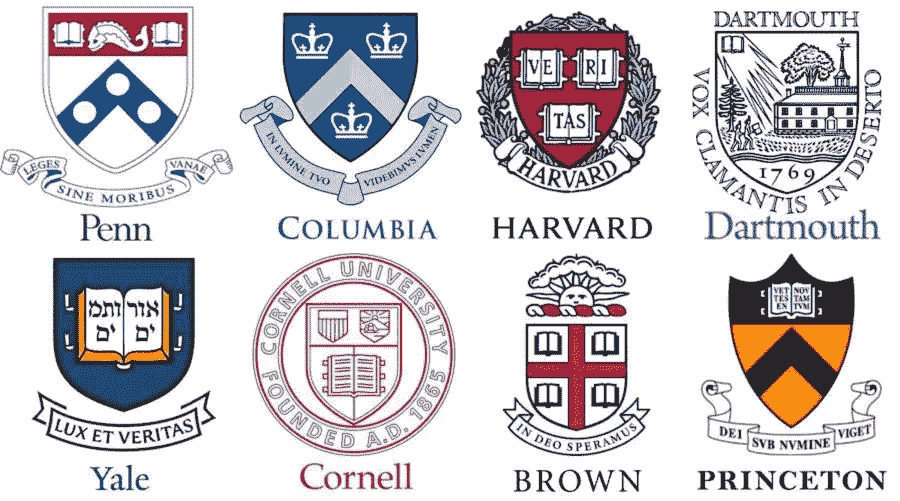
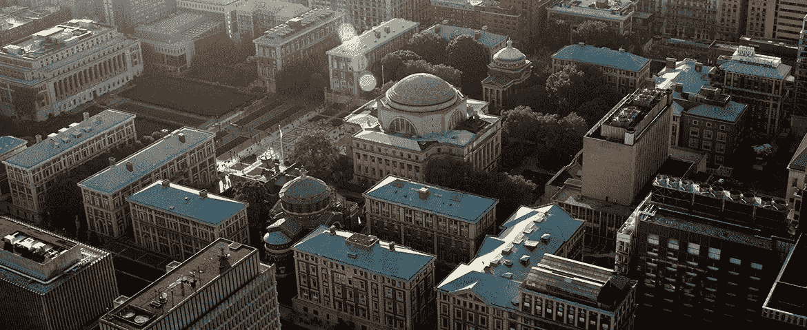
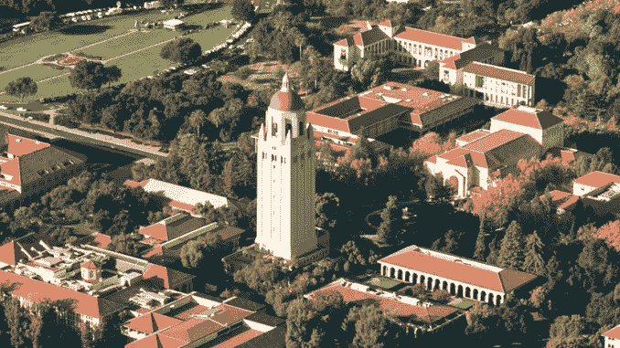
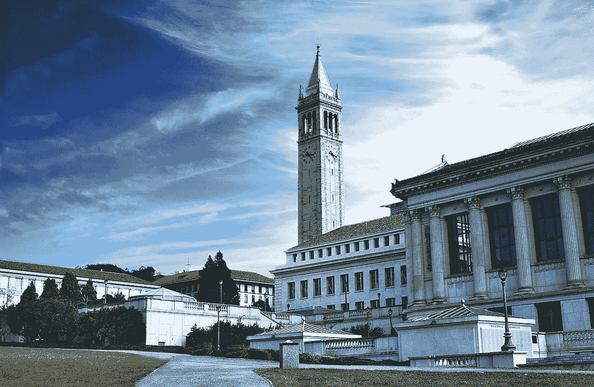
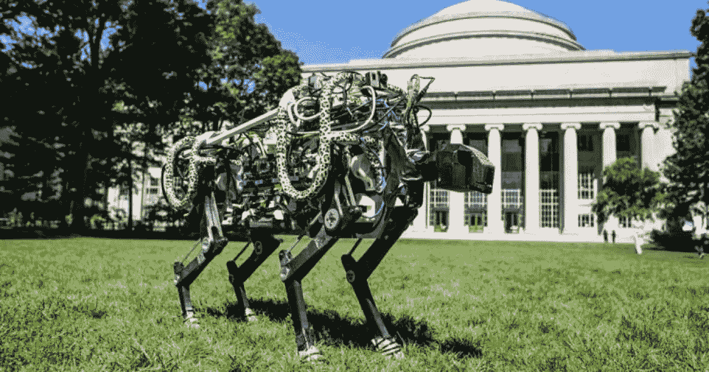

# 美国顶尖计算机科学学院

> 原文：<https://towardsdatascience.com/top-us-colleges-for-computer-science-78df5a829270?source=collection_archive---------3----------------------->

## 基于个人和轶事经验的思考

在这篇文章中，你会发现如果你想获得计算机科学学位，什么学校是最好的选择。

这篇文章的视频版本，如果你更喜欢看而不是读:)

现在，我是一个奇怪的例子，因为在我的一生中，我赢得了在世界上一些最好的大学直接学习或工作的机会。在我的一生中，我跳过了许多学校，包括麻省理工学院、牛津大学、哥伦比亚大学、帝国理工学院、加州理工学院、斯坦福大学和伯克利大学。

因此，根据我的经验，我决定在 2020 年创建一个计算机科学的顶级学校，这样，那些希望获得计算机科学学位的人就可以知道哪些学校值得关注。

我想承认，这是基于我的个人观点，我相信 T2 还有许多其他优秀的计算机科学学校，我不会在这篇文章中提及，因为我没有直接的经验。在下面所有的例子中，我或者学习过，或者工作过，或者和参加过或者帮助教授过提到的课程和项目的人是好朋友。

# 常春藤联盟

所以我们从常春藤联盟开始吧。常春藤联盟由 8 所学校组成:布朗大学、哥伦比亚大学、康奈尔大学、达特茅斯大学、哈佛大学、普林斯顿大学、宾夕法尼亚大学和耶鲁大学。

常春藤盟校校花，感谢[火炬](https://shatorch.com/1572/editorials/ivy-leagues-are-overrated/)

一般来说，这些学校拥有“最好”的声誉，你通常会发现它们在《美国新闻》、《福布斯》和《商业内幕》上占据了前 10 名“最好的大学”。

根据我朋友的观点，所有这些学校都有很好的计算机科学学位。其中，我认为最好的是哈佛和哥伦比亚之间的决胜局。就时间安排的灵活性而言，布朗大学是最宽松的，而宾夕法尼亚大学和康奈尔大学可以说是“联盟”中规模最大的大学。耶鲁和普林斯顿都有小得多的、紧密团结的社区，与“更大、更大的城市”有些隔离

## 哥伦比亚大学

哥伦比亚坐落在纽约市的中心，有着曼哈顿的脉搏，有着大城市生活的起伏。

[哥伦比亚大学](https://cuit.columbia.edu/])，晨边校区。从东北方向鸟瞰

我只在其中两所大学——哥伦比亚大学和哈佛大学——上过课或学过。这两所学校都有高度结构化的计算机科学项目，我曾与这两所大学的一些极其聪明、敏锐、勤奋的本科生、研究生和教师一起工作过。

随着时间的推移，我观察到，哥伦比亚大学和哈佛大学的特定 CS 课程拥有如此强大的追随者，以至于它们创建了拥有自己内部规范和文化的完整社区。

哈佛的顶级课程是 CS50，由魅力非凡的大卫·马兰教授。据我所知，CS50 让学生们体验了 C、Python、带有 CSS 和 HTML 的 Javascript 以及 SQL。就定制你在哈佛的 CS 教育而言，它非常灵活，可以选择探索独特的“思维和行为轨迹”，以及探索联合浓度。

瑞茜·威瑟斯彭身着《律政俏佳人》，承蒙吉菲

在哥伦比亚大学，计算机科学课程与其他院系紧密结合。大约有 7 个不同的专业，从“智能系统”到“机器人”我注意到，哥伦比亚大学的一门突出的课程给了本科生一个很好的优势，那就是他们可以接触到 C 和 C++。“J”教授曾经教过这门课，作为一项强制性要求，我记得我的许多本科朋友和学生告诉我这门课很残酷。然而，几年后，在工作中，他们对 C、C++和 UNIX shell 脚本的接触使他们受益匪浅。

所以，如果你正在寻找一个计算机科学学位，考虑一下，虽然所有的常春藤联盟学校都可以给你一个坚实可靠的计算机科学教育；首选是哈佛和哥伦比亚。

现在让我们来谈谈在美国提供世界级计算机科学教育的非常春藤联盟的学校。

## **斯坦福**

斯坦福大学，承蒙[帕洛阿尔托每日邮报](https://padailypost.com/2019/11/01/stanford-drops-plan-to-expand-campus/)

斯坦福坐落在硅谷的中心，提供了充足的行业学术机会。他们在理论、人机交互、人工智能方面做了很多创新性的研究。他们目前有 17 位诺贝尔奖获得者在校园里教学。我曾经在黄工程与科学中心(以英伟达 CEO 的名字命名)的地下室工作过，我会告诉你——斯坦福大学的拼搏精神很强。

我见过学生在地下室工作到深夜，大约 8-15 名学生挤在巨大的桌子周围，助教不知疲倦地回答他们的所有问题。当我想象 CS 的协作精神时，我总是想象旁观者斯坦福学生所展示的团队精神。从和我一起去麻省理工学院并继续在斯坦福大学攻读硕士学位的朋友那里，一个突出的关键因素是观察到的幸福水平。

有些人可能会将此归因于这样一个事实，即大多数斯坦福计算机科学课程(这肯定不是全部，还有一些很难的课程)，大约有 30-50%的学生可以得到 a。这对于我的一个朋友来说是一个巨大的冲击，他也和我一起去了麻省理工学院，因为曲线肯定不是 T2 那么宽。并不是说分数是成为一名优秀工程师的超级准确的指标(他们真的不是)，但不必为拥有优秀的 GPA 而紧张的压力一定是一种解脱，是其他不那么宽容的机构欢迎的替代选择。

## 伯克利

现在我们来讨论一下伯克利。相对于提到的其他学校，伯克利是顶尖的公立学校之一，也是一个更实惠的选择。如果你来自加州，并且预算有限，那么伯克利是一个很好的选择。

伯克利校园，由 brainchildvn 拍摄，在 [Flickr](https://www.flickr.com/photos/brainchildvn/) 上发布

我个人在伯克利从事区块链工作，有几个朋友在那里学习计算机科学和机器人技术。众所周知，课堂上的空间竞争非常激烈，但这是大多数公立大学的领域。

我记得带着 Denero 的 CS 61A 改变了我朋友群中几个人的生活，为那些在 18 岁之前或开始上大学之前从未编程或编写软件的人打下了坚实的基础。同样，CS 61B，数据结构将是为软件工程面试的技术部分做准备的最重要的课程之一。所以如果你不怕大班，你有竞争力，你又缺钱，那么伯克利是一个极好的选择。

## 加州理工学院

许多人会认为加州理工学院是西海岸最难的学校之一。这是美国最小的大学之一，每班大约有 200 名学生。他们通常也被视为我们在麻省理工学院的竞争对手。他们的核心课程很激进——所有学生都被要求学习量子力学。

自主系统中心是加州理工学院发起的一项新举措，一些令人难以置信的教师致力于开发机器人探险家、守护者、变形金刚和运输工具。声音科幻？你打赌！我非常自信地说，由于加州理工学院的惊人工作，我们今天对科幻小说的看法将成为明天的科学现实。如果你想有一个挑战，有机会与教师进行充分的一对一指导和交流，并希望距离 La-La Land 半小时的路程，那么就去加州理工学院吧。

## 卡耐基梅隆大学

最后一所是卡内基梅隆大学。现在，这所学校特别引人入胜，因为它在计算机科学和戏剧方面都名列前茅。这所学校的学生很投入，充满激情，他们对挑战并不陌生。我在这里的一些同事和朋友已经成为不可思议的技术领袖、导演和知识产权律师，他们碰巧在这个过程中制造了一两个英特尔奔腾芯片。在这一类别的学校中，CMU 的录取率最高，2019 年约为 17%。

现在，从我自己被学院本身所影响的角度来看，我认为对计算机科学来说最好的大学是…

## **麻省理工学院**

1056 位教授。90 位诺贝尔奖获得者。59 位国家科学奖章获得者。75 名麦克阿瑟研究员。上午 15 图灵奖获得者。

麻省理工学院的猎豹，由 [IEEE](https://ieeexplore.ieee.org/document/7554355) 提供

麻省理工学院是美国最难进的学校之一。麻省理工学院的大多数学生学习到深夜，我们遵循努力工作，尽情玩乐的哲学。

麻省理工学院的计算机科学课程，我们称之为“课程 6 ”,过去是，现在可能仍然是，最受欢迎和最常见的三大专业之一。因为你正在和世界上其他一些最聪明的人一起学习，这种经历会让你很快变得谦卑。

人们带着各种各样的经验参加课程 6。当我旁听一些课程时，我的左边会有一位国际化学奥林匹克冠军，还有一位在开始大一/大一之前已经在亚马逊实习过的软件工程师。

麻省理工学院改变生活和范式的最“有价值”的课程是 6.006——算法导论。从我的经验来看，麻省理工学院的课程比其他大学更偏重理论。我认为这是因为该部门强调，如果我们能学会如何学习，如果我们理解了基本原则，我们就能真正解决任何问题，或构建任何应用程序。

在这门课中，你通常必须理解算法背后的基本理论或证明，并且能够用 Python 实现它。麻省理工学院也有在群体中设置 p 的文化。团队合作是必不可少的，深夜，发光二极管的屏幕，以及注意力、压力和心流水平的波动都等同于这种体验。如果你有关于麻省理工学院的其他问题，我很乐意与你分享更多。

众所周知的消防水管，位于麻省理工学院斯塔塔中心([麻省理工学院斯隆](https://mitsloan.mit.edu/student-blogs/mba-2017/drinking-from-the-fire-hose/))32 号楼

好吧，你可能认为麻省理工学院是最好的学校之一，事实也的确如此。然而，我也想说…在你来这里之前要三思。虽然你将是最聪明的人之一，并从最鼓舞人心和最敏锐的教授那里学习，但我们这里没有分数膨胀。

你会喝消防水管里的水。你还必须为最大的挑战做好准备(技术上和精神上)。自我将被粉碎，你对自己知道和不知道的东西的理解将被戏剧性地改写。这没关系。正是通过不断的自我创造和自我毁灭，人类获得了内在的力量。

另外，我想强调的是，在美国之外还有很多很棒的学校。例如，我也曾在滑铁卢大学、牛津大学和伦敦帝国理工学院学习和工作。那里的学生和他们的美国同学一样有动力，有动力，也一样聪明。

我没有在这里包括对他们的评估，只是因为课程、项目结构和时间表与我们在地球的这一边有很大的不同。这些录取系统与我们在美国的完全不同，但是对于愿意在国外生活的学生来说，有很多很好的选择。我很高兴向你们每个人解释其中的区别，如果你想了解更多美国以外的国际选择，请随时联系我！