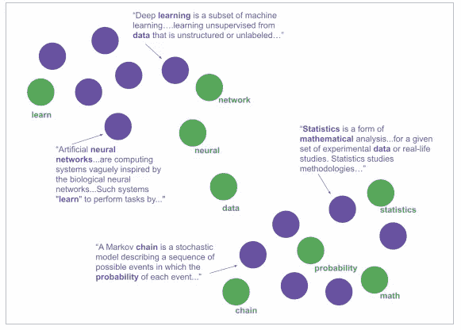
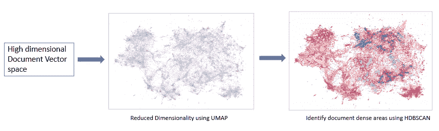
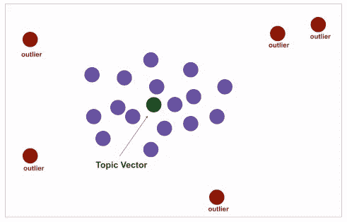

# TOP2VEC:主题建模的新方式

> 原文：<https://towardsdatascience.com/top2vec-new-way-of-topic-modelling-bea165eeac4a?source=collection_archive---------9----------------------->

几年前，从成千上万没有标注的自由文本文档中提取主题/话题/概念是非常困难的。最好和简单的方法是让一些人坐下来，浏览每篇文章，理解和注释主题。事实上，这很费时间，而且容易受到我们人类主观感知的影响。

尽管在过去已经进行了许多尝试，使用像 pLSA 这样的简单算法来处理这种无监督学习问题并提取主题，但是 LDA 彻底改变了该领域，它通过在主题-单词和文档-主题分布之前添加 Dirichlet 来实现这一奇迹。多年来，LDA 曾经是主题建模问题最受欢迎的算法。然而，这些模型的目标是找到可以用来以最小的误差重新创建原始文档的主题。

这两种算法都落后的几个领域:

1.  假设主题的数量是已知的，理想情况下是未知的，并且成为模型的超参数，以获得更好的连贯性和迷惑性
2.  删除停用词是必要的，否则主题词分布将会受到停用词的高度污染
3.  致力于文档的 BOW(单词包)表示，忽略语义。像词汇化、词干化这样的预处理步骤可能有助于但无助于理解*边*和*边*的意思相同

那么，Top2Vec 是如何工作的呢？？让我们一层一层地解码，并尝试在高层次上构建它的框架

在幕后，Top2Vec 利用 Doc2vec 首先生成一个语义空间(语义空间是一个空间空间，其中向量之间的距离是语义相似性的指标)。

如果你关注 NLP 研究，那么你一定读过 doc2vec 算法，它是对 word2vec 的高级修改，用于创建文档/句子/段落嵌入。与 word2vec 不同，doc2vec 还在训练阶段将段落向量(可以将其视为正在学习的另一个单词向量)与单词向量结合在一起。和 word2vec 一样，do2vec 也有两种训练方式:

1.  具有分布式存储器(DM)段落向量:给定段落向量和上下文向量，预测目标单词
2.  分布式单词包(DBOW):给定段落向量，预测上下文单词

由于更好的性能和模型的简单性，Top2Vec 使用了 Doc2Vec 的 DBOW 版本。

这个由单词和文档向量组成的语义空间是主题的连续表示，不像 LDA，主题是从离散空间中采样的。现在以这个共同嵌入的单词和文档语义空间为例，文档高度集中的密集区域可以被认为具有相似的主题，并且可以由附近的嵌入单词来最好地表示。

图一。(来源于[1])]具有文档(紫色气泡)和单词(绿色气泡)的联合嵌入的语义空间的图示

为了找到文档向量的密集区域来识别主题向量，首先想到的选择是利用一些基于密度的聚类算法(HDBSCAN 似乎是理想的)。但是直接使用这些算法的问题是，我们处理的不是二维空间，而是它的多维稀疏空间和维数灾难。所以要克服这个问题，可以先进行降维，然后用 HDBSCAN 进行聚类。为了降低文档向量的维数，使用了一致流形逼近和投影降维(UMAP ),因为它在保持局部和全局结构方面是很好的。

图二。(来源于[1])识别文档密集区域

因此，UMAP 和 HDBSCAN 帮助我们识别文档密集的聚类，主题向量可以简单地计算为这些聚类的质心。

图三。(来源于[1])密集文档聚类的质心是主题向量

因为我们已经在单个语义空间中联合训练了文档和词向量。因此，一旦我们确定了主题向量，就很容易找到附近最能代表该主题的词向量，因此我们可以获得每个主题的词分布。这样，我们就可以为 body 中的每个文档生成主题

由于 Top2Vec 给了我们一个语义空间中主题的连续表示，这也允许我们将主题的数量减少到任何期望的数量。这是通过取最小主题的主题向量和它的最近主题向量的加权算术平均值来完成的，每个主题向量都根据它们的主题大小来加权。每次合并后，都会重新计算每个主题的主题大小(即主题所属文档的数量)

**在使用 Top2Vec 之前我们需要去掉停用词吗？**

不，因为这样的停用词将出现在几乎所有的文档中，因此它们将与所有主题等距，而不会作为离任何主题最近的词出现。

这篇论文的作者也为这个模型提供了开源的 API(【https://github.com/ddangelov/Top2Vec】T2),并且只需要很少的编码工作就可以很好地完成。我不会进入这一部分，让你来做实验

参考资料:

[1]https://arxiv.org/pdf/2008.09470.pdf

[2][https://arxiv.org/pdf/1405.4053.pdf](https://arxiv.org/pdf/1405.4053.pdf)