# 主题建模文章与 NMF

> 原文：<https://towardsdatascience.com/topic-modeling-articles-with-nmf-8c6b2a227a45?source=collection_archive---------1----------------------->

抽取主题是发现文本之间潜在关系的一种很好的无监督数据挖掘技术。有许多不同的方法，最流行的可能是 LDA，但我将集中讨论 NMF。我在这方面取得了更大的成功，而且它通常比 LDA 更具可扩展性。

本文介绍了如何:

*   为主题建模准备文本
*   从文章中提取主题
*   总结这些主题
*   自动查找用于模型的最佳主题数量
*   在所有主题中找到质量最高的主题
*   预测一篇新文章的主题

和往常一样，所有代码和数据都可以在我的 GitHub [页面](https://github.com/robsalgado/personal_data_science_projects/tree/master/topic_modeling_nmf)的存储库中找到。


由[罗曼·维尼斯](https://unsplash.com/@rvignes?utm_source=unsplash&utm_medium=referral&utm_content=creditCopyText)在 [Unsplash](https://unsplash.com/s/photos/text?utm_source=unsplash&utm_medium=referral&utm_content=creditCopyText) 上拍摄的照片

# 数据

我用的是 CNN 的'[商业](https://www.cnn.com/business)'栏目的全文文章。文章出现在 2020 年 3 月下旬到 2020 年 4 月上旬的那个页面，被刮了。每天早上 8 点运行一次刮刀，刮刀包含在存储库中。“商业”页面上的文章关注几个不同的主题，包括投资、银行、成功、视频游戏、科技、市场等。

让我们做一些快速的探索性数据分析来熟悉数据。共 301 篇，平均字数 732 字，标准差 363 字。这是前五行。

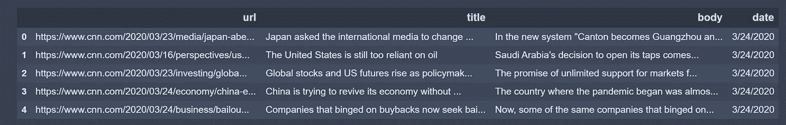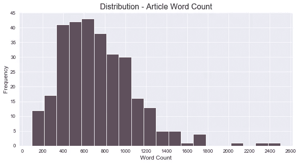

就字数的分布而言，它有点偏正，但总体而言，它是一个非常正常的分布，第 25 百分位为 473 个单词，第 75 百分位为 966 个单词。大约有 4 个异常值(高于第 75 百分位 1.5 倍)，最长的文章有 2.5K 个单词。

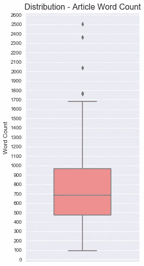

以下是对文本进行处理后，所有文章中出现频率最高的 20 个词。“公司”、“商业”、“人”、“工作”和“冠状病毒”是前 5 名，考虑到页面的焦点和数据被抓取的时间框架，这是有道理的。

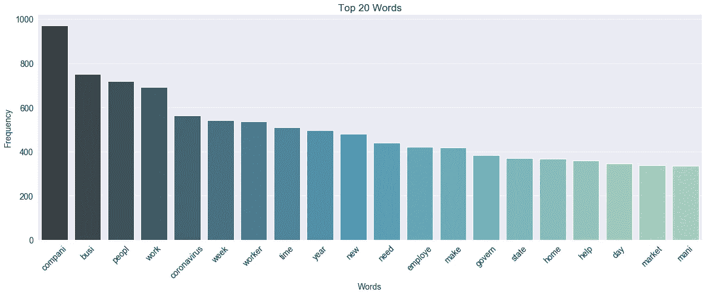

# NMF

非负矩阵分解(NMF)是一种无监督的技术，因此没有模型将被训练的主题的标签。它的工作方式是，NMF 将高维向量分解(或因式分解)成一个低维表示。这些低维向量是非负的，这也意味着它们的系数是非负的。

利用原始矩阵(A)，NMF 会给你两个矩阵(W 和 H)。w 是它找到的主题，H 是这些主题的系数(权重)。换句话说，A 是按词排序的文章(原创)，H 是按主题排序的文章，W 是按词排序的主题。

因此，假设有 301 篇文章、5000 个单词和 30 个主题，我们将得到以下 3 个矩阵:

```
A = tfidf_vectorizer.transform(texts)
W = nmf.components_
H = nmf.transform(A)A = 301 x 5000
W = 30 x 5000
H = 301 x 30
```

NMF 将修改 W 和 H 的初始值，使得乘积接近 A，直到逼近误差收敛或者达到最大迭代次数。

在我们的例子中，高维向量将是 tf-idf 权重，但它实际上可以是任何东西，包括单词向量或简单的单词原始计数。

# 文本处理

这是该过程中最关键的步骤之一。俗话说，“垃圾进来，垃圾出去”。当处理文本作为我们的特征时，尝试减少独特的单词(即特征)的数量是非常关键的，因为会有很多。这是我们对太多特性的第一次防御。

抓取的数据真的很干净(CNN 拥有好的 html，但并不总是如此)。你应该总是手动浏览文本，并确保没有错误的 html 或换行符等。这肯定会出现并伤害模特。

下面是我正在使用的函数:

*   [标记化](https://en.wikipedia.org/wiki/Lexical_analysis#Tokenization)文本
*   小写文本
*   展开收缩
*   [茎](https://en.wikipedia.org/wiki/Stemming)正文
*   删除标点符号、停用词、数字、单个字符和带有额外空格的单词(由展开缩写造成的假象)

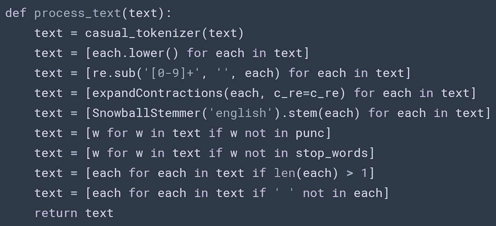

这是我在文章开始时使用的默认设置(在这种情况下效果很好)，但我建议将它修改为您自己的数据集。例如，我在一些数据集中添加了特定的停用词，如“cnn”和“ad ”,所以你应该经常浏览并查找类似的内容。这些是经常出现的词，很可能不会增加模型解释主题的能力。

以下是处理前后的文本示例:

*   在新体制下，“广州变成广州，天津变成天津。”最重要的是，报纸现在将把中国的首都称为北京，而不是北京。对一些美国出版物来说，这一步走得太远了。大约在这个时候，芝加哥论坛报在一篇关于拼音的文章中说，虽然它将对大多数汉字采用拼音，但一些名字已经“根深蒂固”
*   新州变成广州天津变成天津进口报纸西班牙语参考国首都北京北京大步远美国公众文章拼音时代芝加哥论坛报采用中文单词变得根深蒂固

# 特征创建、选择和更多缩减

既然文本已经被处理了，我们可以用它来创建特征，把它们变成数字。有几种不同的方法可以做到这一点，但总的来说，我发现从文本中创建 tf-idf 权重工作得很好，并且在计算上不是很昂贵(即运行速度快)。

你可以在这里阅读更多关于 tf-idf [的内容。一些其他的文本特征创建技术有](https://en.wikipedia.org/wiki/Tf%E2%80%93idf)[单词袋](https://en.wikipedia.org/wiki/Bag-of-words_model)和[单词向量](https://en.wikipedia.org/wiki/Word2vec)，所以你可以随意探索这两种技术。

对于特征选择，我们将“min_df”设置为 3，这将告诉模型忽略出现在少于 3 篇文章中的单词。我们将“max_df”设置为. 85，这将告诉模型忽略出现在超过 85%的文章中的单词。这将帮助我们消除对模型没有积极贡献的单词。

经过处理后，我们有 9K 多一点的唯一单词，因此我们将设置 max_features，以便只包括文章中词频最高的 5K 个单词，以便进一步减少特征。

除了单个单词的 tf-idf 权重，我们还可以为 [n-grams](https://en.wikipedia.org/wiki/N-gram) (二元模型、三元模型等)创建 tf-idf 权重。).为此，我们将 n_gram 的范围设置为(1，2 ),它将包括一元和二元。

我们还需要使用一个预处理程序来连接标记化的单词，因为默认情况下模型会标记化所有内容。

```
texts = df['processed_text']tfidf_vectorizer = TfidfVectorizer(
    min_df=3,
    max_df=0.85,
    max_features=5000,
    ngram_range=(1, 2),
    preprocessor=' '.join
)tfidf = tfidf_vectorizer.fit_transform(texts)
```

现在我们有了这些特性，我们可以创建一个主题模型。👍

# 人工主题建模

首先是一个主题模型的例子，我们手动选择主题的数量。之后我将展示如何自动选择最佳数量的主题。艰难的工作已经完成，所以我们需要做的就是运行模型。

```
nmf = NMF(
    n_components=20,
    init='nndsvd'
).fit(tfidf)
```

唯一需要的参数是组件的数量，即我们想要的主题数量。这是整个主题建模过程中最关键的一步，将极大地影响你最终主题的好坏。现在，我们将它设置为 20，稍后我们将使用一致性分数来自动选择最佳数量的主题。

我还用“nndsvd”初始化了模型，它最适合我们这里的稀疏数据。其他一切我们将保留为默认的工作良好。但是，可以随意试验不同的参数。

# 连贯性得分

为了评估主题的最佳数量，我们可以使用连贯性分数。解释它是如何计算的超出了本文的范围，但一般来说，它测量的是一个主题中单词之间的相对距离。[这里的](http://svn.aksw.org/papers/2015/WSDM_Topic_Evaluation/public.pdf)是关于如何在 gensim 中实现它的原文。

有几种不同类型的连贯性评分，其中最受欢迎的是 *c_v* 和 *u_mass* 。 *c_v* 更精确，而 *u_mass* 更快。我将在这里使用 *c_v* ，范围从 0 到 1，1 是完全一致的主题。

我喜欢 sklearn 的 NMF 实现，因为它可以使用 tf-idf 权重，我发现这比 gensim 的实现只能使用的原始字数更好(据我所知)。然而，sklearn 的 NMF 实现没有一致性分数，我还没有找到如何使用 *c_v* 手动计算的示例(有[这个](https://github.com/derekgreene/topic-model-tutorial/blob/master/3%20-%20Parameter%20Selection%20for%20NMF.ipynb)使用 *TC-W2V* )。如果有人知道一个例子，请让我知道！

因此，我们将使用 gensim 获得具有一致性分数的最佳主题数量，然后将该数量的主题用于 NMF 的 sklearn 实现。

# 自动选择最佳数量的主题

显然，有一种自动选择最佳主题数量的方法是非常关键的，尤其是如果这将进入生产阶段。使用一致性分数，我们可以针对不同数量的主题运行模型，然后使用具有最高一致性分数的主题。这当然不是完美的，但它通常工作得很好。

对于要尝试的主题数量，我选择了 5 到 75 的范围，步长为 5。这只是来自一些试验和错误，文章的数量和文章的平均长度。每个数据集都是不同的，所以你必须手动运行几次来找出你想要搜索的主题号的范围。运行太多的主题会花费很长时间，特别是如果你有很多文章，所以要意识到这一点。

我不打算详细介绍我在这里使用的 NMF 模型的所有参数，但它们确实会影响每个主题的总体得分，所以再次强调，找到适合您数据集的良好参数。你也可以网格搜索不同的参数，但这显然是相当昂贵的计算。

模型运行后，我们可以通过主题直观地检查一致性分数

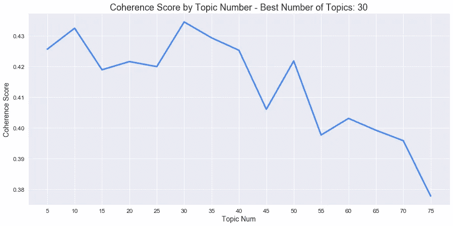

30 是返回最高一致性分数(. 435)的主题数量，之后它下降得相当快。总的来说，这是一个不错的分数，但我不太关心实际价值。真正的考验是你自己浏览主题，确保它们对文章有意义。

10 topics 在一致性得分(. 432)方面紧随其后，因此您可以看到，它也可以通过一组不同的参数来选择。所以，就像我说的，这不是一个完美的解决方案，因为这是一个相当广泛的范围，但从图表中可以明显看出，10 到 40 个主题将产生良好的结果。也就是说，你可能想要平均前 5 个主题数，取前 5 个中的中间主题数，等等。现在我们只要 30 英镑。

# 总结主题

另一个挑战是总结主题。这里最好的解决方案是让一个人浏览文本并手动创建主题。这显然不太理想。另一种选择是使用每个主题中得分最高的单词，然后将这些单词映射回特性名称。我用的是前 8 个词。看起来是这样的:

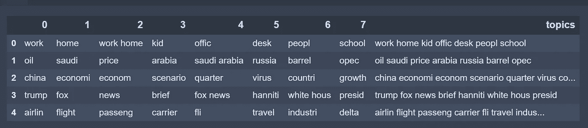

我们可以通过索引将这些主题映射回文章。

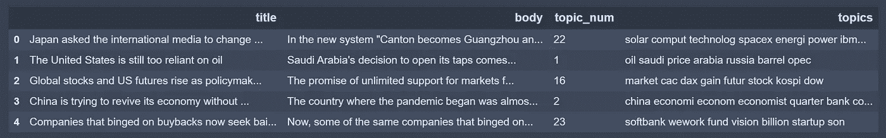

# 比较主题的质量

对于一些主题，发现的潜在因素将很好地接近文本，而对于一些主题，它们可能不是。我们可以计算每篇文章和主题的残差，以判断主题有多好。

残差是数据的观测值和预测值之间的差异。残差为 0 意味着主题与文章的正文非常接近，所以越低越好。

为了计算残差，可以采用 tf-idf 权重(A)的 Frobenius 范数减去主题(H)和主题(W)的系数的点积。然后我们可以得到每个主题的平均残差，看看哪个主题的平均残差最小。

```
# Get the residuals for each document
r = np.zeros(A.shape[0])for row in range(A.shape[0]):
    r[row] = np.linalg.norm(A[row, :] - H[row, :].dot(W), 'fro')# Add the residuals to the df
df_topics['resid'] = r
```

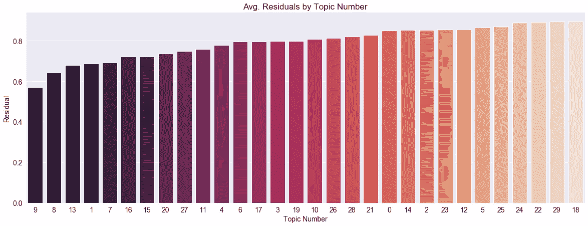

主题#9 具有最低的残差，因此意味着主题最接近文本，而主题#18 具有最高的残差。

主题#9 的摘要是“*insta cart worker shopper custom order gig company*”，有 5 篇文章属于该主题。

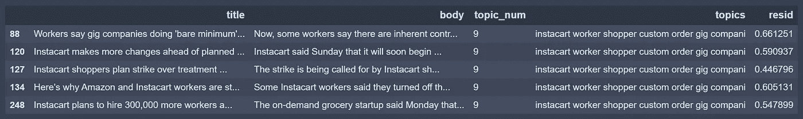

文章链接:

*   [工人称零工公司在冠状病毒爆发期间做得“非常少”](https://www.cnn.com/2020/03/16/tech/delivery-workers-coronavirus/index.html)
*   [Instacart 在计划的工人罢工前做出更多改变](https://www.cnn.com/2020/03/29/tech/instacart-strike-hand-sanitizer-tips/index.html)
*   [Instacart 购物者计划在疫情罢工](https://www.cnn.com/2020/03/28/tech/instacart-planned-strike/index.html)
*   [这就是为什么亚马逊和 Instacart 的工人在你最需要他们的时候罢工](https://www.cnn.com/2020/03/30/tech/instacart-amazon-worker-strikes/index.html)
*   [随着食品杂货配送需求激增，Instacart 计划再雇佣 30 万名工人](https://www.cnn.com/2020/03/23/tech/instacart-hiring/index.html)

这是一个非常连贯的话题，所有的文章都是关于 instacart 和 gig workers 的。我们自动创建的摘要也很好地解释了主题本身。

现在我们来看看最糟糕的话题(#18)。总结就是“*鸡蛋销售零售价格复活节产品鞋市场*”。这个主题总共有 16 篇文章，所以我们只关注残差最高的前 5 篇。

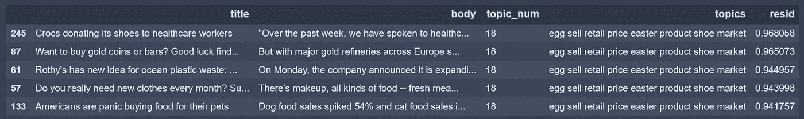

文章链接:

*   [鳄鱼向医护人员捐赠鞋子](https://www.cnn.com/2020/03/26/business/crocs-donation-coronavirus/index.html)
*   [想买金币还是金条？祝你找到任何](https://www.cnn.com/2020/03/26/investing/gold-demand-supply-coronavirus/index.html)
*   [罗斯对海洋塑料垃圾有了新想法:手袋](https://www.cnn.com/2020/03/02/business/rothys-bags/index.html)
*   你真的每个月都需要新衣服吗？订阅盒新鲜感已经消失
*   美国人正在为他们的宠物抢购食物

如你所见，这些文章到处都是。一般来说，它们大多是关于零售产品和购物的(除了关于黄金的文章)，crocs 的文章是关于鞋子的，但没有一篇文章与复活节或鸡蛋有关。他们仍然联系在一起，尽管相当松散。

# 预测新文章的主题

一旦你符合这个模型，你可以给它一篇新文章，让它预测主题。你只需要通过之前安装在原始文章上的 tf-idf 和 NMF 模型来转换新的文本。注意，我在这里只是调用了 transform，而不是 fit 或 fit transform。

```
# Transform the new data with the fitted models
tfidf_new = tfidf_vectorizer.transform(new_texts)
X_new = nmf.transform(tfidf_new)# Get the top predicted topic
predicted_topics = [np.argsort(each)[::-1][0] for each in X_new]# Add to the df
df_new['pred_topic_num'] = predicted_topics
```

在我收集了初始集并随机选择了 5 篇文章后，我继续刮文章。所以这些以前从未被模型看到过。总的来说，它在预测主题方面做得很好。

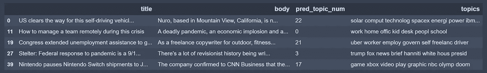

*   [美国为这种没有方向盘或踏板的自动驾驶汽车扫清道路](https://www.cnn.com/2020/02/06/tech/nuro-self-driving-vehicle-houston-dot/index.html) -主题:*太阳能计算技术 spacex energi power ibm vehicl*
*   [如何在这场危机中远程管理一个团队](https://www.cnn.com/2020/04/10/success/managing-a-team-remotely-in-a-crisis/index.html) -主题:*工作家庭办公室儿童办公桌人员学校*
*   国会将失业援助扩展到临时工。但是他们很难访问它 -主题:*优步工人雇佣自治的自由司机*
*   [斯特尔特:联邦政府对疫情的反应是 9/11 级别的失败](https://www.cnn.com/2020/04/06/media/federal-response-coronavirus-reliable-sources/index.html) -主题:*川普福克斯新闻简报汉尼提·怀特·豪斯总统*
*   [全球缺货，任天堂暂停任天堂 Switch 对日出货](https://www.cnn.com/2020/04/10/tech/nintendo-switch-shipment-pause-shortage/index.html) -主题:*游戏 xbox 视频播放图文 nbc olymp doom*