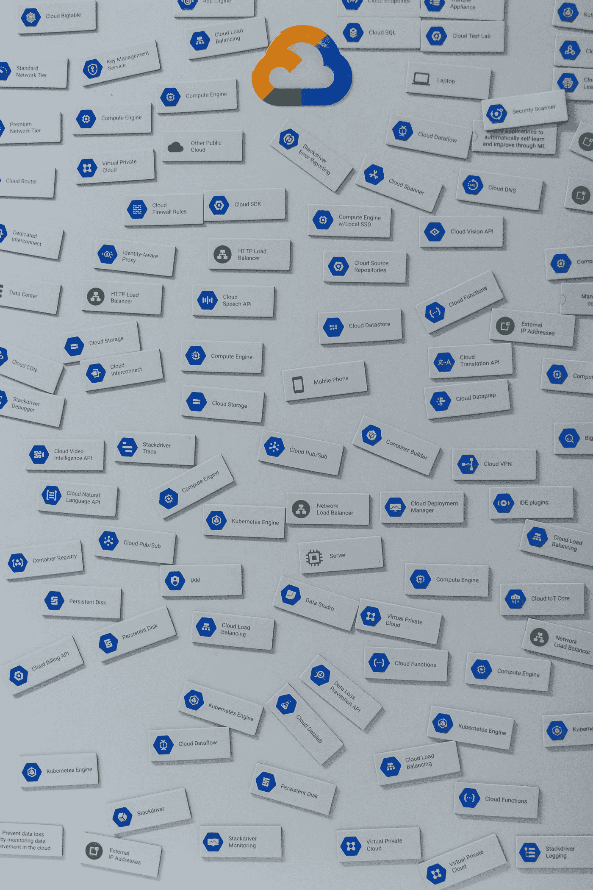

# 自然语言处理中的主题建模

> 原文：<https://towardsdatascience.com/topic-modeling-in-nlp-524b4cffeb68?source=collection_archive---------21----------------------->

## 重点是潜在的狄利克雷分配



照片由[米切尔罗](https://unsplash.com/@mitchel3uo?utm_source=unsplash&utm_medium=referral&utm_content=creditCopyText)在 [Unsplash](https://unsplash.com/s/photos/tag-cloud?utm_source=unsplash&utm_medium=referral&utm_content=creditCopyText)

在自然语言处理中，术语*主题*是指“组合在一起”的一组单词。这是想到这个话题时想到的词。拿*体育*来说。一些这样的词是*运动员*、*足球*和*体育场*。

*主题模型*是自动发现文档集合中出现的主题的模型。然后，可以使用经过训练的模型来辨别这些主题中的哪些出现在新文档中。该模型还可以挑选出文档的哪些部分涵盖了哪些主题。

想想维基百科。它有数百万份文档，涵盖了数十万个主题。如果这些都能被自动发现岂不是很棒？以及哪些文档涵盖了哪些主题的更精细的地图。对于那些试图探索维基百科的人来说，这些将是有用的辅助工具。

我们还可以发现新出现的主题，因为有关于它们的文档。在一些环境中(如新闻),新的文档不断产生，并且新近性很重要，这将有助于我们发现趋势主题。

这篇文章涵盖了一个统计上强大且广泛使用的方法来解决这个问题。

**潜在狄利克雷分配**

这种方法包括建立主题和文档的显式统计模型。

主题被建模为一组固定单词(词典)的概率分布。这就形式化了“提到这个话题时想到的一组词”。文档被建模为一组固定主题的概率分布。这揭示了文档涵盖的主题。

学习的目的是从文档语料库中发现各种主题的良好单词分布，以及各种文档中的良好主题比例。主题的数量是这种学习的一个参数。

**生成单据**

在这个阶段，它将有助于描述如何从学习到的模型生成合成文档。这将揭示这个模型如何运作的关键方面，我们还没有深入研究。

首先，我们将选择本文档将涵盖的主题。一种方法是首先从我们的语料库中随机选取一个文档，然后将新文档的主题比例设置为种子文档的主题比例。

接下来，我们将设置文档长度，称之为 *n* 。

接下来，我们将重复下面的 *n* 次:

```
sample a topic from the document’s topic proportions
sample a word from the chosen topic’s words-distribution
```

这将发出一系列的 *n* 个字。这些单词将会被标注上它们所来自的主题。

生成的文档是乱码。从混合话题中抽取的一袋单词。这不是问题——它不是用来阅读的。它确实揭示了哪些词是由哪些话题产生的，这可能是有见地的。

**举例**

```
**Lexicon**: {athlete, football, soccer, tennis, computer, smartphone, laptop, printer,Intel, Apple, Google}
**Num Topics** : 3
**Topic 1**: {athlete, football, soccer, tennis}
**Topic 2**: {computer, smartphone, laptop, printer}
**Topic 3**: {Intel, Apple, Google}
**Topic proportions in a document**: { 2 ⇒ 70%, 3 ⇒ 30% }
```

在上面，我们已经用一组单词描述了一个主题。我们将此解释为:集合中的所有单词都是等概率的；词典中剩余的单词概率为零。

让我们看一个 4 个字的生成文档。

```
Topic:  2      3       2          2
Word: laptop Intel smartphone computer
```

主题 3 在本文中的比例(25%)接近其在抽样分布中的比例(30%)。

**学习**

像往常一样，这是事情变得特别有趣的地方。

首先，让我们提醒自己学习的目的。它是从文档语料库中发现各种主题的*单词分布*，以及各种文档中的*主题比例*。简而言之，哪些词描述了哪些主题，哪些主题包含在哪些文档中。

我们将要描述的算法被广泛使用。这也不难理解。这是吉布斯采样的一种形式。

该算法的工作原理是，首先以某种方式将主题分配给语料库中的各种单词，然后迭代地改进这些分配。在其操作期间，该算法跟踪当前分配的某些统计数据。这些统计数据有助于算法的后续学习。当算法终止时，很容易从最终的主题分配中“读出”每个主题的单词分布和每个文档的主题比例。

让我们从描述上一段提到的统计数据开始。它们采用两个计数矩阵的形式:topic_word 和 doc_topic。两者都是从语料库中单词的当前主题分配中得到的。topic_word( *t* ， *w* )统计单词 *w* 出现 topic *t* 的次数。doc_topic( *d* ， *t* )统计主题 *t* 在文档 *d* 中出现的次数。

让我们看一个数字例子，以确保我们得到了正确的。下面我们看到一个两个文档的语料库，以及对其单词的主题分配。词典是 A，B，c。

```
Doc 1’s words:  A B A C A        Doc 2’s words:  B C C B
Doc 1’s topics: 1 1 1 2 2        Doc 2’s topics: 2 2 2 2
```

实际上，让我们先利用这个机会思考一下我们看到的一些特性。在文档 1 中，注意 A 有时被分配给主题 1，有时被分配给主题 2。如果单词 A 在两个题目中出现的概率都很高，这就说得通了。在文档 2 中，请注意 B 始终被分配给主题 2。如果文档 2 仅涵盖主题 2，并且 B 在主题 2 的分布中具有正概率，则这似乎是合理的。

好，现在来看两个计数矩阵。

```
**topic_word**:           **doc_topic**:
  *A B C                    1 2*
*1* 2 1 0                 *d1* 3 2
*2* 1 2 **3** *d2* 0 **4**
```

我们加粗了一些有点醒目的条目。也许 doc2 更喜欢主题 2。可能题目 2 更喜欢 c 字。

好了，开始讲解学习吧。第一步是用随机抽样的主题标注语料库中的单词。这听起来很容易。实际上还有更多。与其硬编码这种随机抽样，不如抽取合适的先验分布。这给了我们一个潜在的强大机制来注入领域知识或来自外部文本分析的结果。

这种基于先验的机制工作如下。首先，我们复制前面介绍的两个矩阵。分别叫它们 prior_topic_word 和 prior_doc_topic。如前所述，这些矩阵中的条目是计数。这些计数捕捉了我们先前的信念。

这些先验矩阵影响主题的初始分配。随着学习的进展，这种影响会逐渐减少，尽管不会为零。

我们如何准确地从这些计数中抽取最初分配的题目？首先，我们计算

> *P*(w | t)= prior _ topic _ word(t，w)/sum _ w*'*(prior _ topic _ word(t，w ')
> *P*(t | d)= prior _ doc _ topic(t，d)/sum_t' (prior_doc_topic(t '，d)

*P* ( *w* | *t* )只是题目 *t* 的赋值的分数，其单词为 *w* 。*P*(*t*|*d*)只是文档 *d* 中指定题目为 *t* 的单词的零头。

接下来，我们从这些作业中抽取样本。更具体地说，我们从分子为*P*(*w*|*t*)*P*(*t*|*d*)的分布中抽取文档 *d* 中单词 *w* 的主题。

这可以这样理解。*P*(*w*|*t*)*P*(*t*|*d*)正是我们生成模型中文档 *d* 中生成单词 *w* 的概率。作为 *t* 的一个函数，它记录了在此过程中使用 *t* 的可能性。

现在让我们讨论在两个先前的矩阵中设置这些计数的值。对于我们在这里的目的，我们所关心的是没有一个主题比另一个更好。这种偏好是不必要的偏见。我们可以通过将每个矩阵中的所有计数设置为相同的正数来实现这一点。1 是最简单的选择。奥卡姆剃刀推理。

```
prior_topic_word(*t*,*w*)=1 for every topic *t* and word *w*
prior_doc_topic(*d*,*t*)=1 for every document *d* and topic *t*
```

好的，所以题目分配将会从这些计数中抽样，并且是均匀随机的。

在这个初始任务之后，我们将重复做以下事情，希望改进这个任务，因此，我们的模型从中学习到了:

```
1\. Pick a word *w* from a document *d* in the corpus
2\. Sample a topic *t*’ from the distribution whose numerator is 
   *Q*(*w|t*)*Q*(*t*|*d*)
3\. Set *w*’s topic in *d* to *t*’.
```

什么是 *Q* ( *w|t* )？这是我们目前认为的从话题 *t* 中产生单词 *w* 的可能性。其实好的*Q*(*w*|*t*)的价值观才是我们所追求的。这些将形成最终的特定主题单词分布。

在开始学习之前，我们将先前对这种分布的信念捕获到*P*(*w*|*t*)中。随着学习的进行，*P*(*w*|*t*)开始被修正为后验信念*Q*(*w*|*t*)。

*Q*(*t*|*d*)的解释也差不多。我们之前对每个文档的主题比例的看法分为*P*(*t*|*d*)。随着学习的进行，这些被修改成*Q*(*t*|*d*)。

*Q*(*w*|*t*)和*Q*(*t*|*d*)是如何计算的？在学习过程中的任何时候，考虑将主题分配给语料库中的各种单词。根据这个主题分配，我们可以计算 topic_word 和 doc_topic 矩阵中的计数。接下来，我们执行以下操作

```
posterior_topic_word = topic_word + prior_topic_word
posterior_doc_topic  = doc_topic  + prior_doc_topic
```

注意'+'是矩阵加法。从计数矩阵的后验版本中，我们可以计算出*Q*(*w*|*t*)和*Q*(*t*|*d*)。正如我们从之前的版本中计算出*P*(*w*|*t*)和*P*(*t*|*d*)。

**一些直觉**

我们如何知道这个迭代过程实际上改进了主题分配？我们不会给出证明。取而代之的是一些直觉。

首先注意，可以通过将语料库中所有出现的单词 *w* 乘以各种*Q*(*w*|*t*)*Q*(*t*|*d*)项，来获得语料库中单词的主题分配的总体质量。这里 *d* 表示 *w* 出现的文档，而 *t* 表示分配给该事件的主题。

接下来，我们将揭示分数函数具有某些可取的特征。

**该得分函数有利于主题特异性**

我们所说的“话题特异性”是指 *Q* ( *w* | *t* )只集中在几个话题上。这是那些与特定主题紧密相关的单词的期望属性。我们来细说一下。考虑一个多样化的语料库，如维基百科。假设我们的目标是发现它所涵盖的各种各样的主题。考虑一下单词 *cat* 。它的主题特异性很高，也就是说，它只唤起这些主题中的几个。理应如此。因此，分数函数偏向于支持主题特异性是一件好事。

也就是说，不是每个单词都应该是特定主题的。例如*中的*。稍后我们将讨论在这种情况下抵消主题特异性的独立机制。首先，我们来解释一下主题特异性偏差。我们称特定主题的单词*为信息型*。

考虑在语料库中同一个单词 *w* 出现 1 次 *n* 让 *T* 1 和 *T* 2 成为这些 *n* 事件的两个不同的主题分配。在 *T* 1 中的所有主题都是不同的。称这个集合为{ *1* 、 *2* 、 *3* 、…、 *n* }。 *T* 2 里的所有题目都一样，最大化*Q*(*w*|*T*)的那个。把这个题目叫做 *tmax* 。 *T* 1 在*Q*(*w*|*T*)下的可能性是*Q*(*w*|*1*Q*(*w*|*2*)*…**Q*( **T* 2 在 *Q* 下的可能性( *w* | *t* )是*q*(*w*|*tmax*)^*n*。当 *w* 信息丰富且 *n* 不太小时，T*T*2 的可能性会远远高于 *T* 1。**

这一分析可以总结为

```
The score function encourages informative words to stay on topic
```

**该得分函数有利于文档特异性**

我们所说的“文档特异性”是指文档只涵盖几个主题。文件往往是具体的。问题是分数函数(以及随之而来的学习算法)是否利用了这种趋势来做得更好。答案是肯定的。如下所述。

考虑一个有 *n* 个单词的文档 d。让 *T* 1 和 *T* 2 作为两个不同的题目分配给它的单词。 *T* 1 中的所有主题都是截然不同的。称这个集合为{ *1* ， *2* ， *3* ，…， *n* }。 *T* 2 中的所有题目都一样，这次是 *d* 中比例最高的一个。称之为 tmax 。 *T* 1 在*Q*(*T*|*d*)下的可能性是*Q*(*1*|*d*Q(2 |*d*)*…**Q*(*n*|*d*)。 *T* 2 在*q*(*t*|*d*)下的可能性是*q*(*tmax*|*d*)^*n*。显然，T2 可以高得多，尤其是对于大型文档。

这一分析可以总结为

```
The score function encourages documents to stay on topic
```

**这些影响有时会相互竞争！**

考虑一个特别常见的词: *the* 。合理假设它出现在几乎所有文档中。主题一致性倾向于为所有这些事件分配相同的主题。文件特异性抗议，因为这将迫使所有这些文件涵盖这一个主题。

让我们想象一下这可能会如何发展。主题一致性可能会让这些词失去吸引力。他们被分配的话题可能只是“随波逐流”，以邻居中任何话题的身份出现。当然，这些作业的可能性的主题一致性组件可能会减少。另一方面，文档特异性部分将会增加。

**更多关于学习算法**

我们已经看到分数函数有好的偏向。这只有在学习算法很好地利用它们的情况下才有帮助。所以让我们更深入地讨论一下算法。

我们首先注意到，该算法通过局部优化全局主题分配质量分数来工作。仅这一点就表明它正在关注偏见。

接下来，我们将在一个简单的例子中进行一两次迭代。这将帮助读者更好地感受它的“局部优化”行为。这比一些人想象的更加微妙。

**例子**

我们将词典设置为{A，B}。我们的语料库将有两个文档，AAA (d1)和 BBB (d2)。(虽然这些听起来可能很傻，但这个练习将会很有教育意义。)我们的目标是给语料库添加两个主题。

让我们将所有先前的计数设置为 0.0000001。它仍然会产生均匀随机的初始赋值，尽管简化了我们的数值计算。

假设下面是最初的任务

```
d1     d2
AAA    BBB
121    122
```

从该作业中学到的模型是

```
Q(A|1)  = ⅔ , Q(B|1) = ⅓    // these sum to 1
Q(A|2)  = ⅓ , Q(B|2) = ⅔    // these sum to 1
Q(1|d1) = ⅔ , Q(2|d1)= ⅓    // these sum to 1
Q(1|d2) = ⅓, Q(2|d2) = ⅔    // these sum to 1
```

现在想象从 *d* 1 中选取一个单词，并重新采样它的主题。(我们本可以选择 *d* 2，但理由是相似的。)有三种可能的结果:121 → 121，121 → 1 **1** 1，121 → 12 **2** 或 **2** 21。第三种方法实际上就是我们开始的地方:交换主题名称并重新排列顺序。所以第一个和第三个结果实际上让我们回到了同样的状态。所以我们放大第二个:121 → 111。这种转变的概率是正的。(事实上相当高，因为从 2 → 1 的转换提高了主题可能性分量和文档可能性分量。)因此，如果我们一直重复这个过程，在某一点上，所有 d1 将被分配相同的主题 *t* (=1 或 2)。

接下来，我们从这个赋值 *t* 到 *d* 1 重新估计模型的各种参数。*Q*(*t*|*d*1)现在是 1。Q (A| *t* )很可能比我们开始这个过程时的 Q (A|1)要高。我们已经达到了一种难以摆脱的“快乐状态”。

**变体**

现在让我们看看这个算法的一些变体。这些包括修改下面的步骤 2。

```
1\. Pick a word *w* from a document *d* in the corpus
2\. **Sample a topic *t*’ from the distribution whose numerator is 
   *Q*(*w|t*)*Q*(*t*|*d*)**
3\. Set *w*’s topic in *d* to *t*’.
```

我们可以将步骤 2 替换为“将 *t'* 设置为最大化*Q*(*w | t*)*Q*(*t*|*d*)的主题”。这被称为最大似然估计。在我们的设置中，这产生了一个贪婪的算法。

这种变体因其简单性而吸引人，并且可能收敛得更快。然而，它更容易陷入次优的局部最优。

我们的下一个变体引入了一个称为*温度*的参数，它可以被改变以跨越从吉布斯采样器到贪婪算法的行为范围。这就是这种算法的吸引力所在。不过，这确实提出了一个新问题:如何设定温度。

撇开温度不谈，让我们看看它是如何工作的。考虑单词 *w* ，其当前主题 *t* 正被考虑重新分配。对于我们评估的每个主题

```
delta(t’) = — [ log *Q*(*w*|*t*’)*Q*(*t*’|*d*) — log *Q*(*w*|*t*)*Q*(*t*|*d*) ]
```

我们不会在这里解释为什么日志。我们将注意到，delta(*t*’)小于 0 对应于在这种情况下*t*’比 t 更适合。从 *t* 到 t’的转换可以被视为减少能量(或下坡)的移动。

接下来会发生什么？我们会定性描述。所以现在我们知道了 delta( *t* ')对于 *t* '的各个值，包括 *t* 。根据这些增量值，该算法定义了主题上的合适的概率分布。这种分布由温度参数化。

在高温下，甚至允许“上坡移动”，即移动到 delta 值为正的主题。这样的移动，虽然在当前的主题分配上是倒退的，但是可以帮助逃脱局部能量最小值。

在低温下，分布倾向于δ值为负的移动。在零度的极端情况下，这会产生贪婪的行为。

**更丰富的前科**

到目前为止，我们已经将 prior counts 设置为 1。这里我们考虑更丰富的设定。

之前我们注意到，某些单词最好是特定于主题的。我们能找到这样的单词并把它们的主题特异性偏好记录到先前的计数中吗？这可以加快后续的学习。

这里有一个明智的方法。首先，我们将所有先前的计数设置为 1。接下来，对于每个单词 *w，*我们将计算 *n* - *n* ( *w* )。这里 *n* 是语料库中的文档总数， *n* ( *w* )是单词 *w* 出现的文档数。把*n*-*n*(*w*)看成是 *w* 的某种“逆文档频率”。接下来，我们将对每个单词分别进行以下操作。我们将从众多话题中随机挑选一个话题。我们会把*n*-*n*(*w*)加到前面的 count word_topic( *t* ， *w* )。

这个想法是把不常见的单词映射到特定的主题。由于主题选择是随机的，不同的单词可能会映射到不同的主题。

这个先验是否过于偏颇？我们可以很容易地软化它，如果我们觉得是这样的话。有很多可能性。一种是将*n*-*n*(*w*)替换为*log n*-*log n*(*w*)。第二种方法是在放大一个单词的先前计数时，对多个主题(尽管不是很多)进行采样。

**其他建模增强**

改进模型还需要考虑哪些方面？首先，让我们阐明它的假设:

```
1\. The topics a document covers are sampled independently. They
   are not checked for compatibility.
2\. Word proximity in a document is not considered.
3\. The hierarchical structure among topics is not modeled.
```

让我们分别说一说。主题兼容性可能很重要。一份文件更有可能涵盖*科技公司* & *电脑*而不是*科技公司* & *体育。单词的接近度也很重要。重复出现在彼此附近的两个单词比相隔几千个单词出现的更有可能出现在同一个主题上。主题层次结构更好地模拟了文档。一种常见的写作模式是让文档涵盖一个广泛的主题及其各种子主题。*

下面我们描述如何解决这些问题。在某些用例中，放松可能会提高模型的准确性，尽管可能会增加模型的复杂性或可学性。他们也提供了注入领域知识的机会。此外，在某些方面甚至有助于学习！

具体如何进行很大程度上取决于用例。

**主题兼容性**

这涉及到添加一个马尔可夫模型。它的状态就是主题。它的转换模型语料库中的主题之间的兼容性。

在对文档中的单词主题进行采样时，如何使用这个模型？我们需要适当延长 *Q* ( *t* | *d* )。这个扩展最简单的描述是想象从中抽取主题。

这种抽样可以被看作是在马尔可夫模型上的随机行走，可能偶尔会重新开始。我们首先从*Q*(*t*|*d*)中选择一个主题。接下来，我们执行以下操作。大多数情况下，我们从这个话题的状态开始走一个转换，其概率在那个转换上。偶尔我们会从*Q*(*t*|*d*)重新采样，即跳转到新的话题。

这种随机游走诱导出一种新的分布，称之为*Q*'(*t*|*d*，M)它同时受到马尔可夫模型 M 和*Q*(*t*|*d*)的影响。马尔可夫模型是一个语料库级的结构。使用*Q*(*t*|*d*)将其行为定制为文档 *d* 。

马尔可夫模型的参数是如何学习的？这个比较好解释。到目前为止，我们的学习算法已经在为语料库文档中的单个单词分配主题的层面上工作。马尔可夫模型的参数完全由这种分配决定。

具体来说，对于文档中每一对主题分配的 *s* 、 *t* ，我们对弧 *s* → *t* 和 *t* → *s* 进行递增计数，除非 *s* 等于 *t* ，在这种情况下只递增一次。

因此，随着主题分配的改进，主题兼容性模型的参数也随之改进。两者协同作用。

让我们从更广的范围来看待这种协同作用。随着我们看到越来越多的关于相同两个主题的文档，马尔可夫模型开始了解到这些主题是兼容的。这种改进的学习导致其他地方的主题分配的改进。

**字的接近度**

这可以通过适当延长*Q*(*w*|*t*来合并。具体来说，让 *t* 的选择不仅受到 *w* 的影响，也受到 *w* 附近的词的影响。

让我们把这个正式化。设*W*(*d*)=*W*(-*d*)，…， *w* ，…， *w* (+ *d* )表示以 *w* 为中心的长度为 2 *d* +1 的单词序列。这里 d 是一个非负整数。接下来，我们将*Q*(*W*|*t*)扩展为*Q*(*W*(*d*)|*t*)。

从学习的角度来看，这是否使我们的模型变得复杂了？有了合适的假设，幸运的是没有。我们假设 *W* ( *d* )中的字在给定 *t* 的情况下是条件独立的。在这种假设下，我们得到

```
*Q*(*W*(*d*)|*t*) = *Q*(*w*(-*d*)|*t*)*…**Q*(*w*|*t*)*…*Q(*w*(+*d*)|*t*)
```

涉及 *t* 的 RHS 术语都是和以前一样的形式。所以学习不需要改变！

尽管有这样的假设，我们还是得到了使用上下文的好处。其中最主要的是，分配给中心词 *w* 的主题可以更准确地确定，因为现在我们有了更多的上下文。另一个有用的特征，尤其是在学习的早期，是我们得到了一些话题的连续性。当我们一次滑动窗口 *W* ( *d* )一个单词时，分配的主题不太可能改变，因为上下文没有太大变化。相比于 *W* (0)。

**主题层次**

这是一个高级话题。我们的报道是局部的。

这里是关键的观察。比较两个主题的单词分布有助于评估一个主题是否是另一个主题的后代。后代的关键字将倾向于成为祖先关键字的子集。

使用这个概念，我们可以在学习过程中的任何时候学习主题的层次结构。即使是一个粗略的学习层次也比没有强。

正如我们为主题兼容性所做的那样，我们可以扩展我们的*Q*(*t*|*d*)模型，以将所学的层次结构考虑在内。就像这里一样，描述这个扩展最简单的方法是想象一个特定文档的采样主题。

这种抽样是在层次结构上随机进行的，可能偶尔会重新开始。我们首先从*Q*(*t*|*d*)中选择一个主题。接下来，我们执行以下操作。很多时候我们从这个话题走到一个孩子身上。偶尔我们会从*Q*(*t*|*d*)重新取样，也就是跳到层次结构中其他地方的主题。

这种随机游走导致了一种新的分布，称之为 *Q* '( *t* | *d* ，H)，它同时受到主题层次 H 和 *Q* ( *t* | *d* )的影响。主题层次结构是一个语料库级别的结构。使用*Q*(*t*|*d*)将其行为定制为文档 d。

**提高可读性的增强功能**

文档的可读性不是 LDA 的主要目标。尽管如此，建模框架提供了注入改进它的机制的机会。所以让我们利用这一点。

让我们从提出问题开始。

```
1\. Topic continuity is not maintained. Neighboring words can jump 
   from topic to topic.
2\. Topic coherence is not maintained. A topic spews out its words 
   independently.
```

**话题连续性**

我们可以通过添加一个具有两种状态的马尔可夫模型来保持话题的连续性:*继续*和*切换*。*继续*继续当前话题，*切换*切换到新话题。从*延续*到自身的弧应该有很大概率。从*开关*到*继续*的弧应该有接近 1 的概率，因为我们几乎肯定想要继续跟随开关。

这个模型上的概率很容易从主题作业中学习到。埋在其中的是*继续*和*切换*事件。这种学习与主题任务的学习相吻合，相互受益。

在文档中利用词的邻近性也有助于保持主题的连续性。我们选择涵盖本节方法的原因是，它比单词邻近法更容易实现。

**这也有利于学习**

除了可读性之外，注入主题连续性机制也有可能提高所学作业的质量。实际上，它充当了平滑正则化器，不支持离群值。

这里有一个例子，是我们之前使用的一个例子的扩展。考虑单词*，我们假设它出现在语料库的几乎所有文档中。之前我们解释了为什么我们希望分配给*和*的特定事件的主题能够在它的邻居中“随波逐流”。主题连续性机制为这种偏好增加了更多权重，因为它明确倾向于“随波逐流”。*

***话题连贯性***

*我们可以通过放松单词袋假设来保持话题的连贯性。相反，使用一阶马尔可夫模型来模拟当前单词对下一个单词的影响。每个主题都有自己的马尔可夫模型。*

*每个主题的马尔可夫模型很容易从语料库中的当前主题分配中(重新)学习。*

***延伸阅读***

*大卫·布雷。概率主题模型。ACM 的通信。2012 年[http://www.cs.columbia.edu/~blei/papers/Blei2012.pdf](http://www.cs.columbia.edu/~blei/papers/Blei2012.pdf)*

*大卫·布雷，吴恩达，迈克尔·乔丹。潜在狄利克雷分配。JMLR (3) 2003 年第 993-1022 页。*

*汤姆·格里菲斯。潜在狄利克雷分配生成模型中的吉布斯抽样。[https://people . cs . umass . edu/~ wallach/courses/S11/cmpsci 791 ss/readings/griffiths 02 Gibbs . pdf](https://people.cs.umass.edu/~wallach/courses/s11/cmpsci791ss/readings/griffiths02gibbs.pdf)*