# 基于 PyCaret 的 Power BI 主题建模

> 原文：<https://towardsdatascience.com/topic-modeling-in-power-bi-using-pycaret-54422b4e36d6?source=collection_archive---------8----------------------->

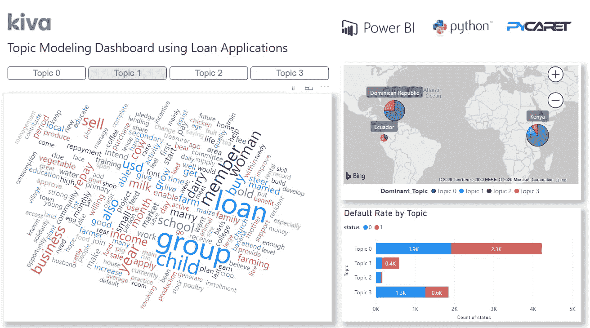

Power BI 中的 NLP 仪表板

在我们的[上一篇文章](/how-to-implement-clustering-in-power-bi-using-pycaret-4b5e34b1405b)中，我们展示了如何通过将 Power BI 与 PyCaret 集成来实现聚类分析，从而允许分析师和数据科学家在他们的报告和仪表板中添加一层机器学习，而无需任何额外的许可成本。

在这篇文章中，我们将看到如何使用 PyCaret 在 Power BI 中实现主题建模。如果你以前没有听说过 PyCaret，请阅读这个[公告](/announcing-pycaret-an-open-source-low-code-machine-learning-library-in-python-4a1f1aad8d46)以了解更多信息。

# 本教程的学习目标

*   什么是自然语言处理？
*   什么是主题建模？
*   在 Power BI 中训练和实现一个潜在的 Dirichlet 分配模型。
*   在仪表板中分析结果和可视化信息。

# 开始之前

如果您以前使用过 Python，很可能您的计算机上已经安装了 Anaconda 发行版。如果没有，[点击这里](https://www.anaconda.com/distribution/)下载 Python 3.7 或更高版本的 Anaconda 发行版。


[https://www.anaconda.com/products/individual](https://www.anaconda.com/products/individual)

# 设置环境

在我们开始在 Power BI 中使用 PyCaret 的机器学习功能之前，我们必须创建一个虚拟环境并安装 pycaret。这是一个四步的过程:

[✅](https://fsymbols.com/signs/tick/) **步骤 1——创建一个 anaconda 环境**

从开始菜单打开 **Anaconda 提示符**并执行以下代码:

```
conda create --name **powerbi** python=3.7
```

*“power bi”是我们选择的环境名称。你可以保留任何你喜欢的名字。*

[✅](https://fsymbols.com/signs/tick/) **第二步—安装 PyCaret**

在 Anaconda 提示符下执行以下代码:

```
pip install **pycaret**
```

安装可能需要 15-20 分钟。如果您在安装时遇到问题，请查看我们的 [GitHub](https://www.github.com/pycaret/pycaret) 页面，了解已知问题和解决方案。

[✅](https://fsymbols.com/signs/tick/)t24】第三步——在 Power BI 中设置 Python 目录

创建的虚拟环境必须与 Power BI 链接。这可以使用 Power BI Desktop 中的全局设置来完成(文件→选项→全局→ Python 脚本)。默认情况下，Anaconda 环境安装在以下位置:

C:\Users\ ***用户名*** \Anaconda3\envs\

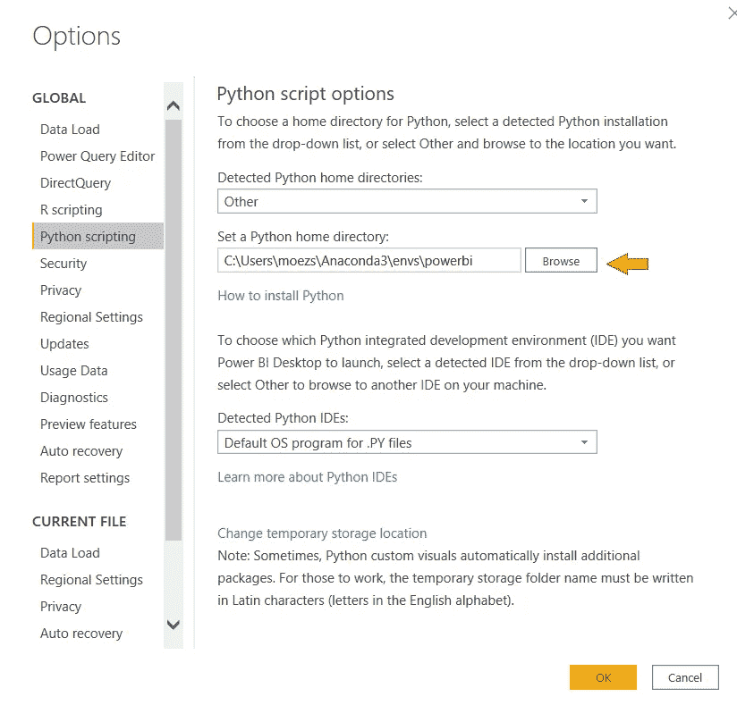

文件→选项→全局→ Python 脚本

[✅](https://fsymbols.com/signs/tick/)步骤 4 —安装语言模型

为了执行 NLP 任务，您必须通过在 Anaconda 提示符下执行以下代码来下载语言模型。

首先在 Anaconda 提示符下激活 conda 环境:

```
conda activate **powerbi**
```

下载英语语言模型:

```
python -m spacy download en_core_web_sm
python -m textblob.download_corpora
```

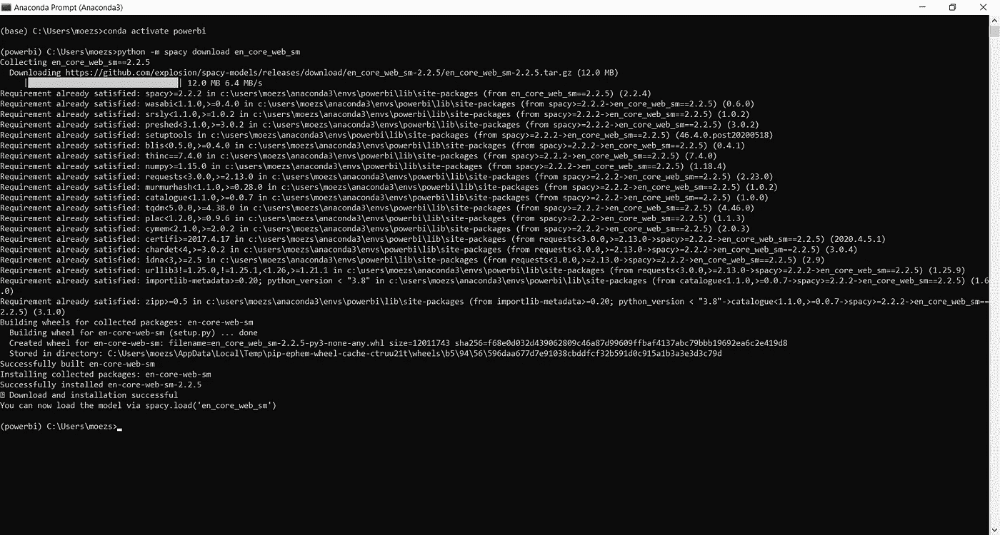

python -m 空间下载

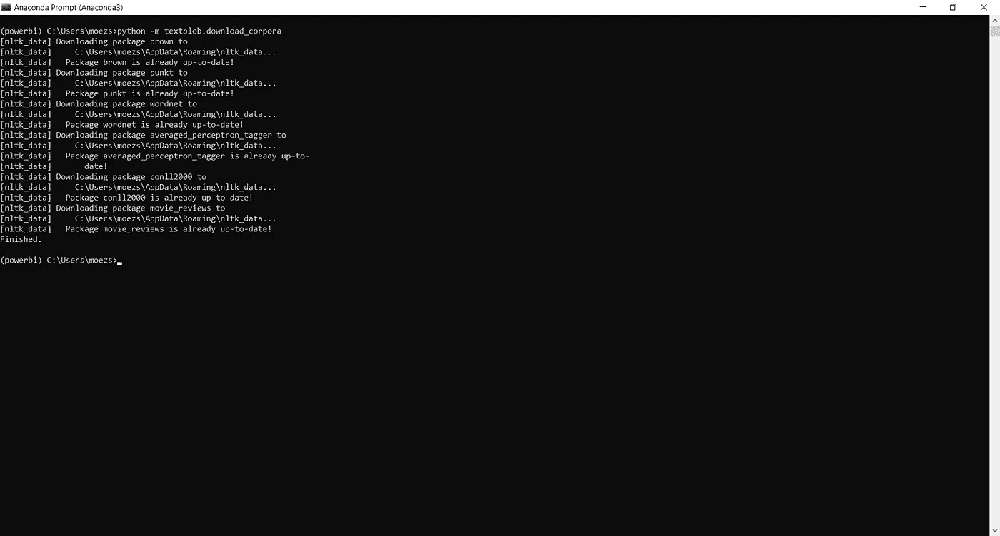

python-m text blob . download _ 语料库

# 什么是自然语言处理？

自然语言处理(NLP)是计算机科学和人工智能的一个子领域，涉及计算机和人类语言之间的交互。特别是，NLP 涵盖了关于如何编程计算机来处理和分析大量自然语言数据的广泛技术。

NLP 驱动的软件在日常生活中以各种方式帮助我们，很可能你已经在不知不觉中使用了它。一些例子是:

*   **个人助理** : Siri，Cortana，Alexa。
*   **自动完成**:在搜索引擎中(*例如:*谷歌、必应、百度、雅虎)。
*   **拼写检查**:几乎无处不在，在你的浏览器，你的 IDE ( *比如:* Visual Studio)，桌面应用(*比如:*微软 Word)。
*   **机器翻译**:谷歌翻译。
*   **文档摘要软件:**文本压缩器，自动摘要器。

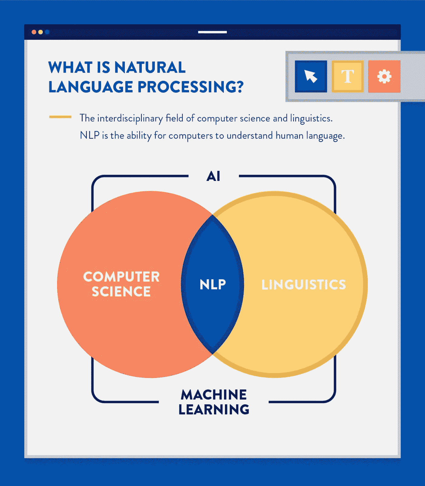

来源:[https://clevertap.com/blog/natural-language-processing](https://clevertap.com/blog/natural-language-processing/)

主题建模是一种用于在文本数据中发现抽象主题的统计模型。这是 NLP 中的许多实际应用之一。

# 什么是主题建模？

主题模型是一种属于无监督机器学习的统计模型，用于发现文本数据中的抽象主题。主题建模的目标是在一组文档中自动发现主题。

主题建模的一些常见用例有:

*   **通过将文档分类成主题来总结**大量文本数据(*这个想法与聚类*非常相似)。
*   **探索性数据分析**了解客户反馈表、亚马逊评论、调查结果等数据。
*   **特征工程**为监督机器学习实验(如分类或回归)创建特征

有几种算法用于主题建模。一些常见的是潜在狄利克雷分配(LDA)，潜在语义分析(LSA)，和非负矩阵分解(NMF)。每种算法都有自己的数学细节，这将不会在本教程中介绍。我们将使用 PyCaret 的 NLP 模块在 Power BI 中实现一个潜在的 Dirichlet 分配(LDA)模型。

如果你有兴趣学习 LDA 算法的技术细节，可以阅读[这篇论文](http://www.jmlr.org/papers/volume3/blei03a/blei03a.pdf)。

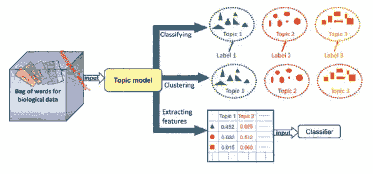

来源:[https://springer plus . springer open . com/articles/10.1186/s 40064-016-3252-8](https://springerplus.springeropen.com/articles/10.1186/s40064-016-3252-8)

# **主题建模的文本预处理**

为了从主题建模中获得有意义的结果，必须在将文本数据馈送给算法之前对其进行处理。这在几乎所有的 NLP 任务中都很常见。在处理结构化数据(行和列中的数据)时，文本的预处理不同于机器学习中经常使用的经典预处理技术。

PyCaret 通过应用超过 15 种技术自动预处理文本数据，如**停用词去除**、**标记化**、**词条化**、**二元/三元模型提取等**。如果您想了解 PyCaret 中所有可用的文本预处理特性的更多信息，[单击此处](https://www.pycaret.org/nlp)。

# 设置业务环境

Kiva 是一个国际非营利组织，于 2005 年在旧金山成立。它的使命是扩大金融服务不足的社区，以帮助他们蓬勃发展。

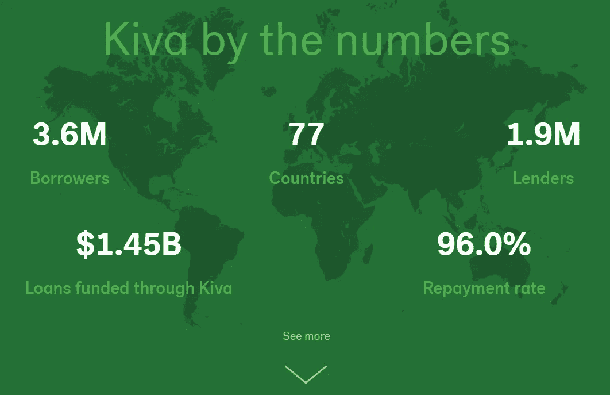

来源:[https://www.kiva.org/about](https://www.kiva.org/about)

在本教程中，我们将使用来自 Kiva 的开放数据集，其中包含 6，818 个已批准贷款申请人的贷款信息。数据集包括贷款金额、国家、性别等信息，以及借款人提交的申请中的一些文本数据。

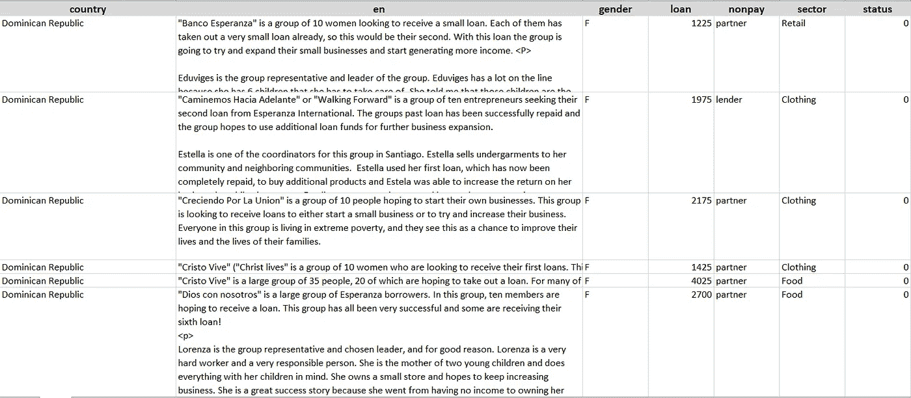

样本数据点

我们的目标是分析' *en* '列中的文本数据，以找到抽象主题，然后使用它们来评估某些主题(或某些类型的贷款)对违约率的影响。

# 👉我们开始吧

现在，您已经设置了 Anaconda 环境，理解了主题建模，并且有了本教程的业务上下文，让我们开始吧。

# 1.检索数据

第一步是将数据集导入 Power BI Desktop。您可以使用 web 连接器加载数据。(Power BI 桌面→获取数据→来自 Web)。

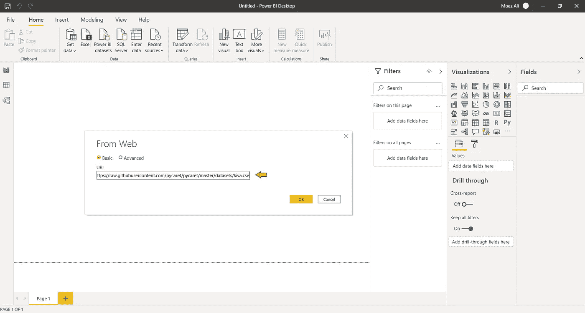

Power BI 桌面→获取数据→其他→ Web

链接到 csv 文件:
[https://raw . githubusercontent . com/py caret/py caret/master/datasets/kiva . CSV](https://raw.githubusercontent.com/pycaret/pycaret/master/datasets/kiva.csv)

# 2.模特培训

为了在 Power BI 中训练主题模型，我们必须在 Power Query Editor 中执行 Python 脚本(Power Query Editor→Transform→Run Python script)。将以下代码作为 Python 脚本运行:

```
from **pycaret.nlp** import *
dataset = **get_topics**(dataset, text='en')
```

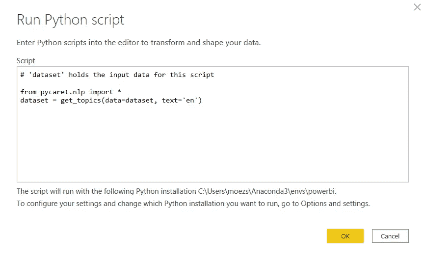

超级查询编辑器(转换→运行 python 脚本)

PyCaret 中有 5 个现成的主题模型。

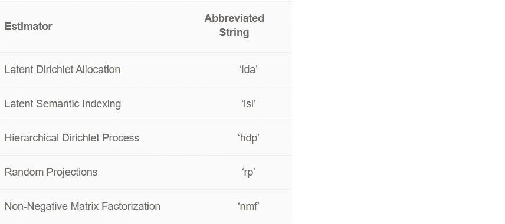

默认情况下，PyCaret 使用 4 个主题训练一个**潜在狄利克雷分配(LDA)** 模型。默认值可以很容易地更改:

*   要更改模型类型，使用 **get_topics()** 中的 ***模型*** 参数。
*   要更改主题数量，使用 ***num_topics*** 参数。

参见包含 6 个主题的**非负矩阵分解**模型的示例代码。

```
from **pycaret.nlp** import *
dataset = **get_topics**(dataset, text='en', model='nmf', num_topics=6)
```

**输出:**

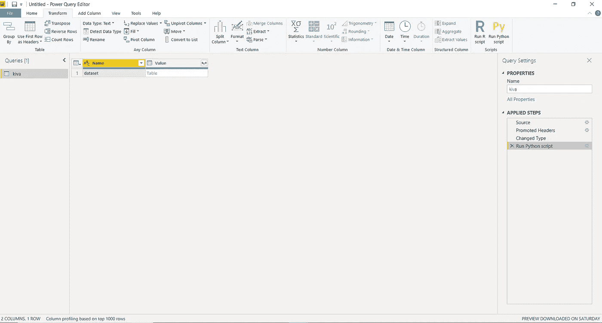

主题建模结果(执行 Python 代码后)

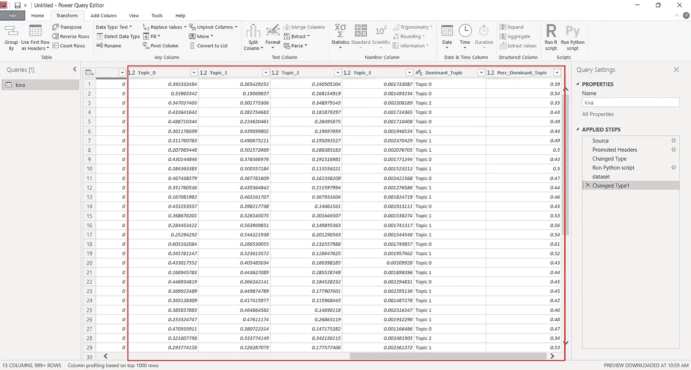

最终输出(点击表格后)

包含主题权重的新列被附加到原始数据集。下面是应用查询后 Power BI 的最终输出。

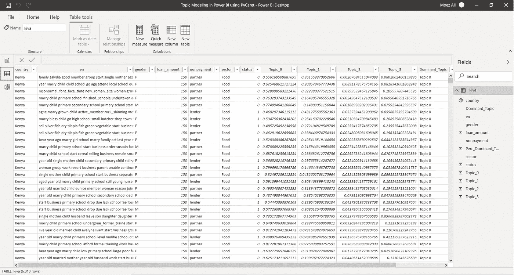

Power BI Desktop 中的结果(应用查询后)

# 3.仪表盘

一旦您在 Power BI 中有了主题权重，以下是一个如何在 dashboard 中可视化它以生成见解的示例:


仪表板的摘要页面

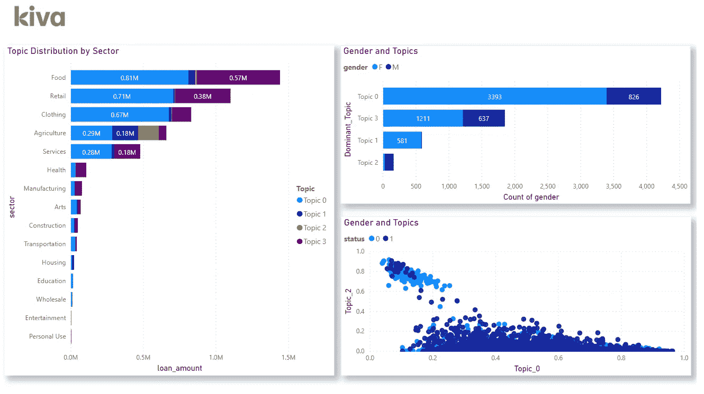

仪表板的详细信息页面

你可以从我们的 [GitHub](https://github.com/pycaret/powerbi-nlp) 下载 PBIX 文件和数据集。

如果您想了解更多关于使用 PyCaret 在 Jupyter 笔记本中实现主题建模的信息，请观看这个 2 分钟的视频教程:

使用 PyCaret 在 Jupyter 笔记本中进行主题建模

如果你有兴趣学习更多关于主题建模的知识，你也可以查看我们为初学者准备的 NLP 101 [笔记本教程](https://www.pycaret.org/nlp101)。

关注我们的 [LinkedIn](https://www.linkedin.com/company/pycaret/) 并订阅我们的 [Youtube](https://www.youtube.com/channel/UCxA1YTYJ9BEeo50lxyI_B3g) 频道，了解更多关于 PyCaret 的信息。

# 重要链接

[用户指南/文档](https://www.pycaret.org/guide)
[GitHub 资源库](https://www.github.com/pycaret/pycaret) [安装 PyCaret](https://www.pycaret.org/install)
[笔记本教程](https://www.pycaret.org/tutorial)
[贡献于 PyCaret](https://www.pycaret.org/contribute)

# 想了解某个特定模块？

从第一个版本 1.0.0 开始，PyCaret 有以下模块可供使用。点击下面的链接，查看 Python 中的文档和工作示例。

[分类](https://www.pycaret.org/classification)
[回归](https://www.pycaret.org/regression) [聚类](https://www.pycaret.org/clustering)
[异常检测](https://www.pycaret.org/anomaly-detection) [自然语言处理](https://www.pycaret.org/nlp)
关联规则挖掘

# 另请参见:

笔记本中的 PyCaret 入门教程:

[聚类](https://www.pycaret.org/clu101)
[异常检测](https://www.pycaret.org/anom101)
[自然语言处理](https://www.pycaret.org/nlp101)
[关联规则挖掘](https://www.pycaret.org/arul101)
[回归](https://www.pycaret.org/reg101)
[分类](https://www.pycaret.org/clf101)

# 你愿意投稿吗？

PyCaret 是一个开源项目。欢迎每个人都来投稿。如果您愿意投稿，请随意处理[未决问题](https://github.com/pycaret/pycaret/issues)。dev-1.0.1 分支上的单元测试接受拉请求。

如果你喜欢 PyCaret，请给我们 GitHub 回购的⭐️。

中:[https://medium.com/@moez_62905/](https://medium.com/@moez_62905/machine-learning-in-power-bi-using-pycaret-34307f09394a)

领英:【https://www.linkedin.com/in/profile-moez/ 

推特:【https://twitter.com/moezpycaretorg1 