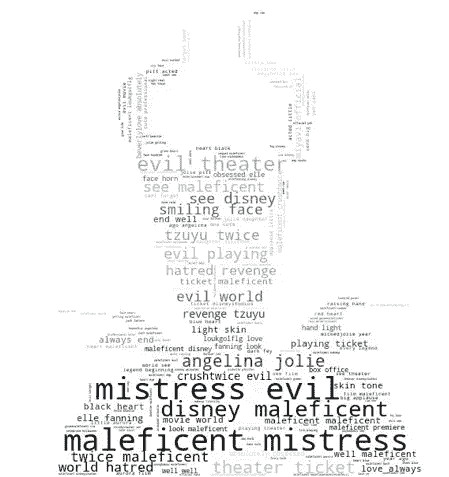
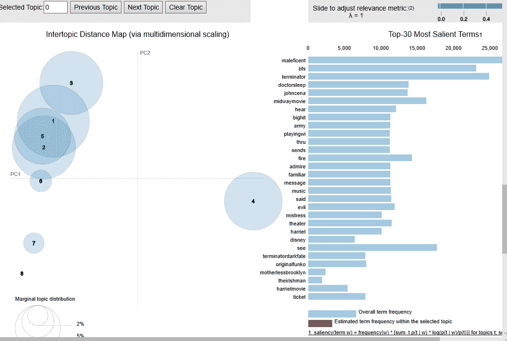
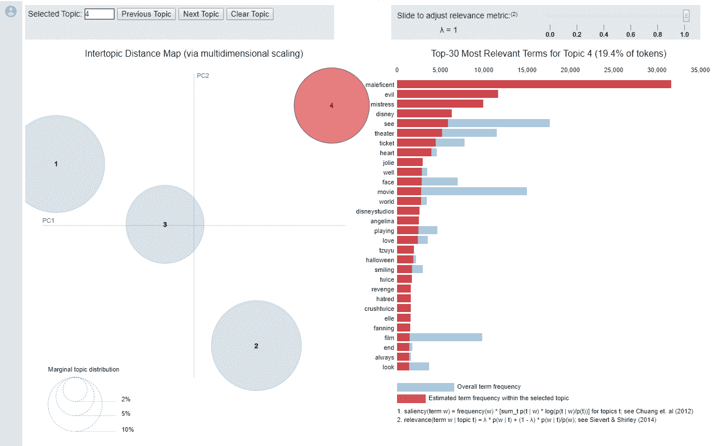
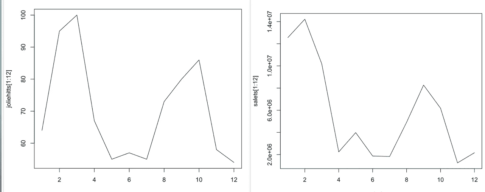
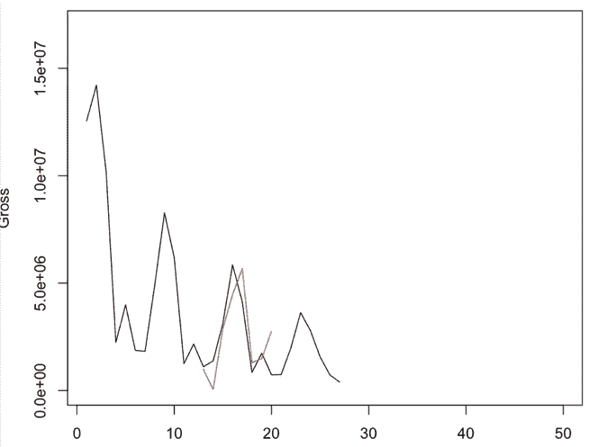
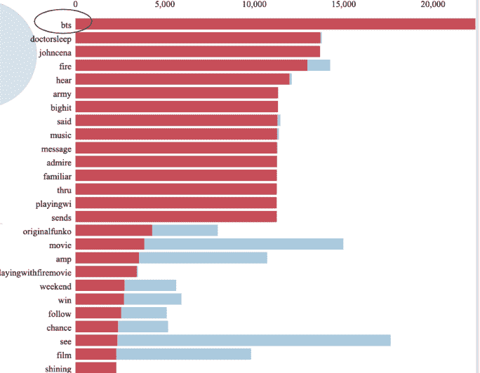

# 电影微博的主题建模——电影销售预测

> 原文：<https://towardsdatascience.com/topic-modeling-on-movie-tweets-movie-sales-prediction-bb32f0d20d51?source=collection_archive---------33----------------------->

## 使用主题建模和时间序列预测分析了社交媒体对电影销售的影响

**供稿人**:小酒窝·辛哈尼亚、郭尔强、袁丽莎、袁建业·李、杰夫·内尔

**Github**

【https://github.com/chikorita5/movie-hype 

**简介**

分析师使用不同的社交媒体平台来收集、分析和预测人们的行为。如今，脸书和推特拥有最多的信息。复仇者联盟端游即将上映的时候，人们在推特上疯了。发行后，它获得了有史以来最高的销量。除了这部电影由漫威电影宇宙制作，有小罗伯特·唐尼、克里斯·埃文斯等演员出演，这部电影的成功很大程度上也是普通大众在网上制造的轰动效应。研究表明，除了预算、明星影响力、类型和其他电影特有的因素之外，上映前在互联网上的知名度和反馈也是决定电影首映周末票房收入的重要因素。但是没人知道这两者是什么关系。twitter 上有很多与电影相关的标签和推文。哪些推文和话题真正让人们去看和喜欢一部电影并不像听起来那么容易理解。也就是说，预测电影销售的因素有很大的商业价值，因为它可以帮助营销和公关团队根据特定人群的兴趣来确定提高销售的策略。这就是为什么我们决定建立一个模型来确定电影成功的因素，并在此基础上得出一些重要的见解。

**数据收集**

我们使用 Twitter API 来访问推文。为了获得相关的推文，我们使用了特定的标签。比如电影《爱尔兰人》，我们用了#TheIrishman。一开始，当我们下载推文时，大多数推文的内容都显示“…”。由于旧的 140 个字符的限制，API 自动忽略超过 140 个字符的单词。因此，我们使用“全文”方法来获取完整的文本。使用这种方法，我们获得了所有相关的数据，但是我们仍然不能从历史中收集完整的数据，因为 twitter API 不允许检索超过 7 天的数据。

**数据预处理**

在将每部电影的日期和推文内容保存到 CSV 文件后，我们使用 NLTK 库清理文本，删除停用词和无意义的词，如“this”、“here”、“I”等。我们还使用词汇化将单词转换成它们的原始格式。最后，我们构建了 N-gram，这样具有相关意义的重要短语就不会被分割成单个无意义的单词。

***题目模型分析***

主题模型分析是在一组文档中识别主题的无监督过程。我们使用了潜在的狄利克雷分配(LDA)算法，该算法将一个单词包作为一定比例的主题集合。然后，它“重新安排文档内的主题分布和主题内的关键词分布，以获得主题-关键词分布的良好组合”。主题是典型代表的主导关键词的集合，仅仅通过查看关键词，我们就可以确定主题是关于什么的。

人们认为，人们写的每一篇文章，无论是推特还是研究论文，都是由主题和话题组成的。我们想知道人们在推特上谈论一部电影时到底在谈论什么。例如，一个人可能会发微博说她有多崇拜电影《玛琳菲森》中的安吉丽娜·朱莉，但其他人可能会发微博说特效或音乐如何让他们爱上这部电影。通过进行主题模型分析，目的是找出哪些关键词与每部电影高度相关。本质上，人们谈论的这些特定话题可能会影响电影的销售。

我们使用来自八部电影的干净文本作为输入，并期望在模型中看到 8 个主题，每部电影一个，但我们的结果令人惊讶。许多主题相互重叠，这意味着一些电影分享了一个相似的主题。因为我们的数据集来自战争、历史、动画、爱情等混合类型的电影。有些可能有相同类型的相似主题与之相关，许多关键字是多余的。其他一些关键字与输出主题完全不相关。因此，我们决定减少话题的数量。

图 1 -重叠主题

只有 4 个主题(图 2)，我们成功地将每个主题分成一个独特的主题。通过选择某个主题，我们还可以知道哪些关键词与电影最相关。

图 2-主题 4 主要与电影《恶魔》和电影推文中使用的关键词有关

**预测**

在我们通过主题模型获得相关主题和关联关键词后，我们使用 R 库‘gtrends’收集每个主题中某些关键词的 google 趋势。例如，安吉丽娜·朱莉的谷歌趋势与《玛丽莲·梦露》的销量高度相关(图 3)。我们找到了与电影销售趋势相似的关键词，并使用这些关键词作为我们的 **ARIMA** 模型的约束。

在构建 ARIMA 模型之前，我们使用 ts()方法将所有变量转换成 R 中的时间序列对象。为了建立一个更好的模型，我们将销售时间序列设为平稳。我们成功地从票房网站上收集了所有电影 30 天的销售额。预测超过 30 天的数据对电影行业毫无用处，因为大多数电影在影院上映的时间只有 2-3 个月。因此，我们使用 12 天的数据作为训练集来构建模型，并预测第 3 周的销售额。为了预测电影《玛琳菲森》的销量，我们使用了关键词“安吉丽娜·朱莉”和“迪士尼”。通过使用这种方法，该模型被证明是相当准确的。

图 3-关键字“安吉丽娜·朱莉”的时间序列图和销售额非常相似

图 4 -预测总销售额-红色:预测，黑色:实际

不幸的是，这个预测模型并不是对所有的电影都非常准确。但是我们仍然可以从主题模型中获得一些见解。因为我们已经知道了每部电影的主题，我们可以很容易地说出哪些关键词是流行的，为什么。例如，从下图可以得出结论，在电影*玩火*的推文中,“bts”被提到了这么多次。因为 BTS 的音乐出现在电影《T2》的《玩火 T3》中。所有这些见解可以为电影的公关团队提供很好的建议，以提高其流行趋势。

图 5 -主题建模结果

**结论&建议**

我们的模型非常准确地预测了 *Maleficent* 的销量。不幸的是，由于我们的模型和电影行业本身的限制，用相同的变量和约束来预测一切是不可能的。然而，我们认为每部电影的相关关键词仍然是决定电影受欢迎程度的一个很好的指标。关键词也是电影受欢迎程度的良好标识。比如从电影*中途*最相关的关键词——‘老兵’和‘历史’，可以说喜欢战争片的人都喜欢这部电影。制作公司可以利用这些见解将他们的促销活动集中在这些主题上，以吸引最相关的观众到影院，并增加电影销售。

**参考文献**

[1][MachineLearningPlus.com](https://www.machinelearningplus.com/)