# PyCaret 上的主题建模

> 原文：<https://towardsdatascience.com/topic-modeling-on-pycaret-2ce0c65ba3ff?source=collection_archive---------21----------------------->

## 数据科学/ Python NLP 片段

## PyCaret 自然语言处理模块初学者指南。


Gabriel Gurrola 在 [Unsplash](https://unsplash.com/s/photos/carrots?utm_source=unsplash&utm_medium=referral&utm_content=creditCopyText) 上拍摄的照片

*我记得不久前和我老板的老板的一次简短谈话。他说，如果公司里有人从零开始开发人脸识别工具，他不会感到惊讶，因为，我引用他的话，“你猜怎么着？有一个 API 可以做到这一点。”然后他继续说做已经做过的事情而不是仅仅使用它是徒劳的。*

这让我深入了解了一名高管是如何思考的。这并不是说他们不关心项目的酷，而是说到底，他们最关心的是项目如何为企业增加价值，更重要的是，项目能多快完成。

在现实世界中，构建原型所需的时间很重要。我们从数据到见解的速度越快，我们就会变得越好。这些帮助我们保持敏捷。

这让我想到了 PyCaret。

> PyCaret 是一个开源的，用 Python 编写的**低代码**机器学习库，允许您在几秒钟内从准备数据到在您选择的笔记本环境中部署模型。

Pycaret 基本上是一些最流行的机器学习库和框架 scikit-learn 和 spaCy 的包装器。以下是 PyCaret 可以做的事情:

*   分类
*   回归
*   使聚集
*   异常检测
*   自然语言处理
*   关联规则挖掘

如果您有兴趣了解传统的 NLP 方法与 PyCaret 的 NLP 模块之间的区别，请查看 [Prateek Baghel](https://medium.com/u/298258b6d26f?source=post_page-----2ce0c65ba3ff--------------------------------) 的文章:

[](/nlp-classification-in-python-pycaret-approach-vs-the-traditional-approach-602d38d29f06) [## Python 中的 NLP 分类

### 传统教学法与 PyCaret 教学法的对比分析

towardsdatascience.com](/nlp-classification-in-python-pycaret-approach-vs-the-traditional-approach-602d38d29f06) 

# 自然语言处理

在短短几行代码中，PyCaret 使自然语言处理变得如此简单，几乎是犯罪。与大多数其他模块一样，PyCaret 的 NLP 模块 streamlined pipeline 将从数据到洞察的时间缩短了一半以上。

例如，只有一行，它自动执行文本处理，具有自定义停用词的能力。再添加一两行代码，您就有了一个语言模型。还有另一行，它给你一个适当格式的 plotly 图。最后，添加另一行可以让您选择评估模型。你甚至可以用一行代码来调整模型。

与其告诉你 PyCaret 的所有精彩特性，不如我们做一点展示和讲述会更好。

# 管道

在这篇文章中，我们将创建一个 NLP 管道，包括以下 6 个步骤:

1.  获取数据
2.  设置环境
3.  创建模型
4.  分配模型
5.  绘制模型
6.  评估模型

我们将对该管道进行端到端的演示，并简要解释相关的功能及其参数。

让我们开始吧。

# 家政

让我们从安装 PyCaret 开始。如果这是您第一次安装它，只需在您的终端中键入以下内容:

```
pip install pycaret
```

但是，如果您有以前安装的 PyCaret 版本，可以使用以下命令进行升级:

```
pip install —-upgrade pycaret
```

注意:PyCaret 是一个很大的库，所以下载和安装需要几分钟时间。

我们还需要下载英语语言模型，因为它不包含在 PyCaret 安装中。

```
python -m spacy download en_core_web_sm
python -m textblob.download_corpora
```

接下来，让我们启动 Jupyter 笔记本并导入 PyCaret 的 NLP 模块:

导入`pycaret.nlp`会自动设置您的环境，只执行 NLP 任务。

# 获取数据

在设置之前，我们需要首先决定如何接收数据。将数据放入管道有两种方法。一种是使用 Pandas 数据框架，另一种是使用简单的文本数据列表。

## 传递数据帧

上面，我们只是将数据加载到一个数据帧中。

## 传递列表

上面，我们正在打开文件`'list.txt'`并读取它。我们将结果列表分配到`lines`中。

## 抽样

在本实验的其余部分，我们将只使用 dataframe 将文本数据传递给 NLP 模块的`setup()`函数。为了方便起见，我们将对数据帧进行采样，只选择一千条推文。

让我们快速浏览一下带有`df.head()`和`df.shape`的数据帧。

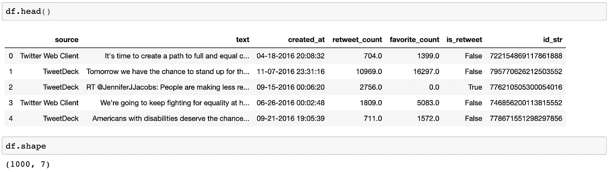

# 设置环境

在下面的代码行中，我们将通过调用`setup()`函数来初始化设置，并将其分配给`nlp`。

通过`data`和`target`，我们告诉 PyCaret 我们想要使用`df`的`'text'`列中的值。此外，我们将`session_id`设置为任意的数字`493`，这样我们可以一遍又一遍地重复实验，并得到相同的结果。最后，我们添加了`custom_stopwords`，这样 PyCaret 将在分析中排除指定的单词列表。

注意，如果我们想使用一个列表，我们可以用`lines`替换`df`并去掉`target = ‘text’`，因为一个列表没有 PyCaret 指向的列！

下面是`nlp`的输出:

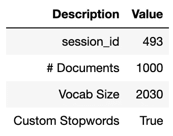

上面的输出表确认了我们的会话 id、文档数量(行或记录)和词汇表大小。它还会显示我们是否使用了自定义停用词。

# 创建模型

下面，我们将通过调用`create_model()`函数创建模型，并将其分配给`lda`。该函数已经知道使用我们在`setup()`中指定的数据集。在我们的例子中，PyCaret 知道我们想要基于`df`中的`'text'`创建一个模型。

在上一行中，注意 w param 使用了`'lda'`作为参数。LDA 代表潜在的狄利克雷分配。我们可以很容易地选择其他类型的模型。

以下是 PyCaret 目前支持的型号列表:

*   “lda”:潜在的狄利克雷分配
*   潜在语义索引
*   “hdp”:分层狄利克雷过程
*   rp ':随机投影
*   “nmf”:非负矩阵分解

我鼓励你研究以上模型之间的区别，首先，看看 Lettier 的关于 LDA 的令人敬畏的指南。

[](https://medium.com/@lettier/how-does-lda-work-ill-explain-using-emoji-108abf40fa7d) [## 你的潜在狄利克雷分配指南

### 在我们开始之前，我做了一个工具(这是源代码),可以在你的浏览器中运行 LDA(非常简洁)。是…

medium.com](https://medium.com/@lettier/how-does-lda-work-ill-explain-using-emoji-108abf40fa7d) 

我们使用的下一个参数是`num_topics = 6`。这告诉 PyCaret 在结果中使用从 0 到 5 的六个主题。如果没有设置 num_topic，缺省值为 4。最后，我们设置`multi_core`告诉 PyCaret 使用所有可用的 CPU 进行并行处理。这节省了大量的计算时间。

# 分配模型

通过调用`assign_model()`，我们将标记我们的数据，这样我们将获得一个数据帧(基于我们的原始数据帧:`df`)，其中包含以下信息的附加列:

*   每个主题的主题百分比值
*   主导话题
*   主导主题的百分比值

让我们来看看`df_lda`。

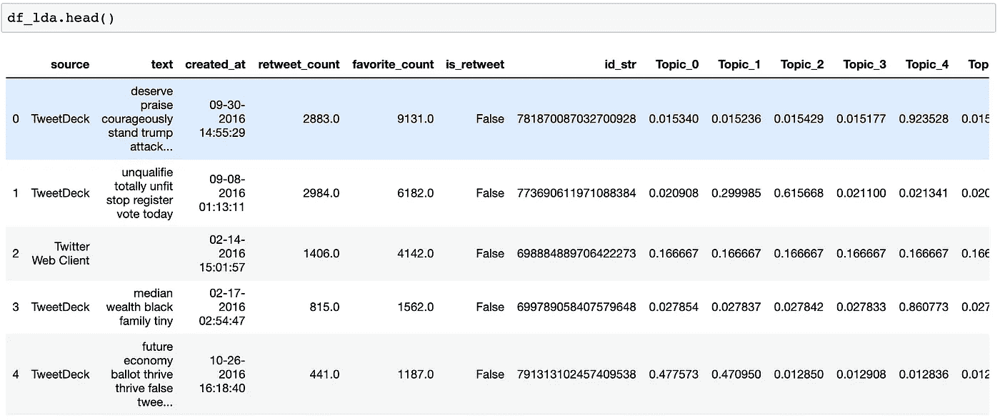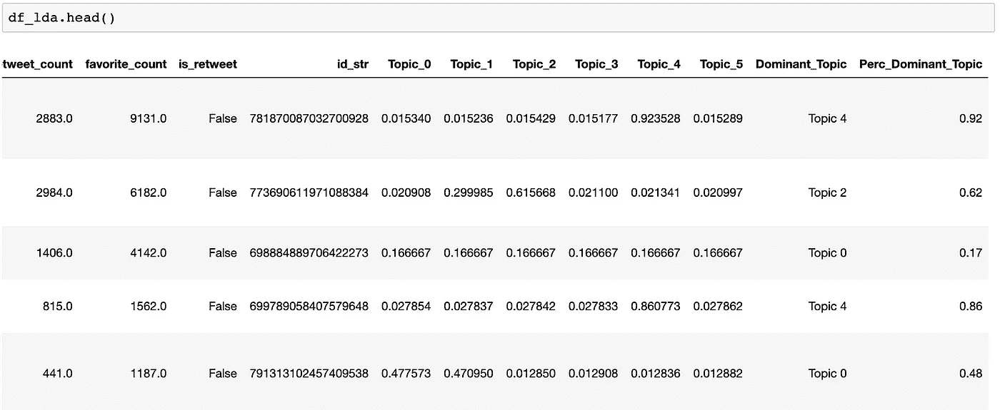

# 绘制模型

调用`plot_model()`函数将会给我们一些关于频率、分布、极性等等的可视化。`plot_model()`函数有三个参数:模型、情节和主题数量。`model`指示 PyCaret 使用什么模型，并且前面必须有一个`create_model()`函数。`topic_num`指定可视化将基于哪个主题编号(从 0 到 5)。

PyCarets 提供了各种各样的情节。生成的图形类型将取决于`plot`参数。以下是当前可用的可视化列表:

*   '频率':单词标记频率(默认)
*   “分布”:单词分布图
*   “二元模型”:二元模型频率图
*   “三元模型”:三元模型频率图
*   “情绪”:情绪极性图
*   “词性”:词频
*   “tsne”:t-SNE(3d)维度图
*   “主题模型”:主题模型(pyLDAvis)
*   “主题分布”:主题推断分布
*   “单词云”:单词云
*   “umap”:UMAP 维度图

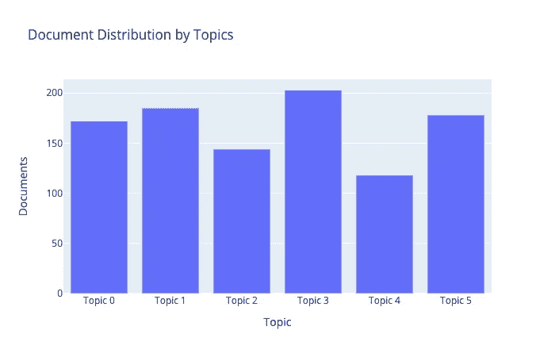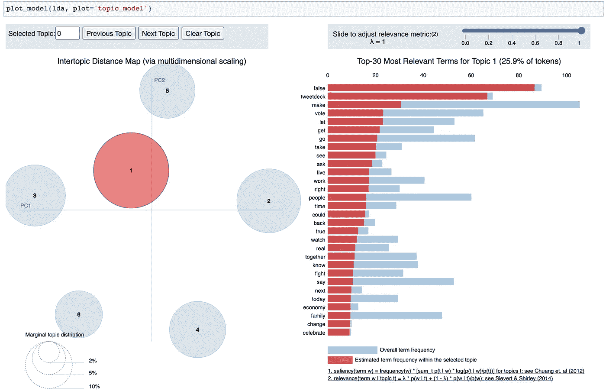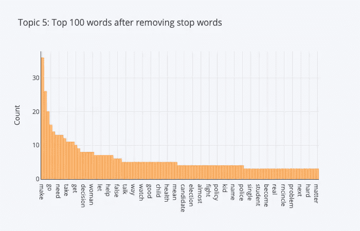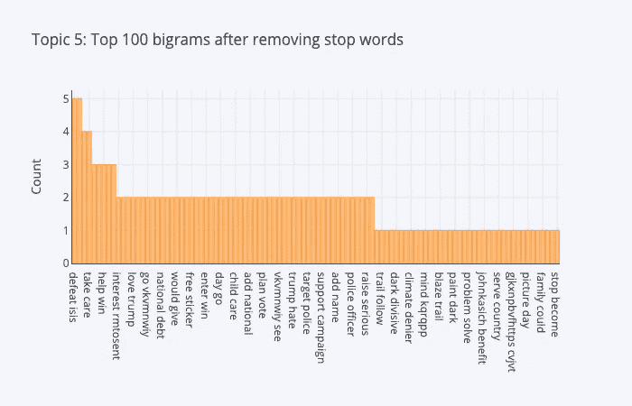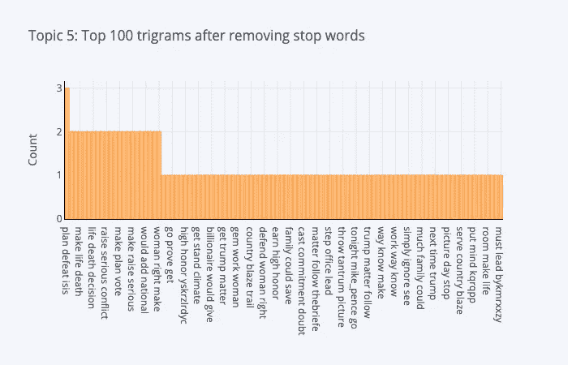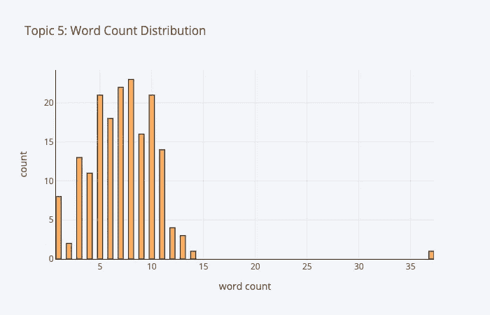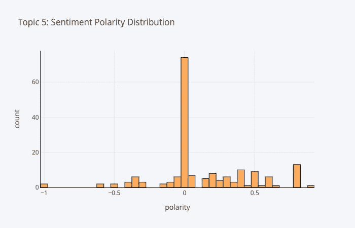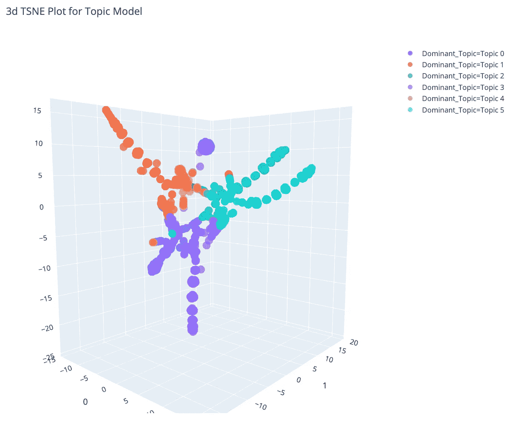

# 评估模型

评估模型包括调用`evaluate_model()`函数。它只需要一个参数:要使用的模型。在我们的例子中，存储的模型是在前面的步骤中用`create_model()`函数创建的`lda`。

该函数返回用于绘图的可视化用户界面。

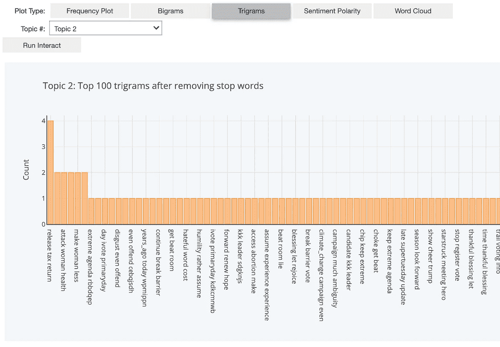

瞧，我们完成了！

# 结论

使用 PyCaret 的 NLP 模块，我们能够在短短几行代码中快速地从获取数据到评估模型。我们讨论了每个步骤中涉及的函数，并检查了这些函数的参数。

感谢您的阅读！PyCaret 的 NLP 模块有更多的特性，我鼓励你阅读他们的文档来进一步熟悉这个模块，甚至整个库！

在下一篇文章中，我将继续探索 PyCaret 的功能。

*如果你想了解更多关于我从懒鬼到数据科学家的旅程，请查看下面的文章:*

[](/from-slacker-to-data-scientist-b4f34aa10ea1) [## 从懒鬼到数据科学家

### 我的无学位数据科学之旅。

towardsdatascience.com](/from-slacker-to-data-scientist-b4f34aa10ea1) 

*敬请期待！*

你可以通过推特或 T2【LinkedIn】联系我。

[1] PyCaret。(2020 年 6 月 4 日)。*为什么 PyCaret* 。[https://pycaret.org/](https://pycaret.org/)