# 主题建模与 LDA 和 Quora 问题

> 原文：<https://towardsdatascience.com/topic-modeling-quora-questions-with-lda-nmf-aff8dce5e1dd?source=collection_archive---------3----------------------->

图片来源:Unsplash

## 潜在狄利克雷分配，非负矩阵分解

Quora 用来给问题分配主题的算法是专有的，所以我们不知道他们是如何做到的。然而，这并不妨碍我们用自己的方式去尝试。

*   **问题描述**

Quora 有所有这些未标记的现有问题，他们需要对它们进行分类，以适应机器学习管道的下一步。

*   **识别问题**

这是一个无监督的学习问题，我们在 Quora 问题中发现了各种各样的主题。

*   **目标**

我们的目标是确定主题的数量，并确定每个主题的主题。此外，我测试了我的模型是否可以预测任何新问题的主题。

*   **方法**

将一个 [LDA](https://en.wikipedia.org/wiki/Latent_Dirichlet_allocation) 和一个 [NMF](https://en.wikipedia.org/wiki/Non-negative_matrix_factorization) 模型应用到 Quora 问题数据集上，确定主题数量和每个主题的主题。

我已经在 Github 上加载了一个[更小的样本数据集](https://raw.githubusercontent.com/susanli2016/NLP-with-Python/master/data/quora_sample.csv)，可以随意使用。

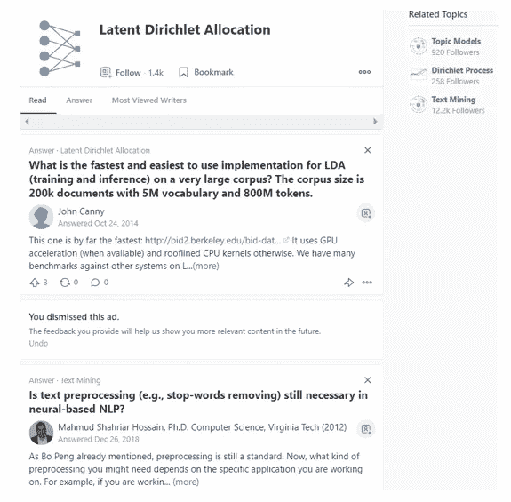

来源:Quora

这是这个话题的一个例子，以及它在 Quora 网站上的样子。

# **数据预处理**

启动. py

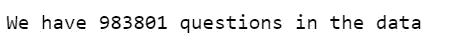

在文本预处理之前，问题看起来是这样的:

prior_preprocessing.py

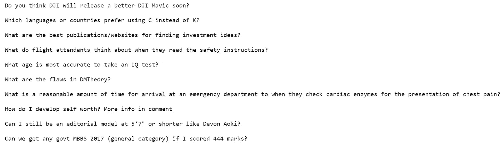

图 1

*文本预处理期间我们要做什么:*

*   *小写字母*
*   *删除停用字词、括号、标点和数字*
*   *使用空间然后移除“-PRON-”的词条解释。*

****在文本预处理过程中我们不打算做什么:****

*   *堵塞物*

*词干删除一个单词中的最后几个字符，往往会导致不正确的意思和拼写错误，或者使单词无法识别，例如:business → busi，busy → busi，situation → situ。*

*我们应该尽量不要做太多的文本预处理，因为大多数问题都很短，删除更多的单词有失去意义的风险。*

*text _ 预处理 _lda.py*

# *电子设计自动化(Electronic Design Automation)*

*探究问题一般有多长。*

*问题 _ 长度. py*

*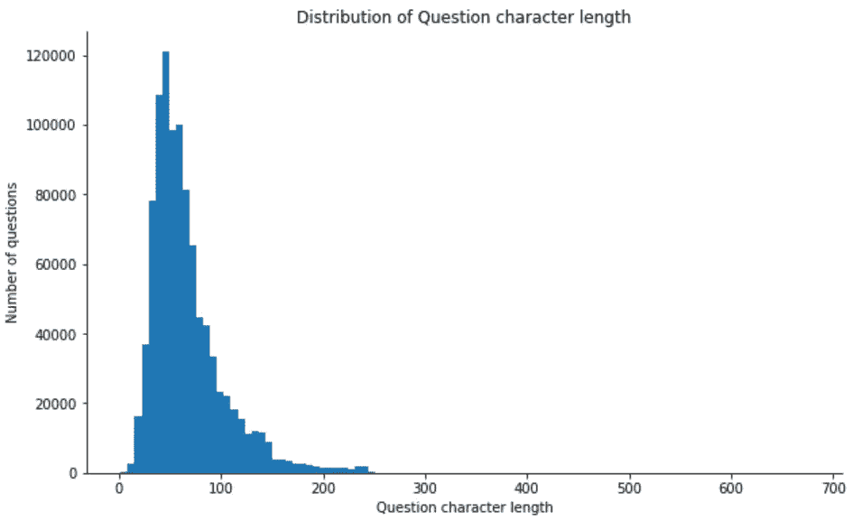*

*图 2*

*关于什么问题。*

*word_cloud.py*

*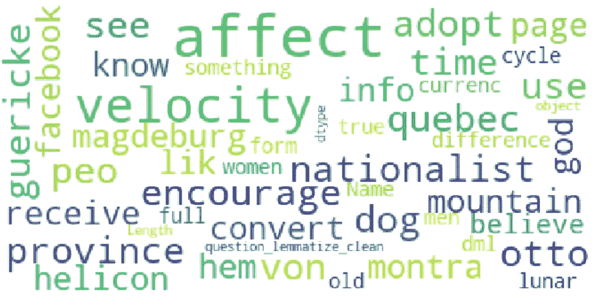*

*图 3*

****Unigrams****

*unigram.py*

*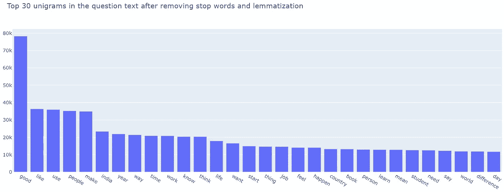*

*图 4*

****二元组****

*bigram.py*

*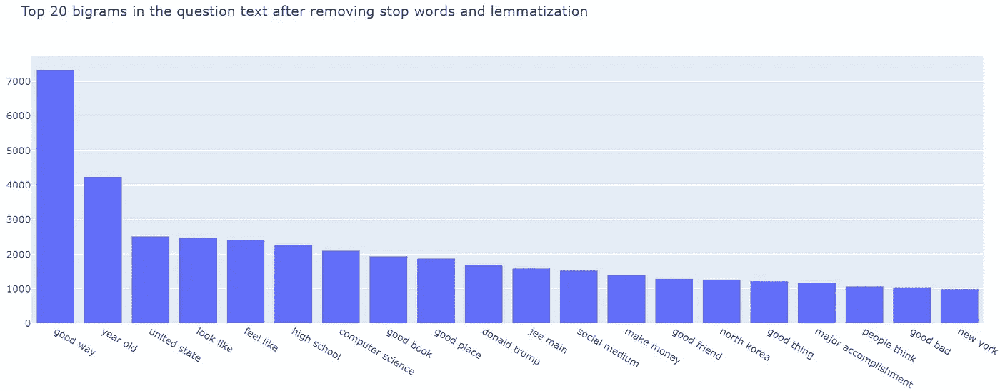*

*图 5*

****三元组****

*三元模型. py*

*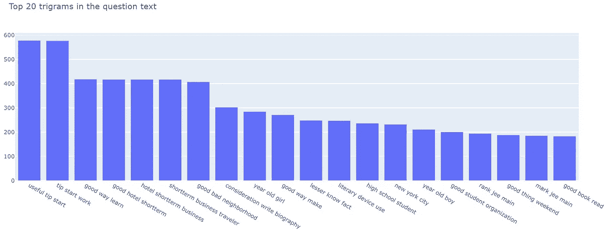*

*图 6*

****观察结果*** :*

*   *很多问题都在问“开始的有用技巧……”(我想是开始一份新的职业或新的工作？)*
*   *很多问题都是关于学习的好方法。*
*   *很多问题都是询问短期商务旅客的酒店推荐。*
*   *许多人在询问好邻居或坏邻居。假设他们想搬到一个新的地方？*
*   *有些人在考虑写传记。*
*   *似乎有一些重复的问题，例如:短期商务旅客的酒店。检测重复的问题会很有趣，这是另一个时间的主题。*

# *主题建模*

*   *做主题建模，我们需要的输入是:文档-术语矩阵。单词的顺序不重要。所以，我们称之为“词汇袋”。*
*   *我们既可以使用 [scikit-learn](https://scikit-learn.org/stable/modules/generated/sklearn.decomposition.LatentDirichletAllocation.html) 也可以使用 [Gensim](https://radimrehurek.com/gensim/models/ldamodel.html) 库，该技术被称为“[潜在狄利克雷分配](https://en.wikipedia.org/wiki/Latent_Dirichlet_allocation)”，简称“LDA”。*
*   *输出是数据中所有问题的主题数量以及每个主题的主题。*

*让我们更深入地研究文档术语矩阵到底是什么。假设我们总共有三个问题:*

> *1).足球运动员如何保持安全？*
> 
> *2).最讨厌的 NFL 足球队是哪支？*
> 
> *3).谁是最伟大的政治领袖？*

*这三个问题的文档术语矩阵是:*

*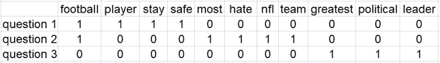*

*表 1*

*每行是一个问题(或文档)，每列是一个术语(或单词)，如果该文档不包含该术语，我们标记“0”，如果该文档包含该术语一次，我们标记“1”，如果该文档包含该术语两次，我们标记“2”，依此类推。*

# *潜在狄利克雷分配*

****潜伏*** 意为隐藏， ***狄利克雷*** 是一种概率分布类型。 ***潜在的狄利克雷分配*** 意味着我们试图找到所有的概率分布，它们是隐藏的。*

*让我们继续我们的例子。我们有四个问题。作为人类，我们确切地知道每个问题是关于什么的。*

*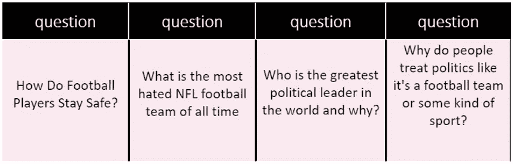*

*图 7*

*第一个问题是关于足球，第三个问题是关于政治，第四个问题是关于政治和足球。当我们将这 4 个问题与 LDA 相匹配时，它会给我们这样的反馈:*

*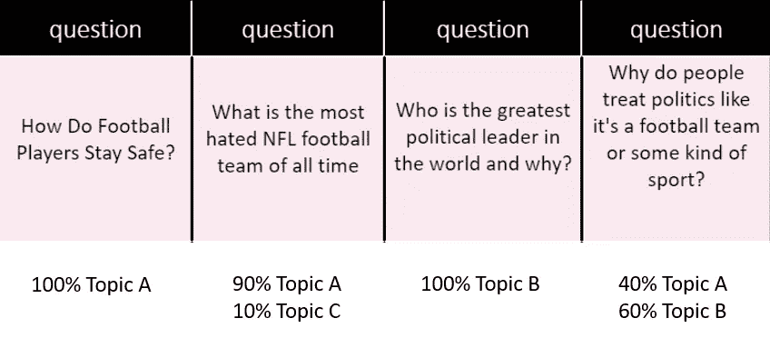*

*图 8*

*第一个问题是话题 A 的 100%，第三个问题是话题 B 的 100%，最后一个问题是话题 A 和话题 B 的拆分，解读它们是我们人类的工作。*

*话题 A 中“足球”一词权重最高，其次是“NFL”，再次是“球员”。所以我们可以推断这个话题是关于体育的。*

*“政治”一词在 B 题中权重最高，其次是“领袖”，再次是“世界”。所以我们可以推断这个话题是关于政治的。如下图所示:*

*   ***话题 A** : 40%足球，30% NFL，10%球员……***体育****
*   ***题目 B** : 30%政治，20%领袖，10%世界… ***政治****

*然后我们回到原来的问题，下面是题目！*

*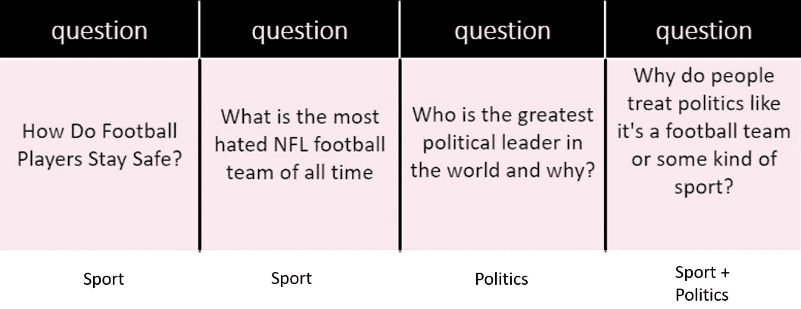*

*图 9*

*再深入一点，每个问题都是话题的混合，每个话题都是文字的混合。*

*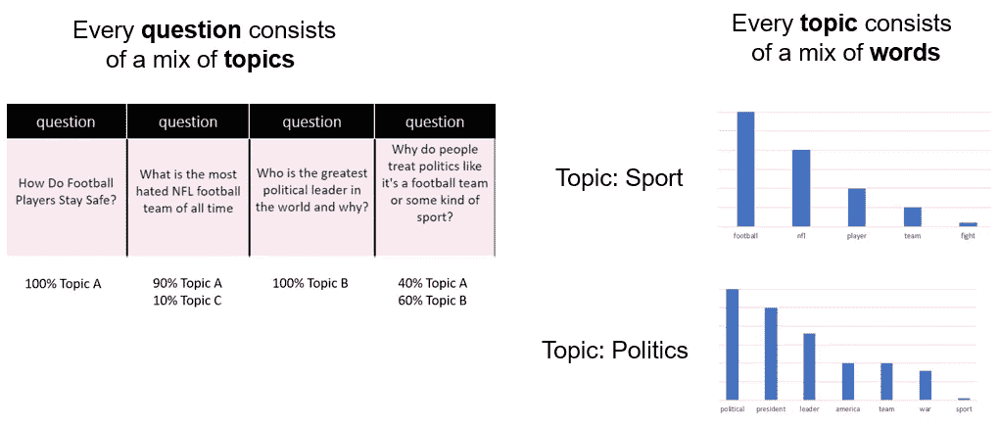*

*图 10*

****严格来说*** :*

*   *一个问题就是一个话题的概率分布，每个话题就是一个词的概率分布。*
*   *LDA 所做的是，当你用所有这些问题来匹配它时，它会尽力找到最佳的主题组合和最佳的单词组合。*

****LDA 工作步骤*** :*

1.  *我们希望 LDA 学习每个问题中的主题组合以及每个主题中的单词组合。*
2.  *选择我们认为在整个问题数据集中有多少个主题(例如:num_topics = 2)。*
3.  *将每个问题中的每个单词随机分配给两个主题中的一个(例如:上述问题中的单词“足球”被随机分配给类似政治的主题 B)*
4.  *仔细阅读每个问题中的每个单词及其主题。看看 1)该主题在问题中出现的频率，以及 2)该单词在整个主题中出现的频率。根据这些信息，给单词分配一个新的主题(例如:看起来“足球”在主题 B 中不常出现，所以单词“足球”可能应该分配给主题 A)。*
5.  *经历多次这样的迭代。最终，这些主题将开始变得有意义，我们可以解释它们并赋予它们主题。*

*幸运的是，我们只需要给 LDA 输入，LDA 会为我们做所有这些脏活。*

*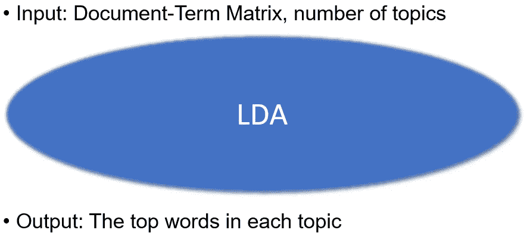*

*图 11*

# *LDA 关于 983，801 个 Quora 问题*

*   *我们收到了 983，801 个 Quora 问题。*
*   *我们希望在整个问题集合中发现隐藏或潜在的主题(例如，技术、政治、科学、体育)，并尝试按主题对它们进行分类。*
*   *选择主题数量(更多主题—更精细)*

> *比如体育，当我们有很多话题的时候，可能会有足球(topic1)、网球(topic2)、曲棍球(topic3)等等。如果我们减少话题的数量，在某个时候，这些与体育相关的话题会自行消失，变成一个话题。像任何无监督学习一样，没有衡量标准，这个比那个好。我们基本上必须为我们自己的用例进行选择。*

*   *使用各种近似方案运行 LDA，使用不同的方案运行多次，以查看哪种方案最适合特定的用例。*

# *带有 Gensim 的 LDA*

*我先试了一下 Gensim，有 20 个话题，还有…*

*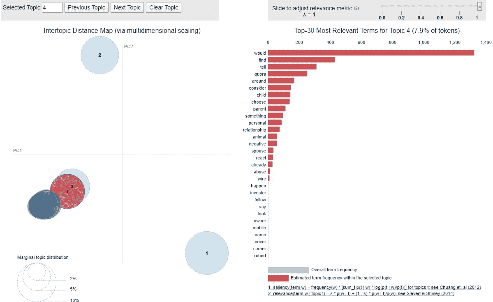*

*图 12*

*一个好的主题模型很少或者没有重叠，这里绝对不是这样。让我们试试 Scikit-Learn。*

# *带 Scikit 的 LDA 学习*

*vec_lda.py*

*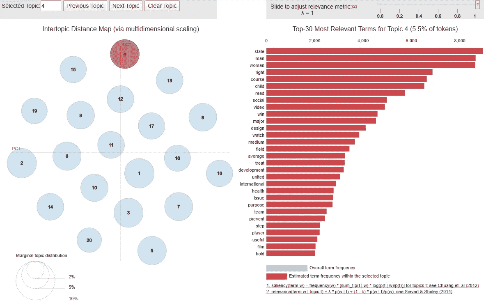*

*图 13*

*我保留了 LDA 找到的每个主题中出现频率最高的前 20 个单词。这里我们展示的是部分表格:*

*显示 _ 主题. py*

*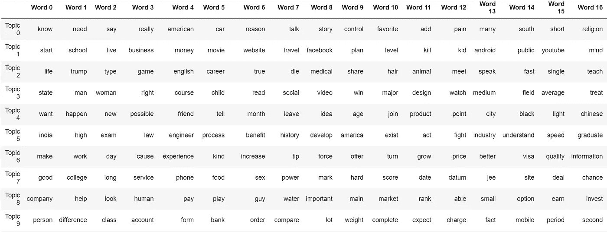*

*表 2*

*然后查看每个主题中的热门词汇，手动为每个主题分配主题。这需要一些领域的专业知识和创造力，主要是，我只是用了前 3 或 4 个词作为主题。*

*topic_theme.py*

*以下是主题-关键字分配的部分表格。*

*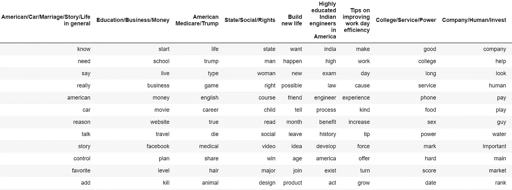*

*表 3*

*要将某个问题归类到某个特定的主题，一个合乎逻辑的方法就是看哪个主题对那个问题的贡献最大，然后分配给它。在下面的过程中，我们将在一系列的数据操作后，为每个问题分配最具主导性的主题。下面的一些代码是从这个[教程](https://www.machinelearningplus.com/nlp/topic-modeling-python-sklearn-examples/)中借来的。*

*分配 _ 主题. py*

*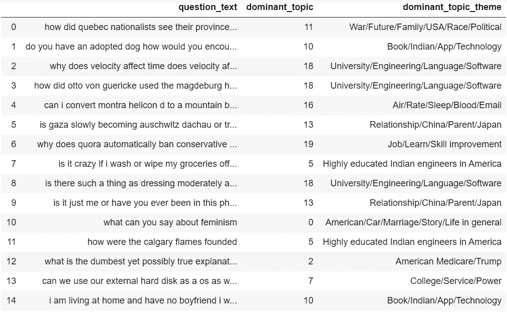*

*表 4*

*从上表中可以看出，问题 2、3 和 8 都被分配给了主题 18。让我们目测一下它们是否有意义。*

*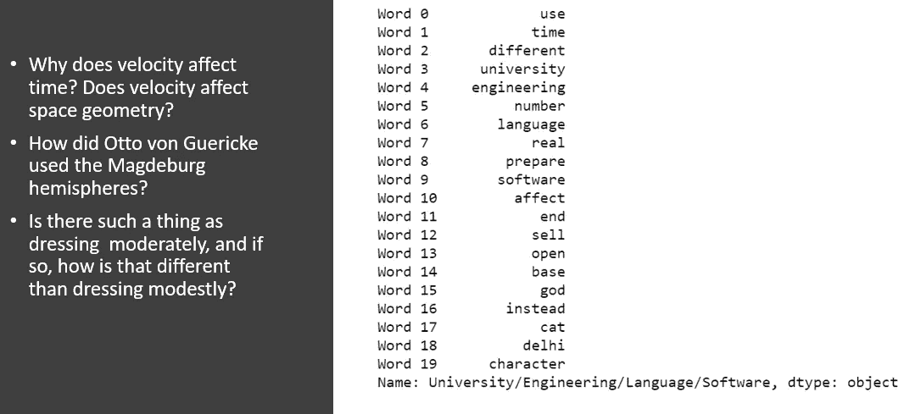*

*图 14*

*我们在左边有这 3 个问题，它们被分配给右边的主题，以及该主题中的每个关键词。*

*我完全同意第一个和第二个问题的作业，不确定第三个问题，可能是因为“穿着谦虚”和“性格”这两个词？*

# *做预测*

*更准确地说，也许我们应该说一个新问题将如何分配给这 20 个主题中的一个。*

*我去了 Quora.com[的](https://www.quora.com/)，取了几个流行的问题来测试我们的模型。同样，下面的代码是从这个[教程](https://www.machinelearningplus.com/nlp/topic-modeling-python-sklearn-examples/)中借来的。*

*第一个测试问题是“ ***你在生活中学到的最重要的经验是什么，你是什么时候学到的*** ？”*

*预测 _ 话题. py*

*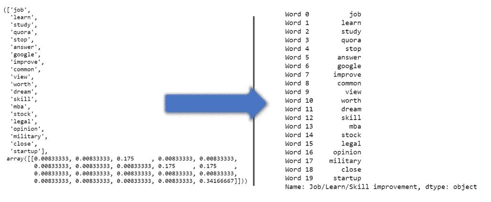*

*图 15*

*我们的 LDA 模型能够找到这个新问题中的主题组合，以及每个主题中的单词组合。这个新问题已经被分配到题目中了，题目中最重要的关键词有“ ***工作、学习、研究*** ”等等，而这个题目的主题是“ ***工作/学习/技能提升*** ”。我同意。*

*第二个测试问题是“ ***就像拉里·佩奇和谢尔盖·布林用一个更好的搜索引擎取代了他们的现任一样，两个计算机科学博士生创造一个取代谷歌的搜索引擎的可能性有多大？谷歌对这种可能性*** 有多脆弱？”*

*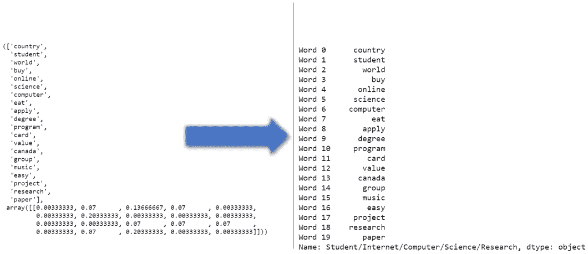*

*图 16*

*用同样的方法，这个新问题被分配到以“ ***国家、学生、计算机、科学*** ”等为顶级关键词的题目中。对于这个新问题，“计算机”和“项目”这两个词的权重最高。而题目的主题是“ ***学生/互联网/计算机/科学/科研*** ”。我也同意。*

# ***非负矩阵分解(NMF)***

*   *一系列线性代数算法，用于识别以非负矩阵表示的数据中的潜在结构。*
*   *NMF 可以应用于主题建模，其中输入是术语-文档矩阵，通常是 TF-IDF 标准化的。*
*   *输入:术语-文档矩阵，主题数量。*
*   *输出:原始的 n 个单词乘以 k 个主题以及 m 个原始文档乘以相同的 k 个主题的两个非负矩阵。*
*   *基本上我们准备用[线性代数](https://en.wikipedia.org/wiki/Linear_algebra)进行话题建模。*

*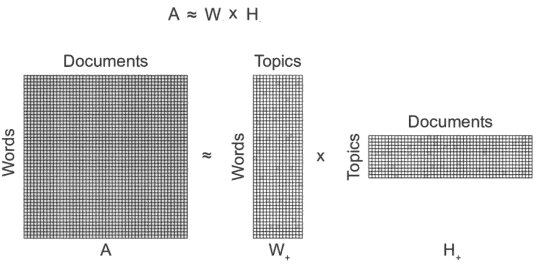*

*来源:[https://www . researchgate . net/figure/Conceptual-illustration-of-non-negative-matrix-factorization-NMF 分解-of-a_fig1_312157184](https://www.researchgate.net/figure/Conceptual-illustration-of-non-negative-matrix-factorization-NMF-decomposition-of-a_fig1_312157184)*

*如上所示，我们将术语-文档矩阵分解为两个矩阵，第一个矩阵包含每个主题和其中的术语，第二个矩阵包含每个文档和其中的主题。*

****再用我们的足球和政治举例:****

*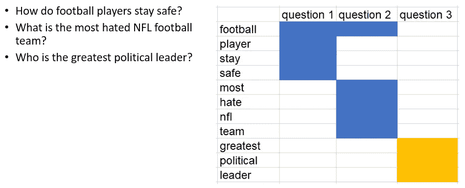*

*图 17*

*左边是 3 个问题，右边是这 3 个问题的术语文档矩阵。我们选择 k=2 个话题。*

*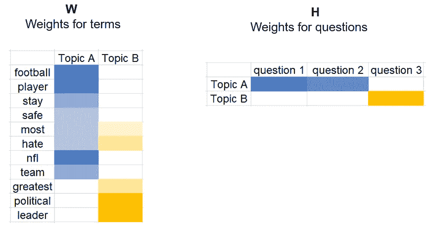*

*图 18*

*经过分解，我们得到了两个非负矩阵，一个由 k 个主题组成，另一个由 m 个原始文档组成。*

*文本预处理部分与 LDA 模型相似，我只为 NMF 模型保留了名词，只是为了看看是否有什么不同。*

*我们可以看到，与 LDA 模型相比，每个关键词在每个主题中是如何分配的，主题是如何组织的。*

*nmf_topic.py*

*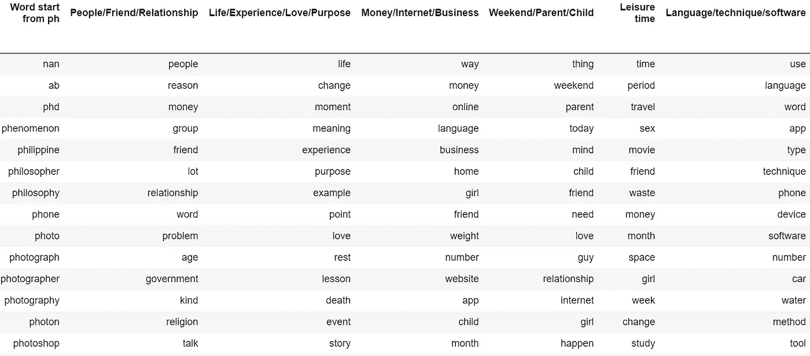*

*表 5*

*比如一个题目，通过查看每个题目中的所有关键词，除了都以“ph”开头之外，我似乎找不到彼此之间有什么关系。所以，我把“单词从 ph 开始”作为这个题目的主题。*

# ***进行预测***

*使用同样的问题，我们将会看到 NMF 模型如何将它分配到这 20 个主题中的一个。*

*问题 1:“***你人生中学到的最重要的一课是什么，是什么时候学到的？”****

*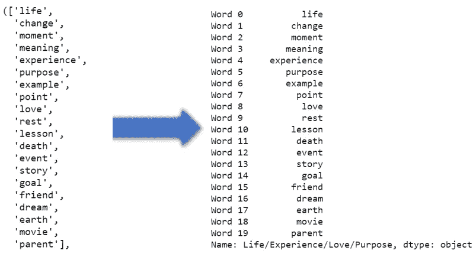*

*图 19*

*问题 1 已分配到以“ ***人生、变化、瞬间、意义、经历*** ”等为顶级关键词的题目，该题目主题为“ ***人生/经历/爱情/目的*** ”。我同意！*

*问题 2:“***就像拉里·佩奇和谢尔盖·布林用一个更好的搜索引擎推翻了他们的现任一样，两个计算机科学博士生创造一个推翻谷歌的搜索引擎的可能性有多大？谷歌在这种可能性面前有多脆弱？”****

*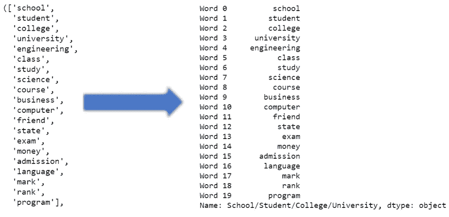*

*图 20*

*问题 2 已经被分配到具有类似于“ ***学校、学生、学院、大学、工程*** ”等顶部关键词的主题，并且该主题的主题是“ ***学校/学生/学院/大学*** ”。我找不到更好的方法。*

*这个帖子的 Jupyter 笔记本可以在这里找到[，在这里](https://github.com/susanli2016/NLP-with-Python/blob/master/Quora%20Topic%20Modeling_scikit%20learn_LDA.ipynb)找到[。享受这周剩下的时光。](https://github.com/susanli2016/NLP-with-Python/blob/master/Quora%20Topic%20Modeling_scikit%20learn_NMF.ipynb)*

*参考资料:*

* [## LDA -如何网格搜索最佳主题模型？(带有 python 中的示例)

### Python 的 Scikit Learn 提供了一个方便的接口，用于使用潜在的 Dirichlet 等算法进行主题建模。

www.machinelearningplus.com](https://www.machinelearningplus.com/nlp/topic-modeling-python-sklearn-examples/) 

[https://learning . oreilly . com/videos/oreilly-strata-data/9781492050681/9781492050681-video 328137](https://learning.oreilly.com/videos/oreilly-strata-data/9781492050681/9781492050681-video328137)

[https://sci kit-learn . org/stable/auto _ examples/applications/plot _ topics _ extraction _ with _ NMF _ LDA . html](https://scikit-learn.org/stable/auto_examples/applications/plot_topics_extraction_with_nmf_lda.html)

[http://www.cs.columbia.edu/~blei/papers/Blei2012.pdf](http://www.cs.columbia.edu/~blei/papers/Blei2012.pdf)*