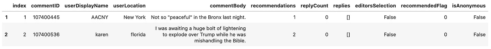
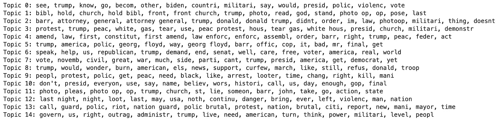
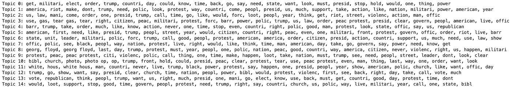
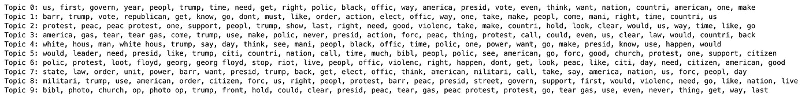
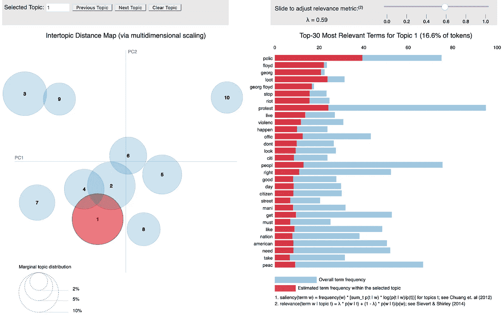
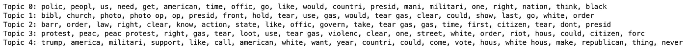

# 纽约时报文章评论部分的主题建模

> 原文：<https://towardsdatascience.com/topic-modeling-the-comment-section-from-a-new-york-times-article-e4775261530e?source=collection_archive---------40----------------------->


[安德鲁·尼尔](https://unsplash.com/@andrewtneel?utm_source=medium&utm_medium=referral)在 [Unsplash](https://unsplash.com?utm_source=medium&utm_medium=referral) 上拍照

## 使用潜在狄利克雷分配(LDA)和非负矩阵分解(NMF)主题建模方法

每次我读《纽约时报》的文章，我通常喜欢通读一些评论，以便对一个故事有更好的看法。然而，有时有成千上万的评论，我没有时间通读它们，我想知道主要讨论点的要点。

**建立一个快速的主题建模脚本可以帮助我抓住人们在文章评论部分讨论的关键主题的要点。**

注意:在本教程中，我们将使用潜在狄利克雷分配(LDA)和非负矩阵分解(NMF)方法。我不会深入解释它是如何工作的，因为有许多关于 medium 的优秀文章在讨论这个问题。严格来说，这是一个编程教程，可以帮助您快速设置主题建模代码。

## 步骤 1:收集意见

我将分析这篇[纽约时报文章](https://www.nytimes.com/2020/06/02/us/george-floyd-video-autopsy-protests.html)的评论部分。

我上周发表了一篇关于如何从《纽约时报》的一篇文章中收集评论的中型文章。在继续本教程之前，请先遵循该教程。

[](/how-to-collect-comments-from-any-new-york-times-article-to-a-pandas-dataframe-a595ec6a1ddf) [## 如何从《纽约时报》的任何一篇文章中收集对熊猫数据框架的评论

### 《纽约时报》( NYT)最精彩的部分是他们对文章积极且高度节制的评论部分。

towardsdatascience.com](/how-to-collect-comments-from-any-new-york-times-article-to-a-pandas-dataframe-a595ec6a1ddf) 

## 第二步:设置事物

```
#Importing Required Plugins
import pandas as pd
import numpy as np#load csv file to Pandas Dataframe 
df = pd.read_csv('nyt_comments.csv', index_col = 0)
```

如果你按照我的教程从这个[中型职位](/how-to-collect-comments-from-any-new-york-times-article-to-a-pandas-dataframe-a595ec6a1ddf)，你的数据帧应该看起来像这样。



保存 NYT 评论的数据帧示例

## 步骤 3:预处理文本数据。

对于主题建模，我们使用的数据类型是文本数据，它需要某种形式的预处理，以使结果更加清晰。

在预处理阶段，通常:

*   将所有单词设为小写
*   删除标点符号
*   删除停用词(and、the 等。)
*   把单词还原成它们的词根形式，这叫做词干化。

*注意:我在下面的脚本中使用了 SnowballStemmer，但是你可以使用任何其他的词干分析器。*

## 步骤 4:使用 Sklearn 的 tfidf 矢量器将我们的文本数据转换成词频逆文档矩阵

> TF–IDF 值与单词在文档中出现的次数成比例增加，并由语料库中包含该单词的文档数抵消，这有助于调整某些单词通常更频繁出现的事实。——维基百科

*注意:您可以在我们的 TfidfVectorizer 上将 min_df 设置为您喜欢的任何值，但是我选择了 0.05，因为它似乎对我的数据运行很有效。*

## 步骤 5:使用 LDA 进行主题建模



LDA 模型生成的 15 个主题的输出。

在这篇文章的评论部分，我们可以清楚地发现一些有趣的话题。

然而，我想知道如果我们采用前 25 个单词而不是前 15 个，我们是否可以获得更多一点的上下文。



输出前 25 个单词的 15 个主题

就我们对各种主题的理解而言，这要好得多。

我们可以采取的另一个步骤是增加或减少我们的模型搜索的主题数量，而不仅仅是增加热门词的显示。

**这就是我们需要创造性思维的地方，在分析我们模型结果的输入中。**

但是，让我们快速了解一下当我们将生成的主题数量减少到 10 个时会发生什么。



LDA 模型的 10 个主题的输出。

看起来生成的主题越少，在文章评论部分区分不同主题的效果就越好。

然而，有些主题并不真正有意义，或者它告诉我们同样的事情。这可能是因为这些评论已经在讨论一篇特定的文章，可以确定的主题可能有限，并且许多相同的词被重复使用。

## 步骤 6:用 pyLDAvis 插件可视化 LDA 模型生成的主题

[pyLDAvis](https://pypi.org/project/pyLDAvis/) 插件生成了一个交互式的图，在我看来，这让我更容易分析生成的各种主题以及我的 LDA 模型的表现。



pyLDAvis 的互动情节

## 第七步:用 NMF 进行主题建模

老实说，设置并没有完全不同，完全一样。但是，这个算法会吐出不同的结果。



NMF 模型的 5 个主题的输出。

进一步减少主题的数量似乎可以更好地区分评论中讨论的各种主题。

*注意:不幸的是，您不能使用 pyLDAvis 插件来可视化 NMF 模型的主题。*

**好了，这就是你如何建立一个主题建模的快速脚本，以确定 NYT 文章评论部分的各种讨论主题。**