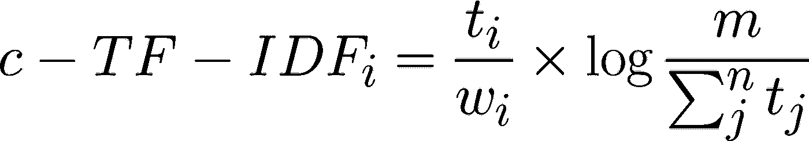

# 用 BERT 进行主题建模

> 原文：<https://towardsdatascience.com/topic-modeling-with-bert-779f7db187e6?source=collection_archive---------0----------------------->

图片由作者提供。

## 利用 BERT 和 TF-IDF 创建易于解释的主题。

当一个产品负责人来找我做一些基于 NLP 的分析时，我通常会被问到以下问题:

> “在这些文档中可以经常找到哪个主题？”

由于没有任何类别或标签，我被迫寻找无监督的技术来提取这些主题，即**主题建模**。

虽然主题模型如 LDA 和 NMF 已经被证明是很好的起点，但我总是觉得通过超参数调整来创建有意义的主题需要相当大的努力。

此外，我想使用基于 transformer 的模型，如 **BERT** ，因为它们在过去几年的各种 NLP 任务中显示了惊人的结果。预训练模型特别有用，因为它们应该包含更准确的单词和句子的表示。

几周前，我看到了这个名为 [Top2Vec](https://github.com/ddangelov/Top2Vec) *的伟大项目，它利用文档和单词嵌入来创建易于解释的主题。我开始查看代码来概括 Top2Vec，以便它可以用于预先训练的 transformer 模型。

Doc2Vec 的最大优点是，得到的文档和单词嵌入共同嵌入在同一个空间中，这使得文档嵌入可以由邻近的单词嵌入来表示。不幸的是，这被证明是困难的，因为 BERT 嵌入是基于令牌的，不一定占用相同的空间**。

相反，我决定想出一个不同的算法，可以使用伯特和🤗变压器嵌入。结果是 BERTopic，一种使用最先进的嵌入技术生成主题的算法。

这篇文章的主题不是 BERTopic 的使用，而是一个关于如何使用 BERT 创建你自己的主题模型的教程。

论文 *:安杰洛夫 D. (2020)。 [Top2Vec:主题的分布式表示。](https://arxiv.org/abs/2008.09470) *arXiv 预印本 arXiv:2008.09470* 。

**注意*** *:虽然你可以让它们占据相同的空间，但是由于 BERT 的上下文特性，单词嵌入的结果大小相当大。此外，生成的句子或文档嵌入有可能会降低质量。

# 1.数据和数据包

对于这个例子，我们使用著名的`20 Newsgroups`数据集，它包含大约 18000 篇关于 20 个主题的新闻组帖子。使用 Scikit-Learn，我们可以快速下载和准备数据:

如果你想加速训练，你可以选择子集`train`，因为它会减少你提取的文章数量。

**注意**:如果你想在段落层次而不是在整个文档上应用主题建模，我建议在创建嵌入之前分割你的数据。

# 2.嵌入

我们要做的第一步是将文档转换成数字数据。我们使用 **BERT** 来实现这个目的，因为它基于单词的上下文提取不同的嵌入。不仅如此，还有许多[预训练的模型](https://huggingface.co/models)可供使用。

如何为文档生成 BERT 嵌入取决于您。然而，我更喜欢使用`sentence-transformers`包，因为最终的嵌入已经证明是高质量的，并且通常对于文档级的嵌入工作得很好。

在生成文档嵌入之前，用`pip install sentence-transformers`安装包。如果你在安装这个包时遇到问题，那么首先安装 [Pytorch](https://pytorch.org/get-started/locally/) 是值得的。

然后，运行以下代码将文档转换为 512 维向量:

我们使用 **Distilbert** ，因为它在速度和性能之间提供了一个很好的平衡。包装中有几款[多语言型号](https://www.sbert.net/docs/pretrained_models.html)供您使用。

**注意**:由于 transformer 型号有令牌限制，您在输入大型文档时可能会遇到一些错误。在这种情况下，您可以考虑将文档分成段落。

# 3.使聚集

我们希望确保具有相似主题的文档被聚集在一起，以便我们可以在这些集群中找到主题。在这样做之前，我们首先需要降低嵌入的维数，因为许多聚类算法处理高维数据的能力很差。

## UMAP

在为数不多的降维算法中， [UMAP](https://github.com/lmcinnes/umap) 可以说是性能最好的，因为它在较低的维度中保留了高维局部结构的重要部分。

在我们降低文档嵌入的维度之前，安装带有`pip install umap-learn`的包。我们将维数减少到 5，同时保持局部邻域的大小为 15。您可以使用这些值来优化您的主题创建。请注意，过低的维度会导致信息丢失，而过高的维度会导致较差的聚类结果。

## HDBSAN

在将文档嵌入的维数减少到 5 后，我们可以用 **HDBSCAN** 对文档进行聚类。HDBSCAN 是一种基于密度的算法，非常适合 UMAP，因为 UMAP 即使在低维空间中也保留了大量的局部结构。此外，HDBSCAN 不会将数据点强制归类，因为它认为它们是异常值。

用`pip install hdbscan`安装软件包，然后创建集群:

太好了！我们现在已经将相似的文档聚集在一起，这些文档应该代表它们所包含的主题。为了可视化得到的聚类，我们可以进一步将维数减少到 2，并将异常值可视化为灰点:

通过将判决嵌入减少到二维空间来可视化主题。图片由作者提供。

由于生成的主题数量众多(约 55 个)，很难直观显示各个集群。然而，我们可以看到，即使在二维空间中，一些局部结构仍然存在。

**注意**:如果你使用的聚类算法可以处理高维数据，比如基于余弦的 k-Means，你可以跳过降维步骤。

# 4.话题创作

我们想从我们生成的聚类中知道的是，是什么使一个聚类基于它们的内容而不同于另一个？

> 我们如何从集群文档中获取主题？

为了解决这个问题，我想到了 TF-IDF 的一个基于类的变体( **c-TF-IDF** )，它允许我提取每组文档与其他文档相比的独特之处。

该方法背后的直觉如下。当您像往常一样对一组文档应用 TF-IDF 时，您基本上是在比较文档之间单词的重要性。

如果我们将单个类别(例如，一个集群)中的所有文档视为单个文档**然后应用 TF-IDF 会怎么样？每个类别的结果将是一个非常长的文档，并且产生的 TF-IDF 分数将展示主题中的重要单词。**

## c-TF-IDF

为了创建这个基于类的 TF-IDF 分数，我们需要首先为每个文档集群创建一个文档:

然后，我们应用基于类的 TF-IDF:

基于类的 TF-IDF，通过连接类内的文档来实现。图片由作者提供。

其中为每个类别`**i**`提取每个单词`**t**`的**频率**并除以单词总数`**w**`。这个动作可以看作是对课堂上常用词的一种正则化形式。接下来，未连接的文档总数`**m**`除以所有类别中单词`**t**`的总频率`**n**`。

现在，我们对一个聚类中的每个单词都有一个单独的**重要性**值，它可以用来创建主题。如果我们在每个聚类中取前 10 个最重要的单词，那么我们将得到一个聚类的良好表示，从而得到一个主题。

## 主题表征

为了创建主题表示，我们根据每个主题的 c-TF-IDF 得分，选取前 20 个单词。分数越高，越能代表其主题，因为分数是信息密度的代表。

我们可以使用`topic_sizes`来查看某些主题出现的频率:

图片由作者提供。

主题名`-1`指的是没有分配任何主题的所有文档。HDBSCAN 的优点在于，并非所有文档都被强制指向某个集群。如果找不到聚类，那么它就是一个离群值。

我们可以看到，主题 7、43、12 和 41 是我们可以创建的最大集群。要查看属于这些主题的单词，我们可以简单地使用字典`top_n_words`来访问这些主题:

图片由作者提供。

看看最大的四个主题，我会说这些似乎很好地代表了容易解释的主题！

我可以把体育、计算机、太空和宗教看作是从数据中提取出来的清晰的主题。

# 5.话题缩减

根据数据集的不同，您可能会获得数百个已创建的主题！您可以调整 HDBSCAN 的参数，以便通过其`min_cluster_size`参数获得更少的主题，但是它不允许您指定集群的确切数量。

[Top2Vec](https://github.com/ddangelov/Top2Vec) 使用的一个巧妙技巧是通过合并彼此最相似的主题向量来减少主题的数量。

我们可以使用类似的技术，通过**比较**主题间的 c-TF-IDF 向量，**合并**最相似的向量，最后**重新计算**c-TF-IDF 向量来更新我们主题的表示:

上面，我们把最不常见的话题和最相似的话题合并。通过重复这 19 次，我们将主题数量从 **56** 减少到 **36** ！

**注**:我们可以跳过这条流水线的重算部分，以加快话题缩减步骤。然而，重新计算 c-TF-IDF 向量更准确，因为这将更好地表示新生成的主题内容。你可以尝试这样做，例如，每 n 步更新一次，这样既能加快进程，又能保持良好的主题表现。

**提示**:您可以使用本文描述的方法(或者简单地使用 [BERTopic](https://github.com/MaartenGr/BERTopic) )来创建句子级嵌入。这样做的主要优点是可以查看单个文档中主题的分布。

# 感谢您的阅读！

如果你像我一样，对人工智能、数据科学或心理学充满热情，请随时在 [LinkedIn](https://www.linkedin.com/in/mgrootendorst/) 上添加我，或者在 [Twitter](https://twitter.com/MaartenGr) 上关注我。

本文中的所有示例和代码都可以在这里找到:

 [## 马尔滕格尔/贝尔托皮

### BERTopic 是一种主题建模技术，它利用 BERT 嵌入和 c-TF-IDF 来创建密集的集群，从而允许…

github.com](https://github.com/MaartenGr/BERTopic)