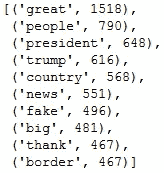

# 使用潜在狄利克雷分配(LDA)的主题建模教程

> 原文：<https://towardsdatascience.com/topic-modeling-with-latent-dirichlet-allocation-by-example-3b22cd10c835?source=collection_archive---------9----------------------->

## 这是一本实用指南，包含经过实践检验的 Python 代码。找到人们在推特上谈论的内容。

来源:杰夫·克拉克的在线推特话题浏览器生成的图片

对内容好奇？感觉迷失在无数的帖子、推文、评论、文章、页面、文档中？寻找人们写的东西？你并不孤单。

在本教程中，我提供了一个实用的指南，其中包含经过实践检验的 Python 代码，用于发现文本或文档集合中出现的抽象主题。

我们将对一组推文应用潜在狄利克雷分配(LDA ),并将它们分成主题。我们开始吧！

# 推特数据

我们将处理来自@realDonaldTrump 推特账户的推文。该数据集包含该账户自 2009 年 5 月 4 日以来的所有推文。

数据集来自 http://www.trumptwitterarchive.com/archive。下面是原始档案的摘录。

# 数据预处理

对文本进行预处理是很重要的，因为语言在各个层面都是模糊的:词汇、短语、语义。我们将推文全部小写，并删除了**的停用词**。它们是常用词，不会给推文增加重要意义。以下是自然语言工具包(NLTK)中的停用词示例。

鉴于推文的性质，我们要小心使用标点符号和术语，如 **RT** (用于转发推文)和 **VIA** (用于提及原作者)，它们不在默认的英语停用词表中。我们还想删除推文末尾的网址。

我们也**标记**我们的推文。记号化器的工作原理类似于正则表达式，用于将 tweets 分成单词列表。下面我们提供了预处理推文的完整代码。

# 一袋单词

当我们对文本分类感兴趣时，根据主题分类，我们通常不想看单词的顺序模式。相反，我们会将文本表示为一个单词包，就好像它是一组无序的单词，同时忽略它们在文本中的原始位置，只保留它们的频率。你可以在我们下面的文章中了解更多关于自然语言处理的知识。

 [## 自然语言处理中的文本表示

### 理解书面单词:温习 Word2vec、GloVe、TF-IDF、单词袋、N-grams、1-hot 编码…

towardsdatascience.com](/representing-text-in-natural-language-processing-1eead30e57d8) 

最常见的单词及其计数如下。

# 寻找主题的数量

**潜在狄利克雷分配(LDA)** 是从词袋计数到更低维度的主题空间的概率变换。推文被视为主题的分布。反过来，主题由词汇表中所有单词的分布来表示。但是我们不知道语料库中出现的主题数量以及属于每个主题的 tweets。使用 LDA，我们希望将 tweets 到主题的分配视为一个随机变量，它是根据手头的数据估计的。

来源:马克·格利克曼(哈佛大学 IACS 分校)

为 LDA 寻找合适数量的主题是一门艺术。**主题连贯**技术通常比困惑技术更受青睐。对于连贯性，我们通过测量高得分单词之间的语义相似度来量化主题的连贯性。这就引出了更人性化的话题。该技术选择每个主题中出现频率最高的单词。然后，它计算并汇总每个单词的所有成对得分(UMass ),以计算特定主题的一致性得分。

下面，我们将一系列用不同数量的主题训练的模型的每个主题的平均一致性分数可视化。平均分稳定的主题数量，是我们正在寻找的最佳点。因此，我们对主题数量的最佳猜测是 6 个左右。我们应该考虑到，通常情况下，包含非常短的文档(在我们的例子中是 tweets)的语料库比包含较长文档的语料库更难应用于连贯模型。

# 运行 LDA

现在，我们可以使用通过上述分析找到的最优值对文本运行 LDA。LDA 是一种生成方法，其中对于每个主题，模型模拟单词出现的概率以及主题在文档中的概率。每个主题的前 10 个单词如下所示。

虽然题目的合理性值得怀疑，但我们可以看到下面有意义的匹配。主题 0 涉及中国、朝鲜和美国领导人之间的会晤。话题 1 似乎与联邦调查局对俄罗斯干涉上届总统选举的调查有关。话题 4 好像是关于边境安全和修建边境墙的。

# 结论

我们展示了统计建模如何帮助发现人们在推特上谈论什么。本文提供的代码可以推广到许多其他任务，旨在发现文档集合中出现的抽象主题。

## 一些参考资料:

D.布莱，阿宁和乔丹。潜在狄利克雷分配。机器学习研究杂志，3:993–1022，2003 年 1 月。d .布雷和 j .拉弗蒂。主题模型。编辑，文本挖掘:理论与应用。泰勒和弗朗西斯，2009 年。
B .陈，x .陈，andW。邢。学习分析和知识会议的“Twitter 考古学”。《第五届学习分析和知识国际会议论文集》(第 340-349 页)。纽约州纽约市，2015 年。

感谢您的阅读。期待您的反馈或问题。