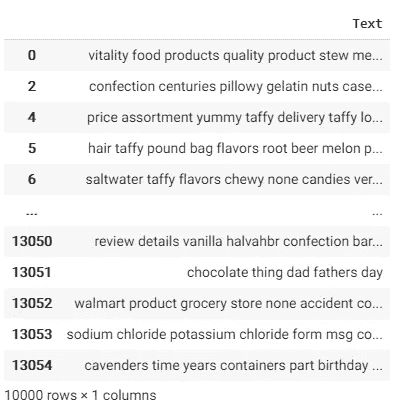

# 亚马逊评论的自然语言处理主题建模

> 原文：<https://towardsdatascience.com/topic-modeling-with-nlp-on-amazon-reviews-an-application-of-latent-dirichlet-allocation-lda-ae42a4c8b369?source=collection_archive---------8----------------------->

## Python 在潜在狄利克雷分配中的应用


来源: [Arfa Adam](https://www.shutterstock.com/g/arfa_adam) ，Via: [Shutterstock](https://www.shutterstock.com/image-photo/colorful-alphabet-arrangement-word-topics-1049976773)

主题建模是另一种流行的文本分析技术。主题建模的最终目标是在评论中找到主题，并发现隐藏的主题。语料库中的每个文档将由至少一个主题组成，如果不是多个主题的话。

在这一部分，我将介绍**潜在狄利克雷分配(LDA)** 的结果，这是众多主题建模技术之一。这是一种无监督的分类方法。当我们有一个大的文本，不知道从哪里开始，那么我们可以应用主题建模，可以看到什么样的群体正在出现。LDA 是专门为文本数据设计的。

要使用主题建模技术，您需要提供:

1.  文档术语矩阵
2.  您希望算法选取的主题数。

在主题建模中，我会创建不同的模型并进行比较。最终我会选择最有意义的话题模型。

# **如何使用潜在狄利克雷分配(LDA)？**

在这里，我不会涉及 LDA 的数学基础。我将只讨论如何解释 LDA 主题建模的结果。

*在 LDA 主题建模过程中，我们创建了许多不同的主题组。作为研究人员，我们是决定输出中组数的人。然而，我们不知道什么是最佳组数。因此，我们将获得不同数量的组。然后，我们检查和比较主题模型，并决定哪个主题模型更有意义，最有意义，在模型中有最清晰的区别。然后在所有的题目组中选出最有意义的组(模型)。*

必须注意的是，LDA 的性质是主观的。对于选择最有意义的话题组，不同的人可能会得出不同的结论。我们正在寻找最合理的主题组。来自不同背景、不同领域专业知识的人可能不会在大多数合理的主题组上达成一致。

LDA 是一种无监督聚类方法。当我们在谈论无监督聚类方法时，我们需要提到 K-Means 聚类。K-Means 聚类是最著名的无监督聚类方法之一。它在很多情况下都非常实用和有用，并且已经用于文本挖掘很多年了。与 K-means 聚类(其中每个单词只能属于一个聚类(硬聚类))相反，LDA 允许“模糊”成员资格(软聚类)。软集群允许集群之间重叠，而在硬集群中，集群是互斥的。这是什么意思？在 LDA 中，一个单词可以属于多个组，而这在 K-Means 聚类中是不可能的。在 LDA 中，这种权衡使得更容易找到单词之间的相似之处。然而，这种软聚类使得很难获得不同的组，因为相同的单词可能出现在不同的组中。在我们进一步的分析中，我们将会遇到这个缺点。

一旦应用了主题建模技术，研究人员作为人的工作就是解释结果，看看每个主题中的单词组合是否有意义。如果它们没有意义，我们可以尝试改变主题的数量、文档术语矩阵中的术语、模型参数，甚至尝试不同的模型。

# **数据准备**

**关于我使用的数据的简要信息:**本研究使用的数据是从 [Kaggle](https://www.kaggle.com/snap/amazon-fine-food-reviews) 下载的。是斯坦福网络分析项目上传的。原始数据来自 J. McAuley 和 J. Leskovec (2013)对“[从业余爱好者到行家:通过在线评论对用户专业知识的演变建模”的研究。这个数据集由来自亚马逊的美食评论组成。该数据包括了从 1999 年到 2012 年的所有 568，454 篇评论。评论包括产品和用户信息、评级和纯文本评论。](http://i.stanford.edu/~julian/pdfs/www13.pdf)

在这项研究中，我将关注亚马逊上的“好评”。我将“好评”定义为拥有 4 星或 5 星客户评价(满分 5 分)的评价。换句话说，如果一个亚马逊评论是 4 星或 5 星，在这项研究中它被称为“好评论”。1、2、3 星的评论被贴上‘差评’的标签。

数据准备是一个关键的部分，因为如果我们不能正确地准备数据，我们就不能进行主题建模。在这里，我不会深究细节，因为数据准备不是本次研究的重点。然而，准备花一些时间在这里，以防你有问题。如果您调整我在这里为您自己的数据集提供的代码，我希望您不会有任何问题。

**一个编辑和警告** : *如果你想复制这项工作，请在我的 Github 上的* [***Colab 笔记本***](https://colab.research.google.com/drive/1JUL32S3r1rShFY4BLK54w5GSwOKqJUe1?usp=sharing) *中跟随/仔细检查，因为这里有几个丢失的变量/定义会阻止这个过程。*

让我们从检查数据的列数和行数开始:

```
df.shape
```

(392384，19)-我的数据集有 392，384 条评论。

对于许多家用电脑来说，如此多的评论是很难处理的。因此，我将只使用 10，000 条评论。不幸的是，如果没有超级计算机，我们就无法使用所有的评论。

```
#Taking only first 10000 Good Reviews from the dataset.
df_good_reviews= df.loc[df.Good_reviews ==1][0:10000]
```

现在，数据准备的下一步是计数矢量器:

```
# Create document-term matrix
from sklearn.feature_extraction import text
from sklearn.feature_extraction.text import CountVectorizercv = CountVectorizer()
data_cv = cv.fit_transform(df_good_reviews.Text)
data_cv.shape
```


计数后数据的形状矢量器

提取数据以创建术语-文档矩阵

```
# Pickle it 
import pickle
pickle.dump(cv, open("cv_stop.pkl", "wb"))
data_stop.to_pickle("dtm_stop.pkl") #saving the pickled datadata = pd.read_pickle('dtm_stop.pkl')
data
```

酸洗数据后，我们获得了一个广泛的字典:


现在，是时候创建术语文档矩阵了。该术语-文档矩阵数据将用于生成主题建模。这就是为什么它对这项研究至关重要。

```
# One of the required inputs is a term-document matrix
tdm = data.transpose()
tdm.head() 
```


创建术语-文档矩阵后的数据

```
# We're going to put the term-document matrix into a new gensim format, from df --> sparse matrix --> gensim corpussparse_counts = scipy.sparse.csr_matrix(tdm)
corpus = matutils.Sparse2Corpus(sparse_counts)# Gensim also requires dictionary of the all terms and their respective location in the term-document matrixcv = pickle.load(open("cv_stop.pkl", "rb"))
id2word = dict((v, k) for k, v in cv.vocabulary_.items())
```

让我们开始创建主题模型吧！

# **使用 LDA 构建主题模型**

有许多方法可以创建主题模型。通过根据特定标准过滤文本，我们可以获得不同的主题组。在本研究中，我们将使用以下方法创建主题模型:

1.  所有文本数据
2.  仅文本中的名词
3.  只有名词和形容词

**主题建模—尝试 1(使用所有复习数据)**

作为开始，我们正在利用我们所有的评论。在此过程中不应用文本过滤。

```
lda = models.LdaModel(corpus=corpus, id2word=id2word, num_topics=2, passes=10)
lda.print_topics()
```

发现了两组话题:

[(0，' 0.020* "咖啡"+ 0.011* "喜欢"+ 0.010* "茶"+ 0.010* "味道"+ 0.009* "好"+ 0.009* "味道"+ 0.007* "一个"+ 0.007* "很棒"+ 0.006* "用"+ 0.006* "杯子"')，

(1，' 0.010* "很棒"+ 0.009* "喜欢"+ 0.009* "好"+ 0.007* "爱"+ 0.007* "美食"+ 0.007* "一个"+ 0.007* "产品"+ 0.005* "味道"+ 0.005* "得到"+ 0.005* "亚马逊" ')]

我将如何处理这个结果？此时，我们可以检查这两个主题组，并检查它们是否是不同的组。我们不期望一组中的所有单词都必须相关。我们在寻找话题组的总趋势。考虑到以上两个群体，很难在那里看到一个清晰的截然不同的群体。这是我的看法。如果你认为实际上有两个离散的群体，并且你能证明它是正当的，那么你是安全的。

记住，我说过 LDA 是一个软聚类模型。在这里，我们看到“like”这个词在两组中都出现了。这是正常的，因为在软聚类模型中，一个单词可以同时出现在不同的组中。

我们不需要强迫自己给上述模型赋予意义。我们可以继续前进。让我们创建更多的主题模型。

与 2 主题模型相似，我们将创建 3 个和 4 个小组。

```
# LDA for num_topics = 3
lda = models.LdaModel(corpus=corpus, id2word=id2word, num_topics=3, passes=10)
lda.print_topics()# LDA for num_topics = 4
lda = models.LdaModel(corpus=corpus, id2word=id2word, num_topics=4, passes=10)
lda.print_topics()
```

所有结果见表 1(下表)。此时，我们应该检查这些组，并尝试找到最有意义的组。通过查看表 1，可以说“用 2 个主题建模”最有意义。第一组是关于饮料，第二组是关于反应。随意得出和我不同的结论！目前，这将停留在这里，不会进一步，因为我们将创建 6 个以上的主题模型。得到所有结果后，我可以更仔细地检查输出。在产生进一步的主题模型后，我们将重新考虑表 1。


表 1:使用所有文本数据的主题建模

**主题建模—尝试 2(仅名词):**在此步骤中，通过使用 LDA 方法，仅名词将用于创建主题。同样，我们的目的是发现评论中隐藏的模式。现在，我们只是试图用不同的标准来探索。

与上一步类似，我们将使用 2、3 和 4 个主题组运行 LDA。

```
import nltk
from nltk.corpus import stopwords
nltk.download('punkt')
nltk.download('averaged_perceptron_tagger')
import string
from nltk import word_tokenize, pos_tag
```

让我们创建一个从一串文本中提取名词的函数:

```
from nltk import word_tokenize, pos_tagdef nouns(text):
    '''Given a string of text, tokenize the text and pull out only the nouns.'''
    is_noun = lambda pos: pos[:2] == 'NN'
    tokenized = word_tokenize(text)
    all_nouns = [word for (word, pos) in pos_tag(tokenized) if     is_noun(pos)]
    return ' '.join(all_nouns)#if this code doesn't work on you, it's probably indentaion mistake coming from Medium writing format.
```

让我们将这个定义的名词函数应用到我们的亚马逊评论文本数据:

```
data_nouns = pd.DataFrame(df_good_reviews.Text.apply(nouns))
data_nouns
```



仅使用名词创建新的文档术语矩阵:

```
from sklearn.feature_extraction import text
from sklearn.feature_extraction.text import CountVectorizer# Re-add the additional stop words since we are recreating the document-term matrixadd_stop_words = ['like', 'im', 'know', 'just', 'dont', 'thats', 'right', 'people','youre', 'got', 'gonna', 'time', 'think', 'yeah', 'said']stop_words = text.ENGLISH_STOP_WORDS.union(add_stop_words) # Recreate a document-term matrix with only nouns
cvn = CountVectorizer(stop_words=stop_words)
data_cvn = cvn.fit_transform(data_nouns.Text)data_dtmn = pd.DataFrame(data_cvn.toarray(), columns=cvn.get_feature_names())data_dtmn.index = data_nouns.index
data_dtmn
```

创建 gensim 语料库:

```
corpusn=matutils.Sparse2Corpus(scipy.sparse.csr_matrix(data_dtmn.transpose()))# Create the vocabulary dictionaryid2wordn = dict((v, k) for k, v in cvn.vocabulary_.items())
```

⚫:让我们从两个话题开始

```
ldan = models.LdaModel(corpus=corpusn, num_topics=2, id2word=id2wordn, passes=10)ldan.print_topics()
```

带 3 个主题的⚫ LDA

```
ldan = models.LdaModel(corpus=corpusn, num_topics=3, id2word=id2wordn, passes=10)ldan.print_topics()
```

⚫ LDA 有 4 个主题

```
ldan = models.LdaModel(corpus=corpusn, num_topics=4, id2word=id2wordn, passes=10)ldan.print_topics()
```

表 2 是仅使用名词的 LDA 主题建模尝试的输出。在这一点上，我们再次需要简要地检查主题，并试图找到一个具有不同主题组的模型。同样，仍然不需要花费太多时间，因为我们仍然会产生更多的主题模型。


表 2:仅使用名词的主题建模

对我来说，有三组的主题模型是有意义的。它有这些组:

1.  宠物物品
2.  饼干和小吃
3.  饮料

人和人能得出不同的结论是完全正常的。

**主题建模——尝试 3(名词和形容词):**在此步骤中，通过使用 LDA 方法，仅使用名词和形容词来创建主题。

让我们为此准备数据:

```
from nltk.corpus import stopwords
import nltk
nltk.download('punkt')
nltk.download('averaged_perceptron_tagger')
import string
from nltk import word_tokenize, pos_tag
```

让我们定义一个只给出名词或形容词的函数:

```
def nouns_adj(text):
    '''Given a string of text, tokenize the text and pull out only     the nouns and adjectives.''' is_noun_adj = lambda pos: pos[:2] == 'NN' or pos[:2] == 'JJ'
    tokenized = word_tokenize(text)
    nouns_adj = [word for (word, pos) in pos_tag(tokenized) if   is_noun_adj(pos)]
    return ' '.join(nouns_adj)#if this code doesn't work on you, it's probably indentaion mistake coming from Medium writing format.
```

让我们用名词/形容词过滤器检查亚马逊评论数据:

```
data_nouns_adj = pd.DataFrame(df_good_reviews.Text.apply(nouns_adj))
data_nouns_adj
```


我们可以看到，这里只有名词和形容词。现在，我们将要求 LDA 通过使用我们数据集的过滤版本来创建主题。

让我们为 LDA 准备数据:

```
# Create a new document-term matrix using only nouns and adjectives, also remove common words with max_df
cvna = CountVectorizer(max_df=.8) #, max_df is used for removing data values that appear too frequently, also known as "corpus-specific stop words".
# For example, max_df=.8 means "It ignores terms that appear in more than 80% of the documents". data_cvna = cvna.fit_transform(data_nouns_adj.Text)
data_dtmna = pd.DataFrame(data_cvna.toarray(), columns=cvna.get_feature_names())data_dtmna.index = data_nouns_adj.index
data_dtmna
```

创建 gensim 语料库:

```
corpusna=matutils.Sparse2Corpus(scipy.sparse.csr_matrix(data_dtmna.transpose()))# Create the vocabulary dictionary
id2wordna = dict((v, k) for k, v in cvna.vocabulary_.items())
```

我们现在可以管理 LDA 了。

⚫:让我们从两个话题开始

```
ldana = models.LdaModel(corpus=corpusna, num_topics=2, id2word=id2wordna, passes=10)
ldana.print_topics()
```

⚫:让我们试试 3 个话题

```
ldana = models.LdaModel(corpus=corpusna, num_topics=3, id2word=id2wordna, passes=10)
ldana.print_topics()
```

⚫:让我们试试 4 个话题

```
ldana = models.LdaModel(corpus=corpusna, num_topics=4, id2word=id2wordna, passes=10)
ldana.print_topics()
```

表 3 是仅使用名词或形容词的 LDA 主题建模尝试的输出。在这一点上，我们再次需要检查主题，并检查是否有任何主题组有意义。


表 3:仅使用名词和形容词的主题建模

# **评估结果**

现在，在最后阶段，必须一起评估表 1、表 2 和表 3。总之，我们创建了 9 个主题模型。在这一点上，我们需要问自己，哪一组更有意义？’。现在，是时候关注和检查主题了。哪些群体有意义？如果没有有意义的组，我们需要返回数据进行数据清洗，更改参数，或者使用不同的过滤器和模型。这是一个递归过程。

在 9 个主题模型中，只有名词，3 主题组对我来说最有意义(表 4)。我在这里看到了三个不同的类别:(1)宠物用品，(2)饼干和小吃，以及(3)饮料。*再一次，另一个人可以找到更有意义的不同主题模型是完全正常的。*


表 4:最有意义的话题-名词只有三个话题

请记住，这个数据集只包含食品评论。所以，看到这些群体与食物有关是很正常的。

所以，让我们把它拉下来，再进行一些迭代，得到更多微调的主题。3 主题(只有名词)对我来说是最有意义的模型。因此，我将通过将迭代次数从 10 次增加到 80 次来进一步微调这个主题模型。

```
# Fine-tuned LDA with topics = 3ldan = models.LdaModel(corpus=corpusn, num_topics=3, id2word=id2wordn, passes=80)ldan.print_topics()
```


表 5:带有微调参数的最终主题模型

在上表中，我们看到与表 4 相似的组，只是顺序不同。通过使用 LDA 方法考虑主题分析的所有步骤，可以得出结论，优秀的亚马逊评论可以分为三个主要主题:(1)饮料，(2)宠物用品，以及(3)饼干和小吃。

最后，我们需要记住，为了理解哪个主题组更有意义，我们可能需要领域专业知识。作为一名研究人员，我们有责任证明我们选择的课题组是正确的。只要能自圆其说，我们可以决定任何一个主题组作为最终的主题模型。

感谢您的阅读！开心分析！

> **特别感谢我的朋友*[***Bibor Szabo***](https://www.linkedin.com/in/bibor-szabo/)*在撰写本文时提供了宝贵的反馈和建议。*

**注:**关于本次学习的 Python 代码，可以查看我的 [***GitHub 文件夹***](https://colab.research.google.com/drive/1JUL32S3r1rShFY4BLK54w5GSwOKqJUe1?usp=sharing) 。本研究中使用的所有脚本都可以在 Github 文件夹中找到。此外，这个主题建模研究是更大项目的一部分。你可以查看我以前的帖子进行 [***数据清理***](/beginners-guide-for-data-cleaning-and-feature-extraction-in-nlp-756f311d8083) 和 [***情绪分析***](/sentiment-analysis-on-amazon-reviews-45cd169447ac)*如果你有兴趣看前面的步骤。*