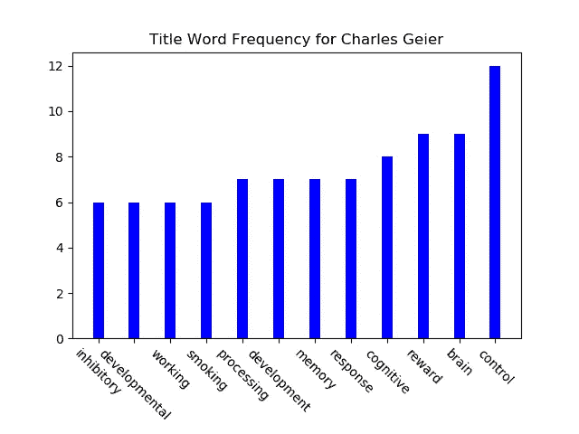
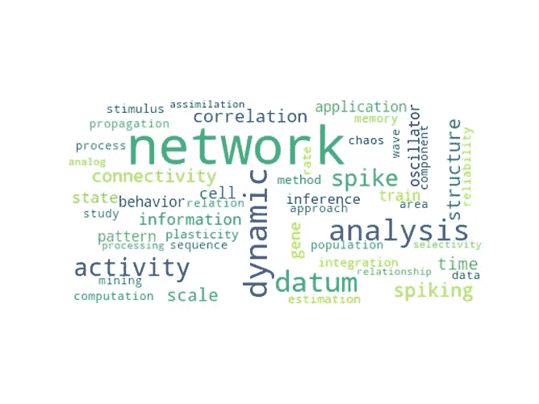
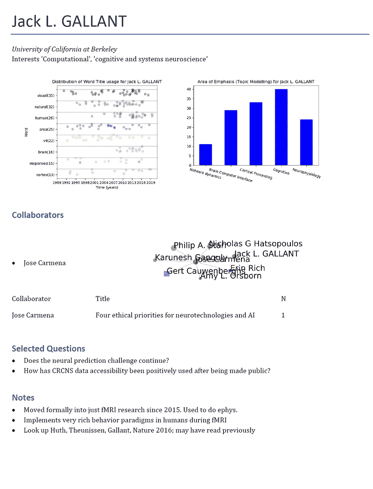

# 研究生院面试的主题建模

> 原文：<https://towardsdatascience.com/topic-modelling-for-graduate-school-interviews-e6331721c6e0?source=collection_archive---------30----------------------->

## 利用数据科学来了解你感兴趣的院系的研究领域。


**图一。**我感兴趣的教师中无人监督检测的子主题的代表词云。

*本文是正在进行的关于在研究生院面试过程中利用数据科学的系列文章的一部分。查看上一期* [*社交网络分析*](/preparing-for-graduate-school-interviews-with-network-analysis-84df6354659b) *，期待更多。*

欢迎回来。在第 1 部分中，我们探索了社交网络分析，同时初步探索了每位教授感兴趣的主题，我们还探讨了更深入分析的可能性，包括主题建模，以获得研究人员之间更深层次的联系(如果您还没有阅读第 1 部分，请立即阅读！).在本次会议中，我们将使用基本上相同的数据，因此，通过第 1 部分的运动，至少让数据争论可能是一个好主意。

由于我们一直在准备，我们已经建立了一个更强的认识，我们的兴趣和他们的职业生涯有多少是在合作中巩固的，并分享了对彼此的尊重。今天，我们将通过更深入地挖掘现有数据来进一步了解这一点，看看我们是否可以收集到任何额外的信息，甚至了解我们自己的研究兴趣。

与第 1 部分一样，我们将主要使用 Python，包括以下模块和一些新模块:

*   学术，通过谷歌学术收集数据。
*   熊猫和 Numpy，进行基础数据角力和操作。
*   Networkx 和 Matplotlib，用于绘图和数据表示。
*   Python-docx，用于自动化文档构造。
*   Sci-kit Learn (sklearn)，用于无监督机器学习。
*   spaCy，用于自然语言处理。

其中一些可能包含在 Python 的典型安装中，也可能不包含在其中，因此我建议您参考它们各自的网站/文档以获得专门的帮助。

**第 0 部分:增加我们之前的数据**

在第 1 部分第 3 节中，我们从每位教师的出版历史中提取数据，并制作了一个直方图，记录了他们感兴趣的主要主题的信息。



**图二。宾夕法尼亚州立大学 Charles Geier 博士的出版物标题词频直方图。**

然而，我们可以重新制作这个图像来捕捉更多的信息，特别是关于每个单词在一段时间内的用法分布。要做到这一点，我们必须重新审视我们的数据收集，这一次，提取关于他们的出版日期的额外信息。这方面的代码如下。

```
import pandas as pd
import matplotlib.pyplot as plt 
from stop_words import get_stop_wordsexcs = get_stop_words('en')
table = pd.read_csv("FoIScholarData.csv") 
def valuef(x):
        return worddict[x]
newcol = []
for i in range(len(table)): 
    search_query = scholarly.search_author(table.Name[i])
    author = next(search_query).fill()
    pubs = scholars[i].publications
    worddict = {}
    for pub in pubs:
        if not ('year' in pub.bib):
            continue
        j = pub.bib['title']
        words = j.lower().split(' ')
        for k in words:
            if k in worddict.keys():
                worddict[k] += [pub.bib['year']]
            else:
                worddict[k] = [pub.bib['year']]
    values = []
    topics = []
    for j in worddict:
        if len(worddict[j]) > 2:
            if not (j in excs):
                values += [len(worddict[j])]
                topics += [j]
    width = 0.3
    topics.sort(key=valuef)
    values.sort()
    newcol += [topics]            
    newcol2 += [values]
    newcol3 += [worddict]table['topics'] = newcoltable['topics'] = nnewcol
table['tcounts'] = nnewcol2
table['tyears'] = nnewcol3
*export_csv = table.to_csv (r'C:\Users\Masters-PC\Desktop\ProfNetworks\FoIScholarData.csv', index = None, header=True, encoding='utf-16') #Don't forget to add '.csv' at the end of the path
```

**第一部分:探索研究兴趣的时间演变。**

现在，我们的单词计数对字典不是只有一个列，而是有 3 个列来携带每个实例的信息，允许以时态栅格图的形式更动态地表示数据。这背后的想法是，即使在作者最常用的词中，在他们的职业生涯中也可能有直方图中没有捕捉到的转变。要为每个研究人员生成图像，代码如下:

```
import matplotlib.pyplot as plt
import numpy as np
import pandas as pd
from matplotlib.ticker import AutoMinorLocator
# Set the random seed for data generationnp.random.seed(2)
# Create rows of random data with 50 data points simulating rows of trainstable = pd.read_csv("FoIScholarData.csv", encoding = 'utf-16')
for i in range(0,len(table)):
    times = eval(table.tyears[i])
    words = eval(table.topics[i])
    values = eval(table.tcounts[i])
    neuralData = np.random.random([8, 50])
    # Set different colors for each word

    colorCodes = np.array([[0, 0, 0],

                            [1, 0, 0],

                            [0, 1, 0],

                            [0, 0, 1],

                            [1, 1, 0],

                            [1, 0, 1],

                            [0, 1, 1],

                            [1, 0, 1]])
    # Set spike colors for each word
    lineSize = [0.4, 0.3, 0.2, 0.8, 0.5, 0.6, 0.7, 0.9]                                  
    def addition(x,y):
        z = []
        if len(x) == len(y):
            for i in range(len(x)):
                z += [x[i]+y[i]]
            return z
        else:
            print('Wrong sizes')
            return 'Wrong Sizes'
    plt.figure()
    for j in range(max([-8,-len(words)]),0):
        plt.plot(addition(times[words[j]], 0.5*np.random.random(len(times[words[j]]))), 
                 addition([j]*len(times[words[j]]),0.5*np.random.random(len(times[words[j]]))), 
                 color = colorCodes[abs(j+1)], marker = 'o', linestyle='', alpha=0.3)
    #plot.eventplot(neuralData, color=colorCodes, linelengths = lineSize)     

    # Provide the title for the spike raster plot
    wordsgraphed = []
    for j in range(max([-8,-len(words)]),0):
        wordsgraphed += [words[j]+'('+str(values[j])+')']
        #wordsgraphed += ['']
    plt.title('Distribution of Word Title usage for ' + table.Name[i])
    plt.xlabel('Time (years)')
    plt.ylabel('Word')
    plt.yticks(np.arange(max([-8,-len(words)]), 0), wordsgraphed, rotation = 0)
    tup = plt.xlim()
    plt.xlim([np.floor(tup[0]),np.ceil(tup[1])])
    plt.xticks(np.arange(np.floor(tup[0]),np.ceil(tup[1])+1,3))
    plt.gcf().subplots_adjust(left=0.28)
    minor_locator = AutoMinorLocator(2)
    plt.gca().yaxis.set_minor_locator(minor_locator)
    plt.grid(which='minor',axis='y')
    # Display the spike raster plot
    plt.show()
    plt.savefig(str(table.Name[i]) + "_WF2.png") # save as png
    plt.close() # display
```

结果应该如下所示:


**图三。**宾夕法尼亚州立大学 Charles Geier 博士的出版物标题的 Word 时态栅格。

我已经将包含的字数减少到 8 个，但是你可以随意修改，但是我想强调你可以从这个情节中获得的新信息。因此，举例来说，如果我们看看*吸烟*，似乎盖尔博士对该领域的兴趣相对较新，所有的出版物都是从 2014 年开始的，这似乎也与对刺激的直接*处理*的兴趣下降相吻合。这都是探索性的，例如我们可以在*开发*中看到，干旱期是常见的，并不一定是完全放弃的信号，但允许我们梳理和询问关于教师对其研究项目的计划的更深层次的问题。

**第 2 节:构建出版物标题的主题模型。**

对于主事件，我们将进入使用非负矩阵分解(NMF)的无监督主题建模。按照惯例，我们认为主题是描述特定工作的离散单词或短语，因此，例如，我们可能认为新闻中可能出现的主题是*犯罪*和*商业*。然而，当我们做主题建模时，输出更准确地被认为是单词集合，立体地典型地出现在属于该主题的文章中。然后，从那些词中，我们可以推断出它可能所指的一个话题集；假设我们从两个主题模型中获得了以下输出:

```
0: murder victim arrested search
1: revenue investment returns innovation 
```

我们现在有两个主题 0 和 1 以及对该主题最重要的单词。有了这些词汇，我们或许可以将第一个主题分配给`crime`，而第二个主题可能是`business`。最后的决定很大程度上是任意的。所以，让我们开始吧。

**第 2a 节。用于主题建模的数据重新格式化**

首先，sci-kit learn 和 spaCy 的结构非常适合处理文本文件，因此我们将通过为每个作者及其出版物创建一系列新的目录结构，将我们的数据重新整理成这种格式。

```
import pandas as pd
import oscur = os.getcwd()
table = pd.read_csv("FoIScholarData.csv", encoding='utf-16')outdir = cur + '\\Publications\\TitleOnly'
if not os.path.exists(outdir):
    os.mkdir(outdir)for i in range(len(table)):
    if not os.path.exists(outdir):
        os.mkdir(outdir+'/'+table.Name[i])
    os.chdir(outdir+'/'+table.Name[i])
    pubs = eval(table.publications[i])
    for j in range(len(pubs)):
        file1 = open(str(j)+".txt","a", encoding='utf-16') 
        file1.write(pubs[j])
        file1.close()
```

请注意这一步，因为我们可能会重新访问它，使这些文本文件也包含摘要，因为这可能会更强大。我们将不得不重新审视我们的数据收集流程并收集额外的数据，因此我们目前不会这样做，但在后续工作中可能会这样做。最后，我们使用 spaCy 构建要分析的数据框架，将适当的数据加载到其中。

```
from sklearn.datasets import load_files
import pandas as pd
import spacy
import os 
os.chdir('C:/Users/Masters-PC/Desktop/ProfNetworks')
nlp = spacy.load("en_core_web_sm", disable=['parser', 'ner'])random_state = 0DATA_DIR = "C:/Users/Masters-PC/Desktop/ProfNetworks/Publications/TitleOnly"
data = load_files(DATA_DIR, encoding="utf-8", decode_error="replace", random_state=random_state)
df = pd.DataFrame(list(zip(data['data'], data['target'])), columns=['text', 'label'])def only_nouns(texts):
    output = []
    for doc in nlp.pipe(texts):
        noun_text = " ".join(token.lemma_ for token in doc if token.pos_ == 'NOUN')
        output.append(noun_text)
    return outputdf['text'] = only_nouns(df['text'])df.head()
```

**第 2b 节。模型构建**

因此，我们做的第一件事是利用带有`TfidfVectorizer`的词频分解从我们的文本文件中提取感兴趣的特征，然后用`NMF`进行实际的主题建模。我们将任意选择 5 作为要生成的主题的数量。像 coherence 这样的特定指标可以帮助您确定特定数据集的正确主题数量，但是讨论它们的使用可能超出了本文的范围。

```
# number of topics to extract
n_topics = 5from sklearn.feature_extraction.text import CountVectorizer, TfidfVectorizer
vec = TfidfVectorizer(max_features=5000, stop_words="english", max_df=0.95, min_df=2)
features = vec.fit_transform(df.text)from sklearn.decomposition import NMF
cls = NMF(n_components=n_topics, random_state=random_state)
cls.fit(features)
```

有了这些，我们将打印出一些最重要的术语，看看它们可能是关于什么的。

```
# list of unique words found by the vectorizer
feature_names = vec.get_feature_names()# number of most influencing words to display per topic
n_top_words = 5for i, topic_vec in enumerate(cls.components_):
    print(i, end=' ')
    for fid in topic_vec.argsort()[-1:-n_top_words-1:-1]:
        print(feature_names[fid], end=' ')
    print()
```

对于我感兴趣的部分，输出如下所示:

```
0 network dynamic analysis datum activity 
1 brain interface stimulation machine control 
2 cortex representation memory motor learning 
3 model response theory mouse imitation 
4 neuron response property behavior spiking
```

另一个，也许是更具知识性的可视化数据的方法是制作每个数据的[文字云](https://pypi.org/project/wordcloud/)。

```
from wordcloud import WordCloud
import math as m
import random
import matplotlib.pyplot as plt
import copy
from matplotlib.pyplot import figurefor j in range(n_topics):

    lst = []
    comps = copy.deepcopy(cls.components_[j])
    comps.sort()
    comps = list(comps)
    bomps = copy.deepcopy(cls.components_[j])
    bomps = bomps*2000/max(bomps)
    for k in range(len(feature_names)):
        if len(comps)-comps.index(cls.components_[j][k]) < 50:
            lst += [feature_names[k]]*m.ceil(bomps[k])
    random.shuffle(lst)
    text = str(lst)
    text = text.replace("'", '')
    text = text.replace(",", '')
    text = text[1:-1]
    figure(num=None, figsize=(16*4, 12*4), dpi=400, facecolor='w', edgecolor='k')
    wordcloud = WordCloud(max_font_size=50, max_words=100, background_color="white",collocations=False).generate(text)
    plt.imshow(wordcloud, interpolation='bilinear')
    plt.axis("off")
    plt.show()
    plt.title('WordCloud for hypothetical topic #' + str(j))
    plt.savefig('Topic#' +str(j)+ "_WC.png") # save as png
    plt.close() # display
```

这将产生图像，如我们的特色图像和以下 3 个主题:



**图 4。**我感兴趣的院系中对应于主题 0、1 和 4 的无监督检测到的子主题的代表性词云。副主题 2 可以在文章的专题图片中看到。

从这里开始，我决定使用以下主题标签:

```
1\. Network Dynamics
2\. Brain Machine Interfaces
3\. Cortical Representation
4\. Cognition
5\. Neurophysiology
```

**第 2c 节。为主题分配插入作者出版历史。**

现在，有了这些标签，我们实际上可以回过头来插入每个作者的出版历史，看看他们的出版物通常会分类成什么主题。就代码而言，这实际上非常简单。

```
newcol = []
for i in range(len(table)):
    newcol += [cls.transform(vec.transform(eval(table.publications[i]))).argsort(axis=1)[:,-1]]

table['pubcats'] = newcol
export_csv = table.to_csv (r'C:\Users\Masters-PC\Desktop\ProfNetworks\FoIScholarData.csv', index = None, header=True, encoding = 'utf-16') table = pd.read_csv("FoIScholarData.csv", encoding = 'utf-16') 
for i in range(len(table)):
    topics = ['Network dynamics', 'Brain-Computer Interface', 'Cortical Processing', 'Cognition', 'Spike-train Analysis']
    pubcats = eval(table.pubcats[i].replace('\n', '').replace(' ', ','))
    values = [pubcats.count(j) for j in range(5)]
    width = 0.5
    plt.bar(topics, values, width, color='b')
    plt.xticks(rotation = -15)
    plt.gcf().subplots_adjust(bottom=0.22)
    plt.title('Area of Emphasis (Topic Modelling) for ' + str(table.Name[i]))
    plt.savefig(str(table.Name[i]) + "_TM.png") # save as png
```

这将为您提供一个新列，包含每个出版物的每个类别，以及一个如下所示的输出图:


图 5。华盛顿大学艾德丽安& # 183；费尔豪尔出版史的主题建模。

这将非常多变的工作，所以请不要弄脏你的手，并考虑修改你的模型的效用。例如，在我的例子中，我降低了一个出版物被归类为*皮层处理*的概率，通过将它的组成部分乘以因子 8，这对我来说似乎相当有效。

**第 3 部分:更新合作者图表以反映感兴趣的主题。**

在我们可以传递给 NetworkX 图形绘制函数的变量中，有一个选项可以改变每个节点的形状，以反映它的一个属性。在我们之前为图形绘制编写的任何循环中，我们可以添加以下用粗体书写的代码。

```
**shapes = ['s','o', 'd', 'p', 'h']**
for i in range(len(G.nodes())):
 **               pubcats = eval(table.pubcats[list(table.Name).index(list(G.nodes())[i])].replace('\n', '').replace(' ', ','))
                counts = []
                for j in range(5):
                    counts += [pubcats.count(j)]
                shape = shapes[counts.index(max(counts))]**
                nx.draw_networkx_nodes(G, pos, nodelist=[list(G.nodes())[i]],**node_shape=shape**,node_size=table.hindex[list(table.Name).index(list(G.nodes())[i])]*19,node_color=viridis(list(domains).index(table.Domain[list(table.Name).index(list(G.nodes())[i])])), **options)
```

我们定义的*形状*列表将节点分别做成正方形、圆形、菱形、五边形和六边形。 *pubcats* 变量只是解释我们在数据上生成的 *pubcats* 列，而 *counts* 和 *shape* 变量只是确定最终选择教员节点形状时最常见的发布主题类别。这可以针对每个教职员工子图和我们的整体循环可视化进行，结果应该类似于下图。


**第 4 部分:更新您的个性化报告以纳入变更。**

在第 1 部分中，我们制作了一份关于我们教授的数据的简明摘要，开始编辑笔记，并对文献进行更直接的搜索，以选择采访过程中作为我们审查的一部分。有了这些新图像，我们可以更新代码来反映这些新信息。只需替换第 1 部分第 5 节中的代码:

```
document.add_picture(table.Name[qt]+"_WF.png", width=Inches(5))
```

通过这段简短的代码:

```
newp = document.add_paragraph('')
        nrun = newp.add_run()
        #p.add_run('\n'+'Topics ' + str(table.topics[qt])[1:-1])
        if os.path.exists(table.Name[qt]+"_WF2.png"):
            nrun.add_picture(table.Name[qt]+"_WF2.png", width=Inches(3.4))
        else:
            nrun.add_picture(table.Name[qt]+"_WF.png", width=Inches(3.4))
        nrun.add_picture(table.Name[qt]+"_TM.png", width=Inches(3.4))
```

记住还要用第 3 部分中描述的代码修改教员子图的生成，结果应该如下所示:



图 6。UCSF 的 Loren Frank 博士和加州大学伯克利分校的 Jack Gallant 博士的输出文档示例。

这些修改确实使表格内容更加丰富，并且有助于做笔记和选择问题。就我个人而言，我已经能够简明扼要地总结一个院系兴趣随时间的变化，他们特定的认同领域，以及他们合作的跨学科动态。

**第 5 部分:创建摘要页面**

我们在前面部分没有讨论的东西实际上是总结了我们所有机构的信息。我还没有以编程方式开发出一个 python-docx 代码来输出我满意的文档，但是我可以分享一个我手动创建的文档来分享我的想法，也许你们可以想出自己的想法。


图 7。手动构建的摘要页面，包含分析过程概述的主要输出。注意:这些数据是虚构的，并没有准确反映我的老师或感兴趣的学校。

本文的目的是简明扼要地总结您理解其余图表所需的大部分信息，并提供您感兴趣的机构的高水平概述。随着面试季的全面展开，我祝你好运！