# 类别树中的主题建模

> 原文：<https://towardsdatascience.com/topic-modelling-into-a-category-tree-acafad0f0050?source=collection_archive---------21----------------------->

## LDA 和 NMF 的数字组合与 W2V 级联，将 1M+多语言记录分类到 275 节点、5 级深度类别树中。

*—这个解决方案*在全印***AI Hackathon****中排名一万+ *第四，自动化多标签分类，在 Techgig 的 Code Gladiators 2020 中。**

> *个人备注:*
> 
> 当我得知以 1 分之差获得黑客马拉松前 3 名时，我的心情很复杂。虽然在决赛队伍中排名第四有点令人放心，尽管我独自参加，但一个充满激情的团队伙伴的空缺相当令人不安。

**黑客马拉松的挑战是用元信息对 100 多万篇多语言文章进行高精度的分类。**元信息表示隐藏在 URL 文本序列中的类别树信息以及每篇文章的标题。您可以浏览一下下面的输入数据集。

**上述文章将根据文章主题分类到一个类别层次中。**例如,“莫迪访华”被归类为“Politics^International ”,而“科罗纳票数创历史新高”被归类为“Health^Pandemic".”

由于上述数据集非常庞大，人工标注文章需要付出巨大的努力。我们的目标是尽可能减少手工劳动。因此，我们的目标是**在上述数据集上进行主题建模。**

# **主题建模 vs 分类**

*   **主题建模**是一种**‘无监督’**ML 技术，用于将文档分类为不同的主题 **s.**
*   **主题分类**是一种**‘监督’**ML 技术，它消耗人工标记的数据，以在以后做出预测。

因此，很明显，我们需要做主题建模，因为输入的文章没有事先标记。**但是主题建模不能保证准确的结果，尽管它很快**，因为不需要培训。

**因此，我们需要替代分类方法，并将它们安排为级联回退，同时改进主题建模结果。**

## **解决方案的完整源代码**可以在**找到** [**这里**](https://github.com/AdroitAnandAI/Topic-Modelling-LDA-NMF-W2V) **。**

# **级联回退管道**

1.  **主要方法:使用描述的类别树分类器**

**关联节点类别中出现的单词的单词向量&文章描述，使用 Google Word2Vec 模型计算。**这个模型是在 Google News 数据集上进行预训练的，这个数据集类似于我们需要分类的输入数据。

2.**回退 1:基于 URL 的类别树分类器**

**文件夹的顺序，从左到右体现了与文章相关的类别层次结构。**例如，以下网址应归类为“新闻/政治/BJP 政治”。如果“方法 1”的**置信度值**低于阈值，则触发回退 1。

[https://www . navjivanindia . com/news/BJP-leader-kau shal-Kishore-attacks-up-police-over-law-and-order-in-up](https://www.navjivanindia.com/news/bjp-leader-kaushal-kishore-attacks-up-police-over-law-and-order-in-up)

3.**回退 2: LDA-NMF 组合模型**

**潜在狄利克雷分配(LDA)** 是主题建模的经典解决方案。但在实践中，它给出了很大比例的错误分类。因此，**非负矩阵分解(NMF)** 也被使用，并在数值上与 LDA 结合，与多类二进制化器一起改进结果。

4.**回退 3:使用描述的类别树分类器**

如果上述所有方法都失败了，那么你可以将文章标记为**“未分类”**，或者将“主要方法”的输出作为最后的退路。

你也可以看看这个博客底部的**“改进”**标题，了解替代 fallback 4 的进一步的 Fallback 策略。

# **解决方案架构**

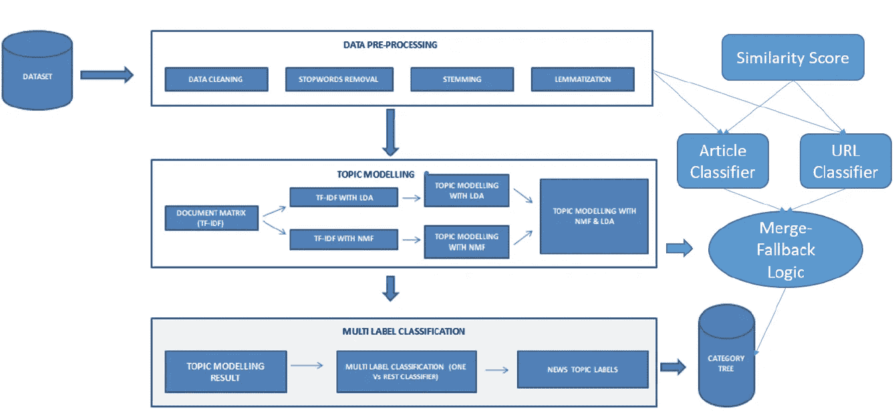

文章、URL 和 LDA-NMF 分类器被合并

在解决方案实现之前，让我们构建输入类别树。

# 构建类别树

下面以 csv 文件的形式给出了对文档进行分类的类别树。

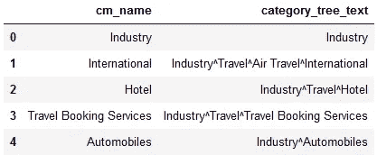

父子节点由^分隔

我们可以使用任何 python 数据结构来表示类别树。 **AnyTree 包用于创建、操纵&遍历类别树输入。**

上面的代码从输入的 cat_tree.csv 文件生成了树结构。

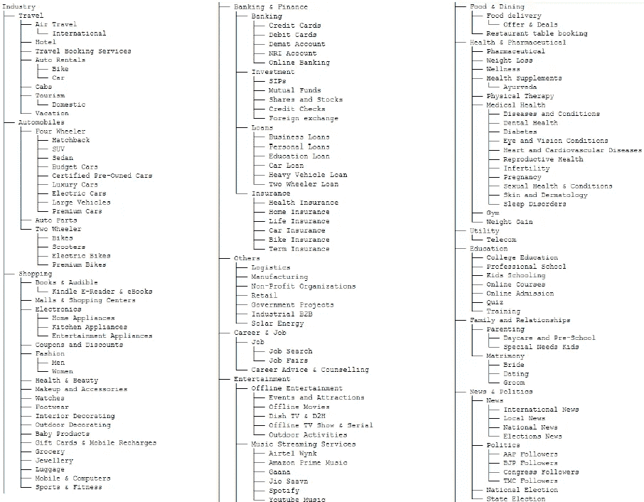

**类别树**

类别树结构可以使用 graphviz 可视化**。**

**类别树描述**

非英语文章可以很容易地翻译成“英语”使用谷歌 API。为了节省时间，请识别非英语行，并只将它们提供给下面的函数。

# 正在加载 Google Word2Vec 模型

谷歌的预训练模型包括 300 万个单词和短语的词汇向量，他们从谷歌新闻数据集中训练了大约 1000 亿个单词。向量长度为 300 个特征，训练数据集类似于我们的输入数据集。

# **主逻辑:类别树 Classn 使用描述**

首先，我们将“长描述”中的单词与节点相关联以找到类别。

实现了一种深度算法，即**搜索与文章描述中每个词相关的类别树节点的 GoogleNews 向量。多词分类得到智能处理**不会提高相似度分数。该功能是解决方案的核心。

**对类别树进行广度优先相关遍历**以找出基于 Word2Vec 相似度的最佳类别树分配。

上面的代码足够复杂，可以通过分析文章中的每个单词(与节点类别中的单词相关联)来生成丰富的类别树。

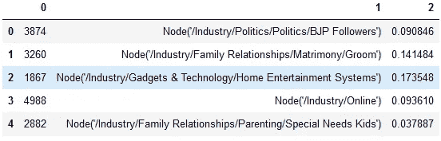

**为了组合不同算法的结果，我们需要计算每篇文章的分类置信度。**因此，将(id、树、置信度)信息保存到 CSV 文件中。

使用基于列表中数值分布的数学公式计算**置信度得分。该公式计算最高相似性值和第二高相似性值之间的差异，因为当前 2 个值接近时，它表示不明确。**

## 调整类别树

具有不同含义的词的多词类别被组合成相似含义的词，使得词向量距离度量不会出错。例如，在单词向量中，“教育”与“金融”相似，因此被重命名为意思相似的单词“学校教育”。

# 后备 1:基于 URL 的类别树分类器

没有单一的信息可能足以对一篇文章进行适当的分类。首先，我们使用 URL 链接中嵌入的树信息来查找类别。

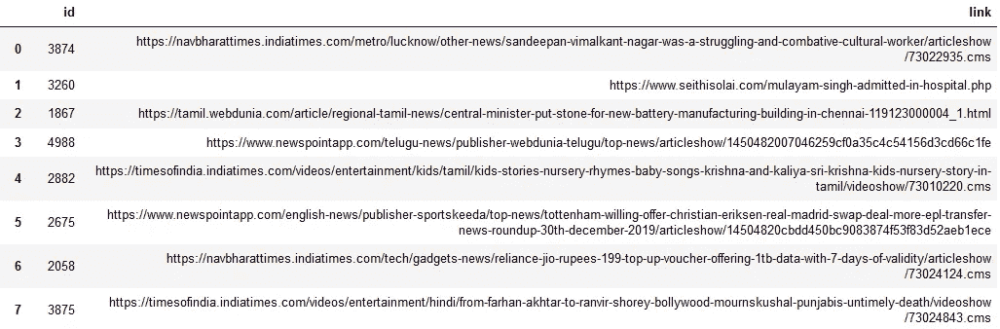

文章 ID 和相应的 URL

上面的代码将生成一个对应于每篇文章的 cat-tree 和置信度得分。请注意，当链接中没有足够的信息时，置信度为 0。

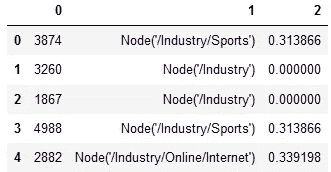

# **回退 2: LDA-NMF 组合模型**

**LDA** 是一个**概率生成**过程，而 **NMF** 是一个**线性代数方法**将文档分类到不同的主题。

任何文档都被认为有与之相关联的潜在混合主题。类似地，主题被认为是可能产生的术语的混合。因此，我们需要计算两组概率分布参数。

1.  给定一个文档 d 的主题 z 的概率: **P (z | d)**

2.给定题目 z 的条件 t 的概率: **P ( t | z)**

由此，**的概率*文档 d 的*** *生成* ***的术语 t，***

P (t | d) =所有主题的前两个概率的乘积之和。

如果有 10 个主题，那么参数数量= 500 个文档 x 10 个主题+ 10 个主题 x 1000 个单词= **15K 个参数。**(优于 500 *1000)

**这种矩阵分解的概念叫做潜在狄利克雷分配。**

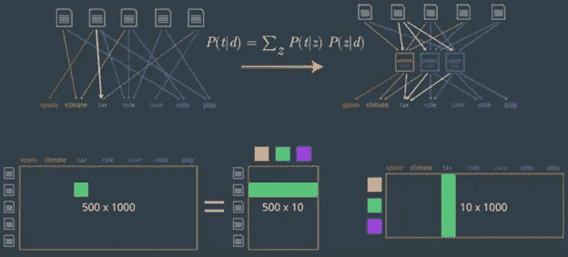

*BoW 模型(左)到 LDA 模型(右)*

LDA 首先为每篇文章挑选一些主题，并为每个主题挑选一些词，这两者都用**多项式分布表示。**

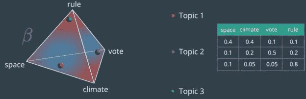

贝塔分布:红色部分大概率，蓝色部分小概率。

LDA 模型有一个巨大的优势，它也给了我们一堆话题。该算法只会抛出一些主题，我们可能需要手动对它们进行更有意义的分组。

然而，由于无人监管，无论是 LDA 还是 NMF 都无法单独获得好的结果。**因此，实施了 LDA 和 NMF 输出矩阵归一化后的数值组合**，以计算出最大可能主题。

进行预处理后，在**“文章描述”上应用**计数矢量器和 TF-IDF-矢量器**计算文档-术语矩阵(DTM)分别馈入 LDA 和 NMF。**

LDA 计算

根据每个聚类中的前 20 个单词手动标记主题，如下所示。

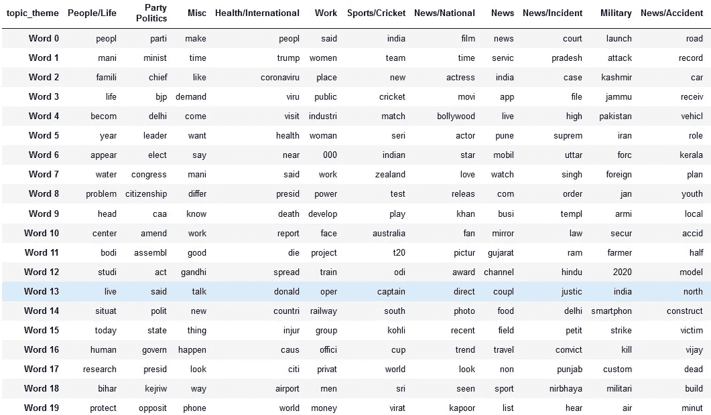

LDA 的输出是大小为文章数*主题数的矩阵。每个单元格包含一篇文章属于一个主题的概率。

**我们还可以使用 NMF 将 DTM** 分解成两个矩阵，如下图，这在概念上与 LDA 模型**类似，只是这里我们使用线性代数而不是概率模型。**

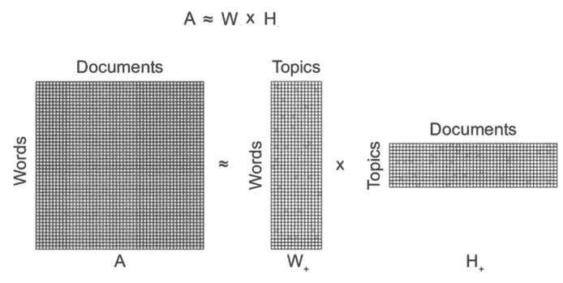

[来源](https://www.researchgate.net/figure/Conceptual-illustration-of-non-negative-matrix-factorization-NMF-decomposition-of-a_fig1_312157184)

**NMF 的输出也是一个大小为文章数*主题数的矩阵，解释保持不变。因此，我们可以在 y 轴上组合 LDA 和 NMF 的输出矩阵，以得到一百万* 40 列。**(输入= 1M 行。话题 LDA 和 NMF 各 20 个)

取每一行的 argmax()，找出 LDA 和 NMF 最可能的预测

**注意**:记得在矩阵串联之前做归一化。

**组合模型产生更好的分类结果**如下。

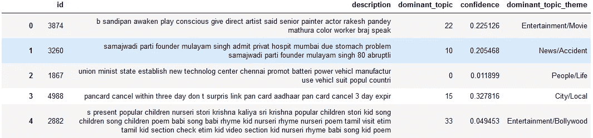

错误分类的置信度得分较低

唯一的缺点是这会导致第一级分类，而不是树形层次结构。所以是这个原因，我决定把它作为第二个退路。

**理想情况下，应使用分级 LDA，并将其作为解决方案管道中文章分类器之后的第一个备用分类器。**文章分类器仍然应该是主要逻辑，因为 Hierarchical-LDA 产生随机类别的词簇，这些词簇可能与我们想要的类别树不同。

# 合并描述、URL 和 LDA-NMF 分类器

文章描述分类器和 URL 分类器通过 LDA-NMF 组合模型合并成一个流水线，作为基于相应置信度得分的级联回退。

**描述分类器被赋予了很大的权重，因为 LDA-NMF 只给出了类别(而不是类别树),而 URL 通常不包含所需的信息。**如果 3 种方法都失败，则将其标记为“未分类”或使用文章分类器的结果，尽管不明确。

*免责声明:由于上述解决方案是在 24 小时黑客马拉松中编写的，代码可能并不完美。它可以通过使用下面提到的方法进行改进，并且还需要对代码中的超参数进行更多的调整。*

# **改进**

1.  [**h-LDA**](https://github.com/joewandy/hlda)**:Hierarchical-LDA**按照主题的层次结构对文档进行分组，并与 LDA-NMF 输出相结合[1]。

**2。知识图:**文章文本的知识图会生成单词的层次关系，类似于类别树。此信息可用于将文章映射到类别树。

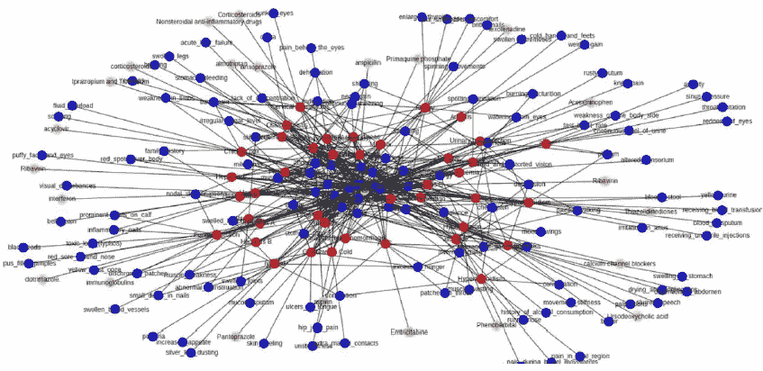

3. **Guided LDA:** 我们也可以使用 [Guided LDA](https://www.freecodecamp.org/news/how-we-changed-unsupervised-lda-to-semi-supervised-guidedlda-e36a95f3a164/) 为歧义类别设置一些种子词，当没有足够的文档来区分时。**种子词将引导模型围绕这些类别收敛。**

## 解决方案的**完整源代码**可以在[这里](https://github.com/AdroitAnandAI/Topic-Modelling-LDA-NMF-W2V)找到。

如果您有任何疑问或建议，您可以在此 处**联系我**

# ****参考文献****

** [## 用 hLDA 推断标签层次结构

### 问题:组织广场支持中心文章

medium.com](https://medium.com/square-corner-blog/inferring-label-hierarchies-with-hlda-2093d0413337)  [## 主题建模与 LDA 和 Quora 问题

### 潜在狄利克雷分配，非负矩阵分解

towardsdatascience.com](/topic-modeling-quora-questions-with-lda-nmf-aff8dce5e1dd)  [## joewandy/hlda

### 层次潜在狄利克雷分配(hLDA)解决了从数据中学习主题层次的问题。的…

github.com](https://github.com/joewandy/hlda)  [## 自然语言处理在线课程

### 新的！纳米学位课程必备知识该课程要求具备 Python，统计学，机器…

www.udacity.com](https://www.udacity.com/course/natural-language-processing-nanodegree--nd892)**