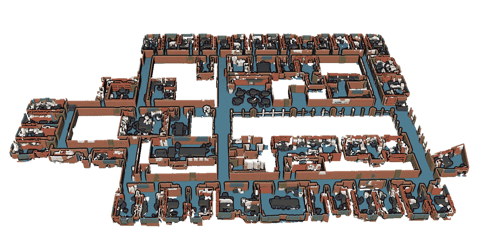
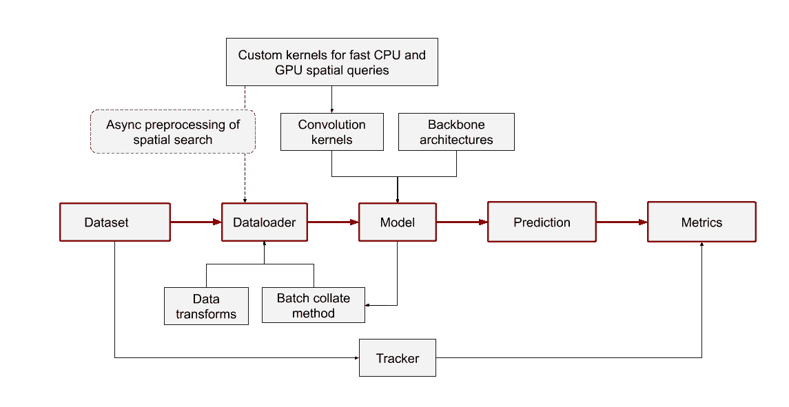
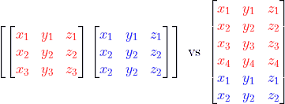
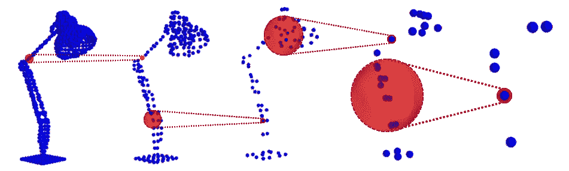
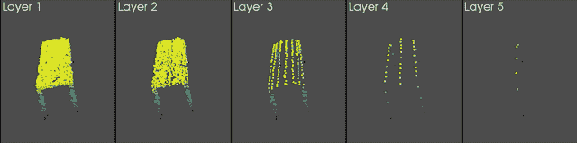
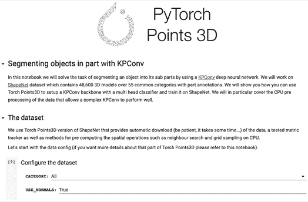

# torch points 3d——点云深度学习的统一框架

> 原文：<https://towardsdatascience.com/torch-points3d-a-unifying-framework-for-deep-learning-on-point-clouds-94115c0be4fb?source=collection_archive---------23----------------------->

## 点云深度学习变得简单

*这是与*[*Thomas Chaton*](https://medium.com/u/cc14203bd1eb?source=post_page-----94115c0be4fb--------------------------------)*和*[*Loic Landrieu*](http://loiclandrieu.com)*的联合出版物。*

github:[https://github.com/nicolas-chaulet/torch-points3d](https://github.com/nicolas-chaulet/torch-points3d)

随着越来越便宜的激光雷达传感器和更高效的摄影测量算法的出现，3D 点云数据比以往任何时候都更容易获取。深度学习社区已经接受了这一趋势，开发了新的网络架构来对 3D 数据执行各种任务。大量的可能性(数据布局、数据扩充、卷积策略等)使得找到最适合您的数据或问题的方法非常耗时。



使用 KPConv 获得的语义分段输出

我们的框架 Torch Points3D 被开发成点云数据的**[**Torch vision**](https://pytorch.org/docs/stable/torchvision/index.html)**:**一个灵活且可扩展的框架，适用于研究基于点云的机器视觉的研究人员和工程师。想知道 [KPConv](https://github.com/HuguesTHOMAS/KPConv-PyTorch) 在点云注册方面表现如何吗？或者 [PointNet++](https://github.com/charlesq34/pointnet2) 用随机采样代替 [RandLa-Net](https://github.com/QingyongHu/RandLA-Net) 中建议的最远点采样进行物体检测？有了 Torch Points3D，您现在只需几行代码就可以尝试多种最先进的主干模型。**

**在快速回顾了点云的特性后，我们将介绍 Torch Points3D 的以下方面:**

1.  **点云数据的优化数据布局**
2.  **许多学术数据集的本地集成**
3.  **快速和稳健的数据处理和数据扩充**
4.  **针对一系列稀疏和基于点的架构测试了卷积核**
5.  **用于访问数据集、数据转换和预配置模型的易于使用的 API**

**我们提供具有有用功能的训练脚本，例如模型检查点、登录 [Tensorboard](https://www.tensorflow.org/tensorboard) 和[重量和偏差](https://www.wandb.com/)，使用脸书 [Hydra](https://hydra.cc/) 轻松配置超参数，等等。您也可以将我们的核心组件用于您最喜欢的训练框架，例如 [PyTorchLightning](https://github.com/PyTorchLightning/pytorch-lightning) 。**

**我们希望你喜欢阅读！我们欢迎您的反馈和贡献。**

****

**火炬点 3D 系统图，数据流以红色突出显示**

# **点云为什么这么特别？**

**围绕 3D 稀疏点云的挑战在研究文献中有广泛描述，我们将仅提及 3D 点云和 2D 图像之间的一些关键差异:**

*   **每个点云可以有不同数量的点，即使它们具有相同的空间分辨率。这使得点云比图像更难构成均匀的批次。**
*   **激光雷达传感器捕捉三维世界中的表面，因此数据本质上是稀疏的。另一方面，照相机产生密集的采集。**
*   **在同一个点云中，点的密度各不相同，因此一些点可能有许多近邻来获得精确的几何信息，而其他点可能是孤立的。**
*   **点云在它们的点的索引的重新索引下是不变的，而像素的索引固有地链接到它们的坐标。这意味着用于处理点云的处理技术也必须是排列不变的。**

# **点云数据和数据布局**

**有两种方法可以组装不同的批次。第一种是通过子采样和过采样使批中的所有元素大小相同，并在新的批维度中整理它们(就像整理图像一样)。我们将这种方法称为密集批处理。或者，您可以直接比较点维度中的样本，并跟踪每个样本中的点数。我们将这种方法称为打包批处理。**

**官方实现 PointNet++和 Relation-Shape CNN 以及类似的架构都使用密集批处理。除了实现简单之外，它的主要好处是可以利用与经典 2D 卷积相关的硬件优化。缺点是一些样本可能有许多重复点，而另一些样本被严重欠采样，丢弃了信息。每个样本的点数必须仔细选择。另一方面，KPConv 或 Minkowski Engine 等更新的模型使用打包批处理，这样就不需要对批处理中的元素进行采样，在某些情况下还可以显著降低内存需求。好消息是我们支持这两种数据格式，我们的数据加载器可以很容易地从一种格式切换到另一种格式。**

****

**对于相同的两个点云(红色和蓝色)，左侧为密集批排序，右侧为打包批排序。**

# **支持的核心数据集**

**该框架提供了对社区广泛使用的几个数据集的简单访问。目前，我们支持以下数据集:**

*   **[ScanNet](http://www.scan-net.org/)**
*   **[S3DIS](http://buildingparser.stanford.edu/dataset.html)**
*   **[ShapeNet](https://www.shapenet.org/)**
*   **[ModelNet](https://modelnet.cs.princeton.edu/)**
*   **[3DMatch](http://3dmatch.cs.princeton.edu/) (感谢 [Sofiane Horache](https://github.com/humanpose1) )**

**要在您自己的框架内使用 Torch Points3D 数据集，您只需编写:**

```
>>> dataset = ShapeNet("data_folder", split="train")
>>> dataset[0]
Data(pos=[5023, 3], x=[5023, 3], y=[5023])
```

**我们所有的数据集都生成了*数据*对象，这是保存点的位置和特征的张量的简单结构 *data.pos* 和 *data.x* (它们实际上是 PyTorch 几何数据对象)。这里*位置*是原始 3D 位置，而 *x* 是每个点的法向量。在训练期间，*数据*对象还包含标签 *y* 以及特定模型或任务可能需要的任何其他信息。**

# **数据处理流水线**

**数据处理管道是任何深度学习模型的关键组件。PyTorch Geometric 已经提供了许多有用的变换函数，我们已经用额外的 3D 特性丰富了这些函数；你可以在[这个链接](https://torch-points3d.readthedocs.io/en/latest/src/api/transforms.html#)找到名单。除了这种大范围的数据转换，我们还添加了助手来直接从 yaml 配置文件实例化数据管道。这使得数据扩充成为一个透明的过程，这反过来又提高了可重复性，并使现有模型的调整更加容易。典型的配置文件如下所示:**

```
data:
   class: shapenet.ShapeNetDataset
   task: segmentation
   dataroot: data
   normal: True                     # Use normal vectors as features
   first_subsampling: 0.02           # Grid size of the input data
information
   pre_transforms:                  # Offline transforms
       - transform: NormalizeScale             
       - transform: GridSampling
         params:
             size: ${data.first_subsampling}
   train_transforms:                # Data augmentation pipeline
       - transform: RandomNoise
         params:
           sigma: 0.01
           clip: 0.05
       - transform: RandomScaleAnisotropic
         params:
           scales: [0.9,1.1]
```

# **卷积核**

**大多数基于点的卷积网络借用了通用编码器/解码器的思想(或仅编码器)。编码器在密集的点云上操作，随着我们越深入，在每一层或每一组层之后，密集的点云被迭代地抽取。点本身支持特征向量，从一层到下一层通常需要两步:**

*   **向下采样点云；**
*   **对于下采样点云中的每个点，基于其在先前点云中的邻居的特征来计算特征向量。**

**简而言之，网络越深，点就越少，但相关的要素就越丰富。**

****

**点云的典型编码过程。每盏灯代表来自给定层的点云，红色球体突出显示来自前一层的哪些点用于构建新的特征向量(图像来源:Hugues Thomas)。**

**我们的框架支持三种可互换的采样策略:随机采样、最远点采样和网格采样。对于邻居搜索，大多数网络使用具有固定半径或 k 近邻的邻居。**

****

**KPConv 模式中不同层次的网格采样。**

**Torch Points3D 是在模块化的理念下创建的。我们为各种模型的卷积核补充了采样策略和邻居搜索算法，作为独立模块，可以包含在您自己的架构中。截至目前，以下模块可用:**

*   **[Pointnet++](https://arxiv.org/abs/1706.02413)**
*   **[关系-形状 CNN](https://yochengliu.github.io/Relation-Shape-CNN/)**
*   **[KPConv](https://github.com/HuguesTHOMAS/KPConv-PyTorch)**
*   **[闵可夫斯基引擎](https://github.com/StanfordVL/MinkowskiEngine)(通过官方 python 包)**

**例如，可以创建一个步进 KPConv 卷积模块，如下所示:**

```
>>> import torch_points3d.modules.KPConv.blocks as kpconv_modules
>>> kpconv_layer = kpconv_modules.SimpleBlock(
                                    down_conv_nn = [64,128], 
                                    grid_size=0.1, 
                                    prev_grid_size=0.05
                                   )>>> kpconv_layer
SimpleBlock(
  GridSampling(grid_size=0.1),
  RadiusNeighbourFinder(radius=0.125),
  (kp_conv): KPConvLayer(InF: 64, OutF: 128, kernel_pts: 15, radius: 0.0),
  (bn): BatchNorm1d(128, eps=1e-05, momentum=0.02),
  (activation): LeakyReLU(negative_slope=0.1)
)
```

**我们的框架负责处理所有的细节。例如，它为卷积核和对应于该步进卷积的栅格采样操作符设置适当的参数。**

**那些核心卷积方案**都已经在语义分割任务上得到验证**，并且已经与各自的作者密切合作再现了已发表的结果。我们计划在新的卷积方案发布后继续添加。**

# **应用程序接口**

**我们已经开始通过一个易于使用的 API 来公开框架的一部分。目前，该 API 支持:**

*   **用于点云数据扩充的常见数据转换**
*   **用于分段任务的通用数据集，具有批量整理功能和强大的指标跟踪器**
*   **用于 KPConv、Pointnet++和 Relation-Shape CNN 的基于 Unet 架构的主干模型**

****

**请参考[https://torch-points 3d . readthedocs . io](https://torch-points3d.readthedocs.io)获取 API 的最新文档，或者看看我们可以在 colab 上运行的示例笔记本:**

*   **[用关系形状分类 3D 物体 CNN](https://github.com/nicolas-chaulet/torch-points3d/blob/master/notebooks/ObjectClassificationRSConv.ipynb)**
*   **[使用 KPConv](https://github.com/nicolas-chaulet/torch-points3d/blob/master/notebooks/PartSegmentationKPConv.ipynb) 分割对象的部分**

# **最后的话**

**Torch Points3D 是一个不断发展的框架，每天都会添加新功能，即将推出的一些功能包括:**

*   **集成更新的架构，如[RandLa-Net](https://github.com/QingyongHu/RandLA-Net)；**
*   **集成更多任务，如点云配准、实例分割、图元拟合、离群点去除、点云完成等；**
*   **通过我们的模型 API 可以直接访问预先训练的模型。**

**我们还要衷心感谢所有参与该项目的人，特别是来自欧洲富士通实验室的 [Sofiane Horache](https://github.com/humanpose1) 、 [Hugues Thomas](https://github.com/HuguesTHOMAS) 、 [Tristan Heywood](https://github.com/tristanheywood) 和 R & D 团队。**

# **参考**

## **模型**

**[PointNet++度量空间中点集的深度层次特征学习](https://arxiv.org/abs/1706.02413)**

**[KPConv:点云的灵活可变形卷积](https://arxiv.org/abs/1904.08889)**

**[用于点云分析的关系形状卷积神经网络](https://arxiv.org/abs/1904.07601)**

**[4D 时空卷积网络:闵可夫斯基卷积神经网络](https://arxiv.org/abs/1904.08755)**

**[RandLA-Net:大规模点云的高效语义分割](https://arxiv.org/abs/1911.11236)**

## **数据集**

**ScanNet:室内场景的丰富注释 3D 重建**

**[用于室内场景理解的联合 2D-3D-语义数据](https://arxiv.org/abs/1702.01105)**

**[ShapeNet:一个信息丰富的 3D 模型库](https://arxiv.org/abs/1512.03012)**

**[3D ShapeNets:体积形状的深层表示](https://people.csail.mit.edu/khosla/papers/cvpr2015_wu.pdf)**

**[3DMatch:学习范围扫描中局部 3D 几何图形的匹配](http://3dmatch.cs.princeton.edu/)**

## **外部库**

**[PyTorch 几何](https://pytorch-geometric.readthedocs.io/en/latest/)**

**[九头蛇核心](https://hydra.cc/)**