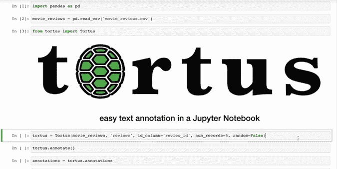

# Jupyter 笔记本中的简单文本注释

> 原文：<https://towardsdatascience.com/tortus-e4002d95134b?source=collection_archive---------24----------------------->

## 如何使用 tortus 注释工具


作者图片

在任何情感分析项目的核心都是一组良好的标记数据。预先标记的数据集可以在互联网上的各种网站上找到。但是…

*   如果你想出了一个*自定义数据集*没有**标签**怎么办？
*   如果您必须在继续您的项目之前*提供这些标签*该怎么办？
*   如果你不愿意付钱给*外包贴标任务*怎么办？

最近，我在为一个**情感分析项目**从 *Twitter 流媒体 API* 中检索文本数据时，就遇到了这个问题。我很快发现，如果没有好的工具，自己注释数据将是一项痛苦的任务。这是制作 **tortus** 背后的灵感，这是一个让**在 Jupyter 笔记本**中标记你的文本数据变得容易的工具！

开始安装**扭转器**并启用适当的**扩展**。

```
$ pip install tortus
$ jupyter nbextension enable --py widgetsnbextension
```

打开 **Jupyter 笔记本**后，将你的数据读入**熊猫**数据框。

```
import pandas as pd
movie_reviews = pd.read_csv('movie_reviews.csv')
```

导入包并创建一个 **Tortus** 的实例。

```
from tortus import Tortustortus = Tortus(df, text, num_records=10, id_column=None, annotations=None, random=True, labels=['Positve', 'Negative', 'Neutral'])
```

## 必需的参数:

*   df :一个包含需要注释的文本的数据帧。这将是你之前读到的熊猫的数据帧。
*   **文本**:包含要注释的文本的列的名称。这应该是一个字符串。

## 可选参数:

*   **num_records** :一次 tortus 会话中要注释的记录数。这必须是一个整数，默认为`10`条记录。
*   **id_column** :包含文本的 **ID** 的列的名称。如果您的数据框中没有这样的列，请保留默认设置为`None`。给定的 **ID** 将成为原始数据帧的索引。如果您稍后需要连接数据集，这可能会有所帮助。
*   **注解**:带有先前在该工具中创建的注解的数据帧。它将拥有在后续注释中使用的正确列。当调用`annotate`方法防止重复时，该数据帧中的记录将被排除。如果该数据集没有以前的注释，默认设置为`None`。
*   **随机**:决定记录是随机加载还是顺序加载到注释小部件中。默认设置为`True`。
*   **标签**:标注标签列表。标签必须是字符串。默认为`[‘Positive', ‘Negative', ‘Neutral']`。

使用`annotate`方法访问注释小部件。

```
tortus.annotate()
```



诉讼侵权法

注释完成后，可以将它们存储到一个变量中，以后可以访问这些变量进行分析。

```
annotations = tortus.annotations
```

如果您需要将来的注释，请将此数据帧作为参数传递给 **tortus** 的后续实例。

这就结束了这篇关于如何使用 **tortus** 轻松地*给你的文本数据添加标签*的简短教程。

要转到 **PyPI** 上的包，点击[此处](https://pypi.org/project/tortus/)。

要查看完整的**源代码**，点击[这里](https://github.com/SiphuLangeni/tortus/blob/master/src/tortus/tortus.py)。

如果您觉得这个包对您的批注任务有帮助，或者您有问题或改进建议，请随时通过 [**LinkedIn**](https://linkedin.com/in/SiphuLangeni) 与我联系，并分享您的反馈。