# 扔一些数据给你的巫师

> 原文：<https://towardsdatascience.com/toss-some-data-to-your-witcher-e936927e7c02?source=collection_archive---------19----------------------->


摄影:卡特林·弗默斯/网飞

## 一篇分析《巫师》中不同角色及其说法的文章，并通过 Seaborn 将结果可视化

大约一个月前，我读了一篇关于可视化“布鲁克林九九”试播集脚本的好文章(感谢 [Melody Zap](https://medium.com/u/91e1f93586da?source=post_page-----e936927e7c02--------------------------------) 的精彩阅读)。现在，我最近狂看了《巫师》第一季，我想做一些类似的事情。我有兴趣找到以下问题的答案:

*   谁说的话最多？
*   一旦他/她有机会说话，谁平均用的词最多？
*   有多少单词被认为是停用词(它们没有任何意义)？
*   根据人物所说的，他们有多积极/中立/消极？
*   杰洛特第二常用的词是什么，假设“嗯”显然是第一个？

不得不提的是**我只看过网飞系列**和**我不熟悉原著** [**书系列**](https://en.wikipedia.org/wiki/The_Witcher) **也不熟悉其他衍生品(桌游、电脑游戏、卡牌游戏等等)。**

## 底层代码

在我看来，没有必要为这种分析重新发明轮子，因此我使用 [Melody Zap](https://medium.com/u/91e1f93586da?source=post_page-----e936927e7c02--------------------------------) Github repo 作为起点。存储库本身可以在下面找到:

[](https://github.com/melozap/Brooklyn-99-Pilot-Analysis) [## melozap/布鲁克林-99-飞行员-分析

### 对布鲁克林九九数据(布鲁克林九九…

github.com](https://github.com/melozap/Brooklyn-99-Pilot-Analysis) 

显然，我必须对 CSV 文件和 Jupyter 笔记本进行一些调整。如果你有兴趣找到我的代码版本，请访问我的 Github 库。

[](https://github.com/markusrenepae/witcher-analysis) [## markusrenepae/witcher-分析

### 对《巫师》的前五集进行文本分析和情感分析，非常感谢 melozap

github.com](https://github.com/markusrenepae/witcher-analysis) 

## 数据

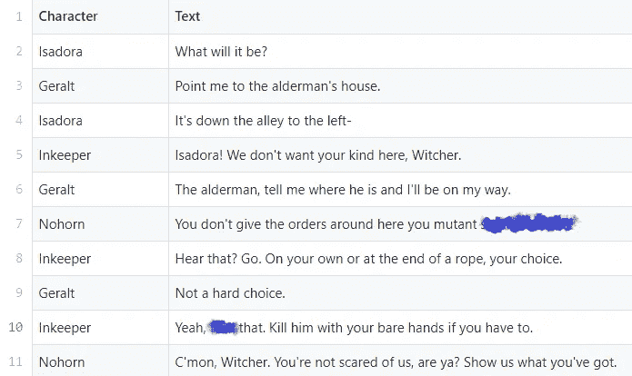

CSV 文件的前 11 行(已审查)

为了这个分析，我使用了前五集的脚本，这些脚本是在 [**这里**](https://transcripts.fandom.com/wiki/The_Witcher) 找到的。它们都存储在一个 CSV 文件中，其中第一列代表一个字符，第二列是这个特定字符所说的文本行。**因为这个脚本包含了大量的注释，我删除了所有放在方括号中的内容**。

生成的文件包含 1479 行文本，在我看来，这是一个很大的工作量。一旦我得到了第 6、7 和 8 集的数据，我会很乐意更新这篇文章。

现在我们已经准备好进行分析了

## 谁说的最多？

在执行 Jupyter 笔记本中的脚本之前，我对结果有一些假设:

1.  杰洛特有最多的台词，但说的话却不多，因为一般来说，他的台词都很短。
2.  贾斯克尔话很多。他每集的字数(他不是每集都出现)一定是最高的。
3.  Yennefer 是从第 2 集进化到第 8 集(好吧，我们的数据到第 5 集)。因此，我相信她的每行字数在开始时较低，在接近结尾时较高。

我们开始吧！在我们的数据集中，哪个角色的**线**最多？

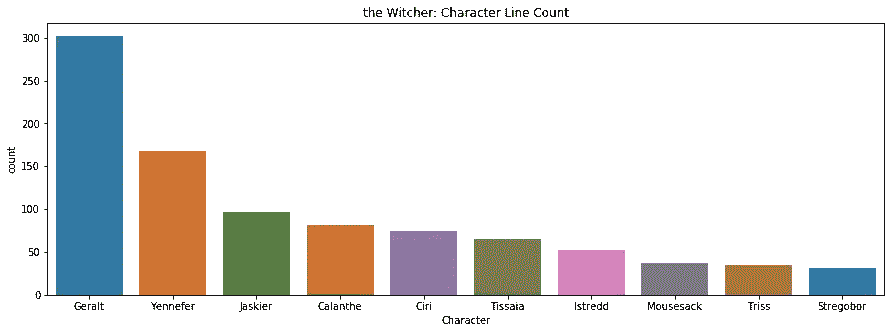

这个结果是有道理的，因为杰洛特只是每集出现的两个角色之一(另一个是希里)。

哪些人物总共使用了**最多的词语**？

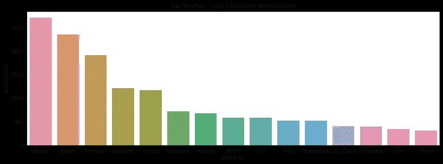

在上图中，杰洛特使用了最多的单词，但差别没有上图那么显著。因此，我们可以说，平均来说，他的线很短。

在前五集里，杰洛特一共出现了五集，叶妮弗出现了四次，贾斯基尔出现了三次。因此，我们已经可以看到，贾斯基尔每集说的话最多(大约 800 个)，而杰洛特每集只用了大约 540 个词，叶妮弗每集还少 500 个词。我们过会儿将回到它。

在我们的数据集中，哪些角色平均使用**最多的单词**？

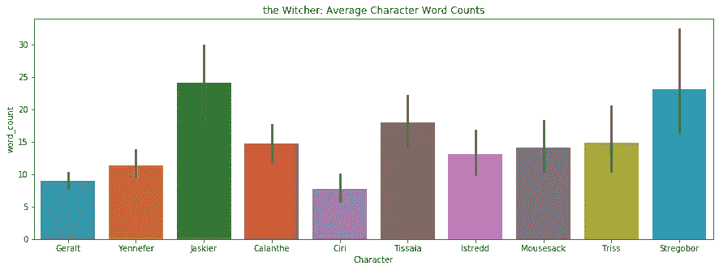

这里，在图中，我们用蜡烛表示平均值和相应的标准偏差。不出所料，贾斯基尔确实平均使用了最多的单词。这主要是因为第二集结尾那首朗朗上口的“扔硬币给你的巫师”的缘故。贾斯基尔在三行中使用了 312 个单词。

其他主要角色(杰洛特、叶妮弗、希里)每行使用大约 10 个单词。

## 最常见的单词

现在我们知道了一些关于单词和行数的分布，我们现在可以找出最流行的单词。我不会去分析这个系列中的每个角色，但是我会给出一些关于杰洛特、贾斯基尔、叶内费尔和希里的见解。

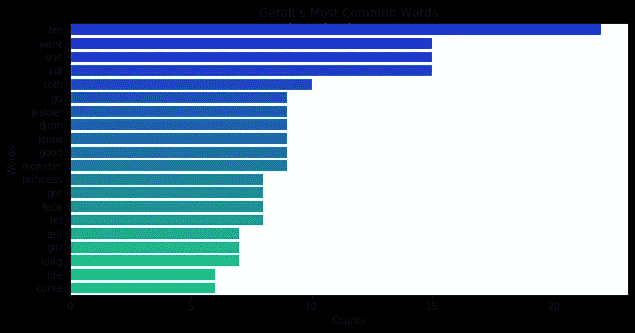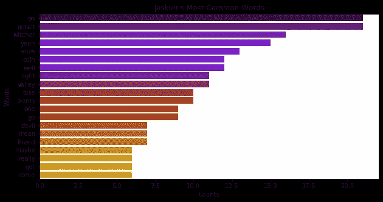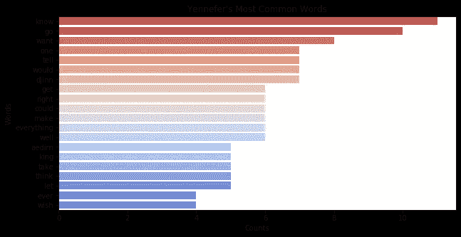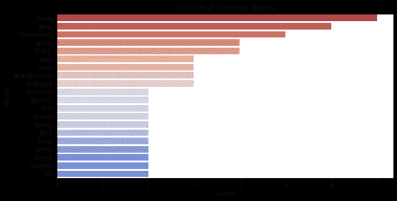

结果不言而喻——杰洛特第二受欢迎的词是“想要”、“一”和“杀死”。最受欢迎的，显然是“嗯”。

所有人物中**最流行的词是什么？**

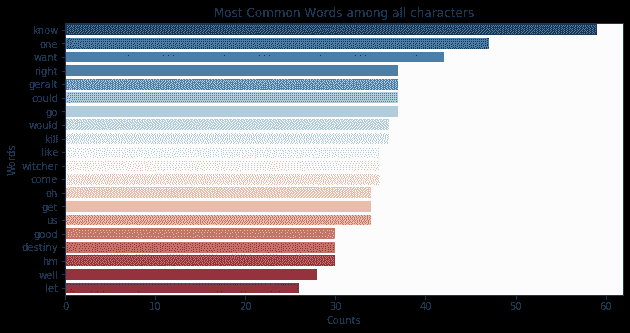

## 清理文本

首先，你注意到最流行的单词中没有语法冠词吗？这是因为对整个脚本应用了清理过滤器:

```
def clean(text):
    text = word_tokenize(text)
    text = [word.lower() for word in text]
    punct = str.maketrans('', '', string.punctuation) 
    text = [word.translate(punct) for word in text] 
    text = [word for word in text if word.isalpha()]
    text = [word for word in text if not word in stopwords]
    return " ".join(text)
```

该函数执行以下操作:

*   文本被标记化，或者简单地说——对于每一行，我们创建一个列表，其中单词是它的元素。
*   所有单词都是小写的。
*   标点符号被删除。
*   字母数字单词被删除(在我们的例子中，这不会有任何影响)。
*   [停用词](https://en.wikipedia.org/wiki/Stop_words)(大多是不提供任何意义的语法文章)被删除。

这造成了巨大的差异。再来看看平均谁用的词最多。

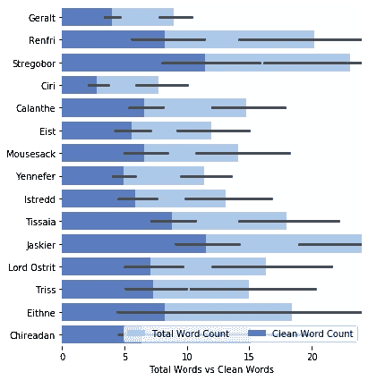

好像用了 clean 功能后差不多 50%用过的字都丢了。

## 情感分析

前五集**整体情绪**如何？

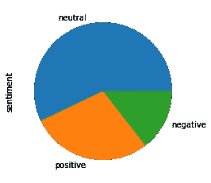

不同人物说出来的台词里的**情是什么？**

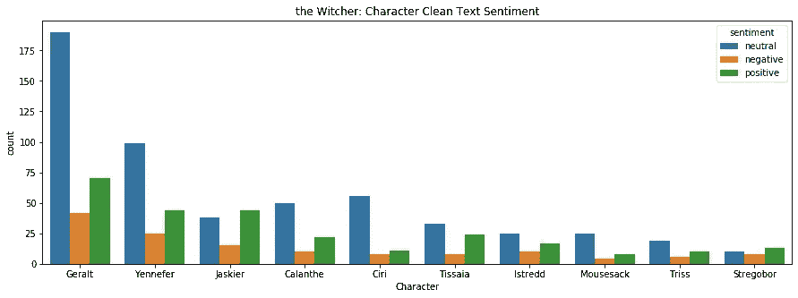

可以看出，中性情绪占主导，除了 Jaskier。他比其他角色更积极，这在系列中是显而易见的。

## Yennefer 真的进化了吗？

Yennefer 一开始是一只害羞的“小猪”，我的一个假设是她的每行字数随着时间的推移而增加。

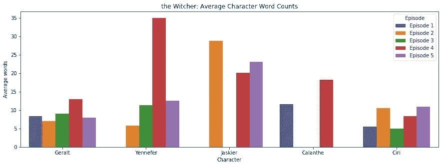

事实证明，这个假设是正确的。我们可以看到的另一件事是，最受关注的杰洛特在五集里的每行字数几乎相同。

# 摘要

《巫师》第一季非常棒，它为接下来的几季树立了很大的期望。更棒的是制作假设并用简单的代码检查它们的过程。写这篇文章帮助我理解了 Seaborn 可视化工具，希望不久我就能使用它。

我要再次感谢 [Melody Zap](https://medium.com/u/91e1f93586da?source=post_page-----e936927e7c02--------------------------------) 编写了如此不可思议的项目，并允许我使用她的 Github 库来构建我的项目版本。

如果你想在这篇文章中看到一些额外的东西，或者有一些真正重要的东西不见了，让我知道。我希望我拿到最后三集的剧本后能尽快更新这篇文章。

# 资源

*   [Melody Zap](https://medium.com/u/91e1f93586da?source=post_page-----e936927e7c02--------------------------------) Github 资源库:[https://github.com/melozap/Brooklyn-99-Pilot-Analysis](https://github.com/melozap/Brooklyn-99-Pilot-Analysis)
*   抄本粉丝:[https://transcripts.fandom.com/wiki/The_Witcher](https://transcripts.fandom.com/wiki/The_Witcher)
*   我自己的这个项目的 Github 库:[https://github.com/markusrenepae/witcher-analysis](https://github.com/markusrenepae/witcher-analysis)