# 边缘无触摸显示界面

> 原文：<https://towardsdatascience.com/touch-less-display-interfaces-on-edge-be8dc277c5b8?source=collection_archive---------55----------------------->

## ***启用边缘 HCI:****多线程*手势&采用 Intel OpenVINO AI 模型的信息亭声音控制。眼睛使眼色&嘴巴方面用数值模式**

****个人注:*** *获得* ***大奖*** *在* ***【深度学习超级英雄挑战赛】*** *与 Intel 为这个项目举办的 Hackster.io。尽管奖金高达 1000 美元&的英特尔 Movidius NCS 2 棒，但在一连串的差点失手之后，终于击中靶心，这给人以安慰。当然，隧道的尽头有光:)**

**大赛链接:*[*https://www.hackster.io/contests/DLSuperheroes*](https://www.hackster.io/contests/DLSuperheroes)*

*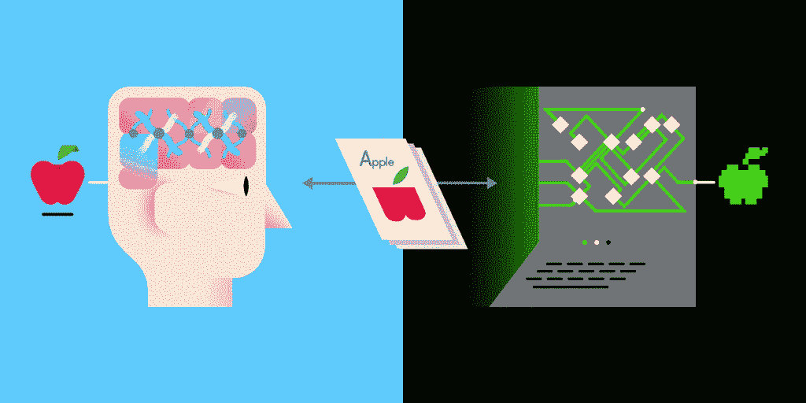*

*[图像来源](https://www.cybiant.com/wp-content/uploads/2020/01/CKC-ANN-Gif.gif)*

*互动公共信息亭现在被广泛使用。银行(自动取款机)、机场(登记)、政府(电子政务)、零售(产品目录)、医疗保健(预约)、学校(出勤)、企业(注册)、活动(信息)等等。随着企业转向信息亭以提供更好的服务，**所有公共设备的免触摸交互已经成为减缓无处不在的** **电晕病毒传播的必要条件。***

***手势或语音导航**似乎可以解决上述问题，**但是这种设备在分析这种输入时会受到资源的限制。**你有没有注意到你的手机语音助手，无论是 Siri 还是 GAssist，在手机离线时都会放弃？当你在偏远的道路上行驶时，你的语音车载信息娱乐系统无法响应。即使是传统的计算机也无法同时运行多个人工智能模型。*

*在你的设备上完成这一切不是很好吗？想象一个可以从卧床不起的病人那里获取视觉或声音提示的床边辅助设备。**随着英特尔 OpenVINO 的出现，这成为可能。它通过进行硬件意识优化，从边缘实现并加速深度学习推理。** OpenVINO 支持 CPU、iGPU、VPU、FPGA 和 GNAs。如果你想尝试一下，树莓派和英特尔 Movidius NCS 2 将是你的最佳选择。*

*在这篇博客中，我们将尝试构建一个**人机交互(HCI)模块** **，它智能地协调 5 个并发运行的 AI 模型**，一个给另一个喂食。用于面部检测、头部姿态估计、面部标志计算和凝视角度估计的 AI 模型识别手势控制输入并触发映射的动作。**部署一个子线程来运行离线语音识别，该子线程与父进程**通信以基于用户话语给出并行控制命令，从而辅助和增强手势控制。*

*博客摘要和项目进展*

***如果你喜欢这个项目，请竖起大拇指** [**这里**](https://www.hackster.io/ananduthaman/touch-less-display-interfaces-on-edge-ac9f43)*

## *解决方案源代码可以在[这里](https://github.com/AdroitAnandAI/No-Touch-Display-Interface-at-Edge-IoT)找到。*

# ***架构图***

*下面解释了体系结构图中的每个组件。*

*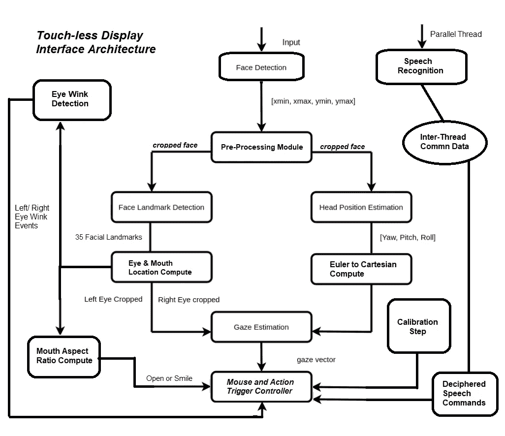*

*作者图片*

# ***控制模式***

*系统中定义了 **4 种控制模式**，用于确定用户输入的模式。我们可以使用手势在控制模式之间切换。*

*   ***控制模式 0:无控制**
    手势和声音导航关闭*
*   ***控制模式 1:注视角度控制**
    鼠标随眼睛注视角度移动(更快)*
*   ***控制模式 2:头部姿态控制** 鼠标随着头部方向的改变而移动(较慢)*
*   ***控制模式 3:声音控制** 鼠标根据用户说话向 4 个方向滑动并打字*

# ***校准步骤***

*为了将 3D 凝视取向角度转换为 2D 屏幕尺寸，系统必须知道与屏幕对角相对应的**偏航和俯仰角度。给定对角的这两个角度，我们可以在屏幕上为中间(偏航、俯仰)角度插入(x，y)位置。***

*因此，当应用程序启动时，将提示用户查看屏幕的对角。这样的校准步骤**需要将凝视角度的变化映射到屏幕**的尺寸和形状，以便“凝视模式”正常运行。*

***没有校准，系统也可以运行**，尽管牺牲了通用性。为了演示，当系统处于“头部姿态”模式时，头部方向的相对变化被用作移动鼠标指针的度量。*

*控制器的功能是用目光和头部移动鼠标*

# ***手势检测管道***

*在输入视频流上执行四个预训练的 OpenVINO 模型，一个馈送到另一个，以检测 **a)面部位置 b)头部姿态 c)面部标志和 d)凝视角度。***

***a)面部检测:**使用了具有高效深度方向卷积的修剪过的 [MobileNet 骨干网](https://docs.openvinotoolkit.org/2019_R1/_face_detection_adas_binary_0001_description_face_detection_adas_binary_0001.html)。该模型输出图像中面部的(x，y)坐标，该坐标作为输入被馈送到步骤(b)和(c)*

***b)头部姿态估计:**[模型](https://docs.openvinotoolkit.org/2019_R1/_head_pose_estimation_adas_0001_description_head_pose_estimation_adas_0001.html) **输出头部的偏航角、俯仰角和滚转角**，将面部图像作为步骤(a)的输入*

*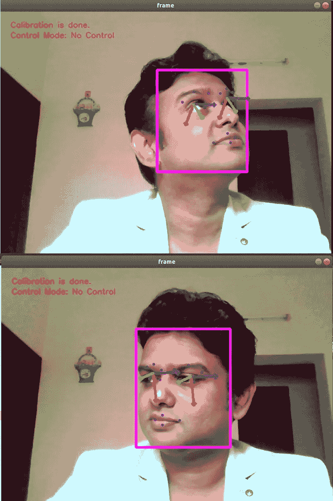*

*笛卡尔坐标系中偏航角、俯仰角和滚转角的可视化*

***c)面部标志:**一个[自定义 CNN](https://docs.openvinotoolkit.org/2019_R1/_facial_landmarks_35_adas_0002_description_facial_landmarks_35_adas_0002.html) 用于估计 **35 个面部标志。***

*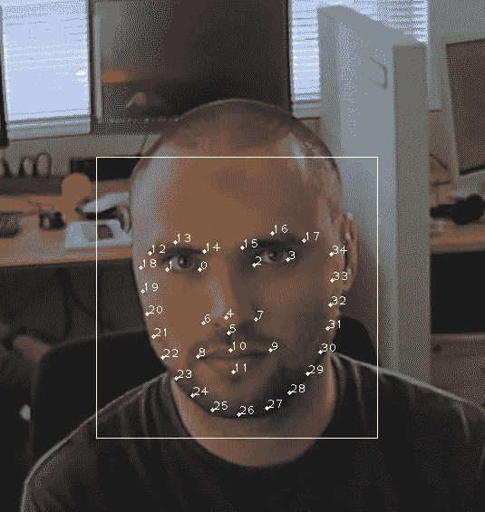*

*[图片由](https://docs.openvinotoolkit.org/2019_R1/_facial_landmarks_35_adas_0002_description_facial_landmarks_35_adas_0002.html)提供*

*如上所述，该模型将来自步骤(a)的裁剪的面部图像作为输入，并计算面部标志。识别面部手势需要这样一张详细的地图，尽管**的计算需求是** [**地标回归模型**](https://docs.openvinotoolkit.org/2019_R1/_landmarks_regression_retail_0009_description_landmarks_regression_retail_0009.html) **的两倍(0.042 对 0.021 GFlops)，后者仅给出 5 个面部地标。***

***d)视线估计:**自定义[类 VGG CNN](https://docs.openvinotoolkit.org/2019_R1/_gaze_estimation_adas_0002_description_gaze_estimation_adas_0002.html)进行视线方向估计。*

*该网络采用 **3 个输入:左眼图像、右眼图像和三个头部姿态角度—(偏航、俯仰和滚动)** —并输出笛卡尔坐标系中的 3d 凝视矢量。*

*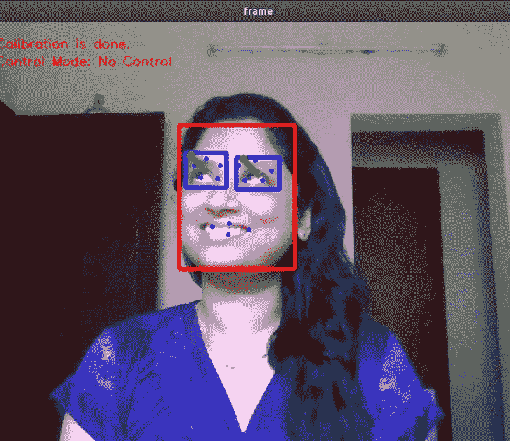*

*视线注视向量的可视化*

# ***后处理模型输出***

*为了将一个模型的输出作为输入提供给另一个模型，需要对每个模型的返回值进行解码和后处理。*

*例如，为了确定凝视角度，**头部方向需要与来自凝视模型**的矢量输出进行数字组合，如下所示。*

*类似地，**面部标志模型返回输入图像大小的比率。**因此，我们**需要将输出乘以图像宽度和高度**来计算 35 个地标的(x，y)坐标。*

*需要处理从地标模型返回的输出面部点*

*虽然面部标志和凝视估计模型的输出可以如上容易地进行后处理，但是头部姿势估计模型输出的**转换稍微复杂一些。***

# ***欧拉角到旋转矩阵***

*注意"**头部姿态估计**"模型仅输出姿态，即头部的偏航、俯仰和滚动角。**为了获得相应的方向向量，我们需要使用姿态来计算旋转矩阵。***

**i)* ***偏航*** 是 **α** 绕 z 轴的逆时针旋转。旋转矩阵由下式给出:*

*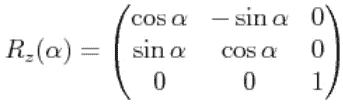*

*ii) ***俯仰*** 是 **β** 绕 y 轴逆时针旋转。旋转矩阵由下式给出:*

*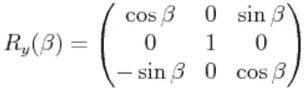*

*iii) ***Roll*** 是γ绕 x 轴逆时针旋转。旋转矩阵由下式给出*

*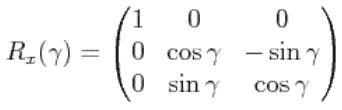*

*我们可以沿着三个轴一个接一个地旋转，以任何方向放置 3D 物体。因此，**要计算方向向量，需要将上述 3 个矩阵相乘。***

*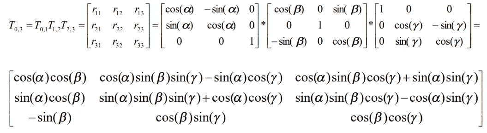*

# ***眨眼检测***

*到目前为止，我们已经使用头部和凝视来控制鼠标指针。但是**要使用 kiosk，你还需要触发事件，**比如‘左键单击’，‘右键单击’，‘滚动’，‘拖动’等等。*

*为此，**需要将一组预定义的手势映射到每个事件**，并从视觉输入中识别。两个事件可以映射到左眼和右眼的“眨眼”事件，但是它们需要被识别为“眨眼”。*

*你可以很容易地注意到，当眼睛睁开时，****的白色像素数量会突然增加，而当眼睛闭上时，**则会减少。我们可以通过计算白色像素来区分睁眼和闭眼。***

***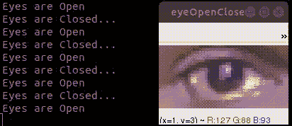***

***眨眼检测***

***但在现实世界中，上述逻辑并不可靠，因为白色像素值本身可以变化。我们总是可以使用深度学习或 ML 技术来分类，但是为了提高效率，建议使用数值解决方案，尤其是当您为边缘设备编码时。***

***让我们看看**如何通过 4 个步骤用数字信号来检测眨眼！*****

1.  ***计算 0–255 范围内的像素频率(直方图)***

*****2。计算直方图中非零像素的分布。**当一只眼睛闭上时，价差会突然下降，反之亦然。***

*****3。尝试在上述信号的尾端拟合一条反 s 形曲线。*****

***4.如果发现拟合成功，则确认拟合曲线的“下降”形状，并声明为**“眨眼”事件。(**无曲线拟合=眼睛没有眨眼)***

*****算法解释:*****

***如果以上步骤不清楚，那么看看当睁开的眼睛闭上时，直方图分布图是如何下降的。***

***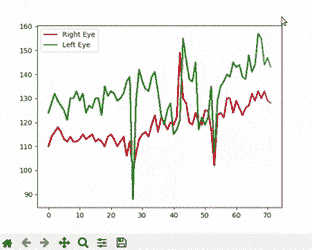***

***图 1 左眼眨眼时的直方图分布***

***给定上述信号，你可以想象当眼睛睁开几秒钟时,**曲线会变成“S”形。**这可以使用 sigmoid 函数进行数学参数化** **。*******

***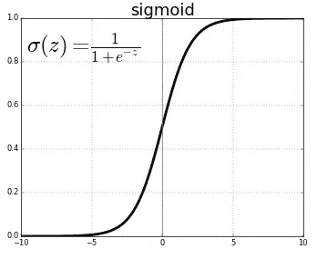***

***但是由于我们需要检测上面所示的“眨眼”事件，曲线的**形状将采用反 s 形函数的形式。**要绕 x 轴翻转 sigmoid 函数，找到 f(-x)***

***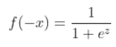***

****反 s 形函数****

***使用任何在线函数可视化工具来绘制上述函数并**改变参数，以查看反向“S”形状如何变化**(以适应上述**T21【图直方图分布 **)*******

***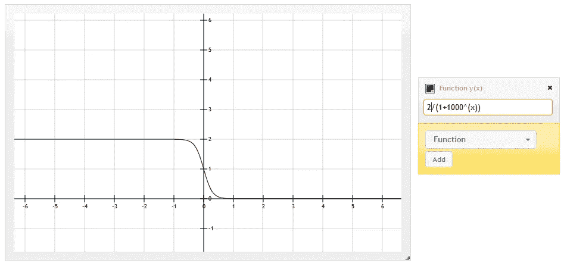***

***[曲线绘制学分](http://fooplot.com)***

***因此**，如果通过参数曲线拟合算法**在直方图分布曲线的末端**发现任何相似的形状，那么我们可以称之为‘眨眼’。**曲线拟合算法试图解决一个**非线性最小二乘问题。*****

***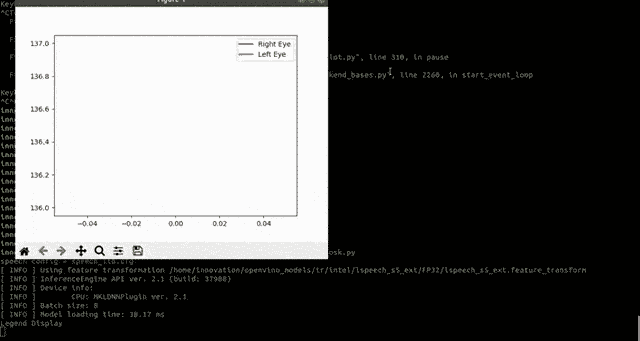***

***反 s 形曲线拟合:左眼和右眼眨眼***

*****注**:计算上述内容的有效方法可以是，***

*   ***考虑非零直方图分布中“n”个最近值的条带。***
*   ***计算带材前端和尾端“k”值的**中值&标准值。*****
*   ***如果**中值>阈值和两个标准<阈值**不同，则检测眨眼事件，因为它很可能是一个反 s 形。***

***或者，我们也可以使用下面的算法来寻找眨眼。***

*   ***取直方图分布值的**的第一个微分*****
*   ***在第一个微分值中找到**峰值，以找到突然峰值*****
*   ***寻找信号的**反射**和**寻找峰值**寻找突然下降***
*   ***如果在上述两个步骤中都发现**峰值，则**闪烁*******
*   ***如果只在反射中发现峰值，那么它是眨眼事件。***

***上述方法比曲线拟合更有效，但可能导致许多假阳性，因为峰值检测并不总是可靠的，尤其是在低光下。中间道路方法将使用中间值和标准偏差来估计曲线的形状。***

# *****口长宽比(MAR)*****

***在这篇[经典的面部标志论文](https://vision.fe.uni-lj.si/cvww2016/proceedings/papers/05.pdf)中，眼睛纵横比(耳朵)被计算出来以确定眨眼。***

***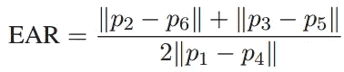******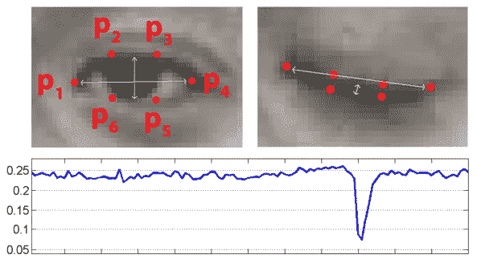***

****眼睛闭上时，耳值会下降。****

***我们不能使用上面的公式来确定眼睛姿态，因为我们的模型没有估计这样密集的地标图。然而，**受 EAR 的启发，我们可以基于从 OpenVINO 模型获得的可用 4 个地标来计算 MAR** ，如下。***

***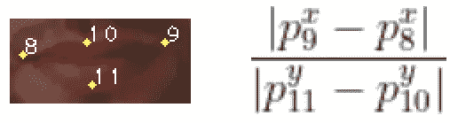***

****高效标记公式****

*****两个手势事件**可以使用 MAR:***

1.  ***如果**标记了>阈值**，那么人就是**微笑*****
2.  ***如果**标记了<阈值**，那么这个人正在**打哈欠*****

***我们可以自由地附加两个与这两个手势相对应的命令。***

# *****线程和进程线程通信*****

***为了增强控制，我们还可以启用基于声音的导航，以及手势控制。然而，**系统在分析来自输入视频流的图像帧**时，需要连续监控用户话语 **以识别命令。*****

***因此，在不同的线程中运行语音识别模型并让子线程与父进程通信自然是明智的。子线程将识别移动鼠标或在屏幕上书写的语音命令，**使用 Python 中的共享队列数据结构**将其传递给父线程(如下所示)。***

*****父进程将运行所有上述 AI 模型**和手势识别所需的计算，以启用头部和凝视控制模式。因此，可以并行地获取手势和声音控制命令，但是为了可用性，在这个项目中，我们选择在控制模式 3 中单独获取声音命令。***

# *****语音识别*****

***为了解码声波，我们使用 OpenVINO 特征提取和解码器库，**接收并转录来自麦克风的音频。**我们已经使用了这里[提到的语音库](https://docs.openvinotoolkit.org/latest/openvino_inference_engine_samples_speech_libs_and_demos_Live_speech_recognition_demo.html)在边缘上运行语音识别，不上线。***

***由于识别模型是以牺牲准确性为代价进行优化的，因此需要进行一些调整来识别口头命令。首先，我们限制命令词汇，只说‘上’，‘下’，‘左’&，‘右’。其次，命令词的**相似发音同义词被存储**在字典中以找到最佳匹配。例如，“右”命令可以被识别为“写”。***

***这个函数是这样编写的，命令和同义词可以很容易地扩展。为了启用用户输入，还启用了语音写入功能。这使得用户能够输入字母和数字。**如** : PNR 号。***

***线程从相似声音“同义词”中识别命令，并插入到 STT 队列中***

# *****手势控制和**鼠标导航***

***手势控制命令配置如下。但是，您可以轻松地更改手势命令映射。***

***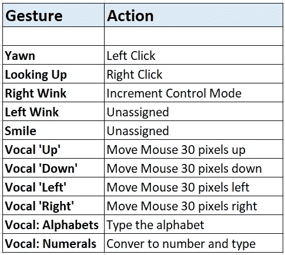***

***手势映射可以随意修改***

***使用 **pyautogui 库控制鼠标指针。**move()、moveTo()、click()、drag()、scroll()、write()等函数用于触发上述手势对应的事件。***

# ***粘性特征及优化***

***眼睛的凝视或头部的姿势至少会持续改变一点，即使是无意的。**此类自然动作不应被视为命令，否则鼠标指针会变得抖动。**因此，我们引入了一个**“粘性”参数，在该参数范围内，运动被忽略。**这大大增加了手势控制的稳定性和可用性。***

***最后， [**英特尔 VTune**](https://software.intel.com/content/www/us/en/develop/documentation/get-started-with-vtune/top.html) **评测器用于查找热点并优化**应用代码。一个 shell 脚本 vtune_script.sh 被提供给 VTune GUI，它使用合适的参数启动项目。***

# *****结论*****

***项目**展示了英特尔 OpenVINO 顺序和并行处理多个边缘人工智能模型的能力。**许多控制输入也用于证明灵活性。但是要部署定制解决方案，你可以选择你认为合适的控件。***

***例如，凝视控制对于大屏幕可能是理想的，而头部姿势控制对于笔记本电脑屏幕可能是理想的。无论哪种方式，声音控制都有助于接受自定义表单条目或语音命令。手势-动作映射也可以修改。然而，你可以理解的一点是，在边缘上链接多个硬件优化的人工智能模型的可能性，加上高效的数值计算来解决有趣的问题。***

## ***解决方案源代码可以在[这里](https://github.com/AdroitAnandAI/No-Touch-Display-Interface-at-Edge-IoT)找到。***

***如果您有任何疑问或建议，您可以**联系我** [**这里**](https://www.linkedin.com/in/ananduthaman/)***

*****如果你喜欢这个项目，请竖起大拇指** [**这里**](https://www.hackster.io/ananduthaman/touch-less-display-interfaces-on-edge-ac9f43)***

# *****参考文献*****

***[1] **英特尔 OpenVINO 官方文档:**[https://docs.openvinotoolkit.org](https://docs.openvinotoolkit.org)***

***[2] **英特尔 Edge AI for IoT Nanodegree 由 Udacity 提供。**灵感来自期末课程项目。**[https://classroom.udacity.com/nanodegrees/nd131](https://classroom.udacity.com/nanodegrees/nd131)*****

*****[3] *布拉格捷克技术大学电子工程系 Tereza Soukupova 和 Jan Cech 使用面部标志进行实时眨眼检测*。*****