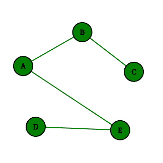

# Python Itertools 之旅

> 原文：<https://towardsdatascience.com/tour-of-python-itertools-2af84db18a5e?source=collection_archive---------3----------------------->

## 让我们探索两个伟大的 Python 库——ITER tools 和 more_itertools，看看如何利用它们进行数据处理…

特雷弗·科尔在 [Unsplash](https://unsplash.com/s/photos/snake?utm_source=unsplash&utm_medium=referral&utm_content=creditCopyText) 上拍摄的照片

有很多很棒的 Python 库，但大多数都无法与内置的`itertools`和`more-itertools`相提并论。当涉及到在 Python 中处理/迭代一些数据时，这两个库实际上是整个厨房水池。然而，乍一看，这些库中的函数似乎并不那么有用，所以让我们来看看(在我看来)最有趣的函数，包括如何充分利用它们的例子！

# 压缩

当涉及到过滤序列时，您有相当多的选项，其中之一是`compress`，它采用 iterable 和 boolean 选择器，并输出 iterable 的项目，其中选择器中对应的元素是`True`。

我们可以使用它将一个序列的过滤结果应用到另一个序列，就像上面的例子一样，我们创建了一个日期列表，其中对应的计数大于 3。

# 积聚

顾名思义——我们将使用这个函数来累加一些(二元)函数的结果。这方面的例子可以是运行最大值或阶乘:

如果您不关心中间结果，您可以使用`functools.reduce`(在其他语言中称为`fold`)，它只保留最终值，并且内存效率更高。

# 循环

这个函数采用 iterable 并从中创建无限循环。例如，在游戏中，玩家轮流游戏，这是很有用的。你可以用`cycle`做的另一件很酷的事情是创建简单的无限旋转器:

# 三通

来自`itertools`模块的最后一个是`tee`，这个函数从一个迭代器创建多个迭代器，这允许我们*记住*发生了什么。例如来自 *itertools recipes* (还有`more_itertools`)的`pairwise`函数，它从输入 iterable 返回成对的值(当前值和前一个值):

每当您需要指向同一数据流的多个单独指针时，这个函数就非常方便。不过在使用它的时候要小心，因为它在内存方面的开销非常大。同样需要注意的是，在对原始 iterable 使用了`tee`之后，不应该再使用它，因为它会弄乱(无意中推进)那些新的`tee`对象。

# 更多 _itertools

现在，让我们仔细看看`more_itertools`图书馆提供了什么，因为有许多有趣的功能，你可能没有听说过。

## 划分

从`more_itertools`开始的第一个是`divide`。顾名思义，它将 iterable 分成若干个子 iterable。正如你在下面的例子中看到的，子元素的长度可能不一样，因为它取决于被划分的元素的数量和子元素的数量。

## 划分

使用这个函数，我们也将划分我们的 iterable，但是这次使用一个*谓词*:

在上面的第一个例子中，我们使用简单的 *lambda* 函数将日期列表分为最近的和旧的。对于第二个例子，我们基于扩展名对文件进行分区，同样使用 *lambda* 函数，该函数将文件名分为名称和扩展名，并检查扩展名是否在允许的列表中。

## 连续组

如果您需要查找连续的数字、日期、字母、布尔或任何其他可排序的对象，那么您可能会发现`consecutive_groups`很方便:

在这个例子中，我们有一个日期列表，其中一些日期是连续的。为了能够将这些日期传递给`consecutive_groups`函数，我们首先必须将它们转换成序数。然后使用列表理解，我们迭代由`consecutive_groups`创建的连续序数日期组，并使用`map`和`fromordinal`函数将它们转换回`datetime.datetime`。

## 副作用

假设您需要在迭代条目列表时产生副作用。这种副作用可能是，例如，写入日志、写入文件或类似于以下示例中计数发生的事件数:

我们声明了一个简单的函数，它将在每次被调用时递增一个计数器。然后，这个函数和名为`events`的非特定 iterable 一起传递给`side_effect`。稍后当事件迭代器被使用时，它将为每一项调用`increment_num_events`,给我们最终的事件计数。

## 倒塌

这是另一个名为`flatten`的`more_itertools`函数的更强大版本。`collapse`允许你展平多层嵌套。它还允许您指定基本类型，以便您可以在剩余一层列表/元组的情况下停止扁平化。此功能的一个用例是展平*熊猫*。以下是一些更通用的例子:

第一个通过折叠`os.walk`返回的可重复项来生成文件和目录路径的列表。在第二种方法中，我们采用嵌套列表形式的树数据结构，并将其折叠以获得所述树的所有节点的平面列表。

## 拆分 _at

回到拆分数据。`split_at`函数根据谓词将 iterable 拆分成列表。这类似于字符串的基本`split`,但是这里我们用 iterable 代替字符串，用谓词函数代替分隔符:

上面，我们使用行列表来模拟文本文件。该*“文本文件”*包含带有`-------------`的行，用作分隔符。这就是我们用来把这些行分割成独立列表的谓词。

## 水桶

如果您需要根据某种条件将 iterable 分成多个桶，那么`bucket`就是您要找的。它通过使用*键*函数拆分输入可迭代对象来创建子可迭代对象:

这里我们展示了如何基于条目类型存储 iterable。我们首先声明几种类型的形状，并创建它们的列表。当我们用上面的*键*函数调用这个列表上的`bucket`时，我们创建了一个*桶*对象。这个对象像内置的*Python*一样支持查找。此外，正如您所看到的，整个 bucket 对象中的每一项都是一个生成器，因此我们需要对它调用`list`来实际获取其中的值。

## Map_reduce

对于所有数据科学人士来说，这个库中最有趣的函数可能就是`map_reduce`。我不打算详细说明 MapReduce 如何工作，因为这不是本文的目的，已经有很多关于它的文章了。我要给你展示的是如何使用它:

这个 *MapReduce* 实现允许我们指定 3 个函数: *key* 函数(用于分类)， *value* 函数(用于转换)，最后 *reduce* 函数(用于缩减)。这些函数中的一些可以省略，以产生 *MapReduce* 过程中的中间步骤，如上所示。

## 一起排序\

如果您处理的是数据的电子表格，那么很有可能您需要按某一列对其进行排序。这对于`sort_together`来说是一个简单的任务。它允许我们指定根据哪一列对数据进行排序:

该函数的输入是可迭代对象(列)和`key_list`的列表，它告诉`sort_together`使用哪些可迭代对象进行排序以及优先级。在上述示例中，首先按出生日期*对*“表格”*进行排序，然后按在*列更新的*进行排序。*

## 可寻找的

我们都喜欢迭代器，但是在 Python 中你应该一直小心使用它们，因为它们的一个*特性*是它们消耗提供的 iterable。感谢`seekable`，他们不必如此:

`seekable`是一个将 iterable 封装在一个对象中的函数，使得在迭代器中来回遍历成为可能，甚至在一些元素被消耗之后。在这个例子中，你可以看到我们在遍历了整个迭代器后得到了`StopIteration`异常，但是我们可以返回并继续处理它。

## 过滤 _ 例外

让我们看看下面的场景:您收到了混合数据，其中包含文本和数字，并且都是字符串形式。然而，您只想处理数字(浮点数/整数):

`filter_except`通过将 iterable 的元素传递给提供的函数(`float`)并检查它是否抛出错误(`TypeError, ValueError`)来过滤输入 iterable 的项目，只保留通过检查的元素。

## 每个都是唯一的

`unique_to_each`是`more_itertools`库中比较晦涩的函数之一。它接受一堆 iterables 并从每个 iterables 中返回元素，这些元素不在另一个 iterables 中。最好看看例子:

在这里，我们使用*邻接表*(实际上是`dict`)来定义图数据结构。然后，我们将每个节点的邻居作为一个集合传递给`unique_to_each`。它输出的是一个节点列表，如果相应的节点被删除，这些节点将被隔离。

## 数字 _ 范围

这种方法有很多用例，因为需要迭代一系列非整数值是很常见的:

`numeric_range`的好处在于它的行为方式与基本的`range`相同。您可以像上面的例子一样指定`start`、`stop`和`step`参数，这里我们首先使用`1.7`和`3.5`之间的小数，步长为`0.3`，然后使用`2020/2/10`和`2020/2/15`之间的日期，步长为 2 天。

## 制作 _ 装饰

最后但同样重要的是，`make_decorator`使我们能够使用其他 itertools 作为装饰器，从而修改其他函数的输出，产生迭代器:

这个例子使用了`map_except`函数并从中创建了 decorator。这个装饰器将使用被装饰函数的结果作为它的第二个参数(`result_index=1`)。在我们的例子中，修饰函数是`read_file`，它模拟读取某个文件的数据，并输出一个可能是也可能不是浮点数的字符串列表。然而，输出首先被传递给 decorator，它映射并过滤掉所有不需要的项目，只给我们留下浮动。

# 结论

我希望你在这篇文章中学到了一些新的东西，因为如果你经常处理大量的数据，那么`itertools`和`more_itertools`可以让你的生活变得更加容易。然而，使用这些库和函数需要一些练习才能有效。所以，如果你认为你可以利用这篇文章中展示的一些东西，那么就去检查一下 [itertools recipes](https://docs.python.org/3/library/itertools.html#itertools-recipes) 或者强迫自己尽可能多地使用这些东西，以适应它。😉

*本文最初发布于*[*martinheinz . dev*](https://martinheinz.dev/blog/16)