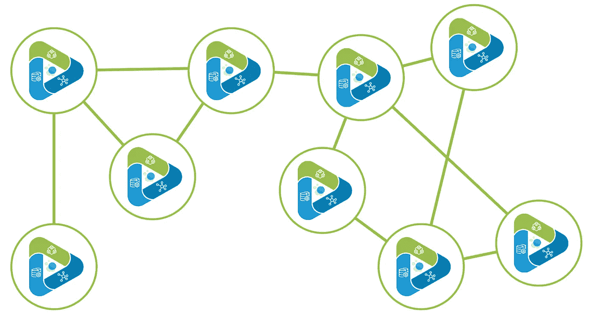

# 走向数据的万维网

> 原文：<https://towardsdatascience.com/towards-a-world-wide-web-of-data-27d5b483074f?source=collection_archive---------36----------------------->

照片由[格雷格·拉科齐](https://unsplash.com/@grakozy?utm_source=unsplash&utm_medium=referral&utm_content=creditCopyText)在[Unsplash](/s/photos/constellation?utm_source=unsplash&utm_medium=referral&utm_content=creditCopyText)——[https://unsplash.com/@grakozy](https://unsplash.com/@grakozy)拍摄

## 使用软件历史上最成功、可扩展的模式来解决数据科学和分析中最糟糕的问题。

# 数据，数据，无处不在…

*…洋溢着* ***巨大的*** ***潜能*** ***价值*** *对于科学、商业和社会的发现。*

不幸的是，对于价值发现/提取目的而言，大多数收集的数据的**实际效用大大降低**——就像喝咸海水一样，成本/收益是净损失。*这是为什么？*

1.  **收集的数据遭受极端*变化***——在编码格式、访问方法和定制的特定领域模式方面。即使有可能将整个数据源重新格式化和重组为标准的、与 SQL 兼容的表，仍然存在连接和解密大量不同的表/列模式的不可能任务。
2.  **收集的数据遭受*内容*** 的不完整性——我说的不仅仅是缺失值。数据代表了什么？为什么要收集这些数据？设计/目的是什么？数据是从谁那里收集的，为谁收集的？存在哪些偏见或特殊情况？典型地，关于数据源的缺失信息被**存储在领域专家的大脑中——也就是人类**。这些人很少与他们拥有或曾经拥有的数据源在同一个地方。

*各种数据来源
一片纯净、复杂的雪花，
迅速融化。*

# 旧软件不能处理新的数据类型

所有的软件在发货的那一天就变旧了。

为价值发现/提取而构建的软件和算法被设计为在以**显式格式或模式**构建的源数据上运行。

因此**任何软件的适用范围仅限于**符合严格输入要求的数据源。有时，只需要重命名一个字段，算法或软件工具就会立即燃烧起来——或者更糟——产生无错的损坏工件(恐怖表情)。

> 例如，在数据科学中，已经投入了很多努力来将数据源转换成单个表(即一个 [*数据帧*](https://github.com/mobileink/data.frame/wiki/What-is-a-Data-Frame%3F) )，其中一列表示要预测的类或结果，而其他列表示特征。因此，许多机器学习算法可以利用数据帧作为输入结构。

**你通常无法让算法适应数据，所以你只能让数据适应算法***或者换句话说 *—* *如果你不能加入他们*(在你的算法中)*，击败他们*(屈服)*。**

*对于像我自己一样有[经验的人来说](https://www.linkedin.com/in/jessepaquette/)，很明显**转换大量数据集以适应软件或算法一点也不容易**。管理模式转换的复杂性(或者， [ETL](https://en.wikipedia.org/wiki/Extract,_transform,_load) )是耗时的，充满了双输决策，并且经常丢失信息。*

*每次出现重要的新数据格式/模式时，升级或改造软件也不是一件容易的事情。即使对于一个假设的零技术债务的系统来说，开发每个新的 ETL 组件的增量成本也太高了。*

*它不可扩展。*

*这就是我们今天所处的位置——在一个充满不同的孤岛、模式、SQL 和单一数据湖的反乌托邦世界中，大多数收集到的数据源被随意隔离在一旁。*

**这就是* ***无用数据问题*** *。有些事情需要改变。**

# *万维网设计模式*

*在过去的 50 年中，很难考虑有什么技术创新比[环球网](https://en.wikipedia.org/wiki/World_Wide_Web)对世界的影响更大。*

*考虑一下世界上市值最高的公司，或者试着花几个小时不去查看社交媒体、工作邮件或谷歌搜索。互联网在我们的生活中无处不在。*

**【网络版】* [*软件正在吞噬世界。*](https://www.wsj.com/articles/SB10001424053111903480904576512250915629460)*

***这对于如上所述的*无用数据问题*意味着什么？**让我们来关注推动互联网革命的万维网设计模式的五个关键组成部分:*

1.  *网络服务器(例如 Apache)*
2.  *网络客户端/浏览器(如 Netscape)*
3.  *超文本传送协议*
4.  *HTML/JavaScript/CSS*
5.  *URL(例如 IP 地址和 DNS)*

***如果你有一个网络服务器，你可以向任何一个有网络客户端/浏览器**的人提供你自己的 [**特定领域的内容**](https://www.pexels.com/search/cat/)**——而不仅仅是那些明确构建来连接到你的服务器或解释内容的客户端。***

**您可以在瞬间将您的应用扩展到数百万用户。**

***如果你有一个网络客户端/浏览器，你可以连接到任何公共网络服务器**——而不仅仅是那些专门为响应你的客户端而构建的服务器。*

*你可以在一瞬间访问和使用数百万个网站中的任何一个。*

***Web 客户端通过一种通用语言与 Web 服务器通信:** [**HTTP**](https://en.wikipedia.org/wiki/Hypertext_Transfer_Protocol) 。HTTP 有许多方法允许客户端向任何服务器发出请求。常见的 HTTP 请求格式是通用的——GET、POST、headers、authentication、SSL 等。*

*那么，在不了解任何领域的情况下，web 客户端如何从 web 服务器获取信息呢？带有用 HTML 和/或 JavaScript 实现的**回调模式**。*

*在从 web 客户端到 web 服务器的初始通用 HTTP 请求之后，来自服务器的响应不仅提供定义页面外观和工作方式的 HTML/JavaScript/CSS，对服务器(或其他 web 服务器)的特定****回调** **也嵌入在响应**中。***

****例如<一个 href="https://tag.bio" >，或者一个*[*AJAX*](https://en.wikipedia.org/wiki/Ajax_(programming))*表达式。****

*****由 web 服务器提供的内容来恰当地传递有效的 HTML 和 JavaScript 代码**，以便客户端呈现页面并进行回调——否则你会在浏览器中看到破碎的页面和链接。***

> ***因此，特定领域功能的负担落在 web 服务器的开发人员身上，而不是每个客户端和每个用户。**这是可扩展的**，因为特定领域的功能只需要实现一次，就可以用于多种用途。***

*****最后，万维网模式需要一个通用的寻址系统**，这样当你在你的网络客户端键入一个 URL(例如 [https://tag.bio)，](https://tag.bio),)客户端将知道互联网路径以与正确的网络服务器通信。互联网地址的全球注册处 [IP 系统](https://en.wikipedia.org/wiki/Internet_Protocol)和互联网地址的域名映射全球注册处 [DNS](https://en.wikipedia.org/wiki/Domain_Name_System) 对此起到了促进作用。***

****能否利用 WWW 设计模式解决* ***无用数据问题*** *？****

# ***数据网格体系结构***

******

***2019 年，ThoughtWorks 的 [Zhamak Dehghani](https://www.thoughtworks.com/profiles/zhamak-dehghani) 发表了一篇[励志文章，介绍了数据网格](https://martinfowler.com/articles/data-monolith-to-mesh.html)作为无用数据问题的拟议解决方案。从文章的摘要来看:***

> ***基于数据湖架构的数据平台有一些常见的故障模式，会导致大规模的承诺无法兑现。为了解决这些故障模式，我们需要从湖的集中式范例或其前身数据仓库中转移出来。我们需要转向一种借鉴现代分布式架构的范式:将领域视为首要关注点，应用平台思维来创建自助式数据基础架构，并将数据视为一种产品。***

*****文章很长，技术密集，令人瞠目结舌。**数据网格打破了围绕数据湖的最先进的思维，消除了将所有数据放在一个地方并将所有数据转换成单一模式的必要性(这是一个巨大、耗时、价值递减的棘手问题)。***

***数据网格的总体思想是数据源可以——也应该——留在原处。数据源应该由最了解该领域的人开发和部署为模块化的、独立的**数据产品**。这些人将能够最有效和高效地围绕他们的数据源开发有用的内容和功能。***

***那听起来像什么？ ***万维网服务器*** *。该死的。****

# ***走向收集数据的万维网***

***让我们将 WWW 设计模式与数据网格架构结合起来，看看兔子洞能走多远。***

***以下是我们需要的(与上面列出的 5 个 WWW 组件直接匹配):***

1.  ***一个服务器应用程序— **一个*数据产品*** —它可以包装任何给定的数据源/模式而不改变它。该数据产品将配备一个 API，它可以与任何客户端进行通用的*通信，而且还支持**特定于域的请求和响应**——以及对附加服务器功能的**回调**——而不会暴露源数据模式。保持客户端独立于源数据模式对于该模式的可伸缩性至关重要，因为**如果源数据模式要改变**——这种情况经常发生— **只有数据产品需要调整**，而不是每个 gall-dang 客户端应用程序。****
2.  ****一个客户端应用程序，即**一个*数据门户*** ，它可以与任何数据产品进行通用*通信，以了解它可以执行什么功能以及如何执行这些功能。数据门户应该能够将服务器响应处理为报告、可视化、训练有素的机器学习模型、原始数据切片，并将所有服务器响应存储为 [*有用的数据工件*](https://medium.com/tag-bio/a-brief-introduction-to-useful-data-artifacts-and-the-next-generation-of-data-analysis-systems-1f42ef91ce92) 以实现可再现性。*****
3.  ***一个**通用通信协议**，方便任何数据门户和任何单个数据产品之间的一般通信。***
4.  ***一个**通用查询模式**，它使每个数据产品能够提供一个带有*回调功能*的数据门户，以调用特定领域的、无模式的查询和算法。***
5.  ***一个**全球数据产品注册和寻址系统**，以便数据门户可以找到并利用一个或多个数据产品中的功能。***

# ***为什么它很重要***

***简而言之，万维网模式是一种创新的、可扩展的设计，用于最大限度地发现和提取组织内和世界各地收集的数据的价值。***

***一些主要优势:***

*   ***数据产品发布者可以**专注于他们自己的数据源** **和他们以及他们的同行最了解的算法**，并即时发布他们的数据产品，以便从他们的组织内部或者从世界上的任何地方访问。***
*   ***数据门户用户可以**在他们的组织内——或世界上的任何地方——快速找到和利用数据源**,并使用域原生功能**,而不必适应复杂的数据源模式**。数据门户通过捕获[有用的数据工件](https://medium.com/tag-bio/a-brief-introduction-to-useful-data-artifacts-and-the-next-generation-of-data-analysis-systems-1f42ef91ce92)，支持数据研究和协作的可再现性。***
*   *******适应数据模式变化**或向模式中添加新数据源的负担只落在一个技术组件上——数据产品。*****
*   *******在数据源上实现有用算法的负担主要落在最了解数据的数据产品发布者身上**。值得注意的是，这可能不足以满足所有数据用例。另一种选择是，数据门户客户端调用数据产品的下载方法，提取原始数据或转换后的数据，然后执行外部算法。*****

******模块化、领域驱动的设计——可扩展且有用！******

# *****数据门户对数据产品的要求*****

*   *****你有什么样的数据？最后一次更新是什么时候？*****
*   *****你们提供什么方法？*****
*   *****对于给定的方法，有哪些参数？*****
*   *****对于方法参数，有效的值集/范围是什么？*****
*   *****对于给定的方法，响应的模式/编码是什么？*****
*   *****请使用这些参数运行此方法。*****
*   *****RESTful 和异步的、基于令牌的轮询(用于长期运行的方法)。*****

# *****假设和考虑*****

*   *****数据门户不知道每个数据产品背后的显式数据模式。它只通过上面列出的问题来了解数据产品。这允许数据产品适应数据模式的变化，而不破坏每个 API 客户端。*****
*   *****正如 Data Mesh 文章中所发表的那样— **数据产品应该是不可变的**。因此，客户端状态/会话必须由补充组件来维护。如果数据门户或算法调用数据产品中的数据转换，它应该产生/部署新的数据产品。*****
*   *****当数据产品包含大数据时，**算法应该在数据产品**中运行。当数据产品包含少量数据时，提取数据供外部使用更为可行。*****
*   *******由于商业秘密或安全性/合规性的原因，许多数据集受到限制** —用户认证和授权是必须的。但是，如果在数据产品应用程序之外管理安全模型，数据产品本身会更加灵活，也就是说，数据产品应该不知道单个用户。*****
*   *****数据产品应该支持执行从数据门户或通过 API 提交的远程代码吗？这是一个强大的选项，但它带来了巨大的安全风险，这在过去一直困扰着 WWW 小心行事。*****
*   *******数据、算法/方法和通信协议的版本**必须明确，并由每个数据产品和数据门户管理。没有版本控制就没有可复制性。*****
*   *****来自数据产品的**算法/方法响应应该在数据门户中产生** [**有用的数据工件(udat)**](https://medium.com/tag-bio/a-brief-introduction-to-useful-data-artifacts-and-the-next-generation-of-data-analysis-systems-1f42ef91ce92)。UDATs 应该包含定义其来源的出处编码，以便能够可靠地解释和复制它们。*****
*   *****全球数据产品注册管理机构以及数据产品本身应遵守 [**公平原则**](https://en.wikipedia.org/wiki/FAIR_data) 。*****

# *****这会产生什么影响？需要检验哪些假设？请在下方留言评论。*****

*****对于我们自己的这个模式的实现，请访问 [Tag.bio](https://tag.bio) 。*****

*****如果你已经读到这里，但还没有阅读 ThoughtWorks 的[数据网格文章，请现在就阅读。](https://martinfowler.com/articles/data-monolith-to-mesh.html)*****

******亿万亿，
闪闪发光的星星和它们的秘密；卡尔梦见，“我必须知道！”******