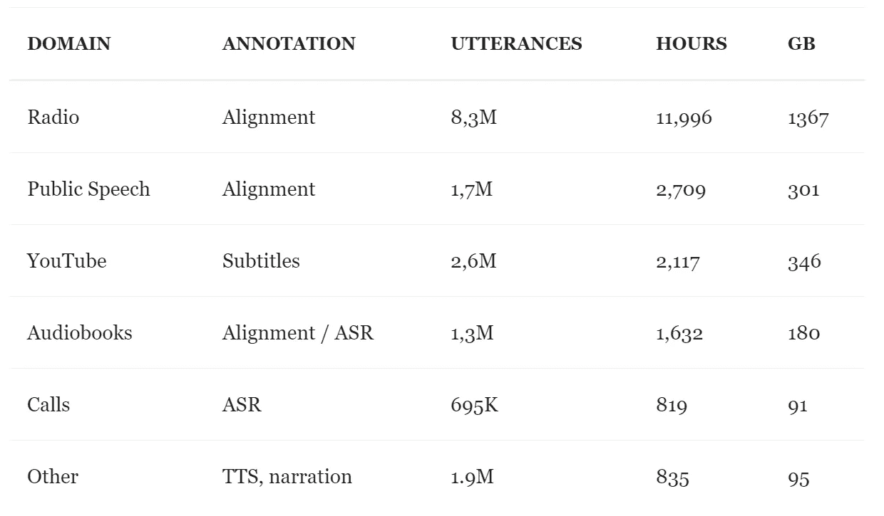
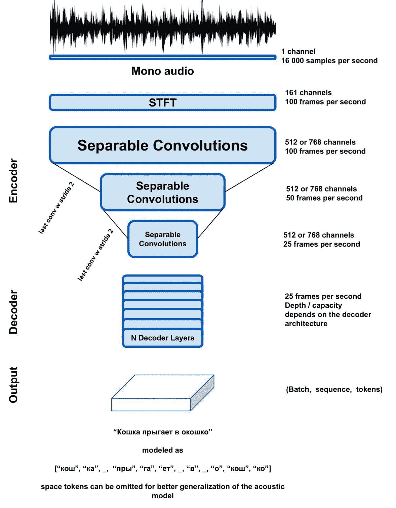
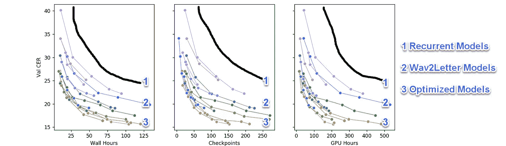
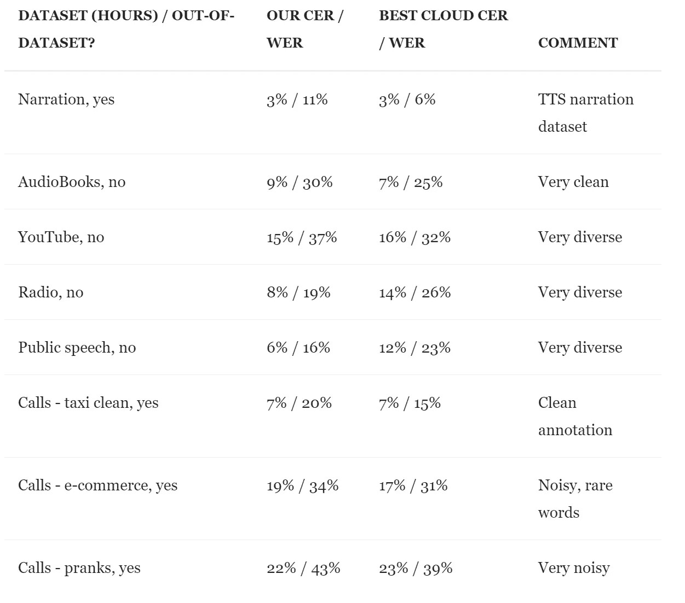

# 迈向语音转文本的 ImageNet 时代

> 原文：<https://towardsdatascience.com/towards-an-imagenet-moment-for-speech-to-text-dabeaa962438?source=collection_archive---------32----------------------->

## *结合现有的想法和技术，向实用的 STT 迈进*

*原载于 2020 年 3 月 28 日*[*https://the gradient . pub*](https://thegradient.pub/towards-an-imagenet-moment-for-speech-to-text/)*。所有的引用和参考文献都保留在原来的文章中。Medium 也没有任何方便的目录特性，所以我也将保留原始链接。在适当的地方，我会提供文章原文部分的链接。我还提供了更多最新基准的链接。*

1.  [**简介**](https://thegradient.pub/towards-an-imagenet-moment-for-speech-to-text/#introduction)
2.  [相关工作及启示](https://thegradient.pub/towards-an-imagenet-moment-for-speech-to-text/#related-work-and-inspiration)
3.  [打开语音转文字(俄语)](https://thegradient.pub/towards-an-imagenet-moment-for-speech-to-text/#open-speech-to-text-russian-)
4.  [给文字模特做精彩演讲](https://thegradient.pub/towards-an-imagenet-moment-for-speech-to-text/#making-a-great-speech-to-text-model)
5.  [模型基准和推广差距](https://thegradient.pub/towards-an-imagenet-moment-for-speech-to-text/#model-benchmarks-and-generalization-gap)
6.  [进一步的工作](https://thegradient.pub/towards-an-imagenet-moment-for-speech-to-text/#further-work)

语音转文本(STT)，也称为自动语音识别(ASR)，有着悠久的历史，并在过去十年中取得了惊人的进展。目前，人们通常认为，只有像谷歌、脸书或百度(或地方政府支持的俄语垄断企业)这样的大公司才能提供可部署的“野外”解决方案。这是由于几个原因:

1.  论文中通常使用的高计算要求设置了人为的高准入门槛；
2.  由于不同的词汇、说话者和压缩伪像，需要大量数据的语音；
3.  一种放弃实际的解决方案而倾向于不切实际的、先进的解决方案的心态(SOTA)。

在这篇文章中，我们描述了我们通过以下方式在全球和俄语领域缓解这些问题的努力:

1.  介绍在 CC-NC-BY 许可下发布的多样化的 20，000 小时[开放 STT 数据集](https://github.com/snakers4/open_stt)；
2.  证明仅使用两个消费级和广泛可用的 GPU 就可以实现有竞争力的结果；
3.  提供了大量的设计模式，为广大研究人员和从业者进入语音领域提供了民主化的入口。

# 介绍

随着计算机视觉的成功和民主化(所谓的[“ImageNet moment”](https://thegradient.pub/nlp-imagenet/)，即减少硬件要求、上市时间和生产可部署产品的最小数据集大小)，合乎逻辑的是希望机器学习(ML)的其他分支也将效仿。唯一的问题是，什么时候会发生，发生的必要条件是什么？

在我们看来，给定 ML 子场中的图像网时刻在以下情况下到达:

*   解决 95%的标准“有用”任务所需的架构和模型构建块作为标准和经过测试的开源框架模块广泛可用；
*   大多数受欢迎的型号都有预先训练的重量；
*   解决了从使用预训练模型的标准任务到不同日常任务的知识转移；
*   与之前在论文中报告的计算需求(在 STT 为 100-1000 GPU 天)相比，为日常任务训练模型所需的计算非常少(例如，在 STT 为 1-10 GPU 天)；
*   用于预训练大型模型的计算机可供小型独立公司和研究小组使用；

如果满足上述条件，人们就能以合理的成本开发新的有用的应用。民主化也发生了——人们不再需要依赖谷歌这样的大公司作为行业内唯一的真理来源。

> 我将在整篇文章中提到“有用性”。从广义上讲，我们坚信，当某样东西为整个社会带来非零和的结果，并且没有彻底的输家时，它就是有用的。这意味着大多数人或多或少都从这件事情中受益，而不仅仅是少数特权阶层。此外，考虑到一些有用的东西，至少应该没有对某个种族或收入群体的负面歧视。例如，如果“完美的”自动驾驶汽车大规模部署，一些工作将不得不演变，但总体而言，这项技术将是“有用的”。如果大规模部署“完美”的人脸检测，它可能会加剧更多的问题，而不是解决更多的问题。这是非常主观的，所以要有所保留。
> 
> 这件作品将描述我们对 STT 的影像网络时刻的追求，这一时刻至今尚未找到，尤其是在俄语的语境中。我们的主要目标是在有限的计算预算下尽可能快地构建和部署有用的模型，并分享我们的成果，以便其他人可以基于我们的发现，这样我们就可以共同实现 STT 的 ImageNet 时刻。
> 
> 这不是一篇传统的同行评议的研究论文，而是一篇总结，总结了我们结合现有的思想和技术，朝着有用和实用的 STT 前进的务实尝试。
> 
> 我们决定以这种形式分享它，而不是在会议上或 arxiv 上以论文的形式，这样我们的发现就能被尽可能多的人获得。虽然确保技术正确性的同行评审当然是有用的，但由于使用了大量现有的想法和我们提供的经验结果，我们对我们的主张很有信心。我们将单独撰写一篇文章，解释为什么我们认为当前同行评审和公司支持的研究不是社会整体进步的最快途径；简而言之，虽然这些有缺陷的系统长期有效，但在短期内有更快的方法来取得进展。
> 
> 简而言之——这里介绍的想法在生产中确实有效，并且已经过域外验证。更重要的是，它们中的大多数都很实际，不需要昂贵的硬件或大量代码。我们欢迎反馈和批评—[aveysov@gmail.com](mailto:aveysov@gmail.com)

# 相关工作及启示

在我们的实验中，我们选择了以下技术:

*   用于声学建模的前馈神经网络(主要是具有[挤压和激励](https://arxiv.org/pdf/1808.08127.pdf)和变压器块的分组 1D 卷积)；
*   [连接主义者时态分类](https://distill.pub/2017/ctc/)loss(CTC loss)；
*   由作为建模单元的字素(即字母表字母)组成的复合记号(与音素相对)；
*   使用预训练语言模型(LM)作为解码器的波束搜索。

有很多方法可以接近 STT。讨论它们的缺点和优点超出了这里的范围。本文中的所有内容都是关于主要使用字素(即字母)和神经网络的端到端方法。

简而言之，为了训练端到端的字形模型，您只需要许多带有相应转录的小音频文件，即 file.wav 和 transcription.txt。您还可以使用 CTC loss，这减轻了对时间对齐注释的要求(否则，您将需要自己提供对齐表或在您的网络中学习对齐)。CTC 损失的一种常见替代方法是标准分类交叉熵损失，但它本身训练缓慢，通常与 CTC 损失一起使用。

**选择这个“堆栈”有几个原因:**

*   可扩展性。您可以通过添加 GPU 来扩展您计算机；
*   面向未来。如果一个新的神经网络模块成为主流，它可以在几天内集成和测试。迁移到另一个框架也很容易；
*   简单。也就是说，使用 Python 和 PyTorch，你可以专注于实验，而不是解决遗留的限制；
*   灵活性。在 Python 中构建适当的代码，你可以在几天内测试新的特性(例如，扬声器二进制化);
*   通过在解码器中不使用注意力，也不使用音素或递归神经网络，我们实现了更快的收敛，并且需要对我们的模型进行更少的维护；

# 打开语音转文本(俄语)

我们所知道的所有公开可用的监督英语数据集都小于 1000 小时，并且具有非常有限的可变性。一篇开创性的 STT 论文提出，你需要至少 10，000 小时的注释来建立一个合适的 STT 系统。1，000 小时也是一个好的开始，但是考虑到泛化能力的差距(将在下面讨论),您需要大约 10，000 小时的不同领域的数据。

典型的学术数据集有以下缺点:

*   太理想了。在工作室录制的，或者与真实世界的应用相比太干净；
*   领域太窄。STT 的难度遵循这个简单的公式:噪音水平*词汇量*说话人数量；
*   大多只会英语。虽然像 [Common Voice](https://voice.mozilla.org/en/datasets) 这样的项目在某种程度上缓解了这种限制，但是你不能可靠地找到大量除了德语和英语之外的语言的数据。此外，普通语音可能比语音到文本更适合于说话人识别任务，因为它们的文本不是非常多样化；
*   不同的压缩。Wav 文件几乎没有压缩失真，因此不能代表以不同方式压缩的真实声音字节；

由于这些缺点，大约 6 个月前，我们决定收集并分享一个前所未有的俄语口语语料库。我们最初的目标是 10，000 小时。据我们所知，这甚至在英语中也是前所未有的。我们已经看到[尝试](http://ceur-ws.org/Vol-2267/475-479-paper-91.pdf)做类似我们的工作，但是尽管有政府资助，他们的数据集并不公开。

最近，我们发布了数据集的 [1.0 测试版](https://github.com/snakers4/open_stt/releases)。它包括以下领域:

我们的数据收集流程如下:

*   收集一些数据，然后使用试探法进行清理；
*   训练一些模型，并使用这些模型进一步清理数据；
*   收集更多数据，并使用对齐功能将抄本与音频对齐；
*   训练更好的模型，并使用这些模型进一步清理数据；
*   收集更多数据，手动标注部分数据；
*   重复所有步骤。

你可以在这里找到[我们的语料库，你可以在这里](https://github.com/snakers4/open_stt)找到[支持我们的数据集。](https://opencollective.com/open_stt)

虽然这已经很可观了，但我们还没有完成。我们的短期计划是:

*   做一些内务，多清理数据，清理一些遗留代码；
*   迁移到。ogg 以便在保持质量的同时最小化数据存储空间；
*   增加几个新领域(法庭对话、医学讲座和研讨会、诗歌)。

> PS。我们做了所有这些，我们的数据集甚至出现在 azure 数据集上，现在我们计划发布 3 种新语言的预训练模型:英语/德语/西班牙语。

# 制作一个很棒的演讲文本模型

要建立一个伟大的 STT 模式，它需要以下特征:

*   快速推断；
*   参数高效；
*   易于维护和改进；
*   不需要大量的计算训练，2 x 1080Ti 或更少的机器应该足够了；

我们将这些作为我们的目标，并在下面描述我们是如何实现它们的。

传统上，模型是通过在几个
固定的“理想”不可见的验证数据集上进行基准测试来选择的。在前面的章节中，我们
解释了如果您考虑到真实世界的使用情况，并且唯一可用的数据集是学术数据集，那么这为什么是次优的。给定有限的
资源来适当地比较模型，您需要一个完全不同的
方法，我们在本节中介绍。还要记住，当您处理真实的野外数据时，没有“理想的”验证数据集，您需要分别对每个域进行验证。

通常当在一些公共数据集(例如
ImageNet)上报告一些结果时，研究人员据称使用不同的
超参数从头开始运行完整的实验，直到收敛。此外，一个好的做法
是运行所谓的烧蚀测试，即通过
比较有和没有这些特征的模型的性能来测试
模型的附加特征是否实际有用的实验。

在现实生活中，从业者无法负担得起
从零开始运行成百上千个实验直到
收敛，或者构建一些花哨的强化学习代码来
控制实验的奢侈。此外，文献中过度参数化方法的优势
和面向企业的工具包的可用性
阻碍了研究人员深入优化他们的管道。当你
探索硬件选项时，在专业或云领域
会偏向昂贵且不切实际的解决方案。

阅读 [**此处**](https://thegradient.pub/towards-an-imagenet-moment-for-speech-to-text/#making-a-great-speech-to-text-model) 更多了解我们的型号选择方法。

## 取得的总体进展

最初，我们从 PyTorch 中的[深度演讲 2 开始。原始 Deep Speech 2 模型基于速度较慢的 deep LSTM 或 GRU 循环网络。上图展示了我们能够添加到原始管道中的优化。更具体地说，我们能够在不影响模型性能的情况下做到以下几点:](https://github.com/SeanNaren/deepspeech.pytorch)

*   将模型尺寸缩小 5 倍左右；
*   将其收敛速度提高 5-10 倍；
*   小型(25M-35M 参数)最终模型可以在 2x1080 Ti GPUs 上训练，而不是 4 个；
*   大型号仍然需要 4x1080 Ti，但与小型号相比，最终 CER 稍低(低 1-1.5 个百分点)。

上面的图表只有卷积模型，我们发现它比递归模型快得多。我们开始了获得这些结果的过程，如下所示:

1.  使用 Deep Speech 2 的现有实现；
2.  在 LibriSpeech 上运行一些实验，我们注意到 RNN 模型与其卷积模型相比通常非常慢；
3.  添加了一个普通的 Wav2Letter 启发的模型，实际上对于俄语来说参数化不足，所以我们增加了模型大小；
4.  注意到这个模型还可以，但是训练非常慢，所以我们试图优化训练时间。

**因此，我们随后探索了以下改进方法:**

*   想法 1 —模型步幅
*   想法 2——紧凑的正则化网络
*   想法 3 —使用字节对编码
*   想法 4 —更好的编码器
*   想法 5——平衡容量——永远不再使用 4 个 GPU
*   想法 6——稳定不同领域的培训，平衡推广
*   想法 7——制作一个非常快速的解码器

请跟随此 [**链接**](https://thegradient.pub/towards-an-imagenet-moment-for-speech-to-text/#overall-progress-made) 详细了解这些想法。

# 模型基准和推广差距

在现实生活中，如果模型在一个领域上被训练，那么在另一个领域上将会有显著的泛化差距。但是一开始就存在泛化差距吗？如果有，那么域之间的主要区别是什么？你能训练一个模型在许多合理的领域里工作得很好，并且有不错的信噪比吗？

有一个概括的差距，你甚至可以推断出哪些 ASR 系统是在哪些领域被训练的。此外，根据上面的想法，你可以训练一个即使在未知领域也能正常运行的模型。

根据我们的观察，这些是导致领域之间泛化差距的主要差异:

*   整体噪音水平；
*   词汇和发音；
*   用于压缩音频的编解码器或硬件；

显然现在这个图表已经很老了，你可以在 silero.ai 上找到更多最新的俄语指标

> 该基准测试包括声学模型和语言模型。声学模型在 GPU 上运行，结果累加，然后在多个 CPU 上运行语言模型后处理；

有关更详细的基准测试、生产使用和基准测试分析的一些想法，请点击 [**这里**](https://thegradient.pub/towards-an-imagenet-moment-for-speech-to-text/#model-benchmarks-and-generalization-gap) 。有关最新的基准测试，请点击此处的****(俄语)**。******

# ******进一步工作******

****以下是我们测试过的一些想法(其中一些甚至可行)，但我们最终认为，它们的复杂性并不能证明它们所提供的好处:****

*   ****摆脱渐变剪辑。渐变裁剪需要 25%到 40%的批处理时间。我们尝试了各种方法来摆脱它，但无法做到不遭受收敛速度的严重下降；****
*   ****亚当，诺沃格勒和其他新的和有前途的优化。根据我们的经验，他们只处理简单的非语音相关领域或玩具数据集；****
*   ****序列间解码器，双重监控。这些想法行得通。使用分类交叉熵损失而不是 CTC 的基于注意力的解码器是出了名的慢启动者(你将语音解码添加到已经繁重的对齐任务中)。混合网络并没有表现得更好来证明它们的复杂性。这可能只是意味着混合网络需要大量的参数微调；****
*   ****基于音素和音素增强的方法。虽然这些帮助我们调整了一些过度参数化的模型(100-150M 参数)，但它们被证明对较小的模型不是很有用。令人惊讶的是，谷歌[的一项广泛的标记化研究得出了类似的结果](http://arxiv.org/abs/1902.01955)；****
*   ****宽度逐渐增加的网络。计算机视觉中的一种常见设计模式，到目前为止，这种网络比具有相同网络宽度的网络收敛得更差；****
*   ****[空闲块](https://arxiv.org/abs/1911.08609)的使用。乍一看，这并不奏效，但也许需要更多的时间才能奏效；****
*   ****尝试任何类型的可调滤波器，而不是 STFT。我们尝试了可调 STFT 滤波器和 SincNet 滤波器的各种实现，但是在大多数情况下，我们甚至不能用这样的滤波器稳定模型的训练；****
*   ****训练一个不同步幅的金字塔形模型。我们在这方面没有取得任何进展；****
*   ****使用模型提取和量化来加速推理。当我们在 PyTorch 中尝试原生量化时，它仍处于测试阶段，而且[还不支持我们的模块](https://t.me/snakers4/2405)；****
*   ****添加补充目标，如扬声器双音化或噪音消除。噪音消除工程，但它被证明是更多的审美用途；****

******作者简介******

*****Alexander Veysov 是 Silero 的一名数据科学家，Silero 是一家开发 NLP / Speech / CV 产品的小公司，他也是《开放 STT》——可能是最大的公开俄语口语语料库——的作者。Silero 最近推出了自己的俄罗斯 STT 发动机。此前，他曾在一家总部位于莫斯科的风险投资公司和 Ponominalu.ru 工作，后者是一家被 MTS(俄罗斯主要电信公司)收购的票务初创公司。他在莫斯科国立国际关系大学(MGIMO)获得了经济学学士和硕士学位。可以在* [*电报*](https://t.me/snakers41) *(@snakers41)关注他的频道。*****

******致谢******

*****感谢《渐变》杂志的安德烈·库连科夫和雅各布·安德森对这篇文章的贡献。*****

******引用**
*学术语境或书籍中的归属，请将本著作引用为*****

> *****Alexander Veysov，“迈向语音转文本的 ImageNet 时刻”，The Gradient，2020。*****

******BibTeX 引文******

> *****@ article { vey SOV 2020 towardimagenetstt，
> author = {Veysov，Alexander}，
> title = { Toward ' s an ImageNet Moment for Speech-to-Text }，
> journal = {The Gradient}，
> year = {2020}，
> how published = { \ URL {*[*https://The Gradient . pub/Toward-an-ImageNet-Moment-for-Speech-to*](https://thegradient.pub/towards-an-imagenet-moment-for-speech-to-text/)****