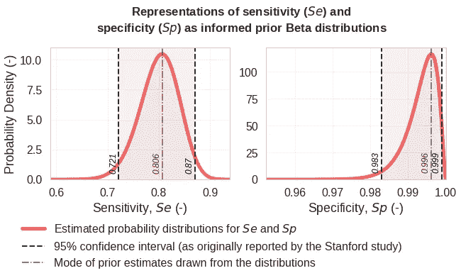
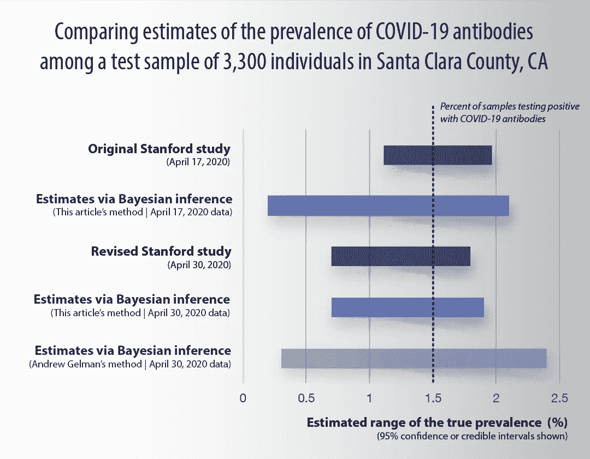

# 对恢复的新冠肺炎病例进行更好的估计

> 原文：<https://towardsdatascience.com/towards-better-estimates-of-recovered-covid-19-cases-d6d1e35b8bda?source=collection_archive---------48----------------------->

## 呼吁在我们的公共话语中多一点贝叶斯思维

**TL；DR——在过去的两周里，关于新冠肺炎抗体的初步血清学检测结果已经公布了很多。最早的例子之一是斯坦福大学一份广为流传的研究草案。该研究的作者估计圣克拉拉县(加利福尼亚州)3300 名受试者中的抗体可能流行率为 1.5%，尽管他们也接受了将真实流行率置于 1.11 至 1.97%范围内的不确定性(95%的置信度)。本文解释了如何考虑处理不确定性和观察数据的众所周知的统计和机器学习概念，特别是贝叶斯定理，将更现实地估计真实患病率位于 0.2%至 2.1%的更大范围内(95%可信)。正如其他科学家所批评的那样，如果最初就能发现如此大的误差，斯坦福大学研究的作者对不确定性的更仔细考虑可能会避免该研究最初发现的过度耸人听闻。**


我可以想象，在我们这个以 COVID 为中心的新世界中，每个人都找到了自己收集、筛选和解释数据、新闻以及关于正在发生的事情和地点的信息的方式。对我来说，我一直着迷于世界各地正在发生的数据科学和建模，以了解这种病毒的性质及其对公共卫生和经济的影响。除此之外，我一直对一种“新常态”的出现非常着迷(如果不是一点点担心的话)，这种“新常态”指的是学术界产生的关键科学研究如何影响政策。我们已经很快到达了这样一个点，几个而不是一个未经审查的流行病学模拟研究和测试结果的预印本已经成为重大新闻标题和政策决定的驱动力，对国家经济和公共卫生战略产生了重大影响。当然，这并非没有充分的理由。这场危机要求我们根据现有的最佳数据、分析和专家做出紧急、直接的决策。做出关键决定的时间窗口，如选择是否以及何时触发留在家中的订单，与大多数典型的学术期刊审查流程不一致。未来几年，我们是否在这场危机开始时观察到了正确的数据，听取了正确的声音(澄清一下，我不是其中之一)，将会引发很多争论。这篇文章更侧重于我们现在才开始关注的一组特定数据:新冠肺炎抗体的血清学检测。

在过去的两周里，血清学检测已经成为新冠肺炎数据收集工作的新领域。获取这些数据似乎对回答我们未来面临的重要问题至关重要:在过去几个月里，我们漏诊了多少轻度或无症状的新冠肺炎病例？我们离所谓的“群体免疫”还有多远？我们应该考虑给那些体内检测出抗体的人发放“免疫护照”吗？

这可能部分是由于我们的兴趣(或不耐烦？)为了尽快回答这些问题，斯坦福大学的 Bendavid 等人在 4 月初发表的一项研究以其惊人的结果迅速引起了媒体和公众的注意。如果你不熟悉它，你可以[阅读最初的研究](https://www.medrxiv.org/content/10.1101/2020.04.14.20062463v1?versioned=true)，或者可能阅读[一些立即涉及它的文章](https://www.sciencemag.org/news/2020/04/antibody-surveys-suggesting-vast-undercount-coronavirus-infections-may-be-unreliable)。该研究的作者对加利福尼亚州圣克拉拉县的 3300 名成人样本进行了血清学测试。他们发现 3300 名受试者中有 50 人新冠肺炎抗体检测呈阳性。当这一结果被外推以反映圣克拉拉县的全部人口时，作者估计，在过去几个月中感染新冠肺炎的真实人数可能比迄今为止诊断的人数高“50 至 80 倍”。

尽管斯坦福大学研究的披露令人震惊，更不用说头条新闻了，但没过多久，一群科学家就(理所当然地)对斯坦福大学论文的作者如何解释他们的结果并得出结论进行了抨击。对这项研究[最值得注意的批评来自哥伦比亚大学的 Andrew Gelman](https://statmodeling.stat.columbia.edu/2020/04/19/fatal-flaws-in-stanford-study-of-coronavirus-prevalence/) 教授，这位统计学家非常忠实地撰写了关于现代统计数据分析方法的教科书。*(原谅我，常客们，把“贝叶斯”等同于“现代”。请不要让这个毁了你的一天。)*。

这篇文章表明，如果在斯坦福大学的研究中透明地进行，关注处理不确定性的贝叶斯方法将如何揭示一个更广泛的，最终不那么耸人听闻的关于圣克拉拉县新冠肺炎抗体流行的结论。明确地说，这篇文章的目标读者不是统计学家或流行病学家，我怀疑他们在大学里学过这些方法。相反，本文是为对不确定性分析和贝叶斯定理感兴趣，但又迫切需要真实用例的应用科学家、科学记者或精通数学的读者而写的。本文采用的方法摘自学术参考文献[2–4]。

# 第一部分:用于描述诊断测试准确性的变量

当我们对普通人群进行血清学检测时，我们可能会直觉地认为产生阳性结果的检测百分比可能等于(或足够接近)受检人群中抗体的*流行率*。毕竟，如果我们的测试不是高度准确的，我们为什么要继续花钱测试我们的人口呢？

这是斯坦福大学研究中提出的一个问题的关键。事实证明，该研究中应用的测试误差——虽然看起来很小——却大到足以对该研究的总体建议的可信度产生怀疑，即圣克拉拉县的实际新冠肺炎感染人数实际上比官方检测的数字高出“50-80 倍”。

为了说明原因，我们首先引入两个关键变量，这两个变量告知任何疾病的诊断测试，或者被任何疾病的诊断测试告知:该疾病在抽样人群中的患病率，以及首先检测为该疾病阳性的概率。

首先，让我们想象一下，我们有 100 个人，我们绝对肯定地知道其中 36 人有新冠肺炎抗体。在这种情况下，我们可以计算出患病率为 36/100 = 0.36 = 36%。我们也可以用概率来重写这个变量， *p* ，因为我们可以假设在这 100 个人口中，任何随机选择的个体都有 36/100 的机会拥有新冠肺炎抗体。所以，如果我们代表一个拥有 *V+* 抗体的个体，那么我们可以把患病率称为 *p(V+)* = 36/100 = 0.36。

我们要介绍的第二个变量是抗体检测阳性的概率， *p(T+)* 。如果在上述 100 个个体的群体中，发现 30 个使用特定的测试试剂盒实际测试抗体呈阳性，那么我们可以进行初步估计，即 *p(T+)* = 30/100 = 0.30。

在这个特定的场景中，我们已经可以看到这里有一个错误。检测呈阳性的概率低于实际拥有新冠肺炎病毒抗体的概率。具体来说，看起来这个测试很容易产生假阴性。然而，我们必须考虑到这可能不是测试的唯一错误(因此我们估计 *p(T+)* 的方法也可能不太正确)。让我们看看下面这个由 11 个人组成的随机测试样本的例子:


在总共 11 个样本中，有 8 个实际阳性病例，只有 7 个样本检测为阳性。在这 7 个阳性测试中，2 个是假阴性的结果，因此只有 5 个阳性与实际阳性病例相匹配。另外两个实际案例导致假阴性测试。因此，在逐个样本的基础上，诊断测试可以正确地识别阳性病例，可以正确地识别阴性病例，或者它可能错误地对已知的阳性病例产生阴性结果，或者它可能错误地对已知的阴性病例产生阳性结果。在任何类型的诊断测试中，后两种错误的程度可以分别通过测试的**灵敏度** 和**特异性**来确定。

**灵敏度** 确定了诊断测试在检测病例时的准确性，这些病例将通过所谓的“金标准”进行识别，即 100%准确的参考诊断。在上表中，我们看到八分之五的真阳性病例也检测为阳性。如果这是我们得到的确定测试灵敏度的唯一数据，我们估计为 5/8 = 0.625 = 62.5%。

**特异性**确定诊断测试在检测已知阴性病例时的准确性。对于新冠肺炎血清学检测，这将意味着成功地识别出那些(尚未)在其系统中具有相关量抗体的个体。在上表中，每三个实际阴性病例中只有一个测试结果也是阴性。因此，特异性估计为 1/3=0.333=33.3%。这是一个非常可怕的测试！)

在我们的数学公式中，我们将**敏感性**和**特异性**表示为两个术语，分别为 *p* (𝑇+|𝑉+)和 *p* (𝑇−|𝑉−)。
敏感度， *p* (𝑇+|𝑉+)，被认为是对已知阳性病例𝑉+的任意测试将产生阳性测试结果𝑇+.的概率同样地，
特异性， *p* (𝑇−|𝑉−)，是对一个已知未感染病例——𝑉−——的任意测试将产生一个阴性结果——𝑇−.的概率*(对于那些以前没有见过这种类型的符号的读者来说，当你看到“* | *”符号时，想到“given”这个词会有所帮助)。*

# 第二部分:根据已知的特异性和敏感性估计患病率

在这一点上，我们知道，如果抗体检测不是 100%准确，检测人群中新冠肺炎抗体的*流行率*很可能与抗体检测呈阳性的病例数不同。这里有一个错误，这个错误(至少)归因于测试的*灵敏度*和*特异性*。那么我们如何在这些不同的参数和疾病流行率之间建立清晰的数学联系呢，𝑉+？

“全概率法则”的“美”就在于此。我试图用几句话来解释这一点，可能对这篇文章(或统计科学)不公平，但还是来了。如果我们对一个随机的人群进行抽样，以确定任何样本检测出𝑇+新冠肺炎病毒阳性的概率，我们知道每个检测出阳性的人只能有两种身体状况:他们要么拥有𝑉+病毒的抗体，要么没有𝑉−.病毒的抗体全概率法则允许我们以这两种表现的组成概率之和的形式来估计 p(𝑇+)，例如:


使用“全概率”规则非常有用，因为我们现在开始看到我们引入的一些变量之间建立的数学关系，如敏感度， *p* (𝑇+|𝑉+)和患病率， *p* (𝑉+).为了让数学看起来简单一点，从现在开始，我们将对𝑆𝑒使用敏感性术语 *p* (𝑇+|𝑉+)，对𝑃𝑣.使用流行性术语 *p* (𝑉+)我们现在有:


我们可以进一步清理。不拥有抗体的概率𝑝(𝑉−)一定与拥有抗体的概率𝑃𝑣.有关如果 10 个人中有 9 个人有抗体，𝑃𝑣=9/10=0.9，那么通过推论，10 个人中只有 1 个人一定没有抗体，𝑝(𝑉−)=1/10=0.1.因此我们可以假设𝑝(𝑉−)=1−𝑃𝑣.误报的概率，𝑝(𝑇+|𝑉−)，可以遵循类似的规则，如
𝑝(𝑇+|𝑉−)=1−𝑝(𝑇−|𝑉−).我们已经引入了最后一项作为特异性，如果我们现在把这一项和𝑆𝑝联系起来，我们可以把这个关系写成𝑝(𝑇+|𝑉−)=1−𝑆𝑝.

最后，我们现在能够将𝑝(𝑇+方程提炼为仅测试的灵敏度、特异性和患病率的函数:


如果我们的目的是对患病率进行估计，我们也可以重新排列等式:


最后，我们似乎可以仅仅从这个等式中梳理出斯坦福/圣克拉拉研究的验证。在下面的要点中，给定斯坦福研究中陈述的 *Sp* 和 *Se* 的确定性值，并假设 *p* (𝑇+) = 50/3330，我对抗体 *Pv* 的患病率进行点估计。

我已经从本文的内容中排除了上面的例子，因为它离题太远，最终不适用于我们正在评估的现实世界的问题。当且仅当我们绝对确定地知道 *Se* 和 *Sp* 时，我们才能接受使用上述等式的 *Pv* 的点估计。不幸的是，我们不能，正如斯坦福研究的作者也不能。甚至诊断测试的报告错误也可能有错误。

# 第三部分:当血清学试验的敏感性和特异性不确定时，估计患病率

为什么我们不能 100%确定诊断试验的特异性和敏感性的真实值，这可能有几个原因。例如，尽管我们尽了最大努力，我们可能永远无法将测试的诊断性能与本身 100%准确的“黄金标准”测试进行比较。在 Andrew Gelman 对斯坦福研究的评论中，他讨论了该研究的作者在估计他们测试的特异性和敏感性的误差时所采用的令人困惑的方法。

尽管如此，我们仍然可以证明斯坦福研究结论所面临的核心问题，即使我们从表面价值上考虑该研究自己对敏感性和特异性不确定性的估计。虽然作者对 *Se* 的总体估计为 80.3%，但他们认为 *Se* 的真实值可能在 72.1%至 87%的更大范围内(95%的置信度)。作者同样估计他们的测试的真实的 *Sp* 在 98.3 到 99.9%的范围内(95%的置信度)。

尝试以概率分布的形式来描述这些误差是有帮助的，这给了我们一种𝑆𝑒=0.721 与𝑆𝑒=0.803.相比的可能性有多大的感觉文献[2，3]中通常使用贝塔分布来表示𝑆𝑒和𝑆𝑝的估计误差，因此我将通过数值拟合分布来估计𝑆𝑒和𝑆𝑝贝塔分布的关键参数，使得每个分布的 95 %置信区间等于斯坦福研究中提供的𝑆𝑒和𝑆𝑝的 95 %置信区间的界限。

```
from scipy import stats
from scipy.optimize import differential_evolution
from scipy.stats import beta
import numpy as np# This code is a lazy solver, from a human’s perspective. 
# It uses a a fairly raw evolutionary algorithm to search for 
# the values of Beta distribution parameters ‘alpha’ and ‘beta’ 
# that characterise the assumed prior distributions for
# sensitivity (Se) and specificity (Sp). Could this be done 
# analytically? Of course it could, but I’m lazy.alpha = 0.05    # This tells the solver that we’re 
                # providing it with input values
                # that correspond with the 95% CI of estimates, 
                # where alpha = 1 — CI.# Confidence intervals of estimated uncertainty in 
# sensitivity and specificity as reported from 
# Stanford / Santa Clara Study (April 17, 2020 pre-print)Se_lower_95 = 0.721
Se_upper_95 = 0.87
Sp_lower_95 = 0.983
Sp_upper_95 = 0.999# Establish and run the solver for Beta probability distributions that fit to prior estimates of Se and Spdef results_Se(x):
   lower_est,upper_est = beta.ppf(alpha / 2, a=x[0], b=x[1]),
                         beta.ppf(1 — alpha / 2, a=x[0], b=x[1]) return ((Se_lower_95-lower_est)**2 + 
           (Se_upper_95-upper_est)**2)**0.5def results_Sp(x):
   lower_est,upper_est = beta.ppf(alpha / 2, a=x[0], b=x[1]),
                         beta.ppf(1 — alpha / 2, a=x[0], b=x[1]) return ((Sp_lower_95-lower_est)**2 + 
           (Sp_upper_95-upper_est)**2)**0.5res_Se = differential_evolution(results_Se,
                                tol = 0.0000001, 
                                bounds=((0.00001,3000),
                                        (0.00001,3000)))res_Sp = differential_evolution(results_Sp,
                                tol=0.0000001,
                                bounds=((0.00001,3000)
                                        (0.00001,3000)))# Extract estimates for alpha and betas of 
# Beta distributions for Se and Spalphas = [res_Se.x[0],res_Sp.x[0]]
betas = [res_Se.x[1],res_Sp.x[1]]
```

定义了 Beta 分布的关键参数后，我们可以绘制这些分布，并将其与源数据进行比较。



成功。我们的贝塔分布的特征(众数和置信区间)与研究数据非常匹配。我们现在还应该考虑如何描述我们对𝑃𝑣.的初始估计的概率分布的特征虽然本文的目的是对𝑃𝑣进行修正估计，但在后面的方法中，我们也要对这个参数进行初始估计，这一点很重要。

我在想，一个保守的，尽管普遍不了解情况的估计是，𝑃𝑣可能在 0%到 3%的范围内。然而，因为我对𝑃𝑣更有可能是 0%还是 1.5%还是 2%还是 3%没有什么初步概念，所以我将假设𝑃𝑣是这些数字中的任何一个的可能性相等，或者介于两者之间。这需要均匀的概率分布:


现在，要以一种既能让不熟悉贝叶斯统计的人满意，又能让熟悉贝叶斯统计的人满意的方式来解释剩余的过程变得越来越困难了。提前道歉。让我们再来看看我们的临界方程:


利用这个等式，我们可以从对𝑆𝑒、𝑆𝑝和𝑝(𝑇+的预测中推断出对𝑃𝑣的预测，但在所有这些中，哪里有空间根据我们从真实世界测试中获得的对𝑇+的实际观察来校准、调整或修正我们的预测呢？最后，这里进入贝叶斯定理，它为我们提供了一种将模型预测的估计概率与现场观察到真实事件的概率联系起来的方法。贝叶斯定理认为:


如果我们让阳性检验率的预测值𝑝(𝑇+ =𝑃𝑡，𝑛和𝑘分别代表样本总体的大小和返回阳性检验的数量，那么我们可以将贝叶斯定理应用于我们的问题，如下所示:


到目前为止，我们已经介绍了解决上述方程所需的所有项，除了可能性，𝑇+|𝑃𝑡).的𝑝(observations 惯例是对这种类型的情况使用二项分布。二项式分布表示在给定模型的情况下，从𝑛样本中观察到𝑘病例的概率，在我们的情况下，该分布变为:


我知道这个理论已经让人精疲力尽了，但我知道我无法在一篇短文中做出恰当的解释。好消息是我们已经走到了尽头。我们现在有了一个全面的、可解决的模型，可以通过以下步骤来执行:

1.  我们可以从𝑆𝑝.𝑆𝑒的初始(先验)概率分布中随机抽取值和𝑃𝑣，并得出对𝑃𝑡的估计
2.  我们可以将我们对𝑃𝑡的估计与观察到的记录(即𝑛=3300).的𝑘=50 病例检测呈阳性)进行比较这使我们能够评估我们对𝑆𝑒、𝑆𝑝和𝑃𝑣的估计是否会产生对𝑃𝑡的估计，而这种估计是否有数据支持。
3.  我们可以重复步骤(1)和(2)很多次(成千上万次),以确定𝑆𝑒、𝑆𝑝和𝑃𝑣的哪个值更有可能出现(假设𝑝(observing 𝑘在𝑛测试了|𝑃𝑡)
4.  我们可以整理在步骤 3 中发现的所有新的估计值 *Se* 、 *Sp* 和 *Pv* ，并规定这些参数的一组更新的(也称为后验)概率分布

从第 1 步到第 4 步的整个过程被称为贝叶斯推理，但是解释我们如何通过计算实现这些步骤需要更多的信息和知识，这是我所能提供的(或花费的时间)。我将开门见山地说 [PyMC3](https://docs.pymc.io/) 是一个伟大的 Python 库，用于解决利用蒙特卡罗马尔可夫链(MCMC)方法的概率数学问题，例如贝叶斯推理。

在下面的代码中，我们使用 PyMC3 来推断𝑆𝑒、𝑆𝑣和𝑃𝑣的更新(后验)估计值，这是基于我们对一项单一诊断测试的了解，其中 3300 名个体中有 50 名检测出新冠肺炎抗体阳性。求解器的结果，在 PyMC3 中称为“踪迹”,是一组对𝑆𝑒、𝑆𝑝和𝑃𝑣.的可能真值的修订估计

```
import pymc3 as pmk = 50 # Number of individuals that were observed to test positive
n = 3300 # Size of population testedp_true = k/nmodel = pm.Model()
with model: Se = pm.Beta(‘Se’,alpha=alphas[0],beta=betas[0])
   Sp = pm.Beta(‘Sp’,alpha=alphas[1],beta=betas[1])
   Pv = pm.Uniform(‘Prevalence’,lower=0,upper=0.03) Pt = ((Se*Pv+(1-Sp)*(1-Pv)))
   y_obs = pm.Binomial( ‘y_obs’, p=Pt, n=n, observed=k) trace = pm.sample(12000, chains=2, tune=2000, target_accept=0.95)
```

贝叶斯推理过程的结果返回了我们对𝑆𝑒、𝑆𝑝和𝑃𝑣在概率分布方面的先验和后验估计的比较。


这些结果带来了这个相对简单过程的重大发现。因为我们只评估一种测试和一种诊断，所以很少有信息表明该测试的敏感性和特异性与该研究作者最初定义的有任何不同。然而，我们确实看到𝑃𝑣的后验分布已经围绕一系列新的值联合起来。我们的后验估计显示，不仅与我们的初始估计值 *Pv* (例如，0 至 0.03%，100% CI)相比，而且与斯坦福研究的估计值(例如，1.11 至 1.97%，95% CI)相比，患病率有相当显著的修正。最后的评估是，基于一项单一的真实世界测试的结果，该测试从 3300 个观察到的阳性中返回了 50 个，真实的流行率必须在至少 0.2%和 2.1%的范围内(95%可信区间)。为了与原始研究进行比较，我们可以再生成一个图:


# 结论

这就是了。使用适当的统计推断，特别是在贝叶斯规则和机器学习技术的帮助下解决贝叶斯推断的问题，我们通过适当考虑所用血清学检测试剂盒的规定误差和误差的误差，对斯坦福/圣克拉拉研究中采样的 3，300 名受试者的抗体流行率进行了新的估计。虽然最有可能的患病率是 1.3%，但我们发现该值位于 0.2%和 2.1%之间的任何地方的概率肯定是 95%。这似乎使任何声称新冠肺炎抗体在圣克拉拉县人口中的患病率比预期高“50-80 倍”的说法有点可疑…至少在没有更多数据的情况下不会。

Andrew Gelman 和其他人一样，已经解决了斯坦福研究中的这个关键问题，而不需要像我在这篇文章中所做的那样深入研究建模的细节。根据这位专家和其他专家的解释，如果某项检测的特异性很低，假阳性的检出率等于或高于阳性检测结果的观察率，那么几乎所有的阳性检测都有可能是假阳性，而不是对抗体携带者的真实鉴定。对于我们预计新冠肺炎抗体流行率仍然较低的地区(显然包括我的家乡不列颠哥伦比亚省温哥华)，我们最终需要特异性非常高的血清学检测，以区分真阳性和假阳性。

在写这篇文章的过程中，斯坦福研究的作者们在 4 月 30 日发布了他们工作的修订版，很大程度上解决了他们第一次提交的一些问题。他们现在包括:1)将贝叶斯推断应用于他们对 *Pv、*和的估计，锐化他们基于额外的参考测试数据对灵敏度和特异性的估计。在他们提交修改后的一天后， [Andrew Gelman 贡献了一份对这份修改过的作品的贝叶斯分析](https://statmodeling.stat.columbia.edu/2020/05/01/simple-bayesian-analysis-inference-of-coronavirus-infection-rate-from-the-stanford-study-in-santa-clara-county/)，使用了一种比我在这篇文章中更彻底的方法。尽管他发现斯坦福团队对不确定性的新评估有待改进，但他展示了使用贝叶斯定理的不确定性分析可以(或应该)应用于他们工作的更充分程度。我的最后一个例子是不同分析的总结:1)斯坦福研究的第一个版本的结果(2020 年 4 月 17 日预印)，2)我在本文中概述的患病率估计，3)修订的斯坦福研究的结果(2020 年 4 月 30 日重新提交)，4)我根据这些修订的结果对患病率的估计，以及 5) Andrew Gelman 最近根据这些修订的数据对患病率的估计。



最后，当我们试图衡量新冠肺炎危机的程度(以及我们为摆脱危机所做的决定)时，适当的不确定性量化方法，也许是贝叶斯方法，应该是最重要的吗？我不得不相信，它们就在我们医疗保健和疾病控制当局模糊的走廊里，但偶尔大声喊出来提醒一下也无妨——尤其是对我们试图理解事物的一线科学记者来说。

我将通过回答常见问题中几个问题来结束本文:

> 在一篇中等水平的文章中解决这些问题是不是有点矫枉过正？

是的，很可能。

> 做这个很难吗？

不，我的意思不是吹捧我自己对这方面的知识。

> 我是否使用了最先进的程序来使用贝叶斯定理评估诊断测试的不确定性？

这个我没法完整回答。我的方法是合理的，但有更彻底的方法来考虑诊断测试中的不确定性(因此，为什么 Gelman 的方法-更彻底-显示了基于 2020 年 4 月 30 日重新提交的估计值的更大不确定性)。我的结果在多大程度上是可靠的，取决于我们对可用数据的掌握程度以及对诊断测试错误的理解程度。[布兰斯克姆等人](https://www.sciencedirect.com/science/article/pii/S0167587705000334)【2】和[恩诺埃等人](https://www.sciencedirect.com/science/article/pii/S0167587700001173)【3】的作品，我觉得还是相关的入门。

> 我看了你的简历。一个建筑与风景园林学院的教授写这样的文章干什么？

是的，完全公开，我的职业是建筑工程师——不是流行病学家、统计学家或数学家。然而，像许多应用科学领域的学者一样，我职业生涯中越来越多的部分都专注于使用数据和机器学习的新方法来解决现实世界的设计和决策问题。在我的直接工作领域，这通常是关于我们如何设计和运行健康、舒适、理想的碳中和的建筑。我的博士生导师是，我称之为，贝叶斯主义者；首批建筑科学家之一，在预测建筑能源需求或建筑占用趋势时，使用贝叶斯定理和“新颖”统计技术来评估不确定性。虽然我只能试着追随她的脚步，但当我想到，在开始攻读博士学位的十年后，我现在在自己的研究小组中对贝叶斯定理保持着浓厚的兴趣，这让我感到振奋。

**参考文献**

[1] Gelman，a .，Carlin，J. B .，Stern，H. S .，Dunson，D. B .，Vehtari，a .，和 Rubin，D. B. (2013 年)。贝叶斯数据分析。CRC 出版社。

[2]刘易斯，F. I .，&托格森，P. R. (2012 年)。在缺乏金标准诊断的情况下估计人类和动物疾病流行的指南。流行病学的新兴主题，9(1)，9。

[3] Branscum，A. J .，Gardner，I. A .，& Johnson，W. O. (2005 年)。通过贝叶斯建模评估诊断试验的敏感性和特异性。预防兽医学，68(2–4)，145–163。

[4]恩诺埃，c .，乔吉亚迪斯，M. P .，&约翰逊，W. O. (2000 年)。当真正的疾病状态未知时，对诊断试验和疾病流行的敏感性和特异性的估计。*预防兽医学*，*45*(1–2)，61–81。