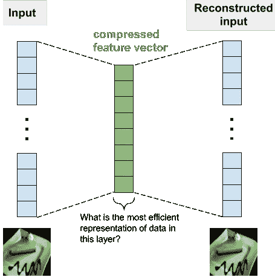
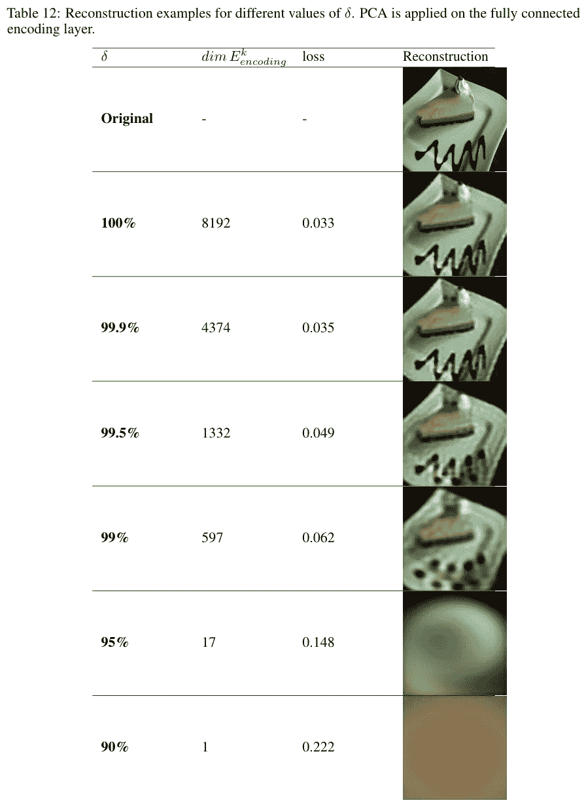
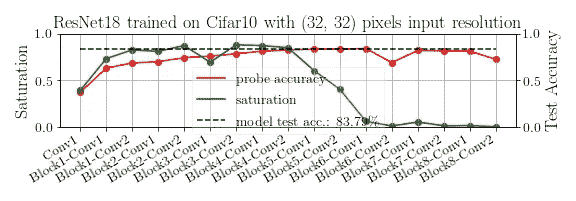
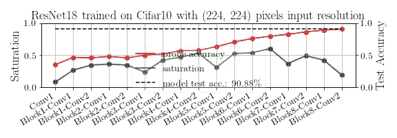

# 面向可解释人工智能的特征空间探索🚀

> 原文：<https://towardsdatascience.com/towards-explainable-ai-with-feature-space-exploration-628930baf8ef?source=collection_archive---------70----------------------->


安迪·凯利在 [Unsplash](https://unsplash.com?utm_source=medium&utm_medium=referral) 上的照片

基于大量数据训练的神经网络导致了难以置信的技术飞跃，几乎影响了我们生活的每一个部分。

这些进步是有代价的——即数据模型的*可解释性*和*可解释性*。与操作的复杂性相对应，为输入“选择”给定输出的标准变得相当神秘，导致一些人将神经网络称为“黑盒”方法。

深度神经网络工作得如此神奇，因为它们学习数据的有效表示，并且它们被有意地限制为捕捉数据中复杂的非线性模式。识别非线性模式的代价相当于**失去视觉，只是为了获得更微妙的声音感知**。在学习这些表示的过程中，神经网络的每一层中的特征在训练期间改变，并且随着不同的网络架构/数据集以不同的方式改变。这让我们想到了几个与深度学习相关的研究问题:

1.  我们如何理解与这些变化相关的模型性能？
2.  我们如何确定每层的最佳单元数量？
3.  我们如何定量描述网络中的变化分布？

我们试图在最近的论文“训练期间的特征空间饱和”中回答这些问题，该论文现已在 [arXiv](https://arxiv.org/abs/2006.08679) 上发布。通过在训练期间将主成分分析(PCA)应用于每一层中学习到的表示，我们可以确定解释这种差异所需的层大小或维度数量，从而逼近内在维度。通过一种类似于信息瓶颈方法[1]、SVCCA [2]和彩票假设[3]的方法，我们试图通过训练来识别网络上的动态分布。

# **层特征空间的固有维度**

为了回答需要多个维度来解释层特征差异的问题，我们看一下自动编码器。



派进去，派出来。自动编码器学习将数据压缩成特征向量，并且对于理解所学习的表示的动态是有用的。

自动编码器学习数据集的紧凑表示。它们对于识别神经网络压缩的限制以及整个模型训练中特征/表示的动态非常有用。

PCA 的输出是对应于数据相关性的各种方向(特征向量)和特征值。在这种情况下，我们的输入是在整个训练过程中根据图层表示计算的特征协方差矩阵。该矩阵捕获与特征独立性和相关性程度相关的一些动态。换句话说，**某些神经元响应与层**中的其他神经元一致或独立的程度。我们称这个投影为*层特征空间。*



阈值处理仅解释了最终全连接层的方差投影。

通过选择不同的阈值来投影特征(通过特征值的累积和计算)，我们能够比较图像的重建，在这种情况下，是一片饼。我们把这个阈值称为 delta (δ **)** ，它的范围是解释方差所需的方向的 0 到 100%。因此，对于 100%的增量，我们期望输入的近乎完美的重构——没有一个被排除。

在我们的实验中，超过 99%的阈值，特征在特征向量上的投影会留下几乎无法辨认的图像。大部分结构丢失，表明模型执行需要绝大多数特征子空间维度。这种方法允许我们比较由网络学习的特征空间，并且理解网络已经学习数据的最佳压缩的程度。

# 饱和度为模型训练提供了一个窗口

我们把解释层特征的方差所需的特征向量比例称为*饱和度*。每层具有介于 0 和 1 之间的饱和指数，指示层特征子空间的固有维度。这使我们能够在深度神经网络中比较各层的饱和度。此外，我们比较了 Alain】和 Ben gio【4】的探测分类器方法，显示了每层输出执行分类任务的相对能力。

我们观察到饱和度反映了推理过程是如何分布的。当饱和度较高时，图层的特征以复杂和非线性的方式变化，对应于探测分类器精度的相对较高的增益。接近最后一层时，层精度的边际增加会减少，大多数情况下饱和度也会减少。因此，饱和度是最佳网络深度的指标，因为冗余层会以*尾*模式使饱和度向零收敛，如本文所述。

# 输入分辨力

输入分辨率是神经网络架构中需要平衡的三个方面之一(包括深度和宽度)[5]。



与网络深度收益递减相关的饱和“尾巴”。探头性能仅在高饱和部分有所提高。饱和度的计算速度比探头精度快几个数量级。



饱和度“驼峰”与层的重要性有关。高分辨率数据的分类需要更复杂、非线性的特征空间分离，因此需要更高的饱和度。

在 [arXiv 文章](https://arxiv.org/pdf/2006.08679.pdf)中阅读更多相关内容，或者在 [GitHub](https://github.com/delve-team/delve) 上下载用于生成图的代码(delve Python 库)。

“训练期间特征空间饱和”，【https://arxiv.org/pdf/2006.08679.pdf 

[](https://github.com/delve-team/delve) [## delve-团队/delve

### Delve 是一个用于可视化深度学习模型训练的 Python 包。如果你需要一个轻量级的 PyTorch 或者…

github.com](https://github.com/delve-team/delve) 

感谢合著者 [Mats L. Richter](https://medium.com/u/1f048937b1f4?source=post_page-----628930baf8ef--------------------------------) ，Wolf Byttner， [Anders Arpteg](https://medium.com/u/8eda5a9ade80?source=post_page-----628930baf8ef--------------------------------) ，以及 [Mikael Huss](https://medium.com/u/bf4c4151f086?source=post_page-----628930baf8ef--------------------------------) 。非常感谢[卡尔·托姆梅](https://medium.com/u/7de8f3513f2e?source=post_page-----628930baf8ef--------------------------------)、[阿格林·希尔姆基尔](https://medium.com/u/8452ea37bdd2?source=post_page-----628930baf8ef--------------------------------)、拉斯穆斯·迪德里克森[、理查德·锡格河](https://medium.com/u/e2bf5583a?source=post_page-----628930baf8ef--------------------------------)、[亚历克西斯·德拉科普洛斯](https://medium.com/u/622790aa1486?source=post_page-----628930baf8ef--------------------------------)、[萨兰·N·苏布拉曼尼扬](https://medium.com/u/90b775aab5a2?source=post_page-----628930baf8ef--------------------------------)、[皮奥特·米格达](https://medium.com/u/50fed9fd6145?source=post_page-----628930baf8ef--------------------------------)和[乌尔夫·克鲁姆纳克](https://medium.com/u/41ee6301db0b?source=post_page-----628930baf8ef--------------------------------)在撰写本文期间提供的宝贵反馈。

如果您在研究中使用这项工作，请注明:

```
[@misc](http://twitter.com/misc){shenk2020feature,
  title={Feature Space Saturation during Training},
  author={Justin Shenk and Mats L. Richter and Wolf Byttner and Anders Arpteg and Mikael Huss},
  year={2020},
  eprint={2006.08679},
  archivePrefix={arXiv},
  primaryClass={cs.LG}
}
```

# 参考

[1]信息瓶颈法，[https://en.wikipedia.org/wiki/Information_bottleneck_method](https://en.wikipedia.org/wiki/Information_bottleneck_method)

[2] SVCCA，[https://medium . com/@ maddyschiappa/SVCCA-summary-e 83 a 53 f 7 DD 68](https://medium.com/@maddyschiappa/svcca-summary-e83a53f7dd68)

[3]彩票假说，[https://towards data science . com/breaking-down-the-Lottery-Ticket-Hypothesis-ca 1c 053 B3 e 58](/breaking-down-the-lottery-ticket-hypothesis-ca1c053b3e58)

[4]概率分类器，“使用线性概率分类器理解中间层”，[https://arxiv.org/abs/1610.01644](https://arxiv.org/abs/1610.01644)

[5] EfficientNet，[https://towards data science . com/efficient net-scaling-of-convolutionary-neural-networks-done-right-3 FDE 32 AEF 8 ff](/efficientnet-scaling-of-convolutional-neural-networks-done-right-3fde32aef8ff)