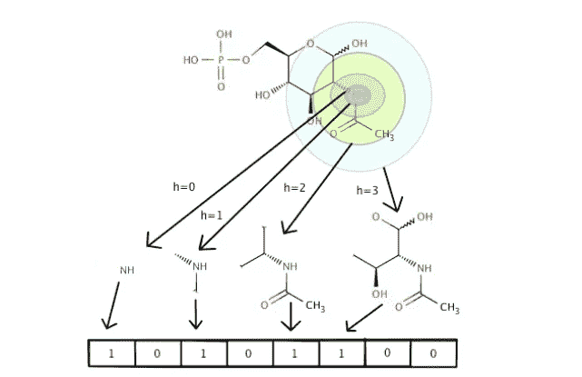
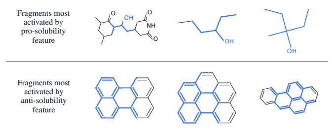
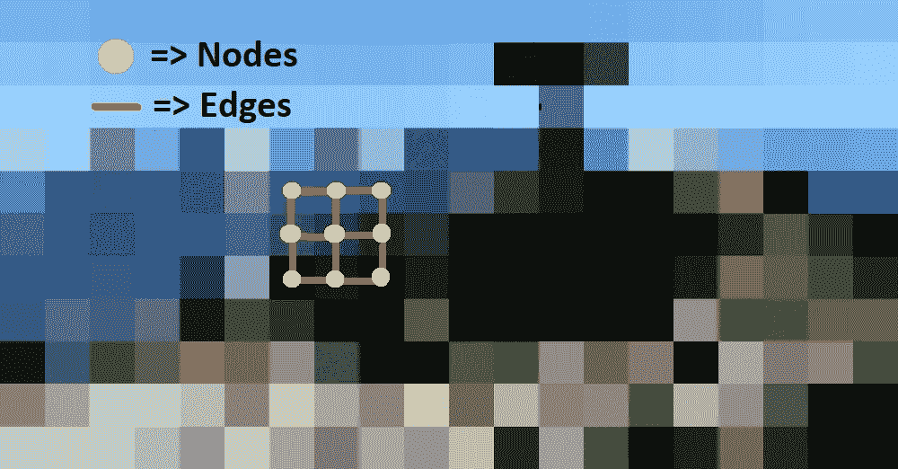

# 面向可解释的图形神经网络

> 原文：<https://towardsdatascience.com/towards-explainable-graph-neural-networks-45f5e3912dd0?source=collection_archive---------17----------------------->

## GNN 解释方法的新进展

拉斐尔·比斯卡尔迪在 [Unsplash](https://unsplash.com/s/photos/molecule?utm_source=unsplash&utm_medium=referral&utm_content=creditCopyText) 上拍摄的照片

## **目录**

*   什么是图卷积网络
*   GNNs 可解释性的当前挑战
*   第一次尝试:可视化节点激活
*   重用卷积神经网络的方法
*   模型不可知的方法:GNNExplainer
*   关于我
*   参考

## 序

这是一个稍微高级一点的教程，假设有图形神经网络的基础知识和一点计算化学。如果你想为这篇文章做准备，我在下面列出了一些有用的文章:

*   [图形的特征提取](/feature-extraction-for-graphs-625f4c5fb8cd)
*   [图上的机器学习任务](/machine-learning-tasks-on-graphs-7bc8f175119a)
*   [图形神经网络的 10 大学习资源](/top-10-learning-resources-for-graph-neural-networks-f24d4eb2cc2b)
*   [化学信息学简介](/introduction-to-cheminformatics-7241de2fe5a8)
*   [分子指纹](https://chembioinfo.wordpress.com/2011/10/30/revisiting-molecular-hashed-fingerprints/)

# 什么是图形神经网络

图一。图像卷积和图形卷积。[【来源】](/beyond-graph-convolution-networks-8f22c403955a)

卷积神经网络(CNN)和图神经网络(GNNs)的主要区别是什么？

简单来说就是*输入数据。*

您可能还记得，CNN 所需的输入是一个固定大小的向量或矩阵。然而，某些类型的数据自然是用图表来表示的；分子、引用网络或社交媒体连接网络可以表示为图形数据。在过去，当 GNNs 不流行时，图形数据通常以这样一种方式转换，即它可以作为输入直接提供给 CNN。例如，分子结构仍然被转换成固定大小的指纹，其中每一位指示某一分子亚结构是否存在[1]。这是一个将分子数据插入 CNN 的好方法，但是它不会导致信息丢失吗？

图二。通过从 NH 原子对中选取不同的分子亚结构将分子映射到位指纹，这些亚结构由不同的半径范围(h=0，h=1，…)定义。[ [来源]](https://chembioinfo.wordpress.com/2011/10/30/revisiting-molecular-hashed-fingerprints/)

GNNs 利用图形数据，摆脱了数据预处理步骤，充分利用了数据中包含的信息。现在，有许多不同的 GNN 架构，其背后的理论变得非常复杂。然而，GNNs 可以分为两类:空间和光谱方法。空间方法更直观，因为它将汇集和卷积操作(如在 CNN 中)重新定义到图形域。频谱方法从一个稍微不同的角度处理这个问题，因为它专注于使用傅立叶变换处理被定义为图形网络的信号。

如果你想了解更多，可以看看 Thomas Kipf 写的[博客文章](https://tkipf.github.io/graph-convolutional-networks/)，这是对 GCNs 的深入介绍。另一篇有趣的文章是[“MoleculeNet:分子机器学习的基准”](https://arxiv.org/abs/1703.00564) [2]，它很好地介绍了 GNNs，并描述了流行的 GNN 架构。

# GNNs 可解释性的当前问题

在写作的时候，我一方面可以数出对 GNN 解释方法有贡献的论文。然而，这是一个非常重要的话题，最近变得越来越流行。

GNNs 比标准神经网络更晚流行。虽然在这个领域有很多有趣的研究，但它仍然不太成熟。GNNs 的库和工具仍处于“实验阶段”,我们现在真正需要的是让更多的人使用它来发现 bugs 错误，并转向生产就绪模型。

嗯，创建生产就绪模型的一种方法是更好地理解它们做出的预测。这可以用不同的解释方法来完成。我们已经看到了许多有趣的可解释方法应用于 CNN，如梯度属性，显著图，或类激活映射。那么为什么不在 gnn 中重用它们呢？

图 3。与神经网络和其他机器学习模型一起使用的流行解释方法及其属性[【来源】](https://github.com/Harvard-IACS/2020-ComputeFest/tree/master/visualization_workshop)

事实上，这就是目前正在发生的事情。最初用于 CNN 的可解释方法正在被重新设计并应用于 GNNs。虽然不再需要重新发明轮子，但我们仍然需要通过重新定义数学运算来调整这些方法，使它们适用于图形数据。这里的主要问题是，关于这一主题的研究相当新，第一份出版物出现在 2019 年。然而，随着时间的推移，它变得越来越流行，很少有有趣的解释方法可以用于 GNN 模型。

在这篇文章中，我们将看看新颖的图形解释方法，看看它们如何应用于 GNN 模型。

# 第一次尝试:可视化节点激活

图 4。 ***左图:*** 具有 3 个堆叠层的神经图指纹模型的计算图的可视化，这是 Duvenaud 等人提出的架构，在这里，节点代表原子，边代表原子键。**右:**更详细的图，包括每个操作中使用的焊接信息[【来源】](https://arxiv.org/abs/1509.09292)

Duvenaud 等人在 2015 年发表了关于 GNNs 解释技术的开创性工作[3]。这篇论文的主要贡献是一个新颖的**神经图指纹模型**，但他们也为这种架构创建了一种解释方法。该模型背后的主要思想是创建可区分的指纹，这些指纹是直接从图形数据本身创建的。为了实现这一点，作者必须重新定义图形的池化和平滑操作。这些操作然后被用来创建一个单一的层。

这些层被堆叠 **n** 次以生成矢量输出，如图 4 所示(左图)。图层深度还对应于相邻结点的半径，结点要素是从这些半径收集和汇集的(在这种情况下为 sum 函数)。这是因为，对于每一层，池操作从相邻节点收集信息，类似于图 1。对于更深的层，池操作的传播从更远的邻域延伸到节点。与普通指纹相反，这种方法是可区分的，允许反向传播以类似于 CNN 的方式更新其权重。

除了 GNN 模型，他们还创建了一种简单的方法来可视化节点激活及其相邻节点。不幸的是，论文中没有很好地解释这一点，有必要看看它们的[代码实现](https://github.com/HIPS/neural-fingerprint/blob/master/examples/visualization.py)来理解底层机制。然而，他们在分子数据上运行它来预测溶解度，它突出了对溶解度预测具有高预测能力的分子的一部分。

图 5。论文作者在溶解度数据集上测试了他们的模型，以突出影响溶解度的部分分子。通过他们的解释方法，他们能够确定使分子更易溶解的分子亚结构(例如 R-OH 基团)和使其更难溶解的分子亚结构(例如非极性重复环结构)。[【来源】](https://arxiv.org/abs/1509.09292)

具体是怎么运作的？为了计算节点激活，我们需要做以下计算。对于每个分子，让我们通过每一层向前传递数据，就像在典型的 CNN 网络中对图像所做的那样。然后，我们用一个 *softmax()* 函数提取每个层对每个指纹比特的贡献。然后，我们能够将一个节点(原子)与其周围对特定指纹位贡献最大的邻居(取决于层深度)相关联。

这种方法相对直接，但是没有很好的文档记录。在这篇论文中所做的最初工作是很有希望的，随后是将 CNN 解释方法转换到图形领域的更精细的尝试。

如果想了解更多，可以看看他们的[论文](https://arxiv.org/abs/1509.09292)、[代码库](https://github.com/HIPS/neural-fingerprint/blob/master/examples/visualization.py)，或者我在本期 [Github 底部的方法详解。](https://github.com/deepchem/deepchem/issues/1761)

# 重用卷积神经网络的方法

[敏感分析](https://medium.com/@einat_93627/understand-your-black-box-model-using-sensitivity-analysis-practical-guide-ef6ac4175e55)、[类激活映射](http://cnnlocalization.csail.mit.edu/)或[激发反向传播](https://arxiv.org/abs/1608.00507)是已经成功应用于 CNN 的解释技术的例子。目前致力于可解释的 GNNs 的工作试图将这种方法转换到图的领域。围绕这一领域的大部分工作已经在[4]和[5]中完成。

我将为您提供这些方法的直观解释，并简要讨论这些方法的结果，而不是集中在这些论文中已经完成的这些方法的数学解释上。

## 概括 CNN 的解释方法

为了重用 CNN 的解释方法，让我们考虑 CNN 的输入数据，它是一个图像，是一个格子状的图形。图 6 说明了这个想法。

图 6。一幅图像可以概括为一个格子状的图形。红十字只显示了一小部分可以用图形表示的图像。每个像素可以被认为是节点 **V** ，其具有 3 个特征(RGB 值)并且通过边 **E** 连接到相邻像素。

如果我们记住图像的图形一般化，我们可以说 CNN 解释方法不太关注边缘(像素之间的连接)，而是关注节点(像素值)。这里的问题是图数据在边中包含了很多有用的信息[4]。我们真正寻找的是一种概括 CNN 解释技术的方法，以允许节点之间的任意连接，而不是像格子一样的顺序。

## 有哪些方法转化到了图域？

到目前为止，文献中已经提出了以下解释方法:

*   敏感性分析[4]
*   导向反向传播[4]
*   分层相关性传播[4]
*   基于梯度的热图[5]
*   类别激活图(CAM)〔5〕
*   梯度加权类激活映射(Grad-CAM) [5]
*   激发反向传播[5]

请注意,[4]和[5]的作者没有提供这些方法的开源实现，所以还不可能使用它们。

# 模型不可知的方法:GNNExplainer

*代码库中的论文可以在这里找到***。**

*别担心，实际上有一个你可以使用的 GNN 解释工具！*

*GNNExplainer 是一个与模型无关的开源 GNNs 解释方法！它也是非常通用的，因为它可以应用于节点分类、图分类和边缘预测。这是第一次尝试创建一种特定于图形的解释方法，由斯坦福大学的研究人员发表[6]。*

## *它是如何工作的？*

*作者声称，重用以前应用于 CNN 的解释方法是一种糟糕的方法，因为它们没有包含关系信息，而关系信息是图形数据的本质。此外，基于梯度的方法对于离散输入工作得不是特别好，这对于 GNNs 来说经常是这种情况(例如，[邻接矩阵](https://en.wikipedia.org/wiki/Adjacency_matrix)是二元矩阵)。*

*为了克服这些问题，他们创造了一种模型不可知的方法，找到了一个以最显著的方式影响 GNNs 预测的输入数据的子图。更具体地说，选择子图来最大化与模型预测的互信息。下图显示了 GNNExplainer 如何处理由体育活动组成的图表数据的示例。*

**

*图 7。图表数据说明了不同的体育活动。目标是解释中心节点的预测，下一个体育活动。对于红色图形， **Vi** 被预测为篮球。GNNExplainer 能够选择一个子图来最大化预测的互信息。在这种情况下，它从图表中提取了一个有用的信息——当某人在过去玩球类游戏时，选择篮球作为下一项体育活动的可能性很高。[【来源】](https://cs.stanford.edu/people/jure/pubs/gnnexplainer-neurips19.pdf)*

*作者提出的一个非常重要的假设是 GNN 模型的公式。该模型的架构或多或少可以是任意的，但它需要实现 3 个关键计算:*

*   *两个相邻节点之间的神经信息计算*
*   *来自节点邻居的消息聚合*
*   *聚合消息和节点表示的非线性转换*

*这些所需的计算多少有些限制，但是大多数现代 GNN 架构无论如何都是基于消息传递架构的[6]。*

*GNNExplainer 的数学定义和优化框架的描述就在本文中。但是，我不会告诉您(和我自己)太多的细节，而是向您展示一些使用 GNNExplainer 可以获得的有趣结果。*

## *实践中的 GNNExplainer*

*为了比较结果，他们使用了 3 种不同的解释方法:**gnnexplaner**、**基于梯度的方法(GRAD)** 和**图形注意力模型(GAT)** 。上一节提到了毕业生，但 GAT 模型需要一点解释。这是另一种 GNN 架构，它学习边的注意力权重，这将帮助我们确定图网络中的哪些边对于节点分类实际上是重要的[6]。这可以用作另一种解释技术，但是它只适用于这个特定的模型，并且它不解释节点特性，这与 GNNExplainer 相反。*

*让我们先来看看应用于合成数据集的解释方法的性能。图 8 显示了在两个不同数据集上运行的实验。*

***BA-Shapes 数据集**基于[**bara basi-Albert**](https://www.geeksforgeeks.org/barabasi-albert-graph-scale-free-models/)**(BA)**graph，这是一种图形网络，我们可以通过改变它的一些参数来自由调整大小。在这个基础图上，我们将附加一些小的房屋结构图(图案),如图 8 所示。这个房屋结构有 3 个不同的节点标签:顶部、中间和底部。这些节点标签只是表示节点在房子中的位置。因此，对于一个类似房子的节点，我们有 1 个顶部节点、2 个中间节点和 2 个底部节点。还有一个额外的标签，表明该节点不属于类似房子的图形结构。总的来说，我们有 4 个标签和一个由 300 个节点和 80 个房子状结构组成的 BA 图，这些节点和结构被添加到 BA 图中的随机节点。我们还通过添加 0.1N 的随机边缘来增加一点随机性。*

***BA-Community** 是两个 BA-Shapes 数据集的并集，因此总共有 8 个不同的标签(每个 BA-Shapes 数据集 4 个标签)和两倍多的节点。*

*让我们看看结果。*

**

*图 8。目标是为红色节点的预测提供一个解释。解释方法被设置为找到最准确地解释结果的 5 节点子图(标记为绿色)。[【来源】](https://cs.stanford.edu/people/jure/pubs/gnnexplainer-neurips19.pdf)*

*结果似乎很有希望。GNNExplainer 似乎用最准确的方式解释了结果，因为选择的子图与地面真相相同。Grad 和 Att 方法未能提供类似的解释。*

*该实验也在真实数据集上运行，如图 9 所示。这次的任务是对整个图网络进行分类，而不是对单个节点进行分类。*

***Mutag** 是一个由分子组成的数据集，这些分子根据对某种细菌的诱变作用进行分类。数据集有许多不同的标签。它包含 4337 个分子图。*

***Reddit-Binary** 是一个数据集，表示 Reddit 中的在线讨论线程。在这个图形网络中，用户被表示为节点，而边表示对另一个用户的评论的响应。根据用户交互的类型，有两种可能的标签。它可以是问答或在线讨论互动。总的来说，它包含了 2000 个图表。*

**

*图 9。GNNExplainer 运行图表分类任务。对于 Mutag 数据集，颜色表示节点特征(原子)。对于 Reddit-Binary 来说，任务是对图形是否是在线讨论进行分类。[【来源】](https://cs.stanford.edu/people/jure/pubs/gnnexplainer-neurips19.pdf)*

*对于 Mutag 数据集，GNNExplainer 可正确识别已知具有致突变性的化学基团(如 NO2、NH2)。GNNExplainer 还解释了被归类为 Reddit-Binary 数据集在线讨论的井图。这种类型的交互通常可以用树状模式来表示(看看基本事实)。*

# *关于我*

*我即将从南安普顿大学毕业，学习电子工程，是 IT 创新中心的研究助理。在我的业余时间，你可以发现我摆弄数据或者调试我的深度学习模型(我发誓这很有效！).我也喜欢徒步旅行:)*

*以下是我的社交媒体资料，如果你想了解我的最新文章:*

*   *[中等](https://medium.com/@kacperkubara)*
*   *[领英](https://www.linkedin.com/in/kacperkubara/)*
*   *[Github](https://github.com/KacperKubara)*
*   *[个人网站](https://kacperkubara.com/)*

# *参考*

***【1】重访分子哈希指纹**[https://chembioinfo . WordPress . com/2011/10/30/重访-分子哈希指纹/](https://chembioinfo.wordpress.com/2011/10/30/revisiting-molecular-hashed-fingerprints/)*

***【2】MoleculeNet:分子机器学习的基准**[https://arxiv.org/abs/1703.00564](https://arxiv.org/abs/1703.00564)*

***【3】用于学习分子指纹的图上卷积网络**[https://arxiv.org/abs/1509.09292](https://arxiv.org/abs/1509.09292)*

***代码库:**[https://github . com/HIPS/neural-fingerprint/blob/master/examples/visualization . py](https://github.com/HIPS/neural-fingerprint/blob/master/examples/visualization.py)*

***【4】图卷积网络的可解释技术**[https://arxiv.org/pdf/1905.13686.pdf](https://arxiv.org/pdf/1905.13686.pdf)*

***【5】图卷积神经网络的可解释方法**[http://open access . the CVF . com/content _ CVPR _ 2019/papers/Pope _ explability _ Methods _ for _ Graph _ 卷积 _ 神经网络 _CVPR_2019_paper.pdf](http://openaccess.thecvf.com/content_CVPR_2019/papers/Pope_Explainability_Methods_for_Graph_Convolutional_Neural_Networks_CVPR_2019_paper.pdf)*

***【6】gnnexplaner:为图形神经网络生成解释**[https://cs . Stanford . edu/people/jure/pubs/gnnexplaner-neur IPS 19 . pdf](https://cs.stanford.edu/people/jure/pubs/gnnexplainer-neurips19.pdf)*

***代码库:**[https://github.com/RexYing/gnn-model-explainer](https://github.com/RexYing/gnn-model-explainer)*