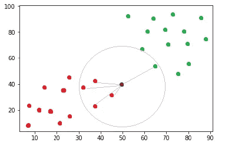
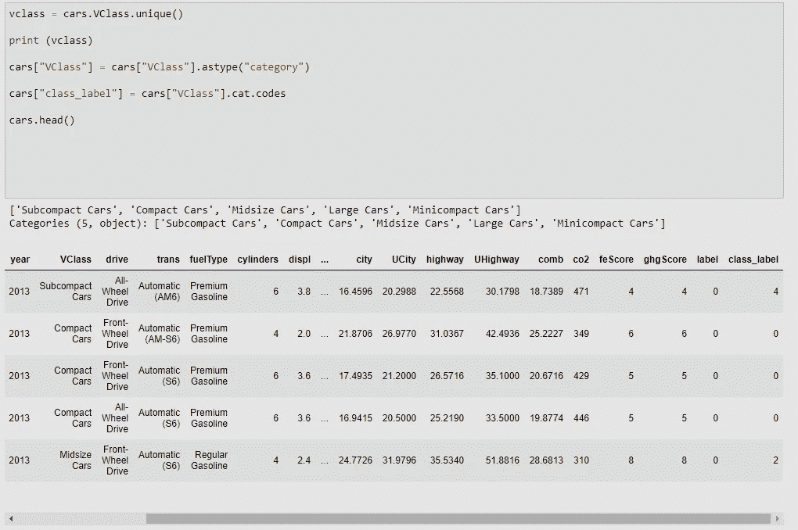
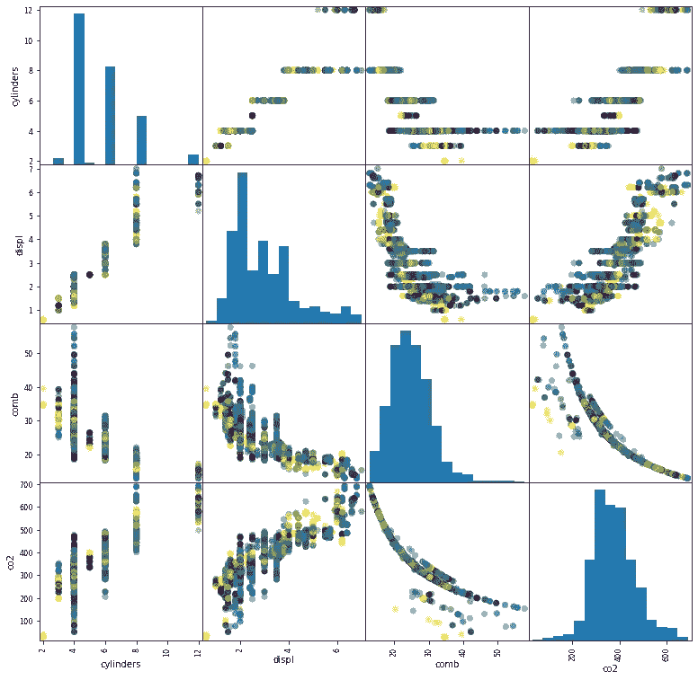
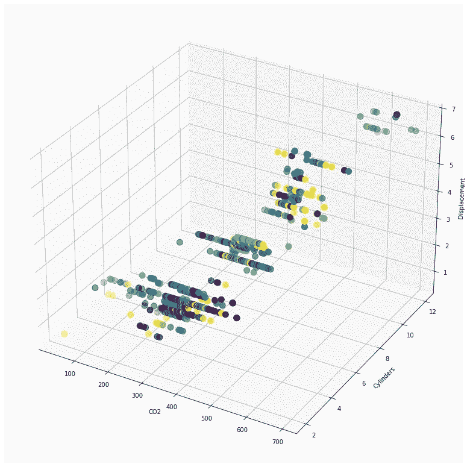
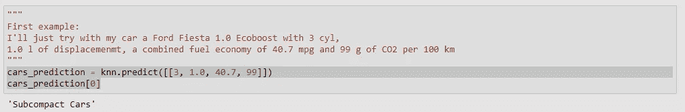
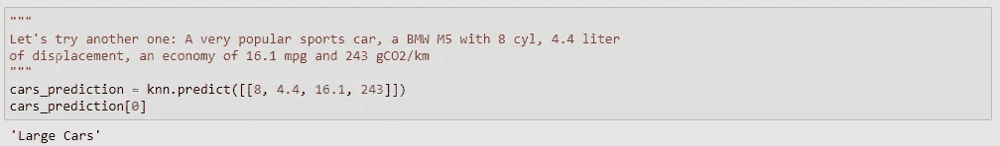
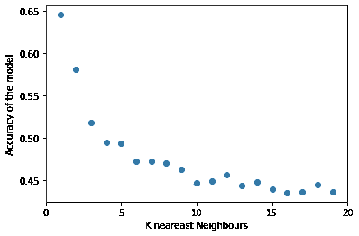
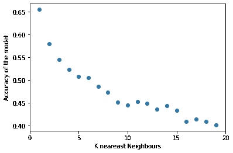
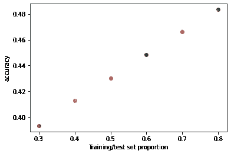

# 走向机器学习——K 近邻(KNN)

> 原文：<https://towardsdatascience.com/towards-machine-learning-k-nearest-neighbour-knn-7d5eaf53d36c?source=collection_archive---------29----------------------->

## 根据油耗和发动机大小对汽车进行简单的 K 近邻(KNN)分类。

纳亚尼·特谢拉在 [Unsplash](https://unsplash.com?utm_source=medium&utm_medium=referral) 上的照片

## 介绍

机器学习(ML)是当今一个非常流行的术语。我认为在网上过一天，不符合条件是不可能的。和我之前的许多人一样，我敢打赌，和我之后的许多人一样，不久前我在这个有趣的领域开始了我的旅程。

关于这个主题，有许多写得很好、很好的在线资源。我不是想发明新的轮子，我只是想分享我的观点，或者说我在学习密歇根大学[的热门在线课程 Python 中的应用机器学习](https://www.coursera.org/learn/python-machine-learning/home/welcome)时的想法。另外，我的目标是强调 K 最近邻法(KNN)的一些关键见解，我希望对初学者(比如我)有所帮助😊)从这种流行的机器学习方法入手的时候。

为了让事情更有趣一点，我使用了来自 [Udacity](https://github.com/udacity/AIPND/tree/master/Matplotlib/data) 的燃油经济性数据集。

## 简而言之，KNN

KNN 算法是一种监督最大似然算法，常用于分类和回归应用。KNN 分类器是基于实例(记忆)的分类器，这意味着它们依赖于类别(输入)之间的相似特征，以便预测新的(独立的)输入或数据点的类别。一般来说，我们需要一个训练数据集，在这里我们的模型被训练来预测，我们在一个独立的数据集上评估模型性能，以检查准确性。

KKN 到底是如何运作的？好吧，假设我们有一个需要分类的数据集(数组)。查看下图。

来源:作者

然后，在位置(50，40)添加一个新的数据点(棕色)。我们检查距离该新点最近的 K 个点(“邻居”)。我们假设 K = 5。所以我们需要找到离新条目最近的 5 个点(棕色点)。

来源:作者

如果选择 5，则根据欧几里德距离找到 5 个最近的点(浅紫色线)，我们可以看到 5 个点中有 4 个是红色的，因此我们的棕色点被分类到“红色”角。

K=5 表示带有异常值的噪声模型和可能的错误标记数据(低 K=1 或 K=2)之间的平衡，或导致拟合不足的大 K，因此基本上，结果不太详细，或在最坏的情况下，所有东西都变成一个类。正确的 K 取决于数据集。大多数情况下，K 是一个奇数，以避免随机决策，如果一个点距离两个已知类的距离相等。

足够的理论让我们开始实践吧！😊

# Python 实现

## 读取和检查数据

首先我们将导入依赖项，在这种情况下，我们需要 numpy、pandas、matplotlib 和 scikit-learn。

我们还需要一些数据。在这个例子中，使用了来自 Udacity 的流行的汽车燃油经济性数据集。这是一个包含 3929 辆汽车基本信息的数据集，比如品牌、型号、年份、变速器类型、车型、汽缸数量、油耗、二氧化碳排放量等。

在这里，我将举例说明如何使用 KNN 算法，根据气缸数量、排量、综合油耗和二氧化碳排放量，将未知车辆类别的汽车分类到适当的类别。

我们检查 VClass 列的唯一值，以获取数据集中的所有车辆类。我们有 5 节课。此外，我们创建了一个新列，其中包含用于绘图的类标签。

由于我们的模型需要首先被训练，我们将把数据分成训练和测试数据(稍后用于评估)。为此，我们使用 scikit-learn 库中的 train_test_split 函数。

对于大型数据集(3929 个条目)，我们不需要担心训练和/或测试规模。因此，函数的 test_size 参数为 None (=0.25)，这意味着测试集包含 25%的数据。

检查数据总是好的做法。为此，使用了特征对图。

训练数据集的配对图

可以观察到一些有趣的模式。即随着气缸数量的增加，排量和 CO2 输出增加，而平均每加仑里程减少。此外，更大的燃料消耗会产生更多的二氧化碳。

观察数据的另一个好方法是 3D 绘图。这里，二氧化碳、气缸数和排量分别绘制在 x、y 和 z 轴上。

3D 图—二氧化碳与气缸和排量的关系

同样，我们可以观察到，气缸多、排量大的汽车往往会产生更多的二氧化碳。尽管如此，一些 4 缸或 6 缸的小型汽车也会产生大量的二氧化碳(可能是大功率输出的运动型汽车)。但总的来说，发动机越大，产生的二氧化碳就越多。

## 建立和测试模型

首先，我们需要选择 K 个最近邻的数量。如前所述，对于这个例子，选择 KNN= **5** 。

然后对模型进行训练，显示精度。

模型的精度为 **0.4933** 。理论上看起来不太好。但是对于我测试过的两辆车，这个模型给出了很好的预测。

福特嘉年华是“小型车”，宝马 M5 是“大型车”。

## 精度随 K 不同而变化吗？

在这里，我们将检查是否改变最近邻 K 的数量可以改变我们的模型的准确性。为此，我们编写了一个简单的 for 循环。此外，random_state 被改变，这导致不同的训练/测试分离组合。

随机状态= 11

对于这个数据集和这个训练/测试分割，较大的 K 值导致较小的准确性。不同的训练/测试分割可能会产生不同的结果。

随机状态= 44

有趣的是观察到训练集#44 产生更大的最大和最小准确度。

## 不同的训练/测试比率会改变模型的准确性吗？

最后但并非最不重要的是，我们将检查是否改变列车测试分割率可以增加我们的模型的准确性。首先，我们生成可能训练/测试比率的列表 t。同样，K 设置为 5。然后创建一个循环，其中对于每个可能的 t 比率，运行 200 次模拟，并计算每个模拟的精度。然后计算每个比率 500 次运行的平均准确度，并绘制成散点图，以观察性能。

随机状态= 11

随机状态= 44

从图中可以看出，精度随着训练样本量的减少而降低。改变 random_state 在这里似乎没有影响，这是有意义的，因为我们对每个训练/测试比率运行 500 次模拟，然后计算平均精度。

## 结论

这里给出了一个 KNN 分类器在流行的汽车油耗数据集上的简短实现。首先，给出 KNN 方法的简要说明。然后，检查数据集以查看数据集中的一致性。然后，我们定义一个 KNN 分类器，K 设置为 5，这意味着一个新的数据点根据 5 个最近的邻居进行分类。

对于两个独立的测试示例，福特嘉年华和宝马 M5，分类工作良好。此外，模型会针对不同的 K 值进行评估，对于这个特定的数据集，K 值越小，模型越精确。将 random_state 更改为不同的值可以改变这种行为，但不会显著改变。

此外，增加训练规模与测试规模的比率，应该会产生更好的结果。这里，由于大量模拟，更改 random_state 值的影响较小。