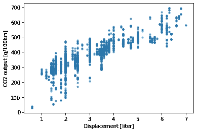
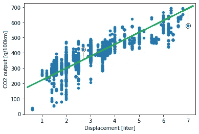
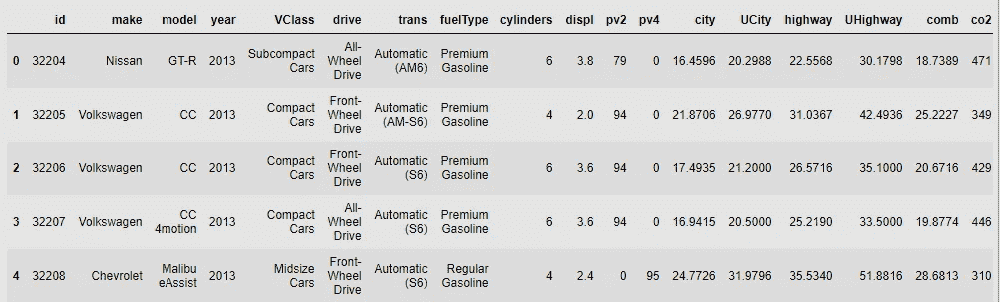
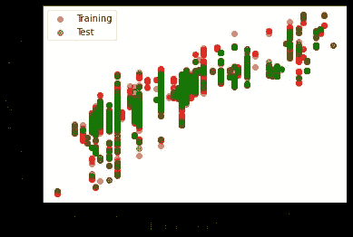
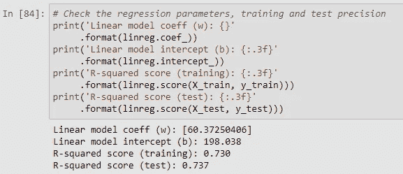
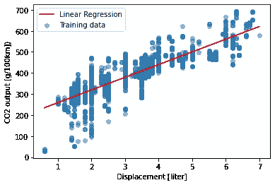
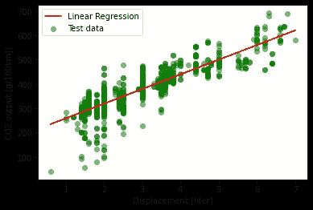
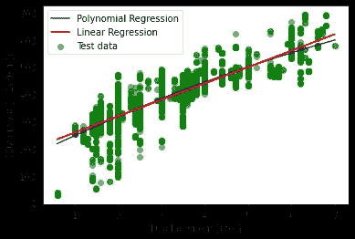
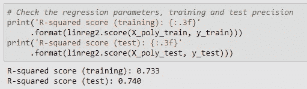
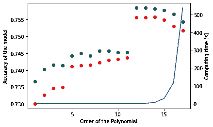

# 走向机器学习——线性回归

> 原文：<https://towardsdatascience.com/towards-machine-learning-linear-regression-and-polynomial-regression-df0c83c15b6e?source=collection_archive---------46----------------------->

瑞安·斯通在 [Unsplash](https://unsplash.com?utm_source=medium&utm_medium=referral) 上的照片

最近，我在 Coursera 上开设了一门密歇根大学的应用机器学习课程。该课程涵盖了一些广泛流行的机器学习算法。我决定写几篇关于这个主题的简短文章，旨在帮助刚接触这个主题的人进入机器学习的有趣世界。我的上一篇文章讨论了 K 近邻(KNN)分类的主题。你可以看看如何使用 [KNN 根据发动机大小、气缸数量、燃料消耗和二氧化碳排放量将汽车分类为车辆类别](/towards-machine-learning-k-nearest-neighbour-knn-7d5eaf53d36c)。今天我们更进一步，处理线性回归，另一个非常流行和广泛使用的技术。

**文章的结构**:

*   介绍
*   数据集加载和描述
*   数据分析
*   模型训练和评估
*   奖励:多项式回归
*   结论

享受阅读吧！🙂

# 介绍

在观察上一篇文章中的燃油经济性数据时，一些特性(如发动机排量和二氧化碳排放量)显示了一个有趣的模式。发动机排量的增加(“更大”的发动机)导致更高的 CO2 输出。让我们看看这个简单的数据散点图。有人会说数据显示了某种线性关系。

可以观察到数据分布的一些线性(来源:作者)

根据排量来预测你的车会产生多少二氧化碳，这难道不是很有趣吗？因此，今天的文章将研究线性回归，以及如何使用 Python 和 Scikit-Learn 库将它应用于一组数据。

## **什么是线性回归，为什么这么受欢迎？**

首先，这是一个非常简单的算法。它试图用一条直线(或线性方程)来描述两个变量之间的关系。如果我们再次查看上面的散点图，我们可以看到 CO2 是**因变量**，是**解释变量**的位移。在研究两个变量之间的关系之前，这种图通常被用作第一步。因此，该方法假设 **Y** (CO2)的每个值都可以描述为 **X** (位移)的**线性函数，遵循以下简单等式:**

Y=w*X + b

其中 ***w*** 为直线的**斜率， ***b*** 为 **y 轴截距**。或者用机器学习的术语来说，更多时候 ***w*** 被简称为**t*和 ***b*** *代表*。*****

**然而，必须考虑一些假设:**

1.  ****线性关系**:x 和 y 之间必须存在线性关系。**
2.  ****独立性**:时间序列数据中的连续残差之间没有相关性**
3.  ****同方差**:每个 x 的残差的恒定方差**
4.  ****正态**:残差呈正态分布**

**这些所谓的残差是什么？嗯，残差是观察值与拟合线的值(或偏差)。基本上就是蓝点离拟合线(绿线)的距离(红线)。**

****

**残差是从拟合线到观察值的距离(来源:作者)**

## ****最小二乘误差****

**到现在，你可能会问自己，我们是如何计算出 ***w*** 和 ***b*** 参数的？嗯，我们需要计算函数的“损失”，也就是所有残差的总和。这里，最小二乘误差开始发挥作用。这是一种常见的方法，计算从观察点(图上的红圈)到拟合线(绿线)的平方差，并汇总所有这些平方距离。该方法的目标是找到产生**最小可能距离平方和**的 ***w*** 和 ***b*** 。距离的平方和通常被称为“**均方误差**或 **MSE** 。**

**让我们跳到一个更实际的例子，关于我们的汽车油耗数据。🙂**

# **数据集加载和描述**

**像往常一样，首先我们导入依赖项，加载数据并查看数据帧。**

****

**数据帧的切片(来源:作者)**

**同样，我们将使用来自 [Udacity](https://github.com/udacity/AIPND/tree/master/Matplotlib/data) 的燃油经济性数据集。它包含了 3920 辆汽车的技术规格，包括气缸数、发动机尺寸(排量)、油耗、二氧化碳排放量等数据。我们只对发动机尺寸和二氧化碳排放量感兴趣。**

# **数据分析**

**由于 2D 阵列的 Scikit-learn 要求，并且由于我们只有 1 个输入特征， ***，我们选择并整形解释变量。*(-1，1)整形使用的是**。然后使用 Scikit-learn 的 train_test_split 函数将数据拆分为训练样本和测试样本。**

****

**训练/测试分割(来源:作者)**

# **模型训练和评估**

**下一步，我们准备我们的模型。因此，使用线性回归函数，并用训练数据拟合来训练模型。**

**我们可以通过调用**来检查回归函数的 ***w*** 和 ***b*** 参数。coef_** 和**。拦截 _** 属性。同样，通过调用**计算 **R 平方**(决定系数)。分数**，类似于 [KNN](/towards-machine-learning-k-nearest-neighbour-knn-7d5eaf53d36c) 。**

****

**模型的结果(来源:作者)**

**现在，让我们对训练数据进行线性回归。**

****

**线性回归—训练数据(来源:作者)**

**在我们绘制测试数据的回归图之前，首先我们根据我们的模型计算预测的 **Y** 值，我们的操作如下:**

****

**线性回归—测试数据(来源:作者)**

**正如我们从训练和测试数据中观察到的，我们的模型非常适合预测排量一般的汽车的二氧化碳排放量，这些汽车的发动机为 3-4 升。对于所谓的异常值，即与观察类的平均值有较大偏差的点，该模型表现出较弱的性能。即非常节能的汽车，如排放量非常低的混合动力汽车，或与之相反的功率输出非常高的汽车。此外，对于发动机非常小的汽车，该模型往往会大大高估二氧化碳的排放量。**

# **奖励:多项式回归**

**简而言之，多项式回归是回归分析的一种形式，其中使用 n 阶多项式而不是线性模型来建模数据关系。这种方法增加了模型的复杂性，当解释变量和因变量之间存在更复杂的数据关系时，可以产生更好的结果。也就是说，在我们的案例中，乍一看，排量和 CO2 输出之间的关系似乎符合线性趋势，但是我们扪心自问，二次函数甚至更高阶函数是否能更好地捕捉这种关系？**

**让我们来了解一下！🙂**

**要使用 Scikit-Learn 应用多项式回归，我们将使用预处理模块中的 PolynomialFeatures 类。基本上，它生成多项式特征，然后用于最小二乘线性回归方法。当我们假设二次关系时，我们将多项式的次数设置为 2。**

**我们训练模型。**

**接下来，我们绘制结果，与之前描述的线性回归模型进行比较。**

****

**多项式与线性回归(来源:作者)**

**应用**二阶** (k=2) **多项式回归**，一个二次函数，在我们的训练和测试数据集上产生略微更好的结果。**

****

**多项式回归的结果(k=2)(来源:作者)**

**在最后一步，我们测试不同阶多项式的模型精度。**

****

**准确性与计算时间(来源:作者)**

**从上图可以看出，当 K 值进一步增加时，精度会有所提高，但计算时间会大幅增加！此外，由于非常高的模型复杂性和过拟合，将 k 增加到 13 以上会开始降低精度。**

# **结论**

**本文给出了一个简单的线性回归例子。线性回归的主要优势之一是趋势描述，更稳定的预测，但在异常值或极值(最小值或最大值)的情况下往往不准确。多项式回归提高了性能，但是随着模型复杂性的增加，往往会过度拟合，并显著增加计算时间。**

**我希望每件事都被清楚地解释和介绍了。直到下一次，随时检查我的其他文章。🙂**

** [## 走向机器学习——K 近邻(KNN)

### 根据油耗和发动机大小对汽车进行简单的 K 近邻(KNN)分类。

towardsdatascience.com](/towards-machine-learning-k-nearest-neighbour-knn-7d5eaf53d36c)  [## 测量和计算普利特维采湖国家公园的河流流量

### 你想知道如何测量和计算溪流或河流的流量吗？

towardsdatascience.com](/measuring-and-calculating-streamflow-at-the-plitvice-lakes-national-park-678223318191) 

欢迎每一个评论或建议！[领英](https://www.linkedin.com/in/karlo-leskovar-a8612b105/)

请随时关注我在[媒体](https://towardsdatascience.com/@Karlo_Leskovar)上的故事。干杯！**