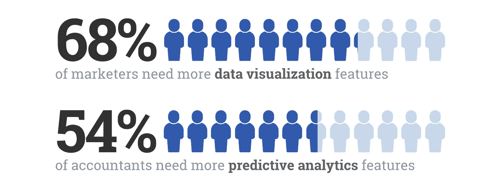
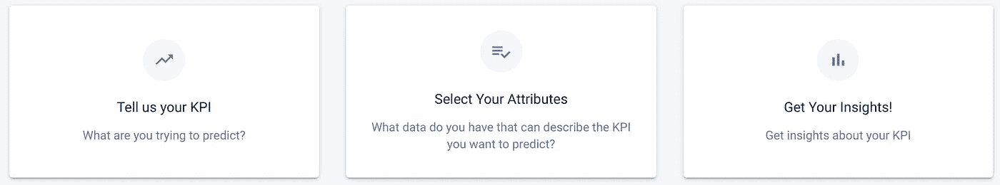

# 走向无代码分析:让每个人都成为数据科学家

> 原文：<https://towardsdatascience.com/towards-no-code-analytics-making-everyone-a-data-scientist-f7693bd0abfd?source=collection_archive---------42----------------------->

## Wix 让每个人都成为网站建设者，Canva 让每个人都成为设计师。现在，是时候让每个人都成为数据科学家了。

弗兰基·查马基在 [Unsplash](https://unsplash.com?utm_source=medium&utm_medium=referral) 上拍摄的照片

在互联网的早期，建立一个网站是 T4 的技术壮举。现在，像 Wordpress 这样的无代码工具使任何人都可以快速启动一个网站，与 1995 年的 31，000 个网页相比，今天已经有超过 50 亿个网页。

同样，今天的数据科学受到高技术准入门槛的损害，但将通过无代码分析工具实现民主化。数据科学家通过复杂工具的字母汤“将数据转化为见解”。

r，SAS，SQL，NoSQL，TF，D3.js，NLTK，RF，MATLAB，ML。我编了一个，没关系。

关键是，如果企业不理解数据科学，他们就无法利用数据科学，而且不是每个人都可以雇佣数据科学家团队——在美国，他们的工资超过六位数。

一项关于 500 名美国雇员如何使用数据的调查显示，企业没有从数据中获得他们需要的洞察力。例如，68%的营销人员需要更多的数据可视化功能，54%的会计师需要更多的预测分析功能来预测风险。

来自 [GetApp](https://lab.getapp.com/excel-isnt-enough-for-accountants-to-do-business-research/) 的统计数据。用[制作的图形美观。AI](http://beautiful.ai) 。

# 商业领袖对此能做些什么

无论你是管理一个营销团队还是经营一家咖啡馆，所有领导者都应该能够使用数据科学，而不需要成为“人工智能向导”或“代码忍者”。

这就是数据科学民主化的含义。像 [Apteo](http://apteo.co) 这样的无代码工具的目标是让每个人都成为数据科学家，让所有规模和技能水平的团队利用这项技术，从可视化到预测分析。

为了明确无代码分析可以应用于任何垂直领域，你可以看看一个[罗宾汉数据追踪器](https://app.apteo.co/workspaces/2333682638402880697)，这个[摇摆州追踪器](https://app.apteo.co/workspaces/2262196577147815275)，或者这个[汤姆·布拉迪分析](https://app.apteo.co/workspaces/2277114924624775041)。

# 民主化——不仅仅是一个时髦词

通过民主化的设计，Canva 成为了一家 60 亿美元的公司。

Wix 通过民主化网站建设，在纳斯达克获得了高达 126 亿美元的市值。

Shopify 使电子商务民主化，目前在纽约证券交易所的市值超过 1000 亿美元。

有人可能会说，谷歌——一家价值[万亿美元的公司](https://www.nytimes.com/2020/01/16/technology/google-trillion-dollar-market-cap.html#:~:text=Google%20Reaches%20%241%20Trillion%20in%20Value%2C%20Even%20as%20It%20Faces,to%20reach%20the%20market%20milestone.&text=SAN%20FRANCISCO%20%E2%80%94%20Numbers%20have%20long%20held%20a%20special%20significance%20at%20Google.)——通过让世界信息触手可及而使知识民主化，通过让你按点击付费而无需购买广告牌而使广告民主化，等等。

1998 年探索谷歌理念的开创性论文提出了这样的假设:

> “迄今为止，大多数搜索引擎的开发都是在很少公布技术细节的公司进行的。这导致搜索引擎技术在很大程度上仍然是一门黑色艺术，并以广告为导向。

22 年后，谷歌每天回答数十亿次查询。谷歌让寻找*信息变得容易。*无代码分析使寻找*见解*变得容易。

甚至在 90 年代，我们就知道“最好的导航服务应该让在网上找到几乎任何东西变得容易。”同样，最好的数据科学服务应该让你很容易找到对数据的任何见解。

# 寻找洞见

忘记从令人困惑的自述文件中导入依赖项或在 Tableau 中编写 SQL，无代码工具使任何人都可以识别趋势、KPI 驱动因素并创建预测。

Apteo 的三步流程。

例如，假设你是一个 SaaS 的企业主，对降低“用户流失率”感兴趣那是你的 KPI。无代码工具允许您选择 KPI，或者您试图解决的问题，所有繁重的工作都在后台完成。

在 Apteo 的例子中，有助于分析 KPI 的属性是自动选择的，但是用户可以添加或删除属性。很快就会创建一个模型，让您根据插入的属性生成预测。

# 从亚马逊、沃尔玛、网飞和麦当劳到你

许多行业领先的公司将他们的成功归功于数据的力量，但他们也有资源雇佣大型数据科学团队。

例如，沃尔玛[使用预测模型](https://corporate.walmart.com/newsroom/innovation/20170807/5-ways-walmart-uses-big-data-to-help-customers#:~:text=In%20many%20industries%2C%20big%20data,our%20stores%20and%20e%2Dcommerce.)来预测特定时段的需求，这样他们就可以安排适当数量的员工，改善结账体验。

亚马逊的[推荐功能](https://www.investopedia.com/articles/insights/090716/7-ways-amazon-uses-big-data-stalk-you-amzn.asp)为亚马逊的收入贡献了高达 [35%的份额——上一财年几乎达到](https://www.forbes.com/sites/chuckcohn/2015/05/15/a-beginners-guide-to-upselling-and-cross-selling/#27b8d7e52912)[1000 亿美元](https://www.marketwatch.com/investing/stock/amzn/financials)。

麦当劳以[3 亿美元](https://www.wired.com/story/mcdonalds-big-data-dynamic-yield-acquisition/)收购了数据公司 Dynamic Yield，以预测其各地的客户需求，减少浪费，并增加利润。

再举一个例子，你的网飞反馈是为你和你的个人兴趣定制的，通过[预测模型](https://seleritysas.com/blog/2019/04/05/how-netflix-used-big-data-and-analytics-to-generate-billions/)输入数据，比如你喜欢的节目，你观看它们的日期和时间，你使用的设备，你是否暂停了节目(以及你是否在之后继续)，等等。

通过使用无代码数据科学工具，您自己的企业可以利用从亚马逊到沃尔玛的行业领导者使用的强大技术。