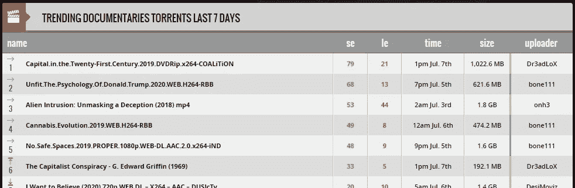
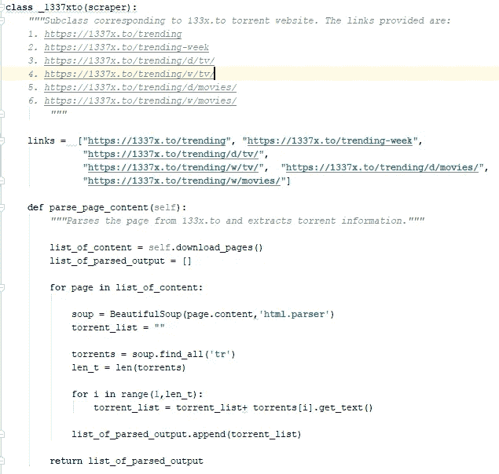
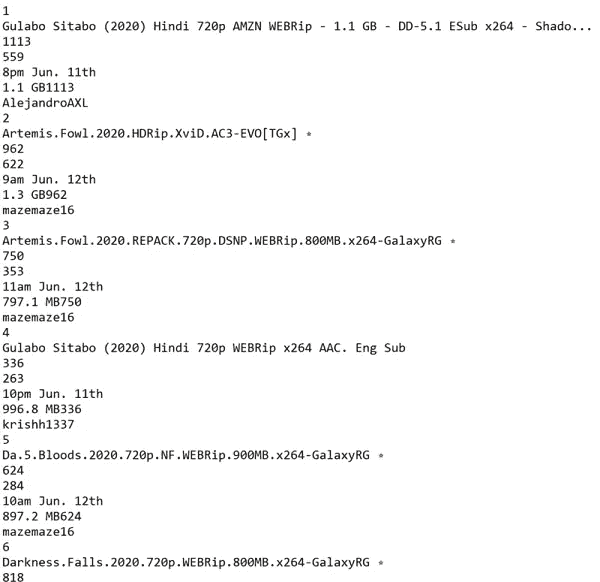
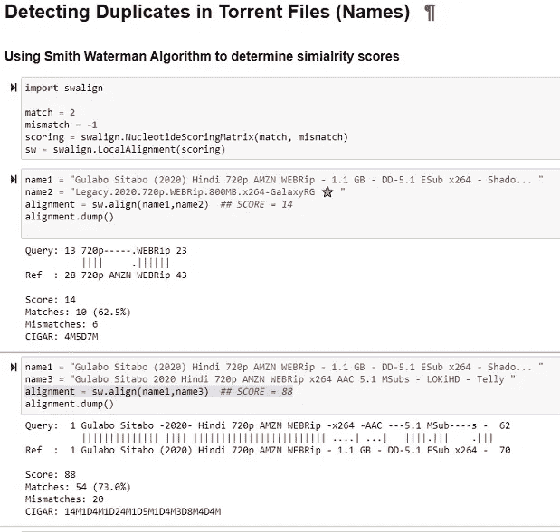
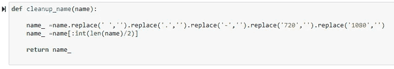
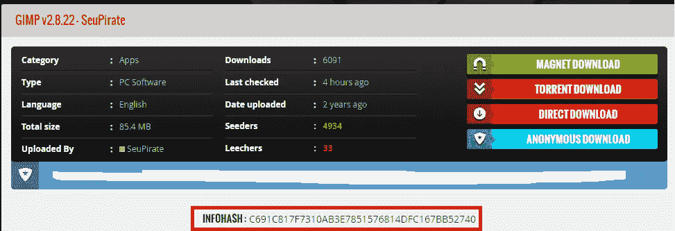
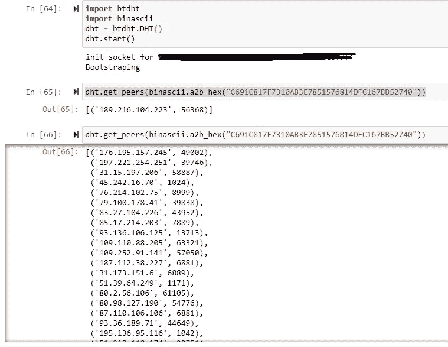
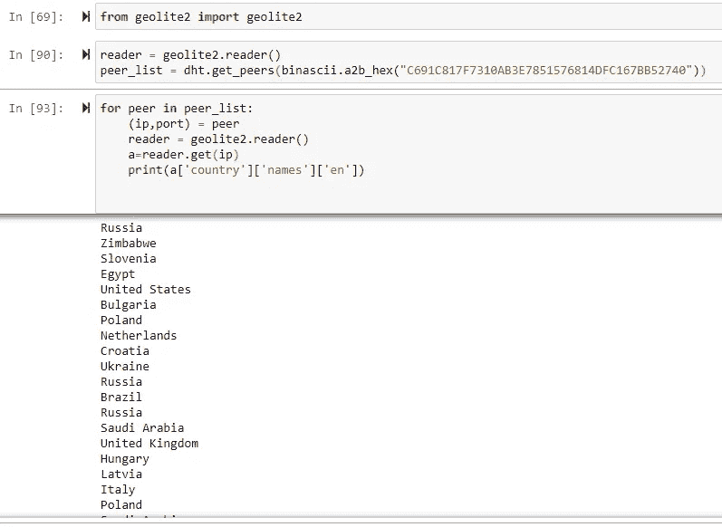
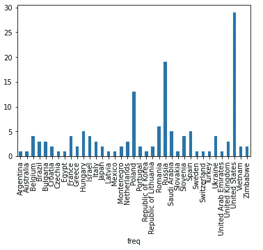

# 走向激流科学:数据工程

> 原文：<https://towardsdatascience.com/towards-torrent-science-data-engineering-d79e774886cb?source=collection_archive---------48----------------------->

## 激流科学

## 挖掘 BitTorrent 网络

艾莉娜·格鲁布尼亚克在 [Unsplash](https://unsplash.com?utm_source=medium&utm_medium=referral) 上的照片

最近，我在综艺节目上偶然发现了一篇名为“网飞如何利用盗版挑选节目”的旧文章。它讲述了网飞如何挖掘 BitTorrent 网络来确定哪些程序必须被选择用于其平台。最近的一篇[文章](https://torrentfreak.com/torrent-traffic-surpasses-netflix-in-europe-middle-east-and-africa-200508/)(“Torrent 流量在欧洲、中东和非洲超过网飞”)强调，多年来 BitTorrent 流量已经逐渐下降，但其使用在欧洲、非洲和亚太地区仍然很突出。显然大量流媒体平台的兴起是 BitTorrent 流量复苏的原因(查看这篇[文章](https://www.vice.com/en_nz/article/d3q45v/bittorrent-usage-increases-netflix-streaming-sites))。顺便说一句，必须注意的是，VPN 的广泛使用使得识别流量的来源变得困难，因此必须有保留地分析这些统计数据。

> 有人为了社会的更大利益而分享他们的带宽，这种想法违背了“公地热”的理论，这是令人惊讶的。

BitTorrent 网络吸引我有两个主要原因。首先，从创新的角度来看，布拉姆·科恩功不可没。使用我刚刚熟悉的简单 CS 原则，在上传的同时下载和组装单个文件的想法很鼓舞人心。第二点是其运作的经济性。有人会为了社会的更大利益而分享他们的带宽，这种想法违背了公地悲剧的理论，这是令人惊讶的。

## 一言以蔽之的 BitTorrent

简单地说，它是一个对等共享协议，试图解决三个主要问题。首先，它提供了一种算法来将一个大文件分割成块，确定哪个对等体拥有哪个块，以及哪个块应该被发送到哪里，而不会产生很大的开销。第二，它试图解决一旦下载了文件，对等点就会频繁地从网络中流出的问题。最后，公平的问题，处理保持上传和下载率之间的相关性。

要使用 BitTorrent 网络，需要一个可以将对等点连接到网络的客户端。在网络上共享的每个文件都与包含客户端所需信息的种子文件相关联。共享完整文件的对等点称为种子，下载文件的对等点称为网络上的吸血鬼。为了网络的健康，种子设定者最好能长时间设定文件的种子。

该协议的更多技术细节超出了本文的范围。查看维基百科了解更多信息。

## 挖掘 BitTorrent 网络

BitTorrent 网络由与网络中的文件和网络中对等体的特征相关的数据组成。例如，网飞感兴趣的是确定哪些是它的消费者想要观看的受欢迎的节目。BitTorrent 是一个世界范围的网络，确定其同伴的地理位置有助于挖掘许多有趣的模式。比如一个国家的社会政治指标和观影习惯有什么关联？特定国家喜欢的音乐类型是什么？哪个国家的色情消费最高？

只有当我们有了一个从 BitTorrent 网络获取数据的框架时，这些问题和许多其他问题才能被探索。这是本文的重点。在这个*系列*、名为**洪流科学**的后续文章中，我将报告执行这一分析所采用的不同技术，并分享从这一调查中获得的结果。

# 数据工程

获取 BitTorrent 数据的过程分为两个部分。首先，抓取种子网站以找到流行的文件(大部分是盗版视频)以及与每个文件相关的对等点(种子和吸血鬼)的数量。许多流行的文件被多次上传，这就需要对文件名进行相似性匹配，并组合属于相同内容的信息。

其次，确定每个文件的对等体的地理位置。请注意，这些信息在 torrent 网站上并不容易获得。这需要对 BitTorrent 协议的工作原理有所了解。

整个过程必须定期重复，以收集时序数据。

## 擦

让我们从第一部分开始。这需要抓取流行的种子网站，如海盗湾，1337x 等。本文仅关注 1337x.to。该网站定期更新按周和日分组的趋势种子列表，涵盖电视、电影、应用程序、游戏等类别。

种子网站快照:1337x.to

对于每个趋势部分，例如趋势纪录片，可以提取种子的名称。查看下面的快照。对于这些种子，我们需要提取种子和水蛭的数量，上传大小，时间等。以及播种者和吸血者的地理位置。

从 1337 年到 2010 年的趋势纪录片

这相当简单。每个网站都需要一个自定义代码。以下代码片段完成了 1337x.to 的工作

代码片段— BeautifulSoup

欲了解更多关于使用美汤的信息，请查看本文。

以下是典型输出的示例。请注意，由于从多个来源上传相同的内容导致多个种子文件，从而出现了重复。以“阿特米斯奇幻历险”为例，它已经上传了两次(输出中的 2 和 3)，可能在文件格式和其他规范上有所不同。但是当涉及到数据挖掘和提取模式时，必须将两者视为同一个文件，因为它们对应于同一个电影。这同样适用于名为“Gulabo Sitabo”的印地语电影(输出中的 1 和 4)。

从网站抓取数据的实例(快照)。

在下一节中，我将讨论如何高精度地找到这些副本。

## 检测重复项

这个问题是关于寻找一对文本串之间的相似性。考虑一个函数，它可以返回一个度量或一个分数来表示两者之间的相似性。第一组想法可能围绕着类似 Jaccard 距离或余弦距离的相似性度量(查看这篇[文章](/overview-of-text-similarity-metrics-3397c4601f50#:~:text=Differences%20between%20Jaccard%20Similarity%20and,term%20frequency%20or%20tf%2Didf)))。但这实际上是一个简单得多的问题，类似史密斯-沃特曼算法的东西适合于这个目的。

**Smith-Waterman 算法**执行局部[序列比对](https://en.wikipedia.org/wiki/Sequence_alignment)；即，用于确定两串[核酸序列](https://en.wikipedia.org/wiki/Nucleic_acid_sequence)或[蛋白质序列](https://en.wikipedia.org/wiki/Protein_sequence)之间的相似区域。史密斯-沃特曼算法不是查看[整个](https://en.wikipedia.org/wiki/Needleman%E2%80%93Wunsch_algorithm)序列，而是比较所有可能长度的片段，并且[优化](https://en.wikipedia.org/wiki/Mathematical_optimization)的[相似性度量](https://en.wikipedia.org/wiki/Similarity_measure)。”——维基百科上说的。

**swalign** 是一个 python 包，它实现了这种在幕后使用动态编程的算法。查看下面的代码片段，它展示了运行中的算法。

用于检测相同种子内容的代码片段

匹配和不匹配值可以改变，以适应当前的应用。通常的值是 2 和-1，这对我们的目的来说也很好。可以看出，当比较 name1 和 name2 时，得分为 ***14*** ，而 name1 和 name3，属于同一部名为 Gulabo Sitabo 的宝莱坞电影，得分为 ***88*** 。

注意，对于同名但不同集或季的电视节目，这种相似性度量将失效。尽管这将取决于一个人希望做什么样的分析。如果有人希望比较一部电视连续剧不同季节或不同集的受欢迎程度，这可能行不通。但是，如果人们希望在电视节目之间进行广泛的比较，那么这仍然是可行的。

通过考虑这样的启发，即只有字符串的开头部分与名称相关，而后面部分只是元数据，并删除点、空格和连字符，我们可以获得更准确的分数。这是使用下面的代码片段实现的。

代码片段:清理

## 提取对等地理位置

这是一个有趣的部分，因为它需要对 BitTorrent 协议的工作原理有更深入的理解。如前所述，为了使用 BitTorrent 下载文件，需要一个客户端，如洪水。向客户端提供关于所需数据的信息，这是找到拥有需要下载的文件的对等体列表所必需的。该信息以指向存储对等体列表的追踪器网站的指针的形式可用。

通过使用分布式哈希表，也可以在没有跟踪器的情况下执行上述任务。这在追踪器网站被来自对等点的请求过载时更有用，因为客户端需要定期刷新对等点列表。在这种情况下，每个节点都维护一个独立的路由表，当该节点与网络中的其他节点通信时，该路由表会更新。注意，即使对于无*跟踪器的*种子，至少需要一个节点来引导到网络中。

如果这一切都令人困惑，或者你打算了解更多，检查下面的视频。

让我们看一下完成这项工作的代码片段。我使用了 BitTorrent DHT 的 python 实现( [Github](https://github.com/nitmir/btdht) 链接)——**Bt DHT。**

让我们尝试识别正在下载流行的开源图像编辑软件 GIMP 的同行的地理位置。这将需要从网站 1337x.to 获取的 *infohash* ，如下图所示。

从 1337x.to 获得 GIMP 图像编辑器的 Infohash

下面的代码使用 **dtdht** 包从网络中提取对等体列表。输出显示了网络中当前与该种子相关联的对等体的 IP 地址列表。

提取对等 IP 列表的代码片段

一旦获得 IP 列表，我们就可以使用 geoIP2 数据库来确定地理位置。当你安装[包](https://github.com/rr2do2/maxminddb-geolite2)， **maxminddb-geolite2 时，这实际上非常简单。**

查看下面的代码片段，其中显示了上面显示的 IP 地址所属的国家。

Gimp torrent 的对等机所在的国家。

显然，GIMP 正在被全世界下载，列表中有 145 个对等点。美国有 29 名同行，紧随其后的俄罗斯有 24 名同行。

下图显示了该特定软件在各个国家的同行频率。

每个国家的同行数量

## 接下来呢？

我目前运行了一个 cronjob，每 6 小时从 torrent 网站收集一次数据。在接下来的几周/几个月里，我将收集足够的数据来尝试数据挖掘算法，并寻找模式和关系。