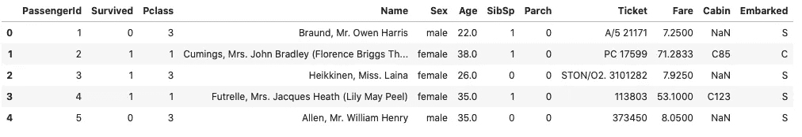
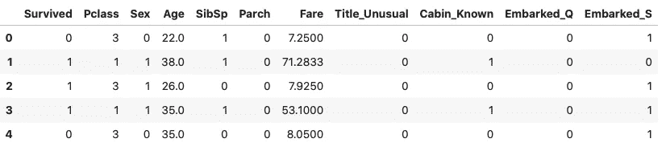
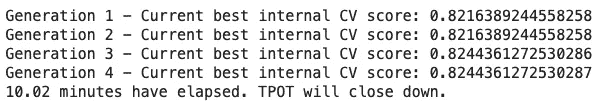
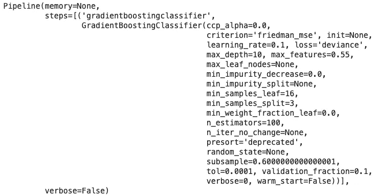

# TPOT:Python 中的自动机器学习

> 原文：<https://towardsdatascience.com/tpot-automated-machine-learning-in-python-e56800e69c11?source=collection_archive---------27----------------------->

## 面向所有人的机器学习？

每个人和他们的母亲都想进入机器学习领域。这很好，但是这些年来这个领域在一定程度上变得自动化了。如今，你不必成为一名机器学习工程师，就能生产出高质量的模型。*如何？这就是像 TPOT 这样的图书馆发挥作用的地方。*


由[万基·金](https://unsplash.com/@kimdonkey?utm_source=medium&utm_medium=referral)在 [Unsplash](https://unsplash.com?utm_source=medium&utm_medium=referral) 上拍摄的照片

如果你更喜欢视频，或者只是想巩固你的知识，请随意观看我们关于这个主题的视频。[源代码](https://github.com/betterdatascience/YouTube/blob/master/0004_TPOT.ipynb)包括:

让我们面对事实——机器学习并没有媒体炒作的那么有趣。你可以用它做一些令人惊奇的事情，不要误会我的意思。我说的只是实际的机器学习过程。你知道，寻找最优算法及其超参数的过程。

这一部分正在变得(或者已经变得)自动化，这很好——因为我们作为工程师可以专注于更有趣的事情。

理想的读者是熟悉 Python 编程语言和机器学习项目一般流程的人。你不需要成为专家，甚至不需要在这个领域工作，但是你应该熟悉最常用的算法以及如何使用它们。

这篇文章的结构如下:

1.  TPOT 是什么？
2.  遗传程序设计简介
3.  数据集加载和准备
4.  TPOT 在行动

所以事不宜迟，让我们开始吧！

# TPOT 是什么？

TPOT，或*基于树的流水线优化工具*是一个用于自动机器学习的 Python 库。以下是官方定义:

> 把 TPOT 当成你的数据科学助理。TPOT 是一个 Python 自动化机器学习工具，它使用遗传编程优化机器学习管道。[1]

在某种程度上，TPOT 是你的数据科学助手。它自动化了“无聊”的事情，把数据收集和准备的任务留给了你。我知道这一部分对你们中的一些人来说并不有趣，但这是 80%的工作。有了像 TPOT 这样的图书馆，这个比例可能只会更高。

此外，由于显而易见的原因，数据收集和准备不能完全自动化。官方文件中的另一句话说明了这一点:

> TPOT 将通过智能地探索成千上万个可能的管道来为您的数据找到最佳管道，从而自动化机器学习中最乏味的部分。[1]

让我们快速看一下你的平均机器学习管道，看看 TPOT 在哪里:


如您所见，该库自动化了该过程的每一个繁琐部分。

但是怎么做呢？通过使用被称为“基因编程”的东西。让我们在下一节探讨这个术语。

# 遗传程序设计简介

官方网站很好地总结了这个概念:

> 遗传编程(GP)是进化算法(EA)的一种，是机器学习的一个子集。进化算法用于发现人类不知道如何直接解决的问题的解决方案。摆脱了人类的先入之见或偏见，EAs 的自适应特性可以产生与人类最大努力相当甚至更好的解决方案。
> 
> 受到生物进化及其基本机制的启发，GP 软件系统实现了一种算法，该算法使用随机变异、交叉、适应度函数和多代进化来解决用户定义的任务。GP 可用于发现数据中特征之间的函数关系(符号回归)，将数据分组(分类)，以及辅助电路、天线和量子算法的设计。GP 通过代码合成、遗传改良、自动错误修复应用于软件工程，并用于开发游戏策略……等等。[2]

有了正确的数据和正确的数据量，我们可以使用机器学习来学习任何函数。尽管如此，知道使用哪种算法可能令人生畏——它们实在太多了。我们仍然没有触及超参数调整的想法。

这就是遗传编程真正闪耀的地方，因为它受到达尔文自然选择过程的启发，它们被用于生成计算机科学中优化的解决方案。

遗传算法有 3 个特性:

1.  **选择**:你有一个可能的解决方案和一个适应度函数的群体——然后在每次迭代中评估每个适应度
2.  **交叉**——选择最优解，进行交叉，产生新的种群
3.  变异——带着他们的孩子，用一些随机的修改使他们变异，直到你得到最合适或最好的解决方案

听起来确实很多，但是 TPOT 并不要求我们成为基因编程专家。了解这些概念总是有益的。

好了，到目前为止我们已经讨论了理论部分。我们将在下一部分收集和准备一些数据。

# 数据集加载和准备

我喜欢在我的大多数例子中使用[泰坦尼克号数据集](https://raw.githubusercontent.com/datasciencedojo/datasets/master/titanic.csv)。数据集不是太基础，因为它需要一些准备，但也不是太复杂，因为准备过程需要太长时间。你肯定可以比我花更多的时间来准备这个数据集，但这足以满足我们的需求。

进口方面，我们现在需要三样东西:*熊猫*、*标准器*和*火车试分裂*:

```
import pandas as pd
from sklearn.preprocessing import StandardScaler
from sklearn.model_selection import train_test_split
```

接下来，我们可以加载数据集并显示前几行:

```
data = pd.read_csv(‘[https://raw.githubusercontent.com/datasciencedojo/datasets/master/titanic.csv'](https://raw.githubusercontent.com/datasciencedojo/datasets/master/titanic.csv'))
data.head()
```



这是我们要做的准备工作:

*   删除无关列(*车票*和*乘客 Id*
*   将*性别*列重新映射为零和一
*   检查一个乘客是否有一个独特的头衔(如医生)或更普通的头衔(如先生、小姐。)—可以从*名称*列中提取
*   检查客舱信息是否已知——如果*客舱*栏的值不是 *NaN*
*   从*开始的*栏创建虚拟变量— 3 个选项
*   用简单平均值填充年龄值

这是准备过程的代码:

```
data.drop([‘Ticket’, ‘PassengerId’], axis=1, inplace=True)gender_mapper = {‘male’: 0, ‘female’: 1}
data[‘Sex’].replace(gender_mapper, inplace=True)data[‘Title’] = data[‘Name’].apply(lambda x: x.split(‘,’)[1].strip().split(‘ ‘)[0])
data[‘Title’] = [0 if x in [‘Mr.’, ‘Miss.’, ‘Mrs.’] else 1 for x in data[‘Title’]]
data = data.rename(columns={‘Title’: ‘Title_Unusual’})
data.drop(‘Name’, axis=1, inplace=True)data[‘Cabin_Known’] = [0 if str(x) == ‘nan’ else 1 for x in data[‘Cabin’]]
data.drop(‘Cabin’, axis=1, inplace=True)emb_dummies = pd.get_dummies(data[‘Embarked’], drop_first=True, prefix=’Embarked’)
data = pd.concat([data, emb_dummies], axis=1)
data.drop(‘Embarked’, axis=1, inplace=True)data[‘Age’] = data[‘Age’].fillna(int(data[‘Age’].mean()))
```

请随意复制，因为这不是关于数据准备的文章。

这是我们的数据集现在的样子:



看起来不错，但是有些属性比其他属性大得多，比如年龄、费用。我们将使用标准定标器来解决这个问题，但首先，让我们执行训练测试分割:

```
X = data.drop(‘Survived’, axis=1)
y = data[‘Survived’]X_train, X_test, y_train, y_test = train_test_split(X, y, train_size=0.8)
```

现在，让我们将标准定标器用于训练数据，并转换训练和测试数据:

```
ss = StandardScaler()
X_train_scaled = ss.fit_transform(X_train)
X_test_scaled = ss.transform(X_test)
```

这一节到此为止。在下一部中，我们将看到 TPOT 图书馆的运作。

# TPOT 在行动

到目前为止，我们已经讨论了很多，现在我们将把重点转移到文章的核心部分。首先，我们需要导入 TPOT——回归变量或分类器。我们在这里处理分类问题，所以猜猜我们将使用哪一个。

```
from tpot import TPOTClassifier
```

培训过程再简单不过了:

```
tpot = TPOTClassifier(verbosity=2, max_time_mins=10)
tpot.fit(X_train_scaled, y_train)
```

在这里，我们将 *verbosity* 参数指定为 2，因为我们希望打印出更多的信息，并且还指定了我们希望训练持续多长时间。你可以随意训练更长时间，但是 10 分钟对于一个演示案例来说是完全可以的。

我们将在培训期间打印出一些信息:



只有 4 代，所以模型不会完美，但我们不想花一整天来训练模型。你可以。

我们现在可以检查最佳管道:

```
tpot.fitted_pipeline_
```



正如你所看到的，梯度推进方法与调整的超参数值一起使用。TPOT 只用了 10 分钟就做到了这一点！想想手动到达这里需要多长时间。

我们现在可以检查测试集的准确性:

```
tpot.score(X_test_scaled, y_test)**>>> 0.8491620111731844**
```

无论如何都不可怕。

这就足够介绍 TPOT 图书馆了。你可以自由探索。官方文档是一个很好的起点。

喜欢这篇文章吗？成为 [*中等会员*](https://medium.com/@radecicdario/membership) *继续无限制学习。如果你使用下面的链接，我会收到你的一部分会员费，不需要你额外付费。*

[](https://medium.com/@radecicdario/membership) [## 通过我的推荐链接加入 Medium-Dario rade ci

### 作为一个媒体会员，你的会员费的一部分会给你阅读的作家，你可以完全接触到每一个故事…

medium.com](https://medium.com/@radecicdario/membership) 

# 参考

[1][https://epistasislab.github.io/tpot/](https://epistasislab.github.io/tpot/)

[2]http://geneticprogramming.com