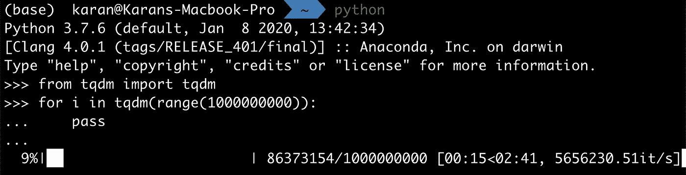

# TQDM: Python 进度条变得简单

> 原文：<https://towardsdatascience.com/tqdm-python-progress-bar-made-easy-b9c735af4b93?source=collection_archive---------24----------------------->

## 在 Python 中创建进度条


照片由 [Jungwoo Hong](https://unsplash.com/@oowgnuj?utm_source=medium&utm_medium=referral) 在 [Unsplash](https://unsplash.com?utm_source=medium&utm_medium=referral) 上拍摄

在过去的一个月里，我一直在和一个研究员同事一起创建一个 python 包。创建一个 python 包包括一些瞧和一些令人沮丧的时刻。虽然我们将在其他时间讨论 python 包的创建过程，但今天我们将学习 Python 中的进度条。

# 进度条的需要

老实说，如果你一次处理最少的信息(数据)，进度条永远不会真正进入你的工作流程。但是对于迭代数据集、对大量信息进行编码或训练模型等情况，进度条会非常方便。

1.  它们为您提供了已经取得的进展的估计和可能需要更多时间的近似值。
2.  它们向您提供进程仍在运行且没有突然终止的信息。

# 进步

`progress`包是我一直用来在 Python 中创建进度条的包。它简单，直观，并提供各种风格的进度条。

首先初始化进度条的对象`bar`。然后，对于每个进度，使用`bar.step()`步进，最后使用`bar.finish()`关闭该栏。该模块在处[可用。](https://pypi.org/project/progress/)

## 例子

要迭代 10 个数据点，您将使用以下代码:

```
from progress.bar import Bar

bar = Bar('Progress bar', max = 10)
for i in range(10):
    bar.next()
bar.finish()
```

虽然它在终端上运行得很好，但当我在 Jupyter 笔记本上运行时，它根本没有显示进度条。所以，我开始寻找替代品，我找到了`tqdm`，我发现它被广泛使用，并决定进行转换。

# tqdm

这个`tqdm`包使得创建进度条变得非常简单，既可以在终端上显示，也可以在 Jupyter 笔记本上显示。所以，我把代码换成了使用`tqdm`。文档和用法可在 [GitHub](https://github.com/tqdm/tqdm) 上获得。

## 例子

假设您有下面的循环，它迭代了 1000000000 次。

```
for i in range(1000000000):
    pass
```

为了有一个进度条来显示你已经取得的进展，我们将修改上面的代码如下(只要用`tqdm()`把这个范围括起来就行了):

```
from tqdm import tqdmfor i in tqdm(range(1000000000)):
    pass
```

当我们用`tqdm`运行这个循环时，`i`仍然保存来自`range()`方法的值。另一方面，`tqdm`获取迭代次数并使用它来显示进度条，如下所示:



使用 tqdm 的进度条

该模块还可以扩展到许多复杂的问题，并可以与`pandas`、`keras`等集成。

# 结论

今天，我们探索了进度条，尤其是`progress`和`tqdm`。我建议你使用`tdqm,`，但是这两个进度条都有很大的价值。

请在评论中与我分享你的想法、观点和建议。你也可以在 LinkedIn 上联系我:[https://www.linkedin.com/in/bhanotkaran22/](https://www.linkedin.com/in/bhanotkaran22/)