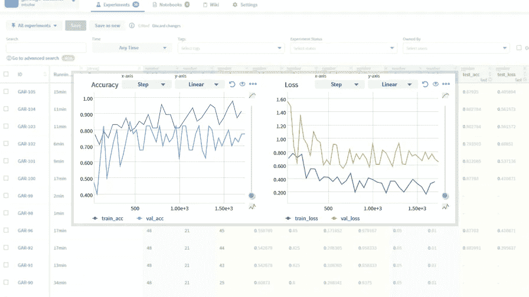
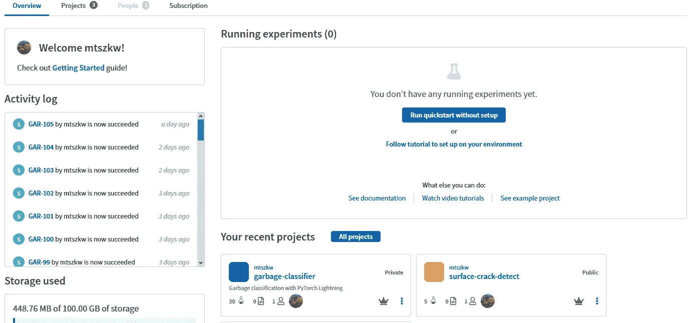
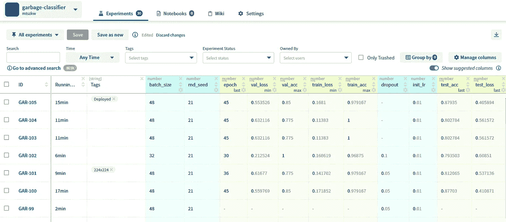
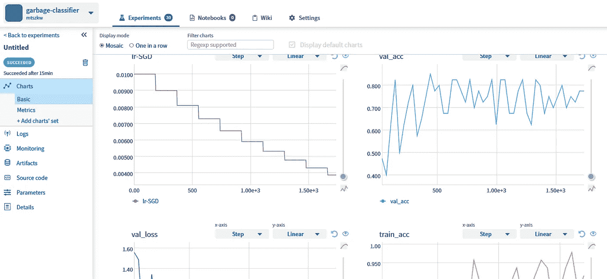
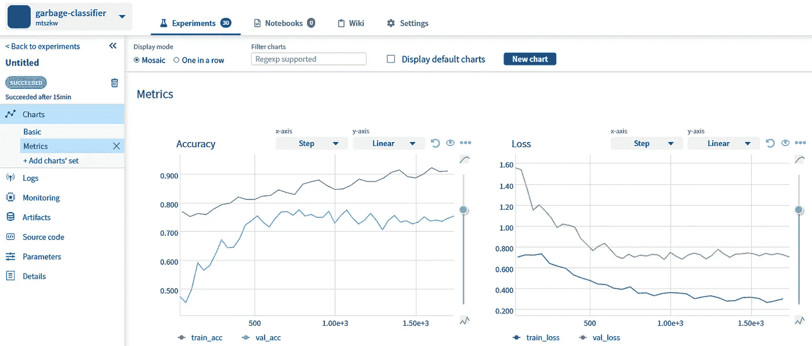
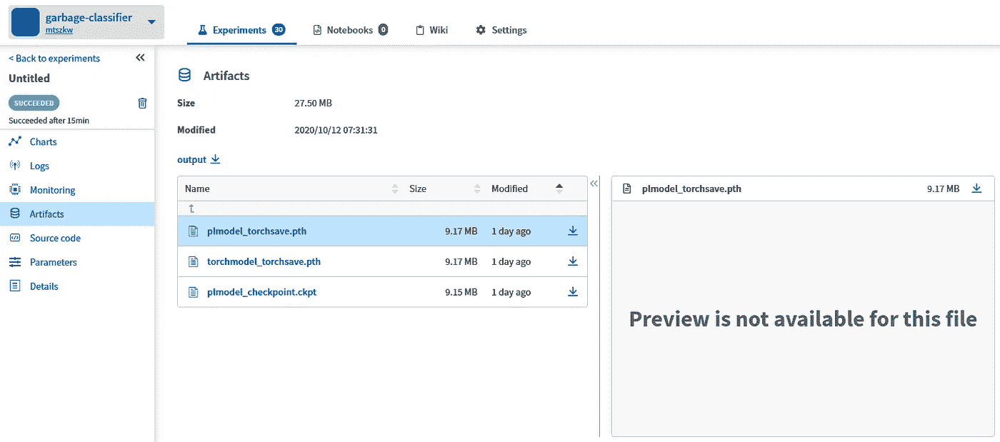

# 跟踪和组织 ML 项目

> 原文：<https://towardsdatascience.com/track-and-organize-your-ml-projects-e44e6c7c3f9d?source=collection_archive---------39----------------------->

## 使用 Neptune.ai 组织工作、跟踪和可视化实验



Neptune.ai 仪表板和指标可视化(图片由作者提供)

每当我开始一个需要运行数百个实验的新项目时，集成实验跟踪工具是我添加到代码中的第一件事。这样的工具不仅仅是可视化度量和存储每次运行的超参数。在这篇文章中，我将介绍和描述 Neptune 工具，我在最近的项目中使用了它。

# 实验“管理”工具

实验跟踪工具给你的机器学习(不仅仅是)**项目**带来**巨大的推动。您可以使用它们来跟踪超参数、可视化图表(如指标)和图像(混淆矩阵或错误分类的样本)、存储工件(模型权重)等等。**

幸运的是，人们已经注意到项目管理工具是组织良好的项目的必备工具。因此，越来越多的工具和服务为此而被创造出来:[彗星](https://www.comet.ml/site/)、 [MLFlow](https://mlflow.org/) 、[海王星](https://neptune.ai/)和[权重&偏差](https://www.wandb.com/)等等。

# 我使用哪个工具？

我个人使用 [Neptune](https://neptune.ai/) 做我的项目。我[用过一次](https://enjoymachinelearning.com/posts/reviewing-pytorch-lightning/)我很喜欢，但是坦白说我还是得找足够的时间来测试其他工具。正如作者所说，Neptune 是“最轻量级”的实验管理工具。您可以随时尝试，因为它**是作为一项服务提供的，并且完全免费用于您的个人项目，这意味着:**

*   1 个公共和私人项目的用户帐户，
*   高达 100GB 的日志、工件等存储空间，
*   无限的实验和笔记本检查点。

公司或要求更高的用户也有其他选择。

“团队”计划允许您创建 10 倍以上的用户，并为您提供 10 倍以上的磁盘空间，但团队中每个用户的费用为 79 美元。天下没有免费的午餐……然而，**用于教育、研究或非营利目的的团队计划是完全免费的**(目前)。Neptune tool 也可以作为“企业”计划的一部分在内部使用(托管在您的组织内)，但这主要是推荐给那些不喜欢为其产品使用 SaaS 解决方案的大型组织。

# 在代码中使用 Neptune

将 Neptune 与您的代码集成在一起是小菜一碟，真的。它基本上是一个带有简单 API 的 Python 模块，例如记录几个参数和指标，你所要做的就是你下面看到的。当然，代替这些神奇的数字，您将记录由机器学习框架返回的值(像 [PyTorch Lightning](https://pytorch-lightning.readthedocs.io/en/stable/logging.html#supported-loggers) 它对 Neptune 和其他工具有很大的支持)。

```
import neptuneneptune.init('Me/MyProject')
neptune.create_experiment(params={'lr':0.1, 'dropout':0.4})
neptune.log_metric('test_accuracy', 0.84)
```

访问[Neptune 的官方页面](https://neptune.ai/how-it-works)，这里有很多它如何工作的例子，并列出了你可能感兴趣的所有特性。我会告诉你哪些是我觉得有用的，以及它们在我的项目中的样子。我将只展示我使用过的特性，但是请注意，您的项目需要大量的**其他功能**。

一张图胜过千言万语，所以…

# 特征

从仪表板视图开始(图 1。)以及所有项目的列表(包括当前正在运行的实验)。



*图一。仪表板:项目列表、磁盘使用等(图片由作者提供)*

在项目视图中(图 2。)，浏览实验列表及其参数和结果(指标如 *test_loss* )。修改显示的列，包括实验信息(作者、运行时间、标签)和指标( **Neptune 可以建议您根据您记录的内容添加一个指标列**)。



*图二。实验:最近的运行、参数和结果(图片由作者提供)*

可视化指标，默认情况下，每个图表单独显示(图 3。)，但是您也可以创建自定义视图。您可以决定在同一个图表中**显示多个可视化效果(图 4。).**



*图 3。指标和其他值的可视化，例如 LR(作者提供的图像)*



*图 4。自定义图表:同一图表中的多个指标(图片由作者提供)*

**将任何文件**(例如，权重、输出文件)保存为工件(图 6。).在预览窗口中查看它们(如果可能)或下载它们用于推断。



*图 6。工件:保存/下载工件(如模型)(作者图片)*

# 不使用这些是浪费时间

改变我的想法。

将您的代码连接到一个“管理”工具是一件轻而易举的事情。除此之外，以 PyTorch Lightning 为例，一旦您决定应该记录哪些指标等等。你可以互换使用 loggers(像 Tensorboard，Neptune，Weights & bias)。

您可以在后台运行实验，所有的**日志、图像和结果将被保存**供您以后查看。

尝试不同的工具，有些可以作为 Saas 使用，有些可以在本地运行。它们提供了各种各样的功能，当然比我描述的要多得多。它们也是相辅相成的，所以试一试，然后再看看另一个。**找到你和你的团队最喜欢的一个**，让你的项目井井有条。过会儿谢谢我。