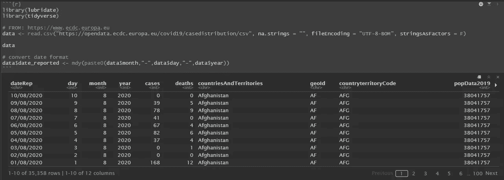
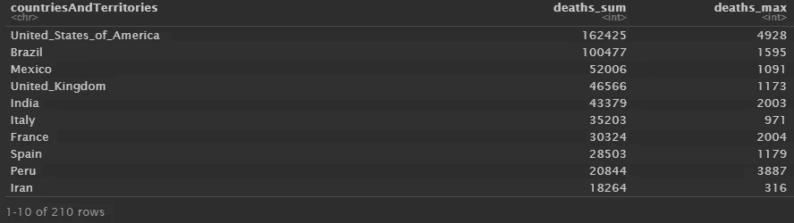
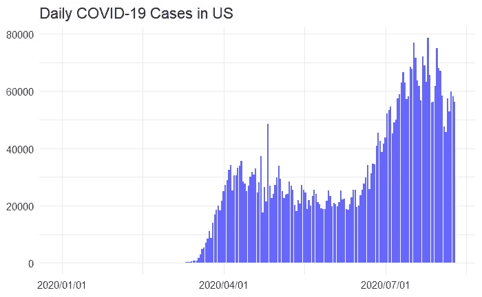
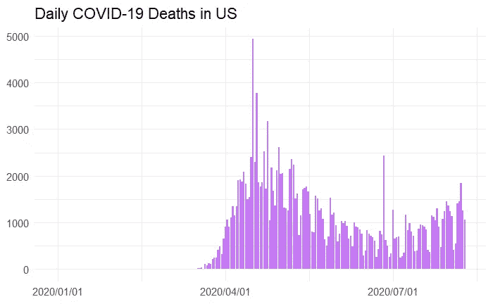
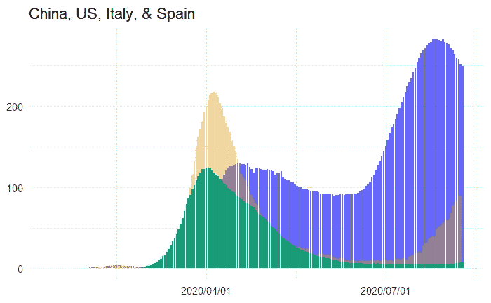

# 使用 R 自己跟踪新冠肺炎数据

> 原文：<https://towardsdatascience.com/track-covid-19-data-yourself-with-r-eb3e641cd4b3?source=collection_archive---------12----------------------->

## [变更数据](https://towardsdatascience.com/tagged/data-for-change)

## 了解如何使用 R 监测您所在国家和全球的每日冠状病毒统计数据和趋势。


[KOBU 社](https://unsplash.com/@kobuagency?utm_source=unsplash&utm_medium=referral&utm_content=creditCopyText)在 [Unsplash](https://unsplash.com/s/photos/covid-19-data?utm_source=unsplash&utm_medium=referral&utm_content=creditCopyText) 上拍摄的照片

今年早些时候，当全球疫情第一次获得势头时，我像大多数人一样，依赖媒体来获取最新消息。我很快发现，媒体的报道不仅不一致，而且经常提供不完整的信息。这些局限性的根本问题是，它们经常导致对数据的误解和曲解，在任何特定时间点对这场全球危机的严重性存在广泛分歧的观点就证明了这一点。

媒体机构经常精挑细选他们报道的统计数据和图表，偏好与他们试图讲述的故事相一致的耸人听闻的标题。鉴于他们的主要目标是吸引观众，你不能过多地责怪他们的这种倾向。但是，如果你希望获得新冠肺炎病毒在你的国家的当前影响的准确和可靠的图片，包括跟踪和绘制趋势，你最好自己分析源数据。

在本文中，我们将介绍如何用 R 编写一个脚本来提取和分析当前的冠状病毒数据。最好的部分是，一旦你写了脚本，你可以很容易地保存和重新运行它。您不再需要依赖基于其他人决定分析和报告的数据的不完整快照。现在，您可以轻松快捷地获得最新的新冠肺炎数据，并且可以自己跟踪当前的统计数据和趋势！

# 让我们开始编码吧

我使用 R Studio 并将这个脚本保存在 R markdown (Rmd)中。如果您喜欢使用 base R，不用担心，代码也可以在标准的 R 脚本中运行。我不打算介绍如何安装 R [1]或 R Studio [2]，但是这两个都是开源的(并且是免费的),您可以查看下面的参考资料，找到详细的文档和安装说明。

首先，打开一个新的 Rmd(或 R)文件。如果你使用 Rmd，使用**Ctrl+Alt+I**(Mac:**Cmd+Option+I**)来插入代码块。在这个新的块中，我们将加载我们将要使用的包。请注意，如果您还没有安装这两个软件包，那么您首先需要安装它们。我包含了下面的代码，用于安装和加载它们，不过如果需要安装它们，您需要先取消对安装行的注释(删除标签)。你只需要安装软件包一次，所以一旦你安装了它们，请随意删除那些注释行。

```
# install.packages('lubridate')
# install.packages('tidyverse')library(lubridate)
library(tidyverse)
```

我们不会太详细地讨论每个包的功能，因为这超出了本文的范围。但是，如果您想了解更多，我将在下面提供对它们的简要描述，并在参考资料中包含它们的文档链接。如果您打算经常使用 R，我强烈建议您仔细看看这些包的文档。他们很牛逼，值得学习！

第一个包是 lubridate，它提供了很多处理日期变量的有用函数[3]。出于我们的目的，我们只是使用 lubridate 将数据集中提供的日期格式转换为 r 可识别的日期变量。另一个包 tidyverse 实际上是组成“Tidyverse”的一组包[4]。当您安装(和加载)tidyverse 时，包含的整个软件包组会自动为您安装(和加载)。其中两个包含的包值得一提，因为我们将多次使用它们，dplyr 和 ggplot2。

dplyr 包“是数据操作的语法，提供一组一致的动词，帮助您解决最常见的数据操作挑战”[5]。可能会有一整本书只是介绍如何使用 dplr，所以现在这样的描述已经足够了。Ggplot2 是另一个用于绘制图形和图表的神奇软件包[6]。我在研究生院上了整整一学期的数据可视化课，专门使用 ggplot2，我们只触及了可用功能的皮毛。安装和加载这两个包之后，我们就可以开始挖掘和研究数据了！

# 加载并浏览数据

今年早些时候，当我第一次寻找可用的冠状病毒数据集时，我检查了几个不同的选项。在对这些选项进行了几周的测试后，我对欧洲疾病控制中心(ECDC)的数据产生了偏好[7]。它持续更新(每晚),并提供我正在寻找的大部分信息，包括每日病例数、死亡人数和人口信息，按国家/地区分类。在过去的 4-5 个月中，他们已经更新了数据集几次，更改了格式并添加了列。但总的来说，他们在维护和更新数据方面非常一致。因此，ECDC 数据集一直是我追踪新冠肺炎的首选来源，也是我们在这里要使用的。

```
# FROM: [https://www.ecdc.europa.eu](https://www.ecdc.europa.eu)
data <- read.csv(“[https://opendata.ecdc.europa.eu/covid19/casedistribution/csv](https://opendata.ecdc.europa.eu/covid19/casedistribution/csv)", na.strings = “”, fileEncoding = “UTF-8-BOM”, stringsAsFactors = F)data# convert date format
data$date_reported <- mdy(paste0(data$month,”-”,data$day,”-”,data$year))
```

ECDC 为他们的 CSV 格式的数据集提供了一个方便的 URL，我们可以使用内置的“read.csv”函数轻松地将其拉入 R 中。这个链接的好处是，他们每天使用相同的 URL 更新数据集，因此您永远不需要更改代码来导入数据集。运行 read.csv 行后( **Ctrl + Enter** 运行单行或高亮选择)，数据集保存在“data”变量中。运行下一行“data ”,查看原始数据集。



原始数据集的快照(图片由作者提供)

如您所见,“dateRep”列使用 DD/MM/YYYY 以一种非常独特的方式格式化日期。上面代码块中的最后一行代码实际上只是将日期字符串转换成 R(和 ggplot2)可以读取的格式。有很多方法可以完成这个任务，但是为了简单起见，我们将使用 lubridate 包中的 mdy()函数[3]。

# 基础探索

让我们先来看看全球累计总病例和死亡人数。第一行将汇总迄今全球新冠肺炎病例总数。接下来，我们将按国家进行细分，并计算该国的病例总数，以及每个国家单日报告的最大病例数。然后，我们按案例总数降序排列结果。下面，我们将计算同样的事情，但这次是冠状病毒死亡(而不是新病例)。

```
# total cases worldwide to date
sum(data$cases)# total cases and max single day by country
data %>% 
 group_by(countriesAndTerritories) %>% 
 summarise(cases_sum = sum(cases), cases_max = max(cases)) %>% 
 arrange(desc(cases_sum))# total deaths worldwide to date
sum(data$deaths)# total deaths and max single day by country
data %>% 
 group_by(countriesAndTerritories) %>% 
 summarise(deaths_sum = sum(deaths), deaths_max = max(deaths)) %>% 
 arrange(desc(deaths_sum))
```

上述代码块将有四个输出。下面是最后的输出，显示了各个国家的新冠肺炎死亡总数，以及一天内的最大死亡人数。目前(2020 年 8 月)，美国是冠状病毒死亡人数最多的国家。



新冠肺炎国家死亡人数(图片由作者提供)

# 绘制每日病例和死亡数

现在我们将开始绘制数据以确定趋势。因为我住在美国，所以我要策划美国的案子。您可以很容易地使用其他国家修改代码，我们将很快介绍这一点。

```
us <- data[data$countriesAndTerritories == ‘United_States_of_America’,]
usUS_cases <- ggplot(us, 
 aes(date_reported, as.numeric(cases))) +
 geom_col(fill = ‘blue’, alpha = 0.6) + 
 theme_minimal(base_size = 14) +
 xlab(NULL) + ylab(NULL) + 
 scale_x_date(date_labels = “%Y/%m/%d”)US_cases + labs(title=”Daily COVID-19 Cases in US”)
```

首先，我过滤数据集，只查看美国案例，并将其存储到一个变量中。然后，我使用 ggplot2 来绘制新冠肺炎的每日新病例。有关如何使用 ggplot2 的更多信息，请查看他们的文档[6]。运行上面的程序块后，您应该会看到下图。



美国每日新冠肺炎病例(图片由作者提供)

太棒了，对吧？当然，数据描绘的画面并不可怕，但你可以自己跟踪它的事实肯定是可怕的！

让我们继续，对冠状病毒死亡做同样的事情。代码实际上是一样的，只是我们现在跟踪的是“死亡”而不是“病例”

```
US_deaths <- ggplot(us, 
 aes(date_reported, as.numeric(deaths))) +
 geom_col(fill = ‘purple’, alpha = 0.6) + 
 theme_minimal(base_size = 14) +
 xlab(NULL) + ylab(NULL) + 
 scale_x_date(date_labels = “%Y/%m/%d”)US_deaths + labs(title=”Daily COVID-19 Deaths in US”)
```



美国每日新冠肺炎死亡人数(图片由作者提供)

如你所见，死亡率描绘了一幅不同于案件数量的画面。虽然第二波病例是第一波的两倍，但第二波死亡人数还没有超过第一波。这些都是值得关注的有趣趋势，绝对值得追踪。

# 比较多个国家

抓紧你的帽子，因为我们将要涉及的最后一个情节将允许我们比较不同的国家！我选择了美国、中国、意大利和西班牙，但是你可以混合起来选择你感兴趣的任何国家/地区。

```
# Now lets add in a few more countries
china <- data[data$countriesAndTerritories == ‘China’,]spain <- data[data$countriesAndTerritories == ‘Spain’,]italy <- data[data$countriesAndTerritories == ‘Italy’,]USplot <- ggplot(us, 
 aes(date_reported, as.numeric(Cumulative_number_for_14_days_of_COVID.19_cases_per_100000))) +
 geom_col(fill = ‘blue’, alpha = 0.6) + 
 theme_minimal(base_size = 14) +
 xlab(NULL) + ylab(NULL) + 
 scale_x_date(date_labels = “%Y/%m/%d”)China_US <- USplot + geom_col(data=china, 
 aes(date_reported, as.numeric(Cumulative_number_for_14_days_of_COVID.19_cases_per_100000)),
 fill=”red”,
 alpha = 0.5)Ch_US_Sp <- China_US + geom_col(data=spain, 
 aes(date_reported, as.numeric(Cumulative_number_for_14_days_of_COVID.19_cases_per_100000)),
 fill=”#E69F00",
 alpha = 0.4)Chn_US_Sp_It <- Ch_US_Sp + geom_col(data=italy, 
 aes(date_reported, as.numeric(Cumulative_number_for_14_days_of_COVID.19_cases_per_100000)),
 fill=”#009E73",
 alpha = 0.9)Chn_US_Sp_It + labs(title=”China, US, Italy, & Spain”)
```

这段代码看起来有点吓人，但实际上非常简单。在顶部，我们筛选出我们感兴趣的国家的数据集，并将其保存在各自的变量中。接下来的一系列代码块创建了我们要堆叠的图，我们添加的每个国家一个。

考虑到我们要比较国家，这次我们将使用一个新列，它列出了该国过去 14 天每 100，000 人中的累计新增病例数。由于每个国家的人口不同，使用每 100，000 人的病例数使我们能够根据人口标准化病例数。让我们看看那是什么样子。



中国、美国、意大利和西班牙——每 100，000 人中超过 14 天的病例(图片由作者提供)

红色的小驼峰(在开始)是中国，绿色是意大利，黄色是西班牙，蓝色是美国。正如你所看到的，中国首先受到冲击，尽管总体影响明显低于其他三个国家(至少根据他们报告的数字)。可悲的是，相比之下，美国看起来仍然相当糟糕。在这四个国家中，西班牙受到第一波冲击最大，而美国和意大利似乎受到了类似的影响。

不幸的是，第二波像卡车一样袭击了美国(就累计病例而言)，尽管我们似乎开始了下降趋势(手指交叉)。西班牙的第二波浪潮似乎仍在升温。我们必须继续监控他们的数据，看看他们何时开始拉平曲线。另一方面，义大利在第一波疫情之后，似乎在抑制新冠肺炎扩散方面做得非常出色。我们可以从他们的成功中吸取一些教训。

# 结论

这只是开始。我们只是触及了你可以用这些数据做的事情的表面。我希望您接受我们在这里介绍的内容，并使用它！让它成为你自己发现的跳板。您不再需要依赖媒体或其他数据科学家的片段来掌握新冠肺炎数据并跟踪趋势。请在评论中告诉我你是如何处理这些数据的，并与我们分享你的发现！

✍️ [订阅获取我的最新文章，这些文章刊登在像➡️数据科学创业公司&这样的出版物上](https://crossphd.com/subscribe/)

## 参考

[1] R，《R:统计计算的 R 项目》r *-project.org* ，2020。【在线】。可用:【https://www.r-project.org】T4。[访问时间:2020 年 8 月 10 日]。

[2] R 工作室，《R 工作室 IDE 桌面》rstudio.com，2020 年。【在线】。可用:[https://rstudio.com/products/rstudio](https://rstudio.com/products/rstudio/)。[访问时间:2020 年 8 月 10 日]。

[3]lubridate package | R Documentation，“让处理日期变得简单一点”，rdocumentation.org，2020 年。【在线】。可用:[https://www . rdocumentation . org/packages/lubridate/versions/1 . 7 . 9](https://www.rdocumentation.org/packages/lubridate/versions/1.7.9)。[访问时间:2020 年 8 月 10 日]。

[4] tidyverse package | R 文档，“轻松安装和加载‘tidy verse’”，rdocumentation.org，2020 年。【在线】。可用:[https://www . rdocumentation . org/packages/tidy verse/versions/1 . 3 . 0](https://www.rdocumentation.org/packages/tidyverse/versions/1.3.0)。[访问时间:2020 年 8 月 10 日]。

[5] dplyr 包| R 文档，“数据操作的语法”rdocumentation.org，2020。【在线】。可用:[https://www . rdocumentation . org/packages/DP lyr/versions/0 . 7 . 8](https://www.rdocumentation.org/packages/dplyr/versions/0.7.8)。[访问时间:2020 年 8 月 10 日]。

[6] ggplot2 软件包| R 文档，“使用图形语法创建优雅的数据可视化”，rdocumentation.org，2020 年。【在线】。可用:[https://www . rdocumentation . org/packages/gg plot 2/versions/3 . 3 . 2](https://www.rdocumentation.org/packages/ggplot2/versions/3.3.2)。[访问时间:2020 年 8 月 10 日]。

[7]欧洲疾病防治中心，“CDC 新冠肺炎·疫情”ecdc.europa.eu，2020 年。【在线】。可用:[https://www.ecdc.europa.eu/en/covid-19-pandemic](https://www.ecdc.europa.eu/en/covid-19-pandemic)。[访问时间:2020 年 8 月 10 日]。