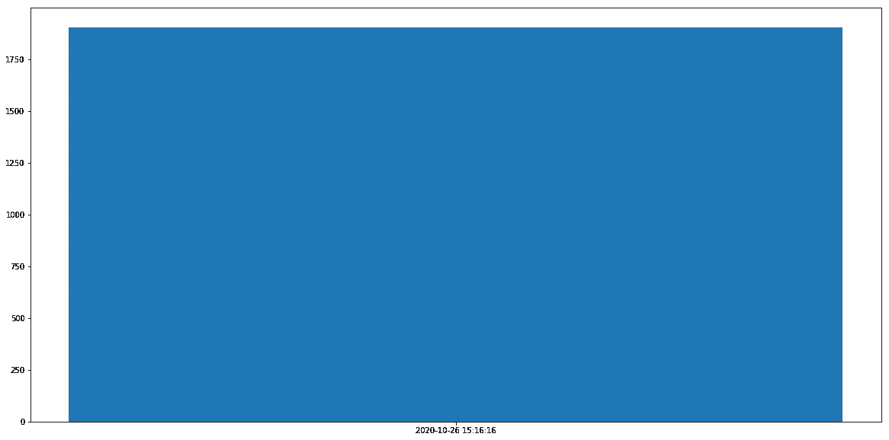
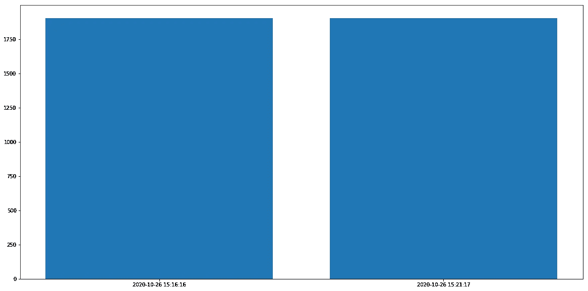
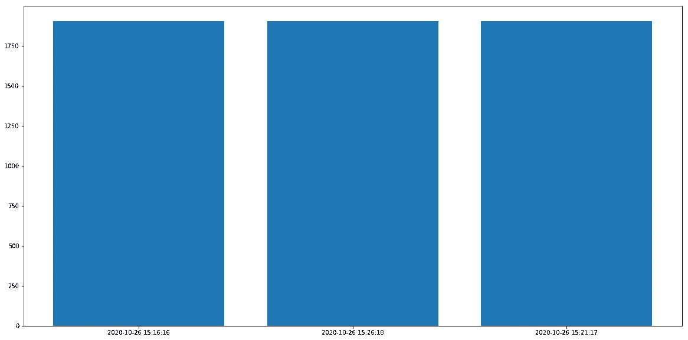
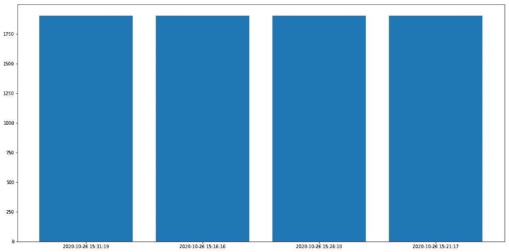
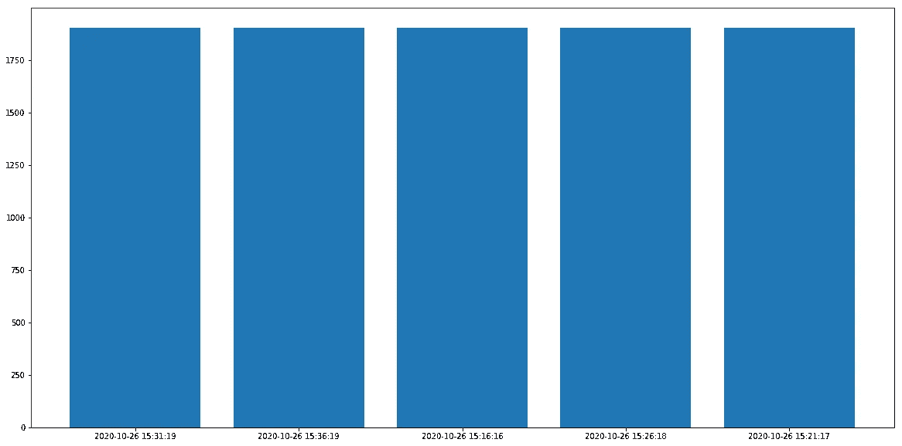

# 使用 Apache Kafka、Pandas 和 MatPlotLib 跟踪实时黄金价格

> 原文：<https://towardsdatascience.com/track-real-time-gold-prices-using-apache-kafka-pandas-matplotlib-122a73728a88?source=collection_archive---------20----------------------->

## 了解如何使用阿帕奇卡夫卡熊猫跟踪实时黄金价格。在条形图上绘制最新价格。


克里斯·利维拉尼在 [Unsplash](https://unsplash.com/s/photos/price-graph?utm_source=unsplash&utm_medium=referral&utm_content=creditCopyText) 上的照片

***来自《走向数据科学》编辑的提示:*** *虽然我们允许独立作者根据我们的* [*规则和指导方针*](/questions-96667b06af5) *发表文章，但我们并不认可每个作者的贡献。你不应该在没有寻求专业建议的情况下依赖一个作者的作品。详见我们的* [*读者术语*](/readers-terms-b5d780a700a4) *。*

在我们所处的时代，跟踪、处理和分析实时数据正成为许多企业的必需品。不用说，处理流数据集正成为数据工程师和科学家最重要和最需要的技能之一。

对于本文，我假设您熟悉 Apache Kafka——一个开源的分布式事件流平台。Apache Kafka 具有内置的分区、复制和容错机制。我在过去的几个项目中使用过 Apache Kafka，用于几个用例，包括度量收集、日志收集和流处理。

在我的数据工程和数据科学课程中，Apache Kafka 是我的学生们讨论的热门话题。在我在课程中提到的许多例子中，我决定分享这个例子。

我们将从以下 API 向 Kafka 中摄取流数据。

[https://forex-data-feed . Swiss quote . com/public-quotes/BBO quotes/instrument/XAU/美元](https://forex-data-feed.swissquote.com/public-quotes/bboquotes/instrument/XAU/USD)

我们将首先创建一个 Kafka 生成器，它将从上面的 API 中读取数据，并不断地将数据推送到 Kafka。

我们还将创建 Kafka 消费者，它将不断地从 Kafka 读取数据。一旦消息被阅读，我们将提取最新的黄金价格，并将结果绘制在条形图上。

**技术栈:Apache Kafka、Pandas、Python、kafka-python 库和 MatPlotLib**

## 准备工作

安装 Java

```
sudo yum -y install java-1.8.0-openjdk.x86_64
```

下载阿帕奇卡夫卡

```
$ cd /opt
$ sudo wget [http://apache.forsale.plus/kafka/2.5.0/kafka_2.13-2.5.0.tgz](http://apache.forsale.plus/kafka/2.5.0/kafka_2.13-2.5.0.tgz)
$ sudo tar -zxf kafka_2.13-2.5.0.tgz
$ cd kafka_2.13-2.5.0
```

在后台启动 Zookeeper 和 Kafka 服务器

```
$ cd /opt/kafka_2.13-2.5.0;export JAVA_HOME=/usr/lib/jvm/jre-1.8.0;export JRE_HOME=/usr/lib/jvm/jre$ nohup sudo /bin/zookeeper-server-start.sh config/zookeeper.properties &$ nohup sudo bin/kafka-server-start.sh config/server.properties &
```

创造一个新的卡夫卡主题— **戈德拉特**

```
$ sudo bin/kafka-topics.sh --create --zookeeper localhost:2181 --replication-factor 1     --partitions 1 --topic Goldrates$ sudo bin/kafka-topics.sh --list --zookeeper localhost:2181
```

克隆我的 Github repo:

```
$ git clone https://github.com/mkukreja1/blogs.git
```

## 创建一个卡夫卡制作人

在 Jupyter 中安装 Kafka Producer 笔记本。我将通过这些步骤来理解这个流程。

*Kafka/gold rates/kafkaproducergoldrates . ipynb*

```
import sys
!{sys.executable} -m pip install kafka-pythonimport time
import json
from json import dumps
**from kafka import KafkaProducer**
from time import sleep
import requests as req
```

**KafkaProducer —** 用于创建异步消息生成器的高级类。

```
ticker_url="[https://forex-data-feed.swissquote.com/public-quotes/bboquotes/instrument/XAU/USD](https://forex-data-feed.swissquote.com/public-quotes/bboquotes/instrument/XAU/USD)"
brokers='localhost:9092'
topic='Goldrates'
sleep_time=300
```

声明一些将在程序中使用的常量。 ***经纪人*** 可以是参与您的 Apache Kafka 集群的经纪人列表。

```
producer = KafkaProducer(bootstrap_servers=[brokers],value_serializer=lambda x: dumps(x).encode('utf-8'))
```

这将初始化一个新的 Kafka 生成器。该生成器将在将数据发送到代理列表之前序列化数据。数据将被转换为 **JSON** 并使用 **utf-8** 进行编码。

```
while(True):
    print("Getting new data...")
    resp = req.get(ticker_url)
    json_data = json.loads(resp.text)
    producer.send(topic, json_data)
    time.sleep(sleep_time)
```

这段代码在一个永无止境的循环中运行。它从 Goldrates API 获取数据，将传入的 JSON 对象转换为 Python 对象，最后将这些数据发送到 Kafka 中的特定主题。在每次迭代之后，它休眠一个先前声明的*周期=sleep_time* 常数。

如果您的 Kafka Producer 运行正常，您应该会看到如下输出:

> **获取新数据…
> 获取新数据…**

让这个笔记本保持运行，这样 Kafka 的消费者就可以阅读这些信息。

## 创造一个卡夫卡消费者

在 Jupyter 安装 Kafka 消费者笔记本。如前所述，我将通过这些步骤来理解这个流程。

*Kafka/gold rates/kafkaconsumergoldrates . ipynb*

```
import time
import json
**from kafka import KafkaConsumer**
from pandas import DataFrame
from datetime import datetime
import matplotlib.pyplot as plt
```

**KafkaConsumer —** 用于创建异步消息消费者的高级类。

```
brokers='localhost:9092'
topic='Goldrates'
sleep_time=300
offset='latest'
```

声明一些将在程序中使用的常量。 ***经纪人*** 可以是参与你的 Apache Kafka 集群的经纪人列表。***Offset =*latest**表示代码应该从 Kafka 队列中获取 **latest** 消息。您也可以选择从最早的**开始。**

```
consumer = KafkaConsumer(bootstrap_servers=brokers, auto_offset_reset=offset,consumer_timeout_ms=1000)
consumer.subscribe([topic])
```

这初始化了一个新的 Kafka 消费者。

***auto _ offset _ reset—***仅在用户遇到**意外**问题时使用。在这种情况下，我们要求消费者重新开始阅读来自**最新**消息的消息。您也可以选择从最早的**开始。**

***自动提交间隔毫秒—*** 两次提交之间的时间段。

最后，我们要求消费者订阅，即从定义为常量的主题中获取消息。

```
oldprice_dict = {}
while(True):
    for message in consumer:
        #print(message)
        d=json.loads(message.value)
        df=DataFrame(d)
        for x in range(1):
            #print(x)
            new_price=df['spreadProfilePrices'][x][0]
            ts=df['ts'][x]
            #print(new_price)
            print("Latest Gold Price: " + str(new_price['ask']))
            datetime_time = datetime.fromtimestamp(ts/1000)
            goldprice_dict[str(datetime_time)]=new_price['ask']
            print("Gold Price at: " + str(datetime_time))
        print("-----------------------------------------")
        #print(goldprice_dict)
        plt.figure(figsize=(20,10))
        plt.bar(range(len(goldprice_dict)), list(goldprice_dict.values()), align='center',linewidth=0.5)
        plt.xticks(range(len(goldprice_dict)), list(goldprice_dict.keys()))
        plt.show()

    time.sleep(sleep_time)
```

对于每条消息，JSON 都被加载到 Pandas 数据帧中。从数据帧中提取黄金的最新价格和时间戳，并存储在 Python 字典中。最后，Python 字典用于绘制如下条形图:

x 轴—黄金价格读数的时间戳

y 轴-黄金价格值

如果一切顺利，对于每次迭代，最新的黄金价格将绘制如下:

**预期产出如下:**

最新黄金价格:1902.951
2020–10–26 15:16:16
黄金价格



最新黄金价格:1902.968
2020–10–26 15:21:17
黄金价格



最新黄金价格:1902.208
黄金价格:2020–10–26 15:26:18
————————



最新黄金价格:1902.293
2020–10–26 15:31:19
黄金价格



最新黄金价格:1902.693
2020–10–26 15:36:19
黄金价格



本文的所有代码都可以在下面的链接中找到:

[](https://github.com/mkukreja1/blogs/tree/master/kafka/gold-rates) [## mkukreja 1/博客

### 此时您不能执行该操作。您已使用另一个标签页或窗口登录。您已在另一个选项卡中注销，或者…

github.com](https://github.com/mkukreja1/blogs/tree/master/kafka/gold-rates) 

我希望这篇文章是有帮助的。由 [Datafence Cloud Academy](http://www.datafence.com) 提供的 **Apache Kafka** 主题将作为大数据 Hadoop、Spark & Kafka 课程的一部分进行更详细的介绍。