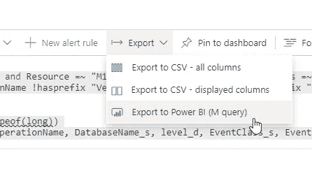
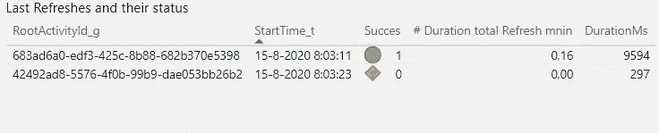
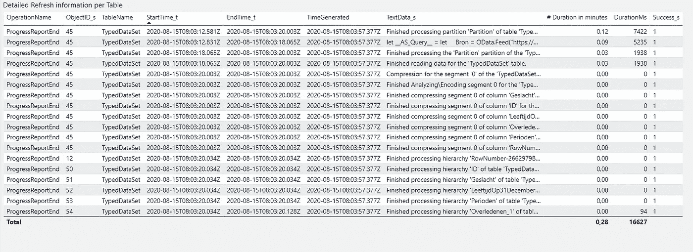

# 跟踪每个表的 Azure Analysis Services 处理时间

> 原文：<https://towardsdatascience.com/track-your-azure-analysis-services-processing-times-per-table-f2d3238f81a6?source=collection_archive---------27----------------------->

## 使用 Kusto 查询和诊断日志

最近我一直在与 Azure Analysis Services 合作。在我们的模型中，表的数量在快速增长，处理时间也在波动和增长。从 AAS 的角度来看，我有足够的理由进一步了解哪些表占用了最多的处理时间。

在这里，我将解释我所采取的步骤，以获得关于 Azure Analysis Services **全流程**从**日志分析工作区**到 **Power BI** 报告的处理步骤的详细信息。

*   将诊断日志记录设置到日志分析工作区
*   使用 Kusto 查询语言浏览日志
*   将数据导入 Power BI

## **诊断日志**

一如既往，起点是微软文档**。好吧，实际上是谷歌或者必应。但是很快我就进入了文档页面，其中包含了开始所需的所有步骤。下面列出了链接。**

在这种情况下，已经完成了诊断设置的配置，以便将日志发送到日志分析工作区。如果您仍然需要这样做，文档中包含了所需的操作。这很简单。

## 浏览日志

下一步是在我们的日志分析工作区(LAW)中探索日志，通过编写查询来获取我们正在寻找的信息。[文档中的第一个示例查询](https://docs.microsoft.com/en-us/azure/analysis-services/analysis-services-logging#view-logs-in-log-analytics-workspace)是一个很好的起点。但这并不是我们想要的，因为我们想要的是模型的更新。而不是查询时间。

最后，我编写了**两个查询，并在 Power BI** 中将它们连接在一起。在第一个查询中，我专门寻找刷新流程的**最高级别** **。**

在这种情况下,“OperationName”字段和“TextData_s”字段中的值“CommandEnd”在“< Refresh”上进行过滤。下面是查询，如果要用，别忘了在第二行加上自己的服务器和数据库名。

在第二个查询中，我们获得了刷新的详细信息，并希望过滤掉尽可能多的我们不使用的操作。这个查询产生了我们正在寻找的所有详细信息。

另一个选择是，为了在最后一个查询中得到更少的结果，将它加入到“RootActivityId_g”上的第一个查询中。这样可以确保只获得与第一个查询相关的数据。

## 在 Power BI 中可视化

Log Analytics 工作区提供了将书面查询导出到 **M 语言**的可能性，并包含一些关于如何在 Power BI 中使用脚本的帮助。

将 Kursto 查询导出到 Power BI(图片由作者提供)

在将两个 Kusto 查询添加到 Power BI 报告之后，在两个表之间的“RootActivityId_g”上创建了一个关系。从“ObjectReference_s”中，可以导出表名。最后，我添加了一个度量来计算以分钟为单位的持续时间。

模型中的数据提供了对每次刷新操作持续时间的深入了解，可通过第一次查询中的“RootActivityId_g”进行识别。从第二个查询中可以看到每个表的详细信息。

第一次查询；每次刷新的状态(图片由作者提供)

如果我们考虑‘object name _ s’=‘Partition’和‘event subclass _ s’= 59，则每个表的步骤包括:

*   查询来源
*   读取数据并处理分区
*   分析和编码
*   每列每段的压缩率
*   每列处理层次结构

这是一个简单的演示模型的例子。第一行显示所选表的完整持续时间。查看开始和结束时间。

第二次查询；每个表的详细刷新信息(图片由作者提供)

## 结论

能够分析刷新过程中的不同步骤，并精确定位耗时的步骤，对我来说非常有价值。

在诊断日志中有大量关于您的 Analysis Services 实例的信息。例如关于“查询处理单元”(qpu_metric)和内存使用的信息。

从我的角度来看，作为一名数据工程师，用 Power BI 中的诊断日志监控 Azure Analysis Services 是 Azure 门户的一个很好的替代方案。您控制着整个流程的设计，并且可以向您的 BI 产品的最终用户提供监控解决方案，而无需登录 Azure 门户。

请让我知道你的想法或者你有什么建议给我！谢谢大家！

**参考文献**:

 [## Azure Analysis Services 的诊断日志记录

### 任何 Analysis Services 解决方案的一个重要部分是监视服务器的性能。Azure 分析…

docs.microsoft.com](https://docs.microsoft.com/en-us/azure/analysis-services/analysis-services-logging)  [## Azure 平台日志概述- Azure Monitor

### 平台日志为 Azure 资源和 Azure 平台提供了详细的诊断和审计信息

docs.microsoft.com](https://docs.microsoft.com/en-us/azure/azure-monitor/platform/platform-logs-overview)  [## Kusto 入门

### Azure Data Explorer 是一项用于存储和运行大数据交互式分析的服务。它基于关系…

docs.microsoft.com](https://docs.microsoft.com/en-us/azure/data-explorer/kusto/concepts/)