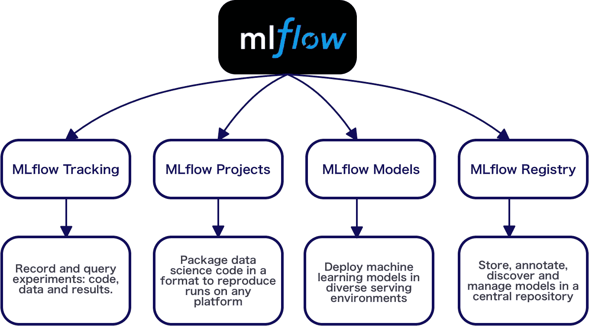
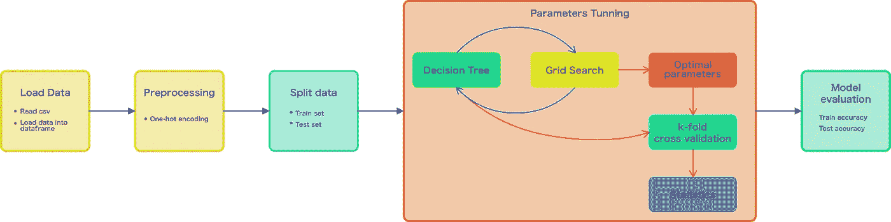
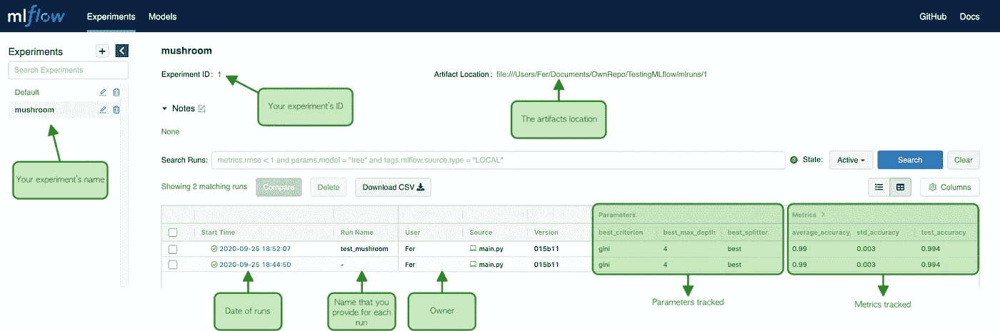
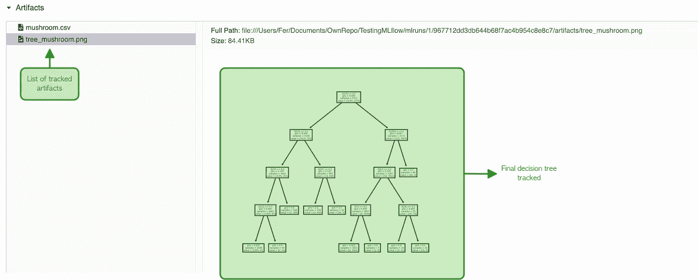

# 作为专业人士跟踪您的 ML 模型，使用 MLflow 跟踪它们。

> 原文：<https://towardsdatascience.com/track-your-ml-models-as-pro-track-them-with-mlflow-11fc5486e389?source=collection_archive---------15----------------------->

## 使用 MLflow 跟踪 ML 模型的分步指南


维克多·加西亚在 [Unsplash](https://unsplash.com?utm_source=medium&utm_medium=referral) 上拍摄的照片

作为一名*机器学习工程师*或*数据科学家*，你的大部分时间都花在实验机器学习模型上，例如调整参数、比较指标、创建和保存可视化、生成报告等。然而，在许多情况下，我们通常不会以健康的方式进行这种跟踪。进行这种跟踪的一种健康、简单和有效的方式是利用促进这种类型活动的工具，例如 **ML *flow*** 。

在这篇博客中，您将学习如何安装、如何跟踪指标、如何跟踪参数以及如何保存和重用 scikit-learn ML 模型。所以这个博客分为以下几个部分:

*   **什么是 *MLflow* ？**
*   **构建 ML 管道**
*   **跟踪 ML 管道**
*   **可视化**

所以，让我们开始吧！

# 什么是 MLflow？

***MLflow*** 是一个管理 ML 生命周期的开源平台，包括实验、再现性、部署和中央模型注册[1]。 ***MLflow*** 是基于 python 的，你可以在这里找到源代码[。所以，本质上 ***MLflow*** 提供了:](https://github.com/mlflow/mlflow)



图一。MLflow 功能|作者图片|创意取自[来源](https://mlflow.org/)

基本上 ***MLflow*** 提供了一套工具，让我们生活中的*机器学习工程师*或*数据科学家*更加**高效**和**有效**。

在这篇博客中，我们将重点关注跟踪参数和指标的部分，以及生成、保存和加载模型以供再次使用。所以让我们继续安装吧！

由于 ***MLflow*** 是基于 *python 的*安装相当容易，你可以用 *pip* 来完成，比如:

```
pip install mlflow
```

很好，假设安装成功，我们将构建一个简单的管道，在其中我们将训练一个*决策树*来生成对*蘑菇数据集*的预测。所以让我们努力吧！

> 你可以在这里找到完整的实现:[https://github.com/FernandoLpz/Tracking-ML-model-MLflow](https://github.com/FernandoLpz/Tracking-ML-model-MLflow)

# **建立洗钱渠道**

正如我们提到的，我们将使用*蘑菇数据集*(你可以在这里找到数据集:[来源](https://archive.ics.uci.edu/ml/datasets/Mushroom))来建立一个机器学习模型。因此，管道将具有以下形式:


图二。Pipeline |作者图片

在管道的每个部分，我们将执行特定的任务，例如:

*   **加载数据**:读取 csv 文件，加载到 pandas *数据帧*
*   **预处理**:删除不必要的列，应用*一键编码*将分类数据转换成数字格式。
*   **拆分数据:**给定整个数据集，将生成训练集和测试集。
*   **参数调整**:通过网格搜索，将获得决策树的最优参数，随后将应用 k-fold 交叉验证来观察具有最优参数的模型的行为。
*   **模型评估**:在给定最优参数的情况下，通过使用测试数据进行计算，对模型进行测试，以计算精度。

然后，管道的每个组件的具体任务描述如下:



图 3。管道详情|作者图片

那么，没有被跟踪的管道将如下所示:

代码 1。无跟踪的管道

正如我们所看到的，属于一个类的每一个函数都代表了管道的每一个组件，每一个组件都有其特定的活动。然而，在我们的日常生活中，我们需要在不同的环境下创建模型的不同版本，也就是说，我们需要跟踪模型的变化和结果。让我们看看如何用 ***MLflow*** 来做到这一点！

# **跟踪 ML 管道**

为了跟踪管道，我们将使用 ***MLflow:*** 提供的一些重要模块

*   **MlflowClient():** 创建和管理实验和运行，以及创建和管理注册的模型和模型版本[2]。
*   **mlflow.start_run():** 启动新的 ***MLflow*** 运行，将其设置为活动运行，在该运行下将记录度量和参数[3]。
*   **mlflow.log_metric():** 记录单个键值度量。该值必须始终是数字[3]。
*   **mlflow.log_param():** 记录当前活动运行中的单个键值参数。键和值都是字符串[3]。
*   **mlflow.log_artifact():** 将本地文件或目录记录为工件[3]
*   **ml flow . sk learn . Save _ model():**将一个 *scikit-learn 模型*保存到本地文件系统[4]上的一个路径中。

因此，首先我们需要创建一个实验，或者如果我们已经有了一个实验，使用 id 来启动之前创建的实验，让我们看看下面的代码:

代码 2。正在初始化 MLflow 客户端

在第 15 行，我们创建了一个客户端实例*。在" *try-except* "块中，用于创建一个命令行提供的名为" *data_name* 的新实验。如果已经创建了一个名为 *data_name* 的实验，则取该实验的 *id* 。*

在第 29 行，我们生成一个上下文来执行 *mlflow.start_run()* ，使用*实验 id* 和*运行名称*作为参数。

好了，一旦以上完成，是时候开始跟踪工件、度量和参数了。让我们来看看我们是如何处理管道的 3 个组件的: ***load_data()*** ，***parameter _ tuning()***和***k _ fold _ cross _ validation()***。

代码 3。跟踪工件

第 6 行中发生的事情是，我们正在保存数据集的路径，该数据集将被加载到 ***MLflow*** 上下文中的*数据帧*中。

代码 4。跟踪参数

一旦找到最佳参数，就使用 *mlflow.log_param()* 用 ***MLflow*** 跟踪它们，如第 16、17 和 18 行所示。

代码 5。跟踪指标

正如我们所看到的，为了跟踪指标，我们必须使用 *mlflow.log_metric()，*，正如您在第 10 行和第 11 行中看到的。

最后，这是使用 ***MLflow*** 跟踪的整个管道的样子:

代码 6。使用 MLflow 跟踪管道

最后，由于我们正在使用一个*决策树*，我们可能想要保存它并将其与其他树进行比较。同样，我们还需要保存最终的模型，我们将这样做:

代码 7。使用 MLflow 跟踪树拓扑和模型

# 形象化

***MLflow*** 提供了一个工具来轻松查看你实验中所做的所有轨迹，这个功能是: *mlflow ui*

一旦我们创建了一个实验并跟踪了工件、参数或指标，我们就可以从命令行启动 UI，如下所示:

```
mlflow ui
```

它会像这样显示和输出:

```
[2020-09-27 00:31:50 -0500] [26723] [INFO] Starting gunicorn 20.0.4[2020-09-27 00:31:50 -0500] [26723] [INFO] Listening at: http://127.0.0.1:5000 (26723)[2020-09-27 00:31:50 -0500] [26723] [INFO] Using worker: sync[2020-09-27 00:31:50 -0500] [26725] [INFO] Booting worker with pid: 26725
```

所以你只需要进入你的浏览器并访问你的本地主机。然后我们会看到类似这样的内容:



图 4。MLflow UI |作者图片

如果您单击运行日期，您可以更详细地查看一些项目，例如我们跟踪的工件:



图 5。MLflow UI 工件|作者图片

> 你可以在这里找到完整的实现:[https://github.com/FernandoLpz/Tracking-ML-model-MLflow](https://github.com/FernandoLpz/Tracking-ML-model-MLflow)

# 结论

在这篇博客中，我们看到了 ***MLflow*** 是什么，它的优势是什么，如何从安装到跟踪一个基本管道以及解释图形界面的可视化来实现它。

# 参考

[1][https://mlflow.org/](https://mlflow.org/)

[2][https://www . ml flow . org/docs/latest/_ modules/ml flow/tracking/client . html](https://www.mlflow.org/docs/latest/_modules/mlflow/tracking/client.html)

[https://www.mlflow.org/docs/latest/python_api/mlflow.html](https://www.mlflow.org/docs/latest/python_api/mlflow.html#mlflow.start_run)

[4][https://www . ml flow . org/docs/latest/python _ API/ml flow . sk learn . html](https://www.mlflow.org/docs/latest/python_api/mlflow.sklearn.html)