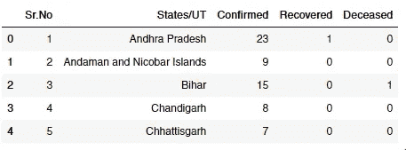
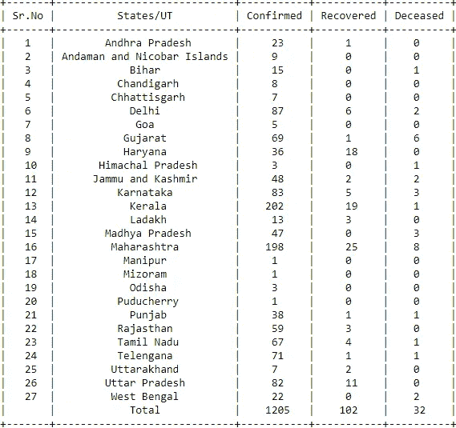
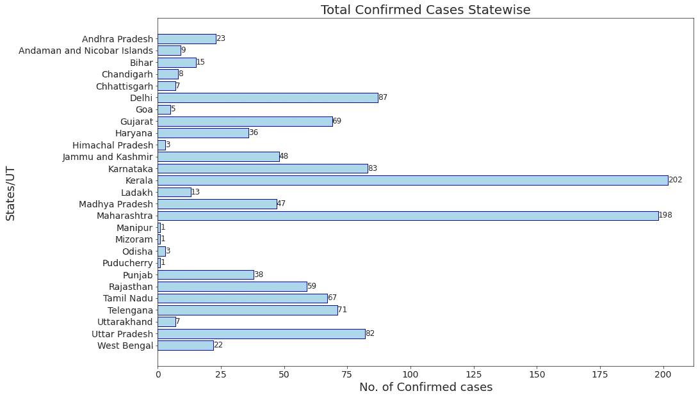
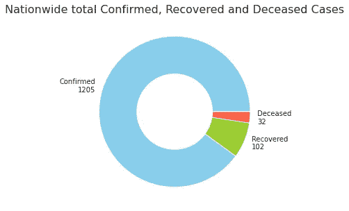
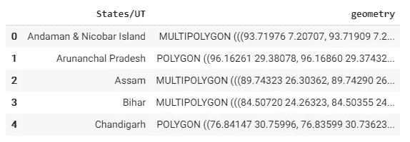
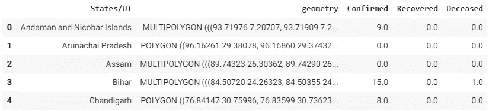
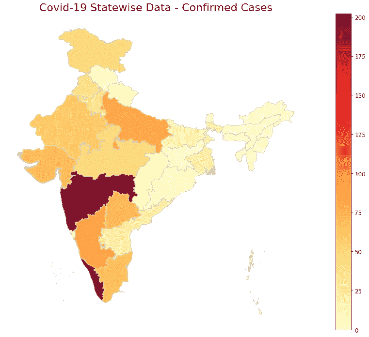

# 使用 Python 追踪冠状病毒(新冠肺炎)在印度的传播

> 原文：<https://towardsdatascience.com/tracking-corona-covid-19-spread-in-india-using-python-40ef8ffa7e31?source=collection_archive---------5----------------------->

## 从卫生部官方网站获取新冠肺炎病例的最新州级数据，并使用 Python 库将其可视化。


Patrick Assalé 在 [Unsplash](https://unsplash.com?utm_source=medium&utm_medium=referral) 上的照片

冠状病毒或新冠肺炎无需介绍。它已经被世卫组织宣布为疫情，在过去的几周里，从健康和经济角度来看，它的影响都是有害的。关于它已经写了很多，特别是关于它的指数增长和“[](https://www.washingtonpost.com/graphics/2020/world/corona-simulator/)**”的重要性的统计报告。**

**截至目前，我们大多数人都呆在家里工作，以避免冠状病毒的传播。我决定利用剩余时间编写一个 Python 脚本，从印度政府卫生和家庭福利部的官方网站[中提取新冠肺炎病例的最新数据，并使用流行的 Python 包(如 GeoPandas、Seaborn 和 Matplotlib)将其转化为有见地的可视化。](https://www.mohfw.gov.in/)**

## **使用的包**

*   **[Beautifulsoup](https://www.crummy.com/software/BeautifulSoup/bs4/doc/) —用于从 *html* 和 *xml* 文件中提取数据的库。**
*   **[Requests](https://requests.readthedocs.io/en/master/) —用于在 python 中发出 HTTP 请求的库。**
*   **GeoPandas —一个用 python 处理地理空间数据的库。**
*   **[PrettyTable](https://pypi.org/project/PrettyTable/) —在视觉上吸引人的 ASCII 表格中快速而简单地表示表格数据。**
*   **还有其他常规包像熊猫，Matplotlib，Seaborn。**

**如果您的系统上没有安装上述任何软件包，请按照相应链接中提到的安装说明进行操作。**

***(注意，Geopandas 进一步依赖于* [*fiona*](https://fiona.readthedocs.io/) *进行文件访问，依赖于* [*笛卡尔*](https://pypi.python.org/pypi/descartes) *和*[*matplotlib*](http://matplotlib.org/)*进行绘图)***

## **搜集数据**

**要使用 Python 抓取网站，您需要执行以下四个基本步骤:**

1.  **向您想要抓取的网页的 URL 发送 HTTP GET 请求，该请求将以 HTML 内容进行响应。我们可以通过使用 Python 的*请求*库来做到这一点。**
2.  **分析 HTML 标签及其属性，例如类、id 和其他 HTML 标签属性。此外，确定内容所在的 HTML 标签。**
3.  **使用 *Beautifulsoup* 库获取和解析数据，并在某种数据结构(如字典或列表)中维护数据。**
4.  **输出任何文件格式的数据，如 csv，xlsx，json 等。或者使用这些列表数据，使用 *Seaborn/Matplotlib* 库进行可视化。**

**如果你是网络抓取的新手，查看这个博客的逐步解释，可以帮助你开始使用 Python 进行网络抓取。**

**[](https://www.pluralsight.com/guides/extracting-data-html-beautifulsoup) [## 用 BeautifulSoup 从 HTML 中提取数据

### 如今，每个人都在谈论数据，以及它如何帮助学习隐藏的模式和新的见解…

www.pluralsight.com](https://www.pluralsight.com/guides/extracting-data-html-beautifulsoup) 

## 跳入代码中

导入必要的库—

```
import pandas as pd
import seaborn as sns
import matplotlib.pyplot as plt
import requests
from bs4 import BeautifulSoup
import geopandas as gpd
from prettytable import PrettyTable
```

网络抓取—

```
url = 'https://www.mohfw.gov.in/'*# make a GET request to fetch the raw HTML content*
web_content = requests.get(url).content*# parse the html content*
soup = BeautifulSoup(web_content, "html.parser")*# remove any newlines and extra spaces from left and right*
extract_contents = lambda row: [x.text.replace('\n', '') for x in row]*# find all table rows and data cells within*
stats = [] 
all_rows = soup.find_all('tr')for row in all_rows:
    stat = extract_contents(row.find_all('td')) *# notice that the data that we require is now a list of length 5*
    if len(stat) == 5:
        stats.append(stat)*#now convert the data into a pandas dataframe for further processing*new_cols = ["Sr.No", "States/UT","Confirmed","Recovered","Deceased"]
state_data = pd.DataFrame(data = stats, columns = new_cols)
state_data.head()
```

*输出:*



在我们继续之前，请注意抓取的数据列实际上是“string”数据类型。我们需要将它们转换成“int”数据类型。

```
state_data[‘Confirmed’] = state_data[‘Confirmed’].map(int)
state_data[‘Recovered’] = state_data[‘Recovered’].map(int)
state_data[‘Deceased’] = state_data[‘Deceased’].map(int)
```

您也可以选择使用[漂亮的表格](http://zetcode.com/python/prettytable/)来展示数据

```
table = PrettyTable()
table.field_names = (new_cols)for i in stats:
    table.add_row(i)table.add_row([“”,”Total”, 
               sum(state_data[‘Confirmed’]), 
               sum(state_data[‘Recovered’]),
               sum(state_data[‘Deceased’])print(table)
```

*输出:*



(这是撰写本文时最新的可用数据)

## 条形图—全州确诊病例总数

绘制水平条形图，显示全州确诊病例总数—

```
sns.set_style(“ticks”)
plt.figure(figsize = (15,10))plt.barh(state_data[“States/UT”],    state_data[“Confirmed”].map(int),align = ‘center’, color = ‘lightblue’, edgecolor = ‘blue’)plt.xlabel(‘No. of Confirmed cases’, fontsize = 18)
plt.ylabel(‘States/UT’, fontsize = 18)
plt.gca().invert_yaxis()
plt.xticks(fontsize = 14)
plt.yticks(fontsize = 14)
plt.title(‘Total Confirmed Cases Statewise’, fontsize = 18 )for index, value in enumerate(state_data[“Confirmed”]):
    plt.text(value, index, str(value), fontsize = 12)plt.show()
```

*输出:*



## 圆环图-全国确诊、恢复和死亡病例总数

```
group_size = [sum(state_data[‘Confirmed’]),
              sum(state_data[‘Recovered’]),
              sum(state_data[‘Deceased’])]group_labels = [‘Confirmed\n’ + str(sum(state_data[‘Confirmed’])),
                ‘Recovered\n’ + str(sum(state_data[‘Recovered’])),
                ‘Deceased\n’ + str(sum(state_data[‘Deceased’]))]custom_colors = [‘skyblue’,’yellowgreen’,’tomato’]plt.figure(figsize = (5,5))
plt.pie(group_size, labels = group_labels, colors = custom_colors)
central_circle = plt.Circle((0,0), 0.5, color = ‘white’)
fig = plt.gcf()
fig.gca().add_artist(central_circle)
plt.rc(‘font’, size = 12)
plt.title(‘Nationwide total Confirmed, Recovered and Deceased Cases’, fontsize = 20)plt.show()
```

*输出:*



## 全部确诊病例的氯普图

*本文中用来绘制带有邦界的印度地图的形状文件可以从这里的* [*下载。*](https://map.igismap.com/share-map/export-layer/Indian_States/06409663226af2f3114485aa4e0a23b4)

```
# reading the shape file of map of India in GeoDataFramemap_data = gpd.read_file(‘Indian_States.shp’)
map_data.rename(columns = {‘st_nm’:’States/UT’}, inplace = True)
map_data.head()
```

*输出:*



我注意到一些州和联邦直辖区(UT)的名称以及形状文件中的名称与政府网站上的州名不一致。因此，我修改了地理数据框架中的州/UT 名称，以便与我们的州数据框架中的名称相匹配。

更正*map _ data*data frame*中各州的拼写——*

```
*map_data[‘States/UT’] = map_data[‘States/UT’].str.replace(‘&’,‘and’)
map_data[‘States/UT’].replace(‘Arunanchal Pradesh’,
                              ‘Arunachal Pradesh’, inplace = True)
map_data[‘States/UT’].replace(‘Telangana’, 
                              ‘Telengana’, inplace = True)
map_data[‘States/UT’].replace(‘NCT of Delhi’, 
                              ‘Delhi’, inplace = True)
map_data['States/UT'].replace('Andaman and Nicobar Island', 
                              'Andaman and Nicobar Islands', 
                               inplace = True)*
```

*合并州/UT 名称上的两个数据帧 *state_data* 和 *map_data**

```
*merged_data = pd.merge(map_data, state_data, 
                       how = ‘left’, on = ‘States/UT’)merged_data.fillna(0, inplace = True)
merged_data.drop(‘Sr.No’, axis = 1, inplace = True)
merged_data.head()*
```

**输出:**

**

*在印度地图上显示各州的数据—*

```
*fig, ax = plt.subplots(1, figsize=(20, 12))
ax.axis(‘off’)ax.set_title(‘Covid-19 Statewise Data — Confirmed Cases’, 
             fontdict =  {‘fontsize’: ‘25’, ‘fontweight’ : ‘3’})merged_data.plot(column = ‘Confirmed’, cmap=’YlOrRd’, 
                 linewidth=0.8, ax=ax, edgecolor=’0.8', 
                 legend = True)
plt.show()*
```

**输出:**

**

## *完整的 Python 代码*

## *结束注释*

*新冠肺炎还没有大规模袭击印度。缺失的数据使得预测未来几个月疫情将如何发展变得不可能。在我结束这篇文章的时候，我为印度和世界各地的每一个人的安全和幸福祈祷。*** 

*****编者注:*** [*走向数据科学*](http://towardsdatascience.com/) *是一份以数据科学和机器学习研究为主的中型刊物。我们不是健康专家或流行病学家，本文的观点不应被解释为专业建议。想了解更多关于疫情冠状病毒的信息，可以点击* [*这里*](https://www.who.int/emergencies/diseases/novel-coronavirus-2019/situation-reports) *。***