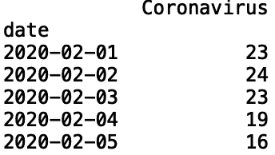
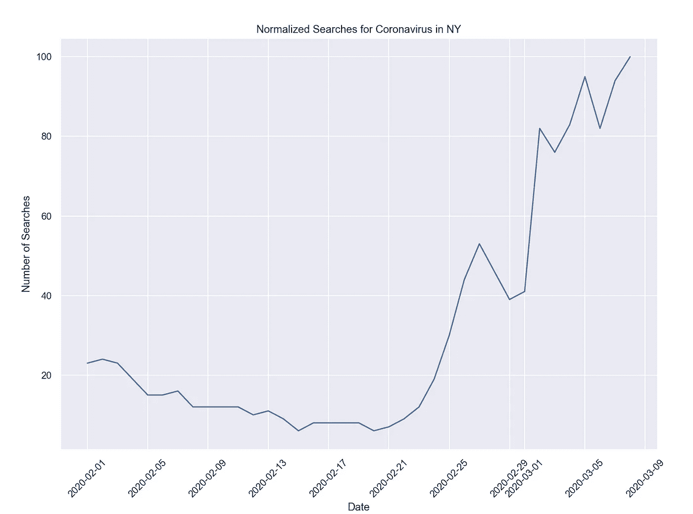
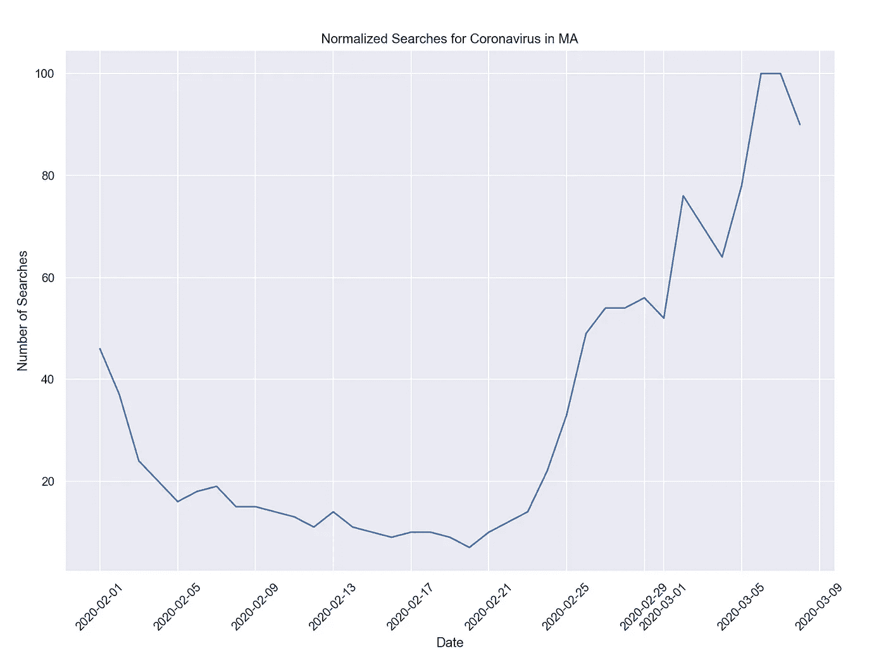
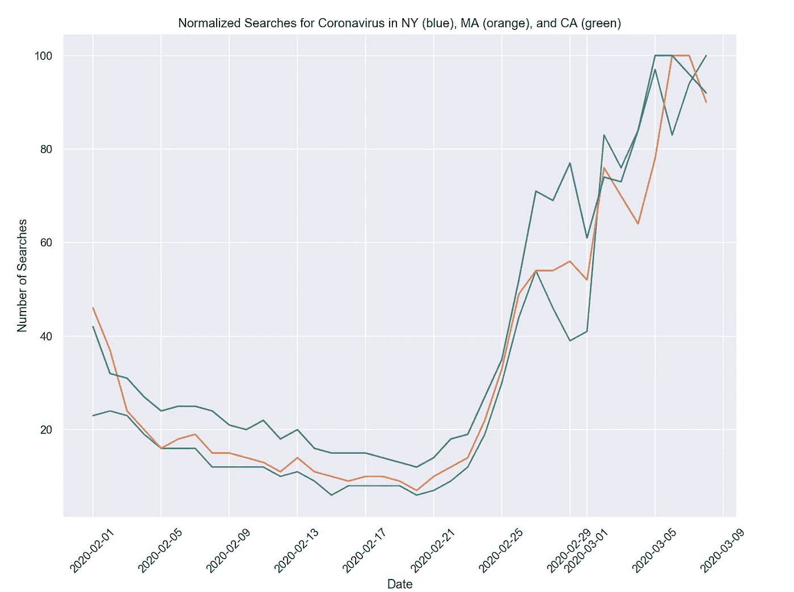

# Python 中的冠状病毒谷歌趋势

> 原文：<https://towardsdatascience.com/tracking-coronavirus-engagement-with-google-trends-in-python-5a4b08bc6977?source=collection_archive---------7----------------------->

## 谷歌搜索的州级分析


[疾控中心](https://unsplash.com/photos/w9KEokhajKw)在 [unsplash](https://unsplash.com/photos/w9KEokhajKw) 拍摄的照片

冠状病毒是一种在动物和人之间传播的病毒家族。症状包括发烧、咳嗽和轻微的呼吸道疾病。在严重的情况下，感染会导致肺炎和死亡。在写这篇文章的时候，美国疾病控制中心报告了 645 例病例和 25 例死亡。[在传染病研究领域](https://www.sciencedirect.com/science/article/pii/S0160412018300771)，社交媒体数据已被证明是预测感冒和流感季节开始和发展的有用指标。在本帖中，我们将使用谷歌趋势 API 来衡量各州对冠状病毒的参与度。

我们将使用 python Google trends API py trends 来分析州级的“冠状病毒”谷歌搜索。

要安装 pytrends，请打开命令行并键入:

```
pip install pytrends
```

接下来，打开一个 IDE(我使用 Spyder)并导入 pytrends:

```
from pytrends.request import TrendReq
```

接下来，我们指定主机语言、时区和有效负载。我们将主机语言指定为英语(“en-US”)，时区为中部标准时区，即“360”，我们可以将 google 属性过滤器(gprop)保留为空字符串。我们还设置 category = 0，对应于与该关键字相关的所有类别。

让我们看看纽约 2020 年 2 月至 2020 年 3 月的“冠状病毒”数据:

```
pytrends = TrendReq(hl='en-US', tz=360)
pytrends.build_payload(['Coronavirus'], cat=0, timeframe='2020-02-01 2020-03-10',  gprop='', geo='US-NY')
```

然后，我们将数据框定义为结果 pytrends 对象，并打印前五行:

```
df = pytrends.interest_over_time()
print(df.head())
```



我们也可以使用 seaborn 和 matplotlib 来绘制搜索“冠状病毒”的时间序列:

```
import matplotlib.pyplot as plt
import seaborn as sns
import pandas as pdsns.set()
df['timestamp'] = pd.to_datetime(df.index)
sns.lineplot(df['timestamp'], df['Coronavirus'])plt.title("Normalized Searches for Coronavirus in NY")
plt.ylabel("Number of Searches")
plt.xlabel("Date")
```



让我们对马萨诸塞州的“冠状病毒”做同样的事情:



我们可以定义一个函数来获取任何状态的数据:

```
def get_searches(key_word, state):
    pytrends = TrendReq(hl='en-US', tz=360)
    pytrends.build_payload([key_word], cat=0, timeframe='2020-02-01 2020-03-10',  gprop='',geo='US-{}'.format(state))    
    df = pytrends.interest_over_time()

    print(df.head())

    sns.set()
    df['timestamp'] = pd.to_datetime(df.index)
    sns.lineplot(df['timestamp'], df[key_word])

    plt.title("Normalized Searches for {} in {}".format(key_word, state))
    plt.ylabel("Number of Searches")
    plt.xlabel("Date")
```

让我们为 NY、MA 和 CA 调用这个函数:

```
get_searches('Coronavirus', 'NY')
get_searches('Coronavirus', 'MA')
get_searches('Coronavirus', 'CA')
```



我就说到这里，但请随意从其他州提取数据。你也可以随意输入关键字。也许你会想搜索“冠状病毒症状”或“冠状病毒死亡率”。

# 结论

总之，在这篇文章中，我们使用 python 库“pytrends”提取了与关键词“冠状病毒”相对应的州级谷歌趋势数据。社交媒体数据，如谷歌趋势数据，可能有助于衡量公共卫生相关话题的社会参与度，如冠状病毒。这可能有助于卫生机构，如疾病预防控制中心，定量评估需求，分配资源和沟通预防措施。我希望你觉得这篇文章有用/有趣。这篇文章的代码可以在 [GitHub](https://github.com/spierre91/medium_code/blob/master/coronavirus_google_trends.py) 上找到。感谢您的阅读！