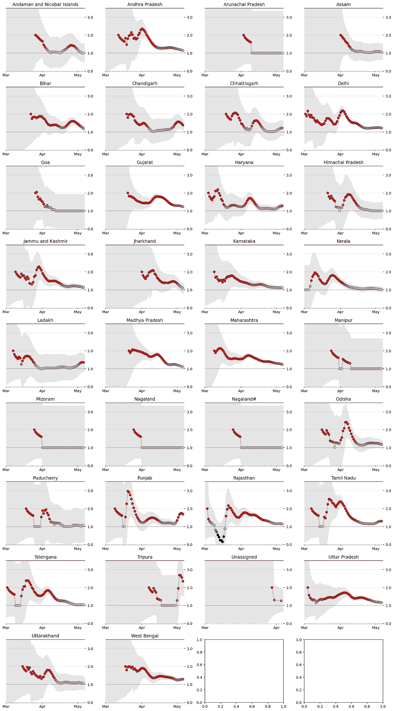
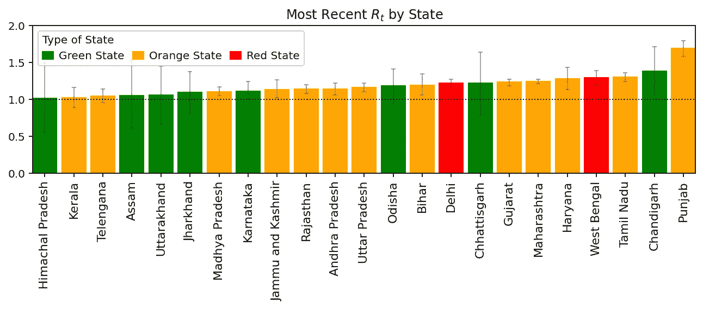

# 追踪新冠肺炎病毒在印度的传播

> 原文：<https://towardsdatascience.com/tracking-covid-19-transmission-in-india-e9ec286b8df0?source=collection_archive---------36----------------------->

## 研究动态传播率以追踪新冠肺炎在整个次大陆的传播

照片由[欧蒂莉](https://unsplash.com/@ohtilly)通过 [Unsplash](https://unsplash.com/photos/2iu_qKPbjSk) 拍摄

凯文·斯特罗姆最近发表了一篇名为[“我们需要追踪新冠肺炎的一个指标”](http://systrom.com/blog/the-metric-we-need-to-manage-covid-19/)的文章。这种度量被称为可变传播率，被指定为 R_t。使用美国新冠肺炎的公共数据，Systrom 计算了每个州的有效 R_t 率，并探索了 R_t 在跟踪病毒传播方面的有效性。

除了这篇文章，Systrom 还发布了一个 [Python 笔记本](https://github.com/k-sys/covid-19/blob/master/Realtime%20R0.ipynb)，这样其他人就可以即插即用他的实现了。以 Kaggle 最近按州和地区划分的印度新冠肺炎案例数据集为例，有一个完整的世界可供探索。

# 贝当古-里贝罗公司

Systrom 实现的特定算法最初由流行病学家团队 [Bettencourt 和 Ribeiro](https://journals.plos.org/plosone/article?id=10.1371/journal.pone.0002185) 于 2008 年发表。他们提出了计算动态 R_t 的贝叶斯方法，该方法将考虑以前的 R_t 和新的观察值——每天新病例的数量——并相应地进行调整。如果您对算法背后的数学和完整推导感兴趣，我建议您浏览之前链接的 Python Notebook，甚至是 Bettencourt 和 Ribeiro 的原始论文。

简而言之，电流 R_t 由下式计算:

*   *P(R_t|k) ~乘积 L(R_t|k)*

Systrom 做了修改。从第 0 天开始跟踪 R_t 公司的原始模型。这有一些长期的影响。第 30 天的模型不会忘记第 1 天 R_t 的高值。这意味着 1 的行为就像一条渐近线，每个状态的 R_t 都是 1，不会更低。

为了对此进行调整，Systrom 让他的模型简单地使用 7 天的移动窗口。任何一天的 R_t 值将基于前 7 天的 R_t。这种可能性受到最高密度区间的限制，以说明数据的彻底性。给定更多的样本大小-更完整的数据集-我们将获得更小和更集中的最高密度区间。

# 将 Systrom 的算法映射到印度

印度的一项开源努力已经产生了一个开放的各邦新冠肺炎病例数据集。模块化代码使得清除印度数据并将其插入笔记本变得容易。要做的两个小调整是:

1.  处理不同的日期格式
2.  将每日新病例计数更改为累计病例计数。

从那里开始，事情变得简单明了，我能够为所有的印度州和地区制作一个运行的 R_t 图:

当前印度各邦的 R_t。数据不足 5 天的州被排除在外。未分配的病例是指没有附加州的新冠肺炎诊断。

# R_t 的效果如何？

在 2020 年 5 月 1 日发布的最新名单中，印度将各区分为红色区、橙色区和绿色区。红色区域是指病毒增长率高的地区，被划分为热点。绿色区域是指没有新的新冠肺炎病例的区域。橙色区域是有病例报告的地区，但病例比红色区域少。你可以在这里找到那个列表[。利用这些分界线，我将这些州分为三类:](https://www.jagranjosh.com/current-affairs/coronavirus-hotspot-areas-in-india-what-are-hotspots-know-all-covid-hotspots-1586411869-1)

*   红色州:红色区域比橙色或绿色区域多的州
*   橙色州:橙色区域多于红色或绿色区域的州
*   绿色州:绿色区域多于红色或橙色区域的州。

R_t 是衡量每一次新冠肺炎诊断会将病毒传播给多少人的指标。更高的 R_t 将意味着该州将是橙色或红色，因为病例数继续扩散。

每个状态 R_t 的条形/须状图。排除最高密度间隔大于 1 的状态

查看该图，我们可以看到，以红色和橙色区域为主的邦往往具有较高的 R_t 值。对于绿色的昌迪加尔邦和恰蒂斯加尔邦，它们都具有较大的最高密度区间。这是因为数据较少，尤其是缺乏日常数据。至于橙色的邦，如旁遮普和泰米尔纳德邦，红色的区域是人口密度高的地区，那里更容易在人与人之间传播，这反映了较高的 R_t。

从一个州的层面来看 R_t 描绘了一幅相当准确的画面。那些 R_t 较高的邦也可能被印度政府指定为新冠肺炎热点。

# 牢记上下文

这是对病毒如何渗透到人群中的一个有价值的观察，现在的预防措施，如传播的锁定效应。还有一些重要的因素需要记住。

这个模型没有考虑测试。它接受第 *k* 个新案例，认为数字是准确的。事实上，印度的测试设置并不普遍，只有一定比例的人口接受过测试。毫无疑问，存在未诊断的病例，这将对 R_t 产生重大影响。

这个数据集很难追踪。印度是一个拥有超过 10 亿人口的大国。由于封锁，印度有数百万人被困，其中一些人步行数百英里从主要城市地区返回家园。这个数据集是一个非凡的开源成果，但很难保证它 100%准确，在跟踪像 R_t 这样的衍生工具时应该记住这一点。

# 未来的工作

我将来要寻找的东西将是如何通过这个模型来解释已经测试过的人口比例。考虑到这一点，我们会对新冠肺炎的传播率有一个更准确的了解。

***感谢阅读！如果你喜欢，请随时关注我！你可以在推特@EswarVinnakota 上找到我。如果你想谈谈，请随时通过 DMs 联系我或在***[***LinkedIn***](https://www.linkedin.com/in/raovinnakota/)***上与我联系。***