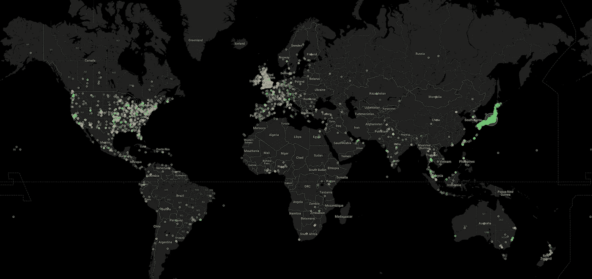
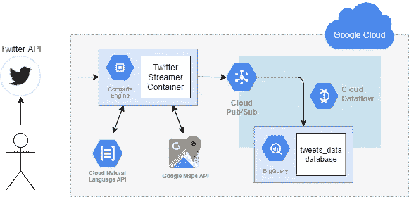
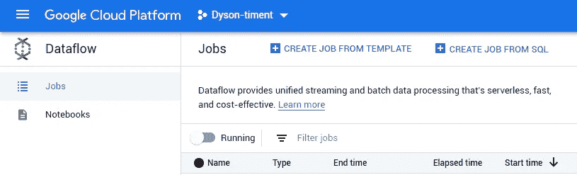
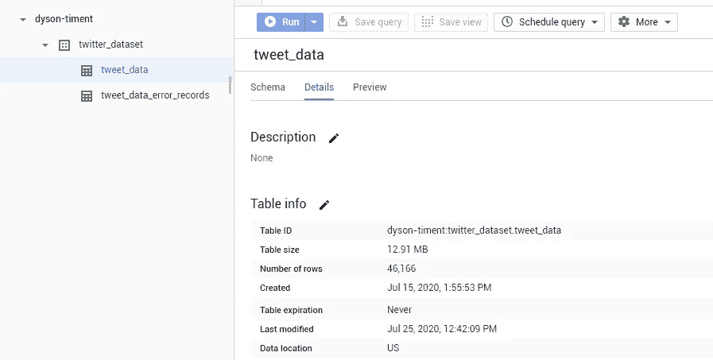
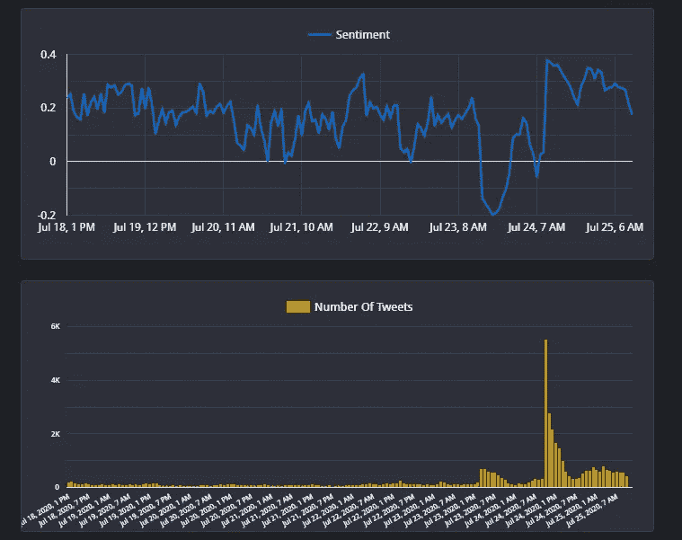
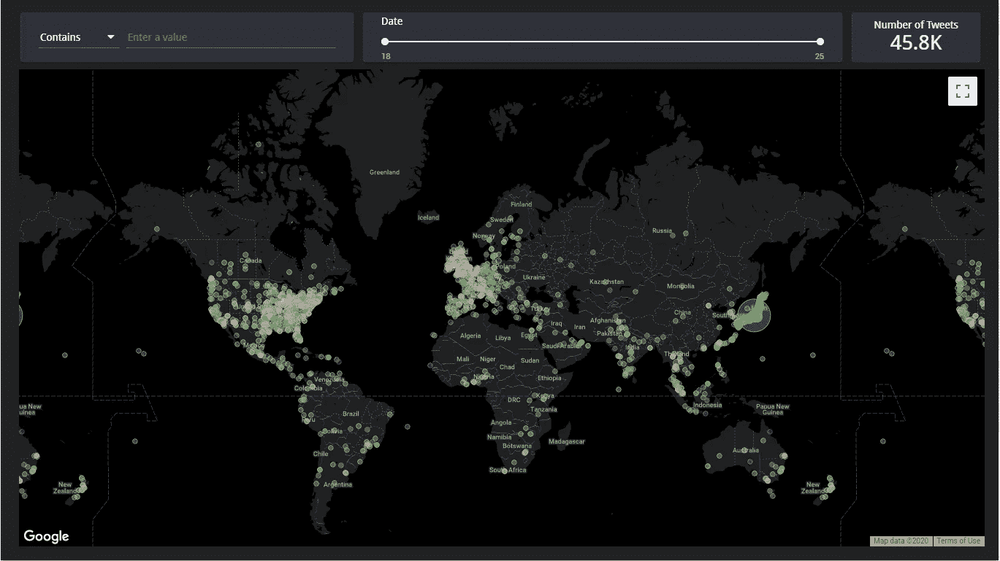
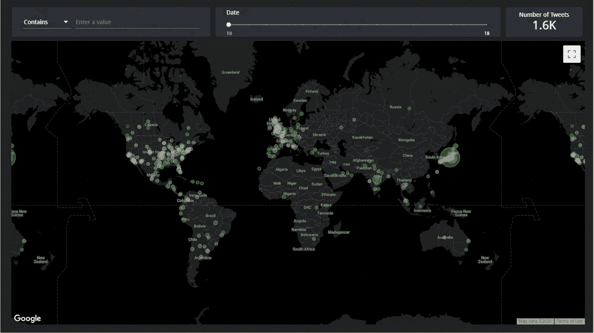
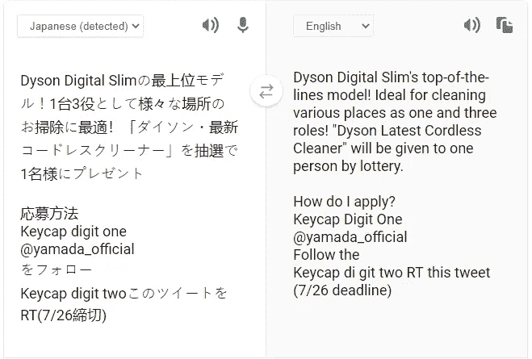
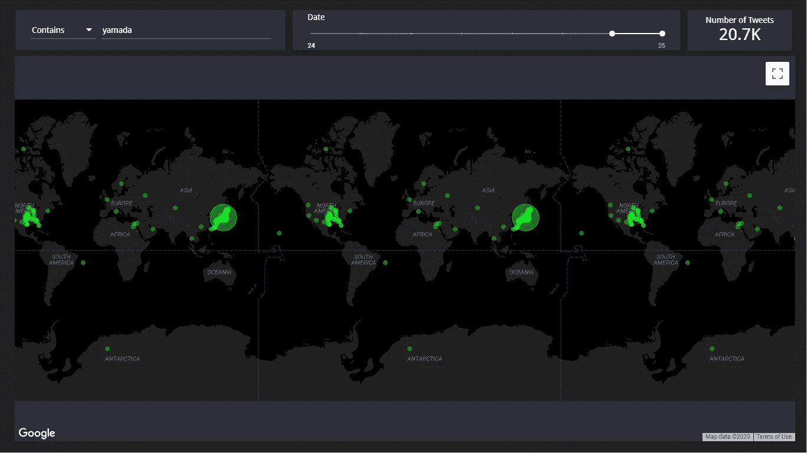

# 使用 46，166 条推文追踪戴森的公众形象

> 原文：<https://towardsdatascience.com/tracking-dysons-public-image-using-46-166-tweets-68af509923a6?source=collection_archive---------23----------------------->

## Google 自然语言 API 和 BigQuery 的一课

*这项工作是个人项目，与戴森没有任何关系*

作者图片

这个项目开始于新冠肺炎，就像现在所有的事情一样。鉴于我天赋的空闲时间，我决定唯一合理的方式就是编程。作为戴森学院的一名本科生，我认为看看公众如何看待更广泛的公司会很有趣。因此，带着价值 300 英镑的免费谷歌云积分，我决定尝试一下。

碰巧的是，我让我完成的代码运行的那一周是公司历史上裁员最多的一周。这并不意味着要轻视成百上千失去工作的人，它最终成为了这个项目的完美测试环境，并产生了一些非常有趣的结果。如果你不关心我是如何完成这项工作的，请跳到最后查看结果的分类。

我，以我无穷的智慧，决定将这个项目命名为“戴森-泰蒙特”。

## 项目概述

我在这里的目标是建立一个谷歌云项目，捕获所有包含“Dyson”一词的推文，进行一些基本的情感分析，并最终将其放入 BigQuery 数据库。主要的 Python 应用程序将是一个 Docker 容器，可以轻松可靠地部署到虚拟机上。

Dyson-timent 的逻辑架构(图片由作者提供)

正如你所看到的，即使是这样一个小项目，也有很多活动的部分。该图还遗漏了 Google Secret Manager，我用它来存储我所有的 Twitter API 密钥。

从 VM 实例到 BigQuery 数据库获取 Tweet 数据的管道是使用数据流模板建立的。Python 应用程序将 Tweet 数据(作为 JSON)发布到 Pub/Sub 主题，然后数据流为我处理导入到 BigQuery 的操作。

使用数据流模板抽象出数据处理任务(图片由作者提供)

使用这样的模板大大降低了我这边的复杂性，使我能够专注于项目的其余部分。这是使用 IAAS 提供商的众多卖点之一——他们带走了大量无聊的任务并进行设置。

谷歌主机说够了，我们来说代码。

# 代码

对于项目的复杂性来说，代码本身实际上并不复杂，因为大部分繁重的工作都是由 Google 的 API 处理的。我们所要做的就是调用它们，这是在 Python 中使用各种 Google Cloud 包完成的，这些包都是使用 pip 简单安装的。

## 谷歌云凭据

因为我希望在云中的 Docker 容器中运行之前能够在本地运行，所以我需要一种方法来处理两种不同的获取云凭证的方法。当应用程序启动时，它会寻找一个环境变量`AM_I_IN_A_DOCKER_CONTAINER` *。*这个变量是在 docker 文件中设置的，所以如果 Python 找到了它，应用程序肯定知道它正在云中运行，并相应地设置自己。

检测代码是否正在云中运行的策略

在云中运行时，所有凭证都由 VM 实例自动处理。在本地运行时，我使用从 Google Cloud IAM 下载的服务帐户凭证文件(上面的第 16 行),并将其传递给我所有的云服务。

## Twitter 流媒体

设置 Twitter 流非常简单，因为[文档](http://docs.tweepy.org/en/latest/streaming_how_to.html#:~:text=Tweepy%20makes%20it%20easier%20to%20use%20the%20twitter,with%20Tweepy%20by%20offering%20a%20first%20walk%20through.)非常棒。

与 Twitter 流相关的代码

我简单地建立了一个`StreamListener`-继承类，如图所示，给了`OAuthHandler`我的 API 密钥和令牌，并把它们全部传递给了一个`Stream` *。*然后通过向流传递一个`tracklist`来过滤流，它只是一个搜索字符串列表——在我们的例子中是`[‘#Dyson’, ‘Dyson’]`。

这不是一个完美的解决方案，因为搜索不够智能，无法排除任何与詹姆斯·戴森或该公司无关的“戴森”的提及。然而，我的假设是，大多数包含“戴森”的推文将与我们相关。

此时，任何包含单词“Dyson”的 Tweets 都出现在`Listener` 类的`on_data()` 方法中，在这里我们可以对它们做一些有趣的事情。

下面是传入的 Tweets 从字符串解析成 JSON 后的样子。

Python 应用程序在调试中捕获的推文(作者截图)

如你所见，仅仅一条推文就包含了大量的数据。我最终提取的字段只有`created_at`、`id_str`、`text`、`user*.*location` 和`lang`。这些给了我大量有价值的信息。

## 自然语言 API

在这个阶段，我们有来自 Tweet 的相关字段。现在开始处理。我写了一个小函数，`analyse_sentiment`使用他们的 [Python 包](https://pypi.org/project/google-cloud-natural-language/)将 Tweet 文本和语言代码发送给[云自然语言 API](https://cloud.google.com/natural-language/#natural-language-api-demo) 。

因为来自 Twitter 的语言代码包含在我对自然语言 API 的调用中，它可以分析世界上几乎任何语言的推文！我们不局限于简单的古英语。

从自然语言 API 中获取文本并计算和返回情感的函数

这是我喜欢现代云技术的另一个原因；你可以在一行代码(第 7 行)中完成非常复杂的事情，比如语言处理，只需要进入 Google 预先训练好的 ML 模型。

我使用的 API 端点最终返回两个值:情绪和信心。情绪从-1 到+1 排列，其中+1 表示非常积极，而-1 表示非常消极。置信度从 0 到 1 排序，并表示 ML 模型对情感分数正确的“确信”程度。

我做了一个(无可否认是武断的)决定，丢弃任何置信度低于 0.1 的推文，希望提高最终数据的质量。

## 谷歌地图 API

我从推文中提取的另一个非常有价值的数据是用户的位置。现在我必须承认，做这一切感觉非常老大哥。但是我做这些事是为了一个好的理由——我自己的好奇心。

`user.location`字段似乎由 Twitter 用户的输入填充，因为它的格式不一致。推文无所不包，从胡言乱语到“美国”到“苏格兰东海岸”。因此，这使得很难转换到适合分析的特定 GPS 坐标。

我又一次被谷歌 API 的魔力所拯救。Google Maps API 本质上允许您在 API 调用中进行 Google Maps 搜索。这是非常有用的，因为 G-Maps 擅长于获取模糊的地名，并给它们分配一个精确的 GPS 坐标。

与`analyse_sentiment`方法类似，我创建了一个`place_search` 函数，它获取用户模糊的地名，将其提供给 Google Maps，并将返回的纬度/经度数据转换为 BigQuery 理解为位置数据的形式(我们并没有忘记这些数据最终会出现在哪里！).

这种格式就是“[众所周知的文本表示](https://en.wikipedia.org/wiki/Well-known_text_representation_of_geometry)”(由此而来的`wkt_loc`)。

这样一来，剩下唯一要做的事情就是发送一个包含所有情绪和位置数据的 JSON 字符串到 Pub/Sub 主题！

这显然不是全部代码，但是这篇文章越来越长了。完整的代码，请查看我的 GitHub repo。

让我们从细节上退一步。

我们现在有代码可以通过关键字/短语来传输和过滤推文，确定推文的情绪是积极还是消极，确定推文来源的一组合理的 GPS 坐标，然后将其发送并存储在数据库中。

我觉得这太酷了。

# 完成了！

代码完成后，就可以部署到容器优化的计算引擎上了。因为我只做了一次，所以我使用云控制台用我的项目的最新 Docker 构建来启动一个 VM 实例。于是，在 2020 年 7 月 18 日，它开始运行。

对我的工作感到满意，我让它大部分时间在后台运行，时不时地回来检查错误，以确保我没有太快用完我的谷歌云积分(我就是这样)。

然后，在 7 月 23 日，[戴森宣布，由于新冠肺炎](https://www.bbc.co.uk/news/business-53517243)的影响，它将裁员 900 多人。这个项目通过 Twitter 捕捉到了所有这些。

经过整整 8 天的监控，以及 BigQuery 中处理和呈现的超过 46，000 条推文，当我只剩下最后 50 个信用点时，我终于决定拔掉插头。

46166 条推文(作者截图)

是时候通过开放数据来看看这一切是否值得了。

## 数据

啊，我们期待已久的时刻。如果你是从上往下跳的，请再打个招呼。

随着数千条推文在我的 BigQuery 数据库中烧出一个洞，我开始分析数据。为此，我做了一个 Google Data Studio 项目，因为它非常容易与 BigQuery 交互，并且可以生成非常好看的 web 报告。

首先要做的是查看平均情绪和一段时间内推文数量的图表。

数据！请看相关的[数据工作室项目](https://datastudio.google.com/reporting/a813866d-8df3-4691-a89b-b3e1e8386b50)(图片由作者提供)

你能看看那个吗？在大多数日子里，平均情绪徘徊在 0.1 至 0.3 之间，我们可以将其解释为总体积极的情绪。

然而，在裁员的那天(23 日),人气大幅下滑至-0.2！这清楚地表明代码正在工作！

不过，从 24 日开始，我们看到未来两天将出现大幅反弹，创下新高。推文数量也出现了大幅增长。这是为什么？？我想不通。

我拥有的最后一点数据是每条推文的来源位置。我在我的 Data Studio 项目中设置了一个 Google Maps visualiser，用于查询数据库中的所有内容。点的颜色基于情感，其中-1 是深红色，0 是灰色，+1 是绿色。让我们来看看。

每条推文的位置。红色是阴性，灰色是中性，绿色是阳性(图片由作者提供)

我们来剖析一下这个。大多数推文来自英国、美国和日本。戴森在所有这些国家都有很强的影响力，所以这是意料之中的。

日本有着压倒性的积极情绪，整个国家都是绿色的。相比之下，英国似乎大多是红色和中性。典型的英国人，总是消极的。

这显示了每天的所有数据，所以让我们在这里按日期深入查看。下面的 gif 循环显示每天的信息。顶部的滑块告诉你它在 7 月的哪一天上映。

按日期分类的推文(按作者分类的图片)

很酷吧。

除了 23 号——宣布裁员的那一天，英国每天的情况都很复杂。全球似乎也普遍存在负面影响。

看看日本的反应，我们得到了 24 日和 25 日积极反弹的线索。日本总是非常绿色，但在那些日子里，它明显更密集的推文。

> 24 日日本发生了什么让大家这么积极？！

我在 Twitter 上搜索 7 月 24 日包含“Dyson”一词的日文推文。你瞧，我发现了下面的推文。

导致推文数量激增的推文(作者截图)

21800 条转发？！这几乎是我收集的所有推文的一半！推特上说了什么？我用谷歌翻译了一下。

(作者截图)

谜团解开了！日本大型家用电器公司山田电机(Yamada Denki)向一名转发并关注其 Twitter 账户的幸运儿赠送了一台新的戴森吸尘器。该项目一定收集了每一条转发，以及由此引发的所有其他推文。

事实上，让我们找到更多的证据。我会在地图上搜索 24 号和 25 号之间的“yamada”这个词。根据推特，有 21800 人转发了这条微博。我们的数据库里应该有类似的数字。

在互动地图中搜索山田(图片由作者提供)

20700 条推文，还不错！在这一点上，这似乎是非常确凿的，你不同意吗？

## 总之…

对于基于云的项目来说，Google Cloud 是一个非常有价值的工具。易于访问的 API 和 tick-box 环境设置极大地减少了您需要做的(从根本上)非常复杂的工作，如情感分析。即使对我这样的初学者来说。

我希望你觉得这很有趣，甚至可能启发你做一个类似的项目！

> 如果你想玩交互式地图，请查看我的[数据工作室项目](https://datastudio.google.com/reporting/a813866d-8df3-4691-a89b-b3e1e8386b50)
> 
> 完整代码见[我的 GitHub repo](https://github.com/ethanr-2000/dysontiment) 。