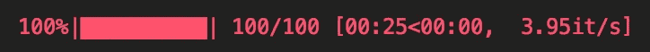
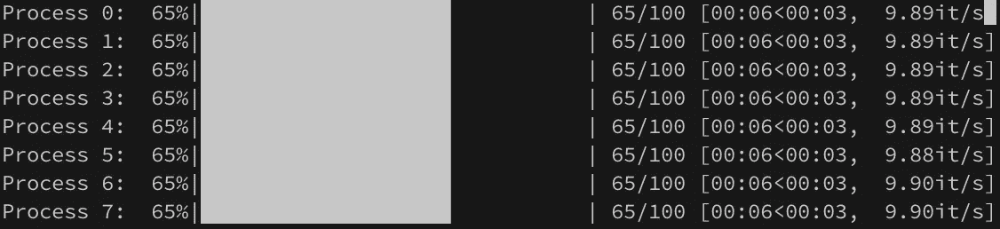
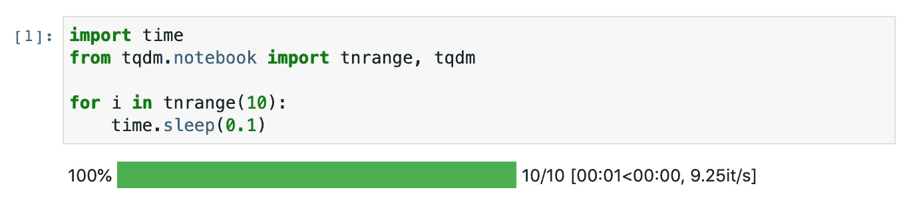

# 使用 tqdm 跟踪大型作业

> 原文：<https://towardsdatascience.com/tracking-monster-jobs-with-tqdm-7a8a9856aff0?source=collection_archive---------34----------------------->

## TQDM 是 Python 的一个易于使用、可扩展的进度条包。这篇短文给了你一些有用的例子来帮助你开始。


Unsplash 上的 Volodymyr Hryshchenko

# 追踪你的进度

你真的无法击败一个伟大的，高质量的小包装，使你更有生产力。`tqdm`就是这样一个包。这是一个易于使用、可扩展的进度条 Python 包，使得向 Python 进程添加简单的进度条变得极其容易。如果你是一名专业的数据科学家或机器学习(ML)工程师，你可能已经使用或开发了算法或数据转换，这可能需要相当长的时间——可能需要几个小时甚至几天——才能完成。

对于人们来说，选择简单地将状态消息打印到控制台并不罕见，或者在一些稍微复杂一些的情况下，使用(优秀的和推荐的)内置`logging`模块。在很多情况下，这是好的。然而，如果您正在运行一个有数百个步骤的任务(例如，训练时期)，或者运行一个有数百万个元素的数据结构，这些方法有时会有点不清楚和冗长，坦率地说有点难看。另外，在你的代码中加入一些“开发者体验”的东西(比如进度条！)也可以让你的代码[更加用户友好](https://www.bbc.com/future/article/20191205-why-progress-bars-can-make-you-feel-better)。

# 给我看看代码！

这就是`tqdm`的用武之地。它有一个漂亮干净的 API，可以让你快速地在代码中添加进度条。此外，它还有一个轻量级的“剩余时间”估计算法内置在进度条中。在一些 ML 包中使用了`tqdm`包，其中最突出的可能是`implicit`，一个 Python [隐式矩阵分解库](https://github.com/benfred/implicit)。在这篇文章中，我们来看看下面这个使用`tqdm`的模拟“训练循环”的例子:

```
import time 
from tqdm import tqdm with tqdm(total=100) as progress: 
    for i in range(100): 
        time.sleep(0.25) 
        progress.update(1)
```

在这个简单的例子中，您设置了一个`tqdm`进度条，该进度条预计包含 100 个步骤。然后，您可以运行循环(步骤之间有 0.25 秒的停顿)，每次在步骤完成时更新进度条。如果你也跳出了循环，你也可以任意数量的更新进度条。这是两行代码(加上 import 语句),可以在代码中得到一个很酷的小进度条。以下是您得到的结果:



一个简单的 **tqdm** 进度条！Mark Douthwaite 截图

# 熊猫集成

除了给你的程序输出添加一些很酷的小东西之外，`tqdm`还可以很好地与其他广泛使用的软件包集成。对于数据科学家来说，最有趣的集成可能是 Pandas，无处不在的 Python 数据分析库。看看下面的例子:

```
df = pd.read_csv("weather.csv") 
tqdm.pandas(desc="Applying Transformation") 
df.progress_apply(lambda x: x)
```

从技术上讲，`tqdm.pandas`方法猴子将`progress_apply`方法修补到熊猫的数据结构上，给它们一个常用的`apply`方法的修改版本。实际上，当我们调用`progress_apply`方法时，这个包用一个`tqdm`进度条包装了标准的 Pandas `apply`方法。当您处理大型数据帧时，这非常方便！


一个进度条的例子，由 Mark Douthwaite 截图的`**tqdm**`与`pandas.` 的集成生成

# 平行过程

这里还有另一个值得一提的常见应用:`tqdm`对于设置跟踪并行进程的进度条也很有用。下面是一个使用一些`tqdm`内置支持更新平行贴图进度条的例子:

```
import time 
from tqdm.contrib.concurrent import process_map def my_process(_): 
    time.sleep(0.25) 
    r = process_map(my_process, range(0, 100), max_workers=2, desc="MyProcess")
```

在这种情况下，在每个子流程中，每次`my_process`调用完成*时，都会有一个进度条更新。不过还有第二个用例:如果您有许多长时间运行的流程，并且希望单独跟踪它们，该怎么办？例如，如果您想避免在进程中序列化和反序列化大型对象，这可能更好。你也可以这样做:*

```
import time 
import multiprocessing as mp 
from tqdm import tqdm def my_process(pos): 
    _process = mp.current_process() 
    with tqdm(desc=f"Process {pos}", total=100, position=pos) as progress: 
        for _ in range(100): 
            time.sleep(0.1) 
            progress.update(1) n_cpu = mp.cpu_count()with mp.Pool(processes=n_cpu, initializer=tqdm.set_lock, initargs=(tqdm.get_lock(),)) as pool: 
    pool.map(my_process, range(n_cpu))
```

这将为您提供类似以下内容的输出:



一个进度条同时跟踪 8 个任务的例子。Mark Douthwaite 截图

还有一个要点[这个例子](https://gist.github.com/markdouthwaite/4a33bf92d5ffdf264d7ee5938a31d84b)你也可以用:

一些示例代码，只给你！💛

# 还有一点

另外，`tqdm`在 Jupyter 笔记本中运行[时，提供了对进度条的支持，作为格式良好的小部件。例如，在笔记本中运行以下代码:](https://tqdm.github.io/docs/notebook/)

```
import time
from tqdm.notebook import tnrange, tqdmfor i in tnrange(10):
    time.sleep(0.1)
```

会产生以下结果:



Jupyter 的进度条！Mark Douthwaite 截图

您可能会注意到您在这里重新导入了`tqdm`。当您想要直接使用`tqdm`对象时，您应该以这种方式导入`tqdm`(如上例所示)。您应该能够直接放下上面的示例片段，并立即获得好看的进度条。哦，请确保从示例中删除`time.sleep`行！

*原载于*[*https://mark . douthwaite . io*](https://mark.douthwaite.io/monster-jobs-with-tqdm/)*。*