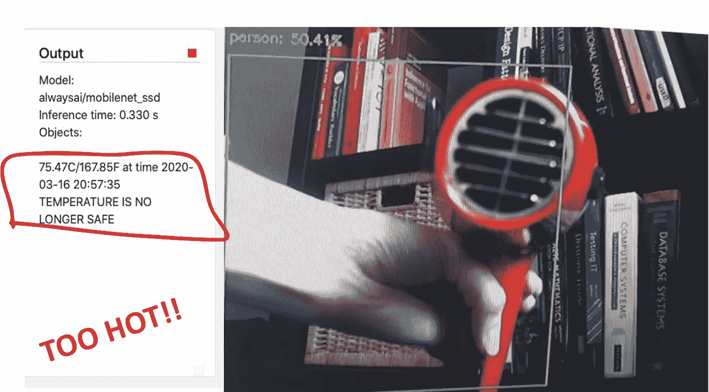

# 在计算机视觉应用中跟踪 Raspberry Pi 内部温度

> 原文：<https://towardsdatascience.com/tracking-raspberry-pi-internal-temperatures-in-computer-vision-applications-3c039fe6ec14?source=collection_archive---------44----------------------->



运行计算机视觉应用程序(或一般的人工智能应用程序)会给边缘设备带来压力，尤其是在组合模型时。使用[散热器和风扇](https://medium.com/hacksters-blog/carefully-researched-raspberry-pi-3-active-cooling-10109a045235)可能足以防止设备节流，但在您的设备变得这么热之前得到通知会很有帮助。收到潜在不安全温度的警报后，您可以在设备烧毁之前停止应用程序，并继续监控温度——当设备充分冷却后，您可以选择重新启动程序。

**为此，我们创建了一个实用程序类，使您能够跟踪和记录温度读数，并提供所收集数据的摘要。**

本教程使用一个 Raspberry Pi 4 和包“gpiozero”，它默认安装在 Raspbian 操作系统映像上。欲了解更多关于此包的信息，请参见以下[链接](https://gpiozero.readthedocs.io/en/stable/installing.html)。

**要完成本教程，您必须具备:**

1.  一个 [alwaysAI 账号](https://alwaysai.co/auth?register=true&utm_campaign=Open%20Beta&utm_source=medium&utm_content=temperature-tracking)(免费！)
2.  在你的机器上设置 alwaysAI(也是免费的)
3.  诸如 [sublime](https://www.sublimetext.com/) 之类的文本编辑器或者诸如 [PyCharm](https://www.jetbrains.com/pycharm/) 之类的 IDE，或者任何你喜欢用来编码的东西

请参见 alwaysAI [博客](https://learn.alwaysai.co/?&utm_campaign=Open%20Beta&utm_source=medium&utm_content=temperature-tracking)了解更多关于[计算机视觉](https://learn.alwaysai.co/computer-vision-101?&utm_campaign=Open%20Beta&utm_source=medium&utm_content=temperature-tracking)、[开发模型](https://learn.alwaysai.co/blog/computer-vision-application-lifecycles-explained-0?&utm_campaign=Open%20Beta&utm_source=medium&utm_content=temperature-tracking)、如何[改变模型](https://learn.alwaysai.co/blog/change-computer-vision-models-alwaysai-platform-0?&utm_campaign=Open%20Beta&utm_source=medium&utm_content=temperature-tracking)等等。

本教程的所有代码都可以在 [GitHub](https://github.com/alwaysai/temperature-tracker) 上获得。

本教程有两个主要部分:

1.  添加 GPIO 零要求
2.  初始化 app.py 文件中的温度跟踪器

**我们开始吧！**

当你有了你的免费账户并建立了你的开发者环境后，你需要下载所有的入门应用；在继续本教程的其余部分之前，使用此链接完成[操作。](https://www.alwaysai.co/docs/reference/starter_applications.html?&utm_campaign=Open%20Beta&utm_source=medium&utm_content=temperature-tracking)

为本教程修改的应用程序是“对象检测器”应用程序，因此 cd 进入 starter apps 文件夹，然后进入“realtime_object_detector”文件夹。

1.  添加 GPIO 零要求:

*   首先，将 requirements.txt 文件添加到您的文件夹中。
*   将内容“gpiozero”添加到 requirements.txt。这将在您部署应用程序时安装。有关[依赖关系](https://alwaysai.co/docs/application_development/handling_app_dependencies.html?&utm_campaign=Open%20Beta&utm_source=medium&utm_content=temperature-tracking)的更多信息，请参见 alwaysAI 文档。

注意:*如果您的 Pi 没有连接 wifi，将无法下载 requirements.txt 中的需求*

2.更新 app.py 文件以使用温度跟踪器:

*   通过在“app.py”的顶部添加以下行来导入温度跟踪器代码:

```
from temperature_tracker import TemperatureTracker
```

*   在打印描述模型、引擎、加速器和标签的语句后，我们将创建 TemperatureTracker 实例。添加以下代码行:

```
temperature_tracker = TemperatureTracker()
```

*   现在，我们需要标记开始记录温度数据的时间。在 try/with 块内，但在“while”循环之前，在启动 FPS 实例后立即添加以下代码:

```
temperature_tracker.start()
```

*   要实际捕获温度数据，请调用“update”方法。将以下代码放入 while 循环中:

```
temperature_tracker.update()
```

注意:*为了可读性，我在“预测中的预测”循环之后和温度语句之前添加了一个空行。这可以在任何时候使用' text.append(" ")在流文本输出中获得更好的可读性。*

*   要仅获取当前读数，而不修改存储的数据，可以使用“now”方法。这将返回温度和相应的时间戳。为此，请在上一步中添加的 update 调用之后添加以下代码行:

```
now = temperature_tracker.now()
```

*   我们可以将当前温度附加到发送给 streamer 的文本中，并检查返回的温度是否安全(至少对于 Raspberry Pi 4 是如此)。在前面两步中所做的更改下添加以下代码:

```
# log block showing current temperature
text.append(“{:1.2f}C/{:1.2f}F at time {}\n”.format(now[0], ((now[0]*(9 / 5)) + 32),time.strftime(‘%Y-%m-%d %H:%M:%S’, now[1])))# details whether the temperature is safe for a Raspberry Pi 4
if now[0] < temperature_tracker.MAX_TEMP_RASP4:
    text.append(“Temperature is safe”)
else:
    text.append(“TEMPERATURE IS NO LONGER SAFE”)
```

注意:*如果您在应用程序停止之前没有在流媒体工具上看到警告消息，这意味着在应用程序停止之前浏览器提要没有刷新。一旦程序停止，您仍会在控制台上看到此警告消息。*

*   在调用 fps.update()后，添加以下检查:

```
if now[0] >= temperature_tracker.MAX_TEMP_RASP4:
    print(**“Maximum safe temperature reached, stopping program”**)
    break
```

*   最后，在最后一个块中，在停止 FPS 实例后，通过添加以下内容来标记停止跟踪器的时间:

```
temperature_tracker.stop()
```

*   通过在“程序结束”打印语句前添加以下几行，捕获并打印温度汇总数据:

```
summary = temperature_tracker.summary()
print(summary)
```

就是这样！现在，您可以构建并启动您的应用程序来查看它的运行情况。您可能需要先配置应用程序，尤其是在您更改了边缘设备或从头开始创建新文件夹的情况下。您可以使用以下命令完成此操作，并在出现提示时输入所需的配置输入:

```
aai app configure
```

现在，要查看您的应用程序的运行情况，首先通过在命令行中键入以下内容来构建应用程序:

```
aai app deploy
```

构建完成后，使用以下命令启动应用程序:

```
aai app start
```

打开浏览器 localhost:5000，查看应用程序的运行情况，并在终止程序后观察控制台，查看您的温度数据摘要，如下所示。

