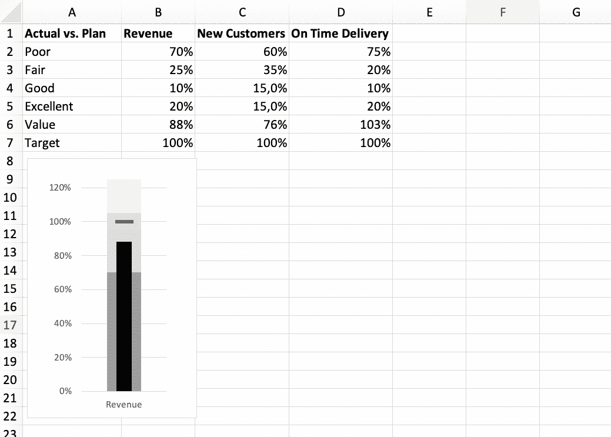

# 一次追踪一颗子弹

> 原文：<https://towardsdatascience.com/tracking-targets-one-bullet-at-a-time-2935c69b93f?source=collection_archive---------28----------------------->

## 如何在 Excel 中创建项目符号图表

假设您需要快速了解我们如何实现季度目标。好吧，让我们看看。

定性范围内的实际与目标

这给了你一个好主意吗？

几乎没有必要解释这个图表的元素。直观上很清楚。每项措施都有一个目标，成就栏嵌入在定性带中，告诉我们如何评估绩效。

> 这种可视化表示因其与众不同的外观而被称为“子弹图”。斯蒂芬·菲勒在他关于视觉数据交流的书中推广了这种方法。

# 在 Excel 中创建项目符号图

项目符号图可能是显示实际数据与目标数据的有效方法，但它并不作为一种现成的图表类型得到普遍支持。

让我们在普通 Excel 中创建一个项目符号图。

> 我将在 Mac 上使用 Excel 2016 进行截图。希望您的 Excel 版本(可能是未来的版本)足够相似，能够轻松地理解图表的结构。

在 Excel 术语中，基本思想是为定性带创建一个堆叠柱，并在次轴上为当前值创建一个标记线和细长柱。

我们的项目符号在 Excel 图表中的构建计划

我们将从一个单一的措施开始，一旦看起来没问题，我们将添加更多的“项目符号”。

我们走吧。

## 从数据开始

先看定性波段。我们将堆叠波段，因此每个波段都是根据其大小来定义的，而不是范围。

对于我们的第一张图表，让我们创建从**差**到**优秀的等级。**叠加它们的值给我们的总数是 125%。

我们还需要一个当前值和一个目标。我选择了 88%的现值和 100%的目标值。

我们第一个项目符号图的数据

## 创建堆积柱形图

我们需要一个堆积柱形图来形成我们的定性波段。我们将使用一些自定义格式从堆栈中取出当前值和目标值。

创建一个堆积柱形图并切换行/列，这样我们就有一个单一的柱形图。

第一步—创建堆积柱形图

## 创建目标标记

接下来，我们将分解目标值。

*   将目标值变为次轴上的标记线
*   删除图表中的次坐标轴，以便所有值使用相同的刻度
*   根据您的喜好格式化标记的外观

将目标分解为副轴上的标记线

## 格式化当前值

我们准备从堆栈中取出当前值。

*   将当前值移动到副轴。
*   增加其间隙宽度，使其看起来更薄。您可能需要修改图表区的宽度以获得正确的比例。
*   为条形使用合适的颜色。

将当前值分解为辅助轴中的一列

## 着色和润色

我们已经有了一个还过得去列表。根据您的喜好调整带子和记号笔的颜色。也许调整规模，以适应我们的范围 125%的最大成就。

完成后，您的图表应该如下所示:

单个度量的项目符号图

## 扩展到多个度量

我们现在想扩展图表以包含多个项目符号。每格一颗子弹。

首先在数据表中以列的形式提供附加度量的数据。一旦就位，您可以简单地拖动图表的数据区域来覆盖您的度量。

## 最后润色

添加一个图例，并对位置、比例和颜色进行一些最后的润色，应该会给你一个令人满意的最终结果。

我们已经做到了:用一个子弹图来跟踪定性区域中的多个目标

开始了。我们一次一颗子弹地追踪我们的目标…